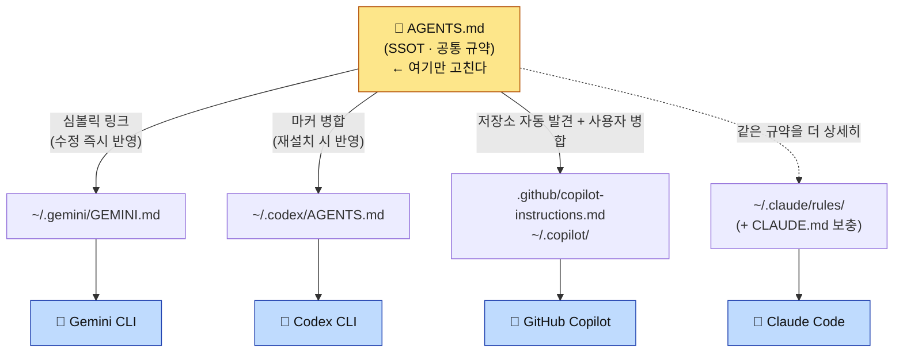
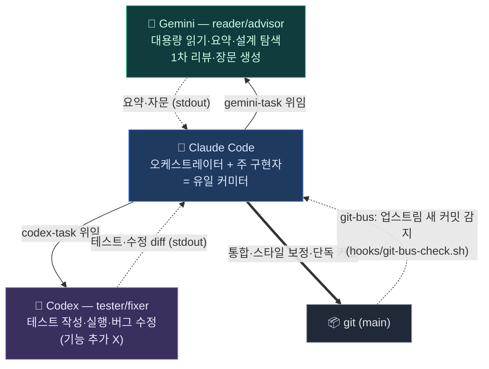

# Multi-CLI Guide — Claude Code · Gemini CLI · Codex CLI · GitHub Copilot

> Windows에서 CLI를 처음 설치하는 절차는 [WINDOWS-SETUP.md](WINDOWS-SETUP.md)를 참고한다.

Arachne는 **하나의 공통 규약(`AGENTS.md`)을 여러 AI 코딩 도구가 동시에 따르도록** 연결한다.
한 파일만 고치면 세 도구가 같은 규칙으로 움직인다. 이 문서는 각 CLI에서 어떻게 쓰고, 셋이
서로 어떻게 영향을 주고받는지 설명한다.

> 한 줄 요약: **`AGENTS.md` = 단일 진실 공급원(SSOT).** 각 도구는 이 파일을 지원 방식에 맞게 본다.

---

## 1. Big Picture

> **SSOT** = Single Source of Truth(단일 진실 공급원). 같은 정보를 여러 곳에 복제하지 않고
> **한 곳(`AGENTS.md`)만 정본**으로 두는 원칙. 거기만 고치면 나머지는 그것을 가리키거나 재생성하므로,
> 사본끼리 어긋나는 **드리프트(drift, 문서·설정이 실제와 점점 불일치해지는 현상)** 가 생기지 않는다.



> Claude는 `rules/`에서 풀 디테일을 자동 로드하므로 점선(`-.->`)으로 표시했다 — `AGENTS.md`를
> 직접 읽는 게 아니라 같은 규약의 상세판을 본다. 자세한 비대칭은 2장.

- **공통 규약**(작업 원칙·코딩 스타일·패턴·보안·테스트·git·이슈·언어 포인터)은 `AGENTS.md`에만 둔다.
- **도구 전용 기능**(Claude의 서브에이전트·훅·슬래시 커맨드·모델 라우팅·`gemini-task`)은 `CLAUDE.md`에만 둔다.
  → 공유 규약과 도구 전용이 파일 단위로 분리돼 **드리프트가 구조적으로 차단**된다.

> 📖 이 문서의 약어(SSOT·TDD·DI·a11y 등)는 [GLOSSARY.md](GLOSSARY.md)에 풀이돼 있다.

---

## 2. How Each CLI Sees the SSOT (Asymmetry is Key)

| CLI | 연결 파일 | 연결 방식 | 반영 시점 | 무엇을 보나 |
| --- | --- | --- | --- | --- |
| **Claude Code** | `~/.claude/rules/` (+ `CLAUDE.md`) | 디렉터리 심볼릭 → **네이티브 자동 로드** | 다음 세션 | `rules/`의 **풀 디테일** (AGENTS.md보다 상세) |
| **Gemini CLI** | `~/.gemini/GEMINI.md` | **AGENTS.md 심볼릭** | **즉시** (재설치 0회) | AGENTS.md 다이제스트 |
| **Codex CLI** | `~/.codex/AGENTS.md` | **AGENTS.md 마커 병합** | `arachne -i --target codex` 재실행 후 | AGENTS.md 다이제스트 |
| **GitHub Copilot** | 저장소 `AGENTS.md` + `~/.copilot/` | 자동 발견 + **마커 병합** | 저장소는 즉시, 전역은 `--target copilot` 후 | AGENTS.md 다이제스트 |

**왜 비대칭인가** — import 지원 여부가 도구마다 다르기 때문이다.
- Claude는 `~/.claude/rules/`를 네이티브로 자동 로드한다. 그래서 Claude는 AGENTS.md를 굳이 import하지
  않는다 — `rules/`가 더 상세한 풀 버전을 이미 준다.
- Gemini는 글로벌 컨텍스트 파일(`~/.gemini/GEMINI.md`) 하나를 읽는다. 심볼릭이라 **AGENTS.md 수정이 즉시** 반영된다.
- Codex는 import가 없어 심볼릭 대신 **본문을 병합**한다. 사용자가 직접 추가한 내용(마커 밖)을 보존하되,
  마커 안 본문은 재설치할 때 AGENTS.md로 갱신된다.
- Copilot은 저장소의 `AGENTS.md`와 `.github/copilot-instructions.md`를 지원한다. 사용자 전역 적용은
  Copilot CLI용 `~/.copilot/copilot-instructions.md`와 VS Code용
  `~/.copilot/instructions/arachne.instructions.md`에 설치한다.

> 이 비대칭은 실측으로 검증됨: Gemini·Codex 모두 비대화 모드에서 AGENTS.md에 심은 고유 토큰을
> 출력함(런타임 로딩 확인). 4장 참고.

**프로젝트 레벨도 같은 패턴** — `arachne -n`이 프로젝트 루트에 `AGENTS.md`(프로젝트 SSOT 스텁:
구조·빌드·검증·grep 키워드·학습된 패턴 섹션) + `CLAUDE.md`(`@AGENTS.md` 포인터)를 생성한다.
Copilot은 저장소 AGENTS.md를 자동 발견하고, Codex/Gemini 위임·Claude 모두 한 파일을 본다.
스텁은 비워서 생성되며(미기재 마커) 자동 기록하지 않는다 — `/learn`과 diff 승인으로만 채운다.
미기재 섹션이 남아 있으면 `session-end.sh`가 세션 스냅샷에 채우기 제안을 남긴다(알림만, 자동 작성 금지).

---

## 3. Per-CLI Behavior — What Actually Works

### 3.0 Capability Matrix

Arachne 구성요소가 각 CLI에서 실제로 작동하는지. **공통 규약만 셋이 공유**하고, 나머지는
대부분 Claude 전용이다(import·이벤트 훅·서브에이전트 개념이 Claude Code에만 있으므로).

| Arachne 구성요소 | Claude Code | Gemini CLI | Codex CLI | GitHub Copilot |
| --- | :---: | :---: | :---: | :---: |
| 공통 규약 (`AGENTS.md` / `rules/common`) | ✅ `rules/` 풀버전 자동 로드 | ✅ `GEMINI.md` | ✅ `~/.codex/AGENTS.md` | ✅ 저장소 + 사용자 지침 |
| 언어 규칙 (`rules/<언어>/*`) | ✅ `paths`로 확장자 매칭 시 자동 로드 | ⚠️ AGENTS §9 **경로 포인터만** (본문 자동 로드 X) | ⚠️ 동일 | ⚠️ 경로 포인터 |
| 서브에이전트 (`agents/`) | ✅ | ❌ | ❌ | Copilot 자체 agent 기능 |
| 슬래시 커맨드 (`commands/`) | ✅ `/이름` | ❌ | ❌ | ❌ Arachne 명령 미이식 |
| 이벤트 훅 (`hooks/`) | ✅ Session·PreCompact·Prompt | ❌ | ❌ | ❌ Arachne 훅 미이식 |
| 스킬 (`skills/`) | ✅ 자동 참조 | ❌ | ❌ | Copilot 자체 skills 위치 별도 |
| 상태표시줄 (`statusline`) | ✅ | ❌ | ❌ | ❌ |
| 작업 위임 래퍼 | ✅ **호출 주체** | `gemini-task`/`gtask` 위임 **대상** (reader/advisor) | `codex-task`/`ctask` 위임 **대상** (tester/fixer) | 독립 실행 표면 |
| MCP 서버 | ✅ `settings.json` | 별도 `~/.gemini` 설정(미관리) | 별도 `~/.codex/config.toml`(미관리) | Copilot 자체 MCP(미관리) |

> 요점: **공통 규약을 읽는 것**은 셋 다 공유한다. 그 위에 Claude는 Gemini를 `gemini-task`(요약·자문),
> Codex를 `codex-task`(테스트·수정)로 **위임 호출**한다 — 3-레인 협업. 에이전트·훅·커맨드 같은
> 오케스트레이션 자체는 Claude Code 고유 기능이라 이식되지 않는다. (Gemini·Codex가 가진 **자체**
> 에이전트·MCP 기능은 별개이며 Arachne가 아직 관리하지 않는다 — [설계문서](issue/2026-06-05-multi-cli-ssot.md) Phase 3.)

### 3.1 Claude Code — Full Stack

별도 설정 불필요 — `arachne -i` 후 자동이다.

**런타임 동작**: 세션 시작 시 `~/.claude/rules/`를 네이티브로 읽고(공통=항상), `CLAUDE.md`의 Claude
전용 보충을 적용한다. 파일 편집 시 확장자에 맞는 언어 규칙이 추가 로드되고, 이벤트마다 훅이 실행되며,
상태표시줄이 렌더된다. 에이전트·슬래시 커맨드를 호출할 수 있다.

**어떻게 쓰나** (Claude Code 채팅에서):

```
/add  /fix  /tdd  /verify  /refactor …      # 슬래시 커맨드 — 워크플로 실행
"code-reviewer로 이 변경 리뷰해줘"            # 서브에이전트 위임
"이 설계 gemini-task로 검토해줘"                     # Claude가 Bash로 gemini-task 호출 → Gemini 위임
```

- **공통 규칙**(`rules/common/*`): 매 세션 자동 로드 — 입력 불필요.
- **언어 규칙**(`rules/<언어>/*`): 해당 확장자 파일을 열면 자동 활성화 (예: `*.rs` 편집 → `rules/rust/*`).
- 슬래시 커맨드·에이전트·스킬·훅 전체 카탈로그와 상세 예시는 [USAGE.md](USAGE.md).

### 3.2 Gemini CLI — Shared Convention + gemini-task Delegation Target (reader/advisor)

**런타임 동작**: Gemini는 매 호출마다 글로벌 컨텍스트 `~/.gemini/GEMINI.md`(→ AGENTS.md 심볼릭)를
로드한다. 즉 **공통 규약만** 적용되고, 에이전트·훅·커맨드는 없다. 비대화 호출 시 신뢰 폴더 검사가 있어
헤드리스 환경에선 `--skip-trust`가 필요하다(`gemini-task`가 자동 처리). 실측: `gemini --skip-trust -p`가
AGENTS.md에 심은 고유 토큰을 출력 → 런타임 로딩 확인됨.

**어떻게 쓰나**:

```bash
# (1) 직접 — 공통 규약이 자동 로드된 채로 동작
gemini                                        # 대화형 세션
gemini -p "이 모듈 설계 검토해줘"             # 비대화 1회 질의

# (2) Claude 안에서 위임 (권장) — gemini-task 래퍼, 답변만 stdout
gemini-task "이 설계 검토해줘: $(cat module.c)"      # 자문
gemini-task "이 로그 에러 원인만 요약: $(cat app.log)"
gemini-task "README 초안 작성" > README.md           # 장문 생성 → 파일로 (재독 금지)
```

- `gemini-task`는 Claude가 Gemini에 작업을 위임하는 비용 최적화 경로다([USAGE.md §6](USAGE.md)).
- `gemini-task`는 헤드리스라 `--skip-trust`를 자동 처리 — 임의 디렉터리에서 불려도 동작한다.

### 3.3 Codex CLI — Shared Convention (Merged) + `codex-task` Delegation Target (tester/fixer)

**런타임 동작**: Codex는 새 세션마다 글로벌 지침 `~/.codex/AGENTS.md`를 로드한다. 이 파일엔 SSOT 본문이
마커(`<!-- === ARACHNE … === -->`)로 병합돼 있고, 마커 밖 사용자 내용은 보존된다. **공통 규약만** 적용되고
에이전트·훅·커맨드는 없다(Codex 자체 기능은 별개). 실측: 프로젝트 AGENTS.md가 없는 중립 디렉터리에서
`codex exec`가 전역 지침의 고유 토큰을 출력 → 런타임 로딩 확인됨.

**협업 레인**: Codex는 3-레인에서 **tester/fixer**다. Claude가 `codex-task`(=`ctask`)로 테스트 작성·실행과
버그 수정을 위임한다. `codex-task`는 호출마다 테스터/픽서 역할 프리앰블을 주입하고(기능 추가 금지), 결과만
stdout으로 돌려줘 Claude가 통합·커밋한다. 기본은 read-only 제안 모드, `-w`는 workspace-write 실행 모드.

**어떻게 쓰나**:

```bash
codex                                         # 대화형 — 새 세션에 공통 규약 자동 로드
codex exec "이 함수 리뷰해줘"                  # 비대화 1회 (raw)
codex exec -C <작업디렉터리> --skip-git-repo-check "..."   # 디렉터리·git 밖 실행

# Claude 안에서 위임 (권장) — codex-task 래퍼, 결과만 stdout
codex-task "tests/ 의 parser 테스트 보강안 제시: $(cat src/parser.c)"  # 제안만 (read-only)
codex-task -w "실패하는 test_auth 를 green 까지 수정"                   # 직접 실행·수정
```

- **주의**: AGENTS.md를 수정했으면 Codex는 자동 반영이 아니다. `arachne -i --target codex`
  (또는 전체 `arachne -u`)로 재병합해야 한다. 까먹어도 `arachne --check`가 stale을 잡는다.

### 3.4 GitHub Copilot — Repository + User Instructions

저장소에서는 루트 `AGENTS.md`를 직접 읽고, `.github/copilot-instructions.md`가 Copilot 전용
진입점 역할을 한다. 사용자 전역 설치는 다음 두 표면을 함께 지원한다.

```text
~/.copilot/copilot-instructions.md              # GitHub Copilot CLI
~/.copilot/instructions/arachne.instructions.md # VS Code 사용자 프로필
```

macOS/Linux/WSL/Git Bash:

```bash
./install.sh -i --target copilot
```

Windows PowerShell:

```powershell
Set-ExecutionPolicy -Scope Process Bypass
.\install.ps1 -Install -Target copilot
```

독립 설치 경로가 필요하면 `.\install-copilot.ps1`도 사용할 수 있다. 둘 다 일반 파일을 생성하므로
Windows Developer Mode나 관리자 심볼릭 링크 권한이 필요 없다.
VS Code Settings Sync에서 `Prompts and Instructions`를 켜면 사용자 지침을 Windows/macOS 간에도
동기화할 수 있다.

---

## 4. How the Three Interact

### 4.1 Propagation — "Edit One File = Three CLIs"

`AGENTS.md`를 고치면:

| CLI | 전파 | 추가 작업 |
| --- | --- | --- |
| Gemini | **즉시** (심볼릭) | 없음 |
| Claude | 다음 세션 | 없음 (단, 풀 규칙은 `rules/`에서 — AGENTS.md와 함께 갱신 권장) |
| Codex | 재병합 후 | `arachne -i --target codex` 또는 `arachne -u` |
| Copilot | 저장소 즉시 / 사용자 전역 재설치 후 | `arachne -i --target copilot` 또는 PowerShell 설치기 |

> `AGENTS.md`(다이제스트) ↔ `rules/`(풀 버전)는 별도 동기화 축이다. 규약을 바꾸면 양쪽을 함께 손봐야 한다.
> CI의 인덱스 검사가 파일 누락은 잡지만, **내용 동기화는 사람 책임**이다.

### 4.2 Collaboration — 3-Lane Cost Routing (Claude · Codex · Gemini)

§1~3이 **규약 공유**(한 파일을 셋이 본다)라면, 이 절은 **런타임 위임**이다. Claude가 중심에서
역할을 분리해 떠넘긴다. 토큰 무겁고 정밀도가 덜 중요한 작업(설계·요약·조사·1차 리뷰·장문 생성)은
`gemini-task`로 **Gemini(reader/advisor)** 에, 테스트 작성·실행과 버그 수정은 `codex-task`로
**Codex(tester/fixer)** 에 위임한다. 정밀 구현·통합·디버깅·보안 리뷰·설정 관리, 그리고 **최종 커밋**은
**Claude(오케스트레이터+주 구현자)** 가 직접 한다.



> 이 다이어그램은 [ARCHITECTURE.md §2](ARCHITECTURE.md)와 동일한 협업 구조다(같은 그림을 두 문서가 공유).
> 정책의 단일 출처(SSOT)는 [`rules/common/workflow.md`](../rules/common/workflow.md), 사람용 설명은 [USAGE.md §6](USAGE.md).

방향이 반대인 두 우선순위 사슬:
- **오프로드(offload, 비용)**: Gemini → Codex → (Claude 안 씀) — 토큰 무거운 일을 싸게 떠넘김
- **실행 후보 폴백(가용성)**: Claude → Codex → Gemini — 쿼터 소진 시 다음 헤드리스 후보를 시도

또 다른 채널은 **git-bus**다. `hooks/git-bus-check.sh`는 업스트림 브랜치 HEAD와 기준점을 비교해
다음 프롬프트 때 새 커밋을 알린다(비동기 메시지 버스). 작성자나 사용 CLI는 판별하지 않으며, 업스트림이
있는 경우 다른 로컬 터미널의 미푸시 커밋은 감지 대상이 아니다.

> ⚠️ **위임 입력 보안 (#38)**: 위임은 신뢰 경계를 넘는 입력을 하위 모델에 전달하므로 **간접 프롬프트
> 인젝션** 위험이 있다. 신뢰할 수 없는 콘텐츠는 `<<UNTRUSTED ... UNTRUSTED>>` 구획에 담고, `ctask`는
> non-raw에서 인젝션 저항 지시를 주입하며 `-w`(쓰기) 모드는 사전 경고한다. 트리 변경은 `git diff` 검토 후
> **Claude가 단독 커밋**한다. 방어 원칙은 [AI-ENGINEERING-NOTES §3](AI-ENGINEERING-NOTES.md).

### 4.3 Independence — They Don't Break Each Other

- Codex 병합은 **마커 밖 사용자 내용을 보존**한다(직접 추가한 메모가 재설치로 사라지지 않음).
- Gemini 심볼릭이 끊겨도(레포 이동 등) Claude·Codex는 영향 없다.
- 한 CLI 미설치 시 `arachne -i`는 그 CLI만 graceful skip한다(나머지 정상 설치).

---

## 5. Usage Modes — 단독 · 위임 · 가용성 폴백

> **정본 선언**: 위임 래퍼(gtask/ctask/atask)의 동작·폴백 정책·쿼터 감지·계측 서술은 **이 절이
> 정본**이다. [USAGE §9](USAGE.md)는 옵션 레퍼런스, [ARCHITECTURE §2](ARCHITECTURE.md)는
> 다이어그램 요약이며, 어긋나면 이 절(과 코드)을 따른다.

세 CLI는 **함께(오케스트레이션)** 도 쓰고 **따로(단독)** 도 쓴다. 공통 규약(`AGENTS.md`)은 어느 쪽이든
적용되므로, 단독으로 띄워도 같은 코딩 스타일·패턴·보안 규칙을 따른다.

### 5.0 계층 원칙 — 사상 동일 · 수단 상이 · 집행은 CI

"Multi-CLI 협업 규율과 단독 사용 규율이 같은가?"에 대한 답은 **층을 나누면** 명확하다.

| 층 | 내용 | 적용 범위 |
| --- | --- | --- |
| **① 사상·규율** | 코딩 스타일·SRP·보안·TDD·git 형식·이슈 처리 (`AGENTS.md`/`rules/`) | **모든 CLI, 단독 포함, 항상 동일** |
| **② 실행 메커니즘** | 에이전트·스킬·훅·슬래시 커맨드·상태표시줄 | **도구별 상이** — Claude가 최다, 나머지는 텍스트 규약만 |
| **③ 3-레인 협업 계약** | tester/fixer·reader/advisor 역할 제한, "커밋은 Claude" | **Claude가 오케스트레이터일 때만** — 단독 사용엔 비적용 |
| **집행층** | git + 프로젝트 CI (`.arachne/verify.sh`·GitHub Actions) | **CLI 무관 동일 게이트** — 누가 작성했든 같은 검증 통과 필요 |

- ②는 규율 자체가 아니라 규율을 **집행하는 수단**이다. "코드 수정 후 리뷰한다"가 규율이고,
  Claude에선 `code-reviewer` 에이전트가, Codex 단독에선 모델 스스로(또는 사람)가 그걸 수행한다.
- ③의 역할 제한은 래퍼(`gtask`/`ctask`)가 프리앰블로 주입한다. 래퍼 없이 직접 띄운 단독 세션에는
  주입되지 않으며, 커밋 여부는 그 세션을 모는 **사람의 결정**이다.
- 집행력은 비대칭이다(Claude는 훅이 강제, 다른 CLI는 텍스트 지시 준수에 의존). 이 비대칭을
  메우는 평형 장치가 CLI 무관 집행층인 **프로젝트 CI**다.

### 5.0.1 단독 세션에서 실제로 일어나는 일 (CLI별)

| CLI | 세션 시작 시 로드 | 규율 집행 수단 | 단독 세션에 없는 것 |
| --- | --- | --- | --- |
| **Claude Code** | `rules/common/*`(전부) + `CLAUDE.md`, 편집 확장자에 따라 `rules/<언어>/*` 추가 | 이벤트 훅(자동) · 서브에이전트(자동 활성화) · 슬래시 커맨드 · `/verify` | — (풀 스택) |
| **Gemini CLI** | `~/.gemini/GEMINI.md`(→AGENTS.md 심볼릭, 매 호출) | 텍스트 규약 준수 + 사람 검토 | 에이전트·훅·커맨드·언어 규칙 본문(경로 포인터만) |
| **Codex CLI** | `~/.codex/AGENTS.md`(마커 병합본, 새 세션마다) | 텍스트 규약 준수 + 사람 검토 | 동일. 역할 프리앰블도 래퍼 경유가 아니므로 없음 |
| **GitHub Copilot** | 저장소 `AGENTS.md`+`.github/copilot-instructions.md`, 전역 `~/.copilot/` | 텍스트 규약 준수 + 사람 검토 | 동일. Copilot 자체 agent/skills는 별도 체계 |

> 어느 CLI로 작업했든 마지막은 같다: **프로젝트 CI 게이트 통과 → 커밋**. 상세 런타임 동작은 §3 참고.

### 5.1 Claude Code의 세 가지 모드

1. **단독 사용 (풀 스택)** — `claude`만 띄워서 쓴다. `rules/`(공통+언어) 자동 로드, 서브에이전트·슬래시
   커맨드·훅·스킬·상태표시줄이 전부 동작한다. 위임 없이 Claude 혼자 설계·구현·리뷰·커밋까지 한다.
   (§3.1 참고.)
2. **위임 사용 (3-레인 오케스트레이션)** — Claude가 중심에서 토큰 무거운 읽기·요약·자문은
   `gemini-task`(Gemini, reader/advisor)로, 테스트·버그 수정은 `codex-task`(Codex, tester/fixer)로
   떠넘기고, 정밀 구현·통합·**커밋**은 직접 한다. (§4.2 참고.)
3. **소진 대응** — 대화형 중심 이양은 자동화되어 있지 않다. Claude를 사용할 수 없으면 `/handoff`와
   별도 Codex/Gemini 세션으로 사람이 인계해야 한다. `atask`는 아래 실행 후보 순서만 자동화하며,
   커밋 권한과 역할 계약을 자동 승계하지 않는다.

   | 단계 | 가용 | 자동 실행 후보 | 역할 계약 | 인계·주의 |
   | --- | --- | --- | --- | --- |
   | **L0 정상** | C·X·G | Claude | Claude 구현·통합·커밋 | 기본 3-레인 |
   | **L1 Claude 소진** | X·G | `codex-task` | tester/fixer 제약 유지 | 구현 완료로 간주 금지, 사람 인계 필요 |
   | **L2 +Codex 소진** | G | `gemini-task` | reader/advisor 제약 유지 | 구현 완료로 간주 금지, 사람 인계 필요 |
   | **L3 전부 소진** | — | 없음 | — | 쿼터 회복 대기 |

   분기(중심=Claude 유지, 위임 대상 하나만 소진): **Codex만 소진** → Claude가 테스트도 직접(맹점 탈상관↓),
   **Gemini만 소진** → 읽기·요약을 Claude/Codex가 직접(토큰 절약↓, 품질 무관).
   순서 근거는 코딩 스타일 충실도(Codex > Gemini). 정책 SSOT는 [`rules/common/workflow.md`](../rules/common/workflow.md).

#### 자동 폴백 — `atask` (arachne-task)

헤드리스 CLI의 **실행 후보 순서**를 자동화하는 디스패처다. 역할별 우선순위로 CLI를 시도하고,
출력에서 쿼터·rate limit 패턴을 감지하면 그 CLI를 **쿨다운 등록 후 다음으로 자동 전환**한다.

```bash
atask "결제 모듈 재시도 로직 구현"            # impl: claude → codex → gemini
atask -R read "이 로그 에러 원인 요약: $(cat app.log)"   # read: gemini → codex → claude
atask -R test -w "실패하는 test_auth 를 green 까지"      # test: codex → claude → gemini
atask --dry-run -R impl "..."                  # 실제 호출 없이 순서·쿨다운 상태만
```

| 동작 | 설명 |
| --- | --- |
| 쿼터 감지 | stdout·stderr의 `rate limit`·`usage limit`·`429`·`too many requests`·`overloaded`·`resource exhausted`·`insufficient_quota`·`quota exceeded` 패턴 (bare `quota` 단독은 매칭 안 함, `disk quota` 등 명백한 일반 오류는 NON_QUOTA 가드로 제외 — 정본은 `arachne-task.sh`의 `QUOTA_PATTERN`/`NON_QUOTA_PATTERN`) |
| 쿨다운 | 소진 CLI를 `~/.claude/arachne-quota-state`에 기록(기본 Claude 5h·그 외 1h) → 그 동안 건너뜀 |
| 미설치 스킵 | 종료코드 **127**(하위 CLI 미설치)은 쿨다운 없이 즉시 다음 후보로 — 솔로 모드 지원(§5.3) |
| 일반 에러 | 쿼터가 **아닌** 실패(문법 오류 등)는 폴백하지 않고 그대로 중단(세 CLI 토큰 낭비 방지) |
| 사전 경고 | `atask-quota-warn.sh` 훅이 상태 파일에서 impl 순서의 첫 가용 후보와 회복 시각을 표시 |
| 계측 | 래퍼 3종(gtask/ctask/atask)이 호출·쿨다운 진입 이력을 `~/.claude/metrics/*-YYYY-MM.log`에 append-only 기록 — ADR-0003(dynamic workflows 미도입) 재평가 기준선 수집용 관찰 전용, 폴백 동작·종료코드에 영향 없음 |

> **한계(정직)**: `atask`는 **헤드리스 호출 전용**이다. Codex와 Gemini 단계는 각각 `codex-task`
> (tester/fixer)와 `gemini-task`(reader/advisor)를 호출하므로 `impl` 요청의 역할을 그대로 보존하지 않는다.
> 하위 명령의 종료코드 0도 실제 구현 완료나 diff 생성을 검증하지 않는다. 대화형 세션 중간 구제와 중심
> 이양은 `/handoff`와 사람 검토가 필요하다. 쿼터 감지는 에러 문자열 휴리스틱이다.

### 5.2 Gemini · Codex의 단독 사용

Claude의 위임 대상이 아니라 **그 자체로** 쓸 수도 있다. 이때도 공통 규약은 적용된다.

- **Gemini 단독** — `gemini`(대화형) 또는 `gemini -p "..."`(1회). 매 호출 `~/.gemini/GEMINI.md`(→ AGENTS.md
  심볼릭)를 로드하므로 공통 규약이 그대로 적용된다. 에이전트·훅·커맨드는 없다(§3.2).
- **Codex 단독** — `codex`(대화형) 또는 `codex exec "..."`(1회). 새 세션마다 `~/.codex/AGENTS.md`(마커 병합본)를
  로드한다. `ctask`/`codex-task` 래퍼 없이 직접 호출하면 tester/fixer 역할 프리앰블은 주입되지 않는다(§3.3).

> 단독 사용과 위임 사용의 차이는 **누가 호출하느냐**일 뿐, 읽는 규약은 같다. `gemini-task`/`codex-task`
> 래퍼는 노이즈 제거 + 역할 프리앰블 주입을 더해 **Claude가 부르기 좋게** 감싼 것이다.

### 5.3 솔로 모드 — Claude Code만 있는 환경

Codex·Gemini·Copilot이 **하나도 설치되지 않은** 사용자도 1급 지원 대상이다. 별도 설정 없이
이렇게 동작한다.

**설치**: `arachne -i`(all 타깃)는 미감지 CLI를 graceful skip하고 Claude 자산만 연결한다.
나중에 다른 CLI를 설치하면 `arachne -i` 한 번으로 3-레인이 활성화된다.

**동작 — 그대로인 것**: 규칙(`rules/common` 매 세션 + 언어 규칙 확장자 매칭), 서브에이전트 8종
자동 활성화, 스킬 31종, 이벤트 훅 전부(git-bus·쿼터 경고·문서 드리프트·세션 스냅샷),
슬래시 커맨드 17종, 상태표시줄, 프로젝트 CI(`arachne init-ci`/`project-check`). 즉 **하네스의
핵심 가치는 위임 없이 전부 동작한다.**

**동작 — 달라지는 것**:

| 3-레인일 때 | 솔로 모드에서 |
| --- | --- |
| 대용량 읽기·요약을 Gemini로 오프로드 (비용 절약) | Claude가 직접 — `sgrep`으로 범위를 좁혀 토큰 관리 |
| 테스트·버그 수정을 Codex로 위임 (맹점 탈상관) | Claude가 직접 — 구현·검증이 같은 모델이므로 리뷰·`/verify`를 더 신중하게 |
| 쿼터 소진 시 다음 CLI 폴백 | 폴백 대상 없음 — 쿼터 회복 대기 또는 사람이 직접 |
| `/handoff`로 다른 CLI 세션에 인계 | 인계 대상 없음 (세션 파일은 다음 Claude 세션 복구용으로 동일 동작) |

**위임 명령을 실수로 불렀을 때** (조용히 깨지지 않는다):

- `gtask`/`ctask`: 하위 CLI 미설치를 감지해 안내 메시지와 함께 **종료코드 127** 즉시 반환 —
  "Claude가 직접 수행하거나 설치 후 `arachne -i --target <cli>`".
- `atask`: 127을 받으면 쿨다운 등록 없이 다음 후보로 건너뛴다. 솔로 모드에선 결국 Claude가
  처리하거나, Claude까지 불가하면 "전 CLI 소진 또는 불가"로 종료한다.
- `arachne -c`: 미설치 CLI는 `[SKIP] 미감지`로 표시될 뿐 FAIL이 아니다.

> 행동 규칙 정본은 [`rules/common/workflow.md`](../rules/common/workflow.md)의 "솔로 모드" 절.
> 요약하면 **소진 분기표의 역할 재배치를 상시 적용**하는 것과 같다.

### 5.4 Cross-Harness Packaging — 같은 자산, 여러 하네스

Arachne가 `AGENTS.md` 하나를 Claude·Gemini·Codex에 배포하는 것은 더 큰 **이식성 모델(portability
model)** 의 한 사례다: **공통 소스를 각 하네스의 형식으로 어댑터 변환**해 배포한다. 같은 접근을
Claude/Codex/Gemini 외에 **Cursor·OpenCode** 같은 다른 하네스까지 넓힐 수 있다.

| 표면(Surface) | 공통 소스 | 하네스별 어댑터 |
| --- | --- | --- |
| 규약·지침 | `AGENTS.md` · `rules/` | Claude `rules/` 자동 로드 · Codex `AGENTS.md` 병합 · Gemini `GEMINI.md` 심볼릭 · Cursor rules · OpenCode instructions |
| 스킬 | `skills/*` | Claude 플러그인 · Codex 플러그인 · `.agents/skills` · Cursor 복사 · OpenCode 플러그인 |
| 훅 | `hooks/*` | Claude 네이티브 훅 · OpenCode 이벤트 · Cursor 어댑터 · **Codex는 지침 기반** |
| 커맨드 | `commands/*` | Claude 슬래시 커맨드 · CLI 엔트리포인트 · 호환 shim |
| MCP | `mcp-configs/` | 하네스별 네이티브 MCP import |

> 핵심: **워크플로 모델을 도구마다 새로 만들지 않는다.** 공통 소스를 가장자리(edge)에서 각 하네스 형식으로
> 변환할 뿐이다. 그래서 어떤 하네스를 단독으로 쓰든 같은 규약·스킬·패턴이 따라온다.
> Arachne는 현재 Claude(풀)·Gemini(심볼릭)·Codex(병합)를 지원하고, Cursor·OpenCode는 아직 다루지 않는 확장 표면이다.

### 5.5 도구별 최대 활용 가이드 — 레인 상한까지 뽑아 쓰기

Claude Code 효율의 본질은 세 가지가 **자동**이라는 것이다: ① 컨텍스트(규약·규칙 자동 로드)
② 역할(에이전트 자동 활성화) ③ 검증(훅·`/verify`·CI 연결). 다른 도구는 이 셋이 자동으로
공급되지 않으므로, **호출자(사람 또는 Claude)가 프롬프트와 절차로 수동 공급**해야 한다.
이 절은 그 수동 공급을 정형화한다 — 격차를 없애는 게 아니라(역량 평가
[capability-eval-2026-06](issue/2026-06-11-capability-evaluation.md) §4·§5 참고),
**각 도구가 자기 레인 상한에서 동작하게** 만드는 방법이다.

#### 공통 원칙 — 모든 위임·단독 사용에 적용

| Claude에선 자동 | 다른 도구에선 이렇게 수동 공급 |
| --- | --- |
| 컨텍스트 (rules·파일 자동 로드) | 필요한 파일 내용을 프롬프트에 직접 포함 — `"... : $(cat src/parser.c)"` |
| 역할 (에이전트 frontmatter) | 래퍼(`ctask`/`gtask`)가 프리앰블 주입. 직접 호출이면 역할·금지 사항을 프롬프트 첫 줄에 |
| 검증 (훅·/verify) | 결과를 받은 쪽이 재실행 — 도구의 "성공" 보고를 검증 없이 신뢰하지 않는다 |

- **완료 기준은 항상 동일**: 어느 도구 산출물이든 `.arachne/verify.sh`(또는 `/verify`) 통과
  전까지 미완료로 취급한다 (§5.0 계층 원칙).
- **한 번에 한 관심사**: 도구가 약할수록 과제를 좁게 자른다. "파서 버그 고치고 README도
  갱신해줘" 같은 복합 과제는 Claude 밖에서는 품질이 급락한다.

#### Codex CLI — tester/fixer를 75점으로 쓰는 법

**질문법** (프롬프트 4요소 — 컨텍스트·완료 기준·순서·범위 제한):

```bash
# GOOD — 대상 코드 + 기존 테스트 스타일 + 완료 기준 + 범위 제한이 전부 담김
ctask "src/parser.c 의 경계 케이스 테스트를 tests/test_parser.c 스타일로 보강.
완료 기준: 'make test' green — 실행한 명령과 결과 요약 포함.
기능 추가·시그니처 변경 금지.
$(cat src/parser.c tests/test_parser.c)"

# BAD — 컨텍스트 없음 (Codex는 sgrep·자동 로드가 없어 추측으로 작성한다)
ctask "parser 테스트 좀 보강해줘"
```

- **버그픽스는 재현 우선 순서를 지시한다**: "① 실패하는 테스트로 먼저 재현 ② 최소 수정으로
  green ③ 수정 범위 설명" — TDD 순서를 프롬프트로 강제하면 원인 아닌 증상 수정을 막는다.
- **완료 기준을 명령어로 준다**: "테스트 통과하게"보다 "`uv run pytest tests/ -k auth` green".
  검증 가능한 기준이 없으면 Codex의 green 보고를 확인할 방법이 없다.
- **레인 계약을 프롬프트에도 반복한다**: "기능 추가 금지" — AGENTS.md 다이제스트만 받는
  도구일수록 핵심 제약은 과제 안에서 다시 말해야 지켜진다.

**모드 선택과 결과 처리**:

| 상황 | 모드 | 받은 뒤 |
| --- | --- | --- |
| 테스트 보강안·수정 diff 검토하고 싶다 | 제안(기본) | diff 검토 → Claude가 적용·실행 |
| 관심사가 좁고 테스트가 빨리 돈다 | `-w` 실행 | `git diff` 전체 검토 → 스타일 보정 |

받은 결과는 ① **Claude(또는 사람)가 테스트 재실행** — green 보고를 그대로 믿지 않는다
② **스타일 보정** — 헤더·네이밍 풀 규칙(`rules/`)은 Codex에 전달되지 않으므로 통합 시 맞춘다
③ **커밋은 항상 Claude** (§4.2 A안).

**단독 사용 시 추가 규율**: `codex exec` 직접 호출은 tester/fixer 프리앰블이 없다 — 역할
문장("테스트 작성·실행과 버그 수정만. 기능 추가 금지")을 직접 첫 줄에 넣는다. 병합본이
오래됐을 수 있으니 `arachne -c`로 stale 확인.

**맡기지 않는 것**: 신규 기능 구현 · 설계 결정 · migration 작성 · 커밋.

#### Gemini CLI — reader/advisor를 구조 60점으로 쓰는 법

**질문법** (출력 형식 고정이 핵심 — 큰 입력, 작은 출력):

```bash
# GOOD — 출력 형식·분량을 고정해 "끌어오기" 비용을 통제
gtask "이 로그에서 에러 원인 후보를 3개 이하로, 각 2문장 + 근거 라인 인용: $(cat app.log)"

# GOOD — 설계 탐색은 단일 답이 아니라 비교 가능한 선택지를 요구
gtask "이 모듈 분리 방안 2~3개와 각각의 트레이드오프를 표로: $(cat src/daemon.c)"

# GOOD — 장문 생성은 파일로 직행, Claude는 존재만 확인 (재독 금지)
gtask "AGENTS.md 규약 기준 README 초안" > README.draft.md

# BAD — 형식 미지정 (장황한 답이 입력 절약을 상쇄한다)
gtask "이 코드 어때? $(cat src/daemon.c)"
```

- **요약은 원본 대체가 아니라 탐색 인덱스**다 — Gemini 요약에서 후보 위치를 얻고, 구현에
  필요한 정확한 코드는 해당 범위만 직접 Read한다.
- **설계 자문은 1회 sanity check 후 채택** — 구현 직전 명백한 결함만 가볍게 점검하고
  출발점으로 쓴다. 전체 재분석은 위임 절약을 무효화한다(workflow.md 전역 규칙).
- **모델 선택**: 단순 질의는 `-m gemini-2.5-flash`로 비용을 더 낮춘다.

**단독 사용 시 추가 규율**: `gemini -p`도 GEMINI.md(심볼릭)로 규약은 로드되지만 훅·검증이
없다 — 산출물에 "검증 명령과 실행 결과 포함"을 요구하고, 받은 쪽이 재실행한다.

**맡기지 않는 것**: 최종 구현 코드(스타일 충실도) · 헤더·네이밍 민감 산출물 · 커밋.

#### GitHub Copilot — 에디터 보조를 규약 안에서 쓰는 법

**효과의 전제부터 확인**: Copilot의 규약 준수는 저장소 루트 `AGENTS.md` 자동 발견과
`~/.copilot/` 전역 지침 연결이 전부다 — `arachne -c`로 연결 상태를 먼저 확인한다.
이게 끊겨 있으면 아래 모든 항목의 품질이 떨어진다.

- **인라인 완성은 반복 패턴에 한정 수용** — JSX·CSS·boilerplate·테이블 드리븐 테스트 케이스
  추가처럼 패턴이 화면에 이미 있는 경우. 새 로직·알고리즘 제안은 비신뢰가 기본값.
- **헤더 주석 선행 작성으로 유도한다** — 함수 헤더(`FUNCTION/DESCRIPTION/PARAMETERS`)를
  먼저 쓰면 Copilot이 그 명세에 맞춰 완성하므로 품질과 규약 준수가 같이 올라간다.
  코딩 스타일 규약(헤더 필수)과 시너지가 나는 지점이다.
- **PR 리뷰 코멘트는 참고 신호** — `code-reviewer`/`database-reviewer` 에이전트나 사람 리뷰의
  대체가 아니다. 코멘트가 가리킨 위치를 에이전트 리뷰로 재확인한다.
- **맡기지 않는 것**: 파일 단위 신규 생성 · 보안 민감 코드(인증·암호화·쿼리) · 아키텍처 결정.

#### 한계 재확인 (정직)

이 가이드를 전부 지켜도 **자동 집행은 생기지 않는다** — 격차는 호출자의 수동 규율로 메우는
것이고, 그래서 도구 점수 상한이 존재한다(역량 평가 §4·§5: Codex ~65–70, Gemini ~50대,
Copilot ~45–50). 수동 규율이 빠진 호출(컨텍스트 없는 과제, 검증 없는 수용)은 점수 이하의
결과를 낳는다. 반대로 말하면, **이 절차가 곧 각 도구의 점수를 상한까지 끌어올리는 방법**이다.

---

## 6. Status Check — `arachne --check`

지원 도구 연결을 한 번에 점검한다. 심볼릭 댕글링과 병합본 stale을 잡는다.

```bash
arachne --check
```

```
[Arachne] 연결 상태 점검
  [OK]   Claude : ~/.claude/CLAUDE.md -> 레포
  [OK]   Gemini : ~/.gemini/GEMINI.md -> AGENTS.md
  [OK]   Codex  : ~/.codex/AGENTS.md (AGENTS.md 최신)
[Arachne] 모든 연결 정상
```

- `[OK]` 정상 / `[SKIP]` 미감지(미설치) / `[FAIL]` 끊김·stale → 안내대로 재설치.
- 하나라도 FAIL이면 종료코드 1 (스크립트·CI에서 활용 가능).

---

## 7. Common Workflows

```bash
# 규약을 바꾸고 싶다 → AGENTS.md 수정 후
vim ~/Arachne/AGENTS.md
arachne -i --target codex      # Gemini는 자동, Codex만 재병합
arachne --check                # 지원 도구 연결 확인

# 전부 최신으로 (다른 머신에서 pull 받은 뒤 등)
arachne -u                     # git pull + 감지된 CLI 전체 재설치

# 새 CLI를 방금 로그인했다 (예: Codex)
arachne -i --target codex      # 또는 arachne -i (all)
```

---

## 8. Related Docs

- [README.md](../README.md) — 설치·CLI 커맨드 개요
- [USAGE.md](USAGE.md) — 커맨드·에이전트·스킬·훅·규칙·협업 상세
- [AGENTS.md](../AGENTS.md) — 공통 규약 SSOT 본문
- [멀티-CLI SSOT 설계](issue/2026-06-05-multi-cli-ssot.md) — 설계 결정·Phase 기록
