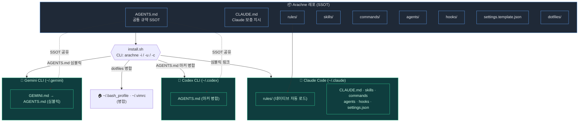
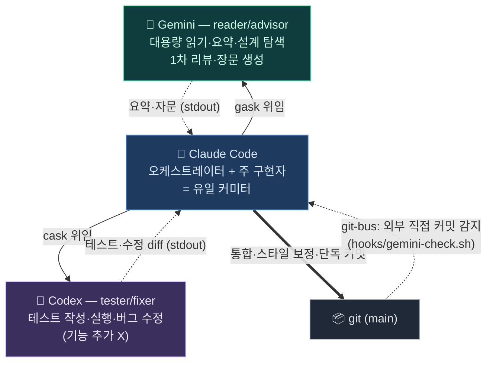
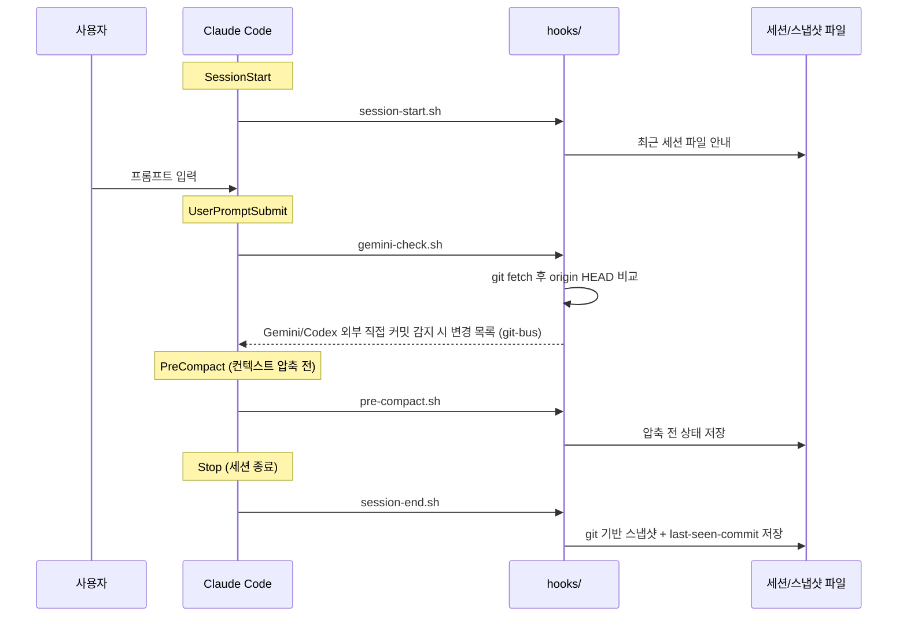
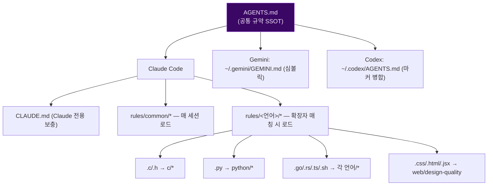
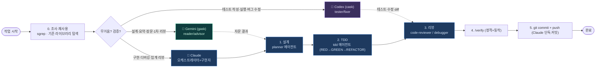

# 🕷️ Arachne 하네스 구조

> 이 문서의 Mermaid 다이어그램은 GitHub에서 자동 렌더링됩니다.
> 전체 디렉터리 설명은 [README](../README.md), 사용법은 [docs/USAGE.md](USAGE.md),
> 멀티-CLI 통합은 [docs/MULTI-CLI.md](MULTI-CLI.md) 참고.

---

## 1. Big Picture — Repo ↔ Multi-CLI Symlink Wiring

하나의 레포(`Arachne/`)를 `install.sh`(CLI: `arachne`)가 심볼릭 링크로 세 CLI에 연결한다.
레포를 수정하면 글로벌 설정에 즉시 반영되고, `git push/pull`로 모든 머신이 동기화된다.



---

## 2. Collaboration Architecture — 3-Lane Delegation

§1이 **정적 배선**(레포→세 CLI 심볼릭)이라면, 이 절은 **런타임 협업 구조**다.
**Claude Code가 중심(오케스트레이터 + 주 구현자 + 유일 커미터)**이고, 토큰 무겁거나 검증성
작업을 두 위임 대상에게 **역할을 분리해서** 떠넘긴다. 셋 다 같은 `AGENTS.md` 규약을 공유하므로
인계 마찰이 작다.

| 레인 (Lane) | CLI | 위임 호출 | 역할 | 안 하는 것 |
| --- | --- | --- | --- | --- |
| 중심 | **Claude** | (직접) | 설계·구현·리팩터링·통합·**커밋**, 보안/임계 리뷰, 인프라 | — |
| reader / advisor | **Gemini** | `gask` (`gemini-task`) | 대용량 읽기·요약, 설계 탐색, 1차 리뷰, 장문 생성 | 최종 구현 코드 |
| tester / fixer | **Codex** | `cask` (`codex-task`) | 테스트 작성·실행, 버그 수정 | 기능 추가 |



**방향이 반대인 두 우선순위 사슬** — 같은 세 CLI를 두 축으로 줄 세운다:

| 축 | 기준 | 우선순위 | 의미 |
| --- | --- | --- | --- |
| **오프로드 (offload)** | 비용 | Gemini → Codex → (Claude 안 씀) | 토큰 무거운 일을 싸게 떠넘김 |
| **페일오버 (failover)** | 구현 품질 | Claude → Codex → Gemini | Claude 쿼터 소진 시 구현 대타는 Codex 먼저 |

> **왜 역할을 분리하나** — 구현(Claude)과 검증(Codex)을 **다른 모델**이 맡으면 상관된 맹점(correlated
> blind spot)이 줄어든다. Gemini는 코딩 스타일 충실도가 낮아 최종 구현 코드는 맡기지 않고 읽기·자문에 둔다.
> `cask`/`gask`는 블로킹·순차 호출이라 두 모델이 같은 파일을 동시에 건드리지 않으며, **커밋은 항상 Claude**다.

**`cask` 통합 경계 (제안 / 실행)**:

| 모드 | 플래그 | Codex 동작 | Claude 동작 |
| --- | --- | --- | --- |
| 제안 (기본) | 없음 | 테스트·수정 diff를 stdout 반환, 트리 미변경 | 받아서 적용·실행·커밋 |
| 실행 | `-w` | 직접 쓰고 돌려 green까지 수정, 트리 변경 | `git diff` 검토·스타일 보정·커밋 |

> 정책 단일 출처(SSOT)는 [`rules/common/workflow.md`](../rules/common/workflow.md),
> 사람용 상세는 [MULTI-CLI.md](MULTI-CLI.md)·[USAGE.md §6](USAGE.md).

---

## 3. Repository Directory Layout

> 디렉터리 구조는 다이어그램이 아닌 트리 텍스트로 표기한다(Mermaid는 관계·흐름 표현용).

```
Arachne/
├── AGENTS.md                    # 공통 규약 SSOT (Claude·Gemini·Codex 공유)
├── CLAUDE.md                    # Claude 전용 보충 지시
├── README.md
├── settings.template.json       # ~/.claude/settings.json 템플릿
├── install.sh                   # 통합 관리 도구 (CLI: arachne)
├── tmux.sh                      # 워크스페이스 매니저 (CLI: tws)
├── gemini-task.sh               # Gemini 위임 래퍼 — reader/advisor (CLI: gask, gemini-task)
├── codex-task.sh                # Codex 위임 래퍼 — tester/fixer (CLI: cask, codex-task)
├── statusline-command.sh
│
├── rules/                       # Claude 전역 행동 규칙
│   ├── common/                  # 언어 공통 (12)
│   ├── c · cpp · golang · rust  # 언어별 규칙
│   ├── python · javascript · bash
│   └── web/                     # design-quality
├── skills/                      # 워크플로·도메인 스킬 (28)
├── commands/                    # 슬래시 커맨드 (16)
├── agents/                      # 서브에이전트 7개 (planner·code-reviewer·tdd·debugger
│                                #   ·python-reviewer·fastapi-reviewer·react-reviewer)
├── hooks/                       # 이벤트 훅 (session-start/end · pre-compact · gemini-check)
├── mcp-configs/                 # MCP 서버 설정 템플릿
├── dotfiles/                    # bash_profile · vimrc (병합 원본)
├── tests/                       # 검증 (bats + shell)
└── docs/ · .github/workflows/   # 문서 · CI
```

---

## 4. Runtime — Event Hook Flow

`settings.json`이 Claude Code 라이프사이클 이벤트를 `hooks/`의 스크립트에 연결한다.



---

## 5. SSOT Convention Loading Model

`rules/common/*`는 매 세션, `rules/<언어>/*`는 해당 확장자 편집 시 자동 로드된다.
세 CLI 공통 규약은 `AGENTS.md` 하나에서 파생된다.



---

## 6. Development Workflow Pipeline (3-Lane)

`조사 → 설계 → TDD → 리뷰 → 커밋`. 토큰 무거운 읽기·요약은 Gemini(`gask`, reader/advisor)로,
테스트·버그 수정은 Codex(`cask`, tester/fixer)로, 정밀 구현·통합·커밋은 Claude가 맡는다.
TDD = Test-Driven Development(테스트 주도 개발), RED→GREEN→REFACTOR 순서.


