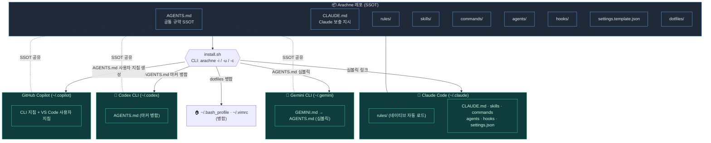
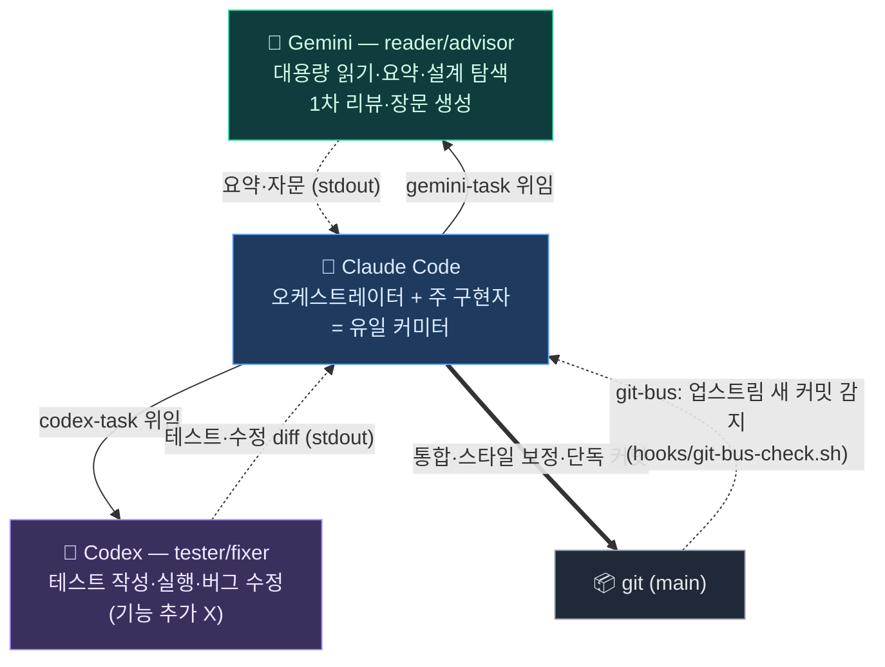
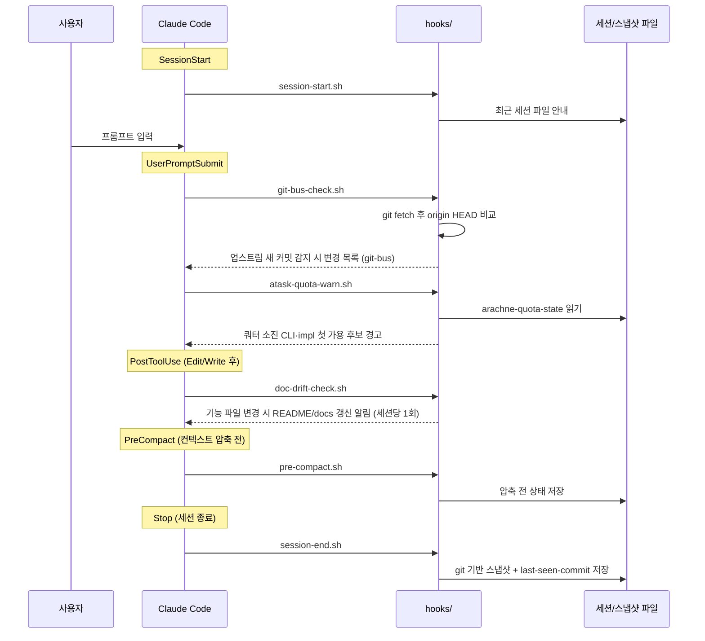
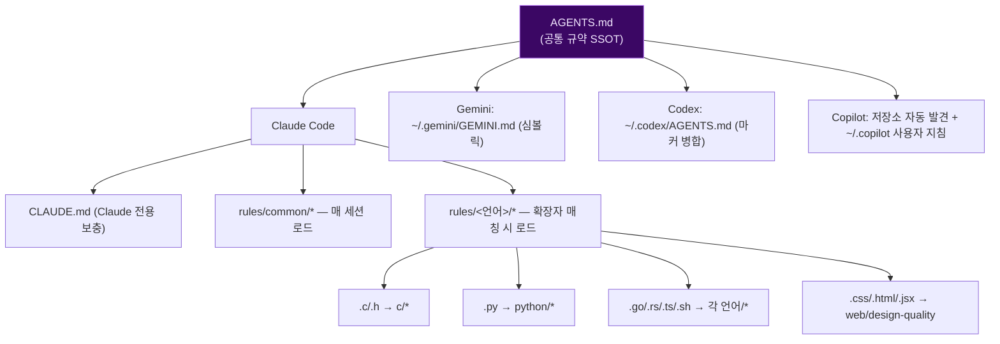
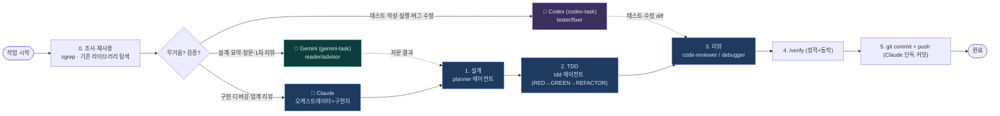

# 🕷️ Arachne 하네스 구조

> 이 문서의 Mermaid 다이어그램은 GitHub에서 자동 렌더링됩니다.
> 전체 디렉터리 설명은 [README](../README.md), 사용법은 [docs/USAGE.md](USAGE.md),
> 멀티-CLI 통합은 [docs/MULTI-CLI.md](MULTI-CLI.md) 참고.

---

## 1. Big Picture — Repo ↔ Multi-CLI Configuration Wiring

하나의 레포(`Arachne/`)를 `install.sh`(CLI: `arachne`)가 CLI별 지원 방식으로 연결한다.
Claude/Gemini는 심볼릭 링크를 사용하지만 Codex는 마커 병합 사본을 사용한다. 따라서 Codex의
`AGENTS.md` 변경 반영에는 재설치가 필요하며, `git push/pull`은 각 머신의 원본 레포를 동기화한다.



### 동작 단계 — `arachne -i` 설치가 실제로 하는 일

`arachne`는 `~/.local/bin/arachne → install.sh` 심볼릭이다. 실행하면 `install.sh`가 POSIX 호환
`ResolvePath`로 자기 실제 경로를 풀어 **레포 루트(`REPO_DIR`)** 를 찾는다 — 그래서 어느 디렉터리에서 불러도 올바른
레포를 가리킨다. 그다음 `install()` 디스패처가 타깃별로 아래를 순서대로 수행한다.

Windows에서는 `~\.local\bin\arachne.cmd → install.ps1` 래퍼가 같은 역할을 한다.
`install.ps1`은 관리자 권한이 필요한 파일 심볼릭 링크 대신 디렉터리 junction과 파일 hard link를
우선 사용하고, 파일 시스템 제약이 있으면 복사로 폴백한다. Bash 기반 훅과 위임 명령은
Git for Windows의 `bash.exe`를 통해 실행한다.

1. **Claude 설치** (`install_claude`)
   1. `~/.claude/` 생성(`mkdir -p`).
   2. `SYMLINK_TARGETS`(CLAUDE.md · commands · agents · rules · hooks · skills · statusline)를 하나씩:
      - 대상이 **실파일/디렉터리면** `.bak`으로 백업(`mv`), **기존 심볼릭이면** 제거(`rm`).
      - `ln -s 레포/대상 ~/.claude/대상` 으로 **심볼릭 링크** 생성 → 이후 레포 수정이 즉시 반영.
   3. `settings.json`은 링크가 아니라 **생성**: 실파일이면 `.bak` 백업 후,
      `settings.template.json`의 `__HOME__`을 실제 홈 경로로 `sed` 치환해 써넣는다.
2. **Gemini 설치** (`install_gemini`, 감지된 경우만)
   - `ln -s 레포/AGENTS.md ~/.gemini/GEMINI.md`. **심볼릭이므로 AGENTS.md 수정이 재설치 없이 즉시 반영.**
3. **Codex 설치** (`install_codex`, 감지된 경우만)
   - Codex는 import를 지원하지 않아 심볼릭 대신 **마커 병합**(`merge_dotfile`): `~/.codex/AGENTS.md`의
     `<!-- === ARACHNE … === -->` 마커 **안쪽만** AGENTS.md 본문으로 갱신하고, 마커 밖 사용자 내용은 보존.
   - 심볼릭이 아니라서 **AGENTS.md를 고친 뒤엔 `arachne -i --target codex`로 재병합**해야 반영된다.
4. **GitHub Copilot 설치** (`install_copilot`, 감지된 경우만)
   - Copilot CLI용 `~/.copilot/copilot-instructions.md`는 사용자 영역을 보존하며 마커 병합한다.
   - VS Code용 `~/.copilot/instructions/arachne.instructions.md`는 `applyTo: "**"` frontmatter와 함께 생성한다.
   - Windows 네이티브는 `install-copilot.ps1`, macOS/Linux/WSL/Git Bash는 `install.sh`를 사용한다.
5. **공통 설치** (`install_shared`, 항상 1회)
   1. `install_dotfiles` — `~/.bash_profile`·`~/.vimrc`에 `# === ARACHNE BEGIN/END ===` 마커 섹션을
      병합(멱등: 있으면 교체, 없으면 추가, 사용자 영역 중복 줄은 제외).
   2. `register_bin` — `BIN_TARGETS`(arachne · tws · gemini-task · gtask · codex-task · ctask ·
      arachne-task · atask · docs-sync)를
      `~/.local/bin/`에 심볼릭으로 등록(+`chmod +x`). PATH에 `~/.local/bin`이 없으면 경고 출력.

> **graceful skip**: `all` 타깃에서 Gemini/Codex/Copilot이 감지되지 않으면 해당 도구만 건너뛰고
> 나머지는 정상 설치한다.

### 동작 단계 — `arachne -u` 동기화 (다중 머신)

1. `git -C 레포 pull` 로 최신 소스를 받는다(동기화 허브).
2. 위 `arachne -i` 설치 흐름을 그대로 재실행 → 새 스크립트·심볼릭·규칙이 반영.
3. `settings.json`은 **매번 템플릿에서 재생성**되므로, 직접 수정한 값이 있으면 먼저 `arachne -e`로
   템플릿에 역추출해 둬야 유실되지 않는다(직전 값은 `settings.json.bak`에 남는다).

> **머신 간 동기화 모델**: 레포가 단일 진실 공급원(SSOT)이다. Claude/Gemini는 심볼릭 그림자,
> Codex는 재설치 시 갱신되는 마커 병합 사본이다.
> 한 머신에서 `git push` → 다른 머신에서 `arachne -u`(= pull + 재설치) 하면 전 머신이 같은 설정으로 수렴한다.

---

## 2. Collaboration Architecture — 3-Lane Delegation

§1이 **정적 배선**(레포→CLI별 심볼릭/병합)이라면, 이 절은 **런타임 협업 구조**다.
**Claude Code가 중심(오케스트레이터 + 주 구현자 + 유일 커미터)**이고, 토큰 무겁거나 검증성
작업을 두 위임 대상에게 **역할을 분리해서** 떠넘긴다. 셋 다 같은 `AGENTS.md` 규약을 공유하므로
인계 마찰이 작다.

| 레인 (Lane) | CLI | 위임 호출 | 역할 | 안 하는 것 |
| --- | --- | --- | --- | --- |
| 중심 | **Claude** | (직접) | 설계·구현·리팩터링·통합·**커밋**, 보안/임계 리뷰, 인프라 | — |
| reader / advisor | **Gemini** | `gemini-task` (`gtask`) | 대용량 읽기·요약, 설계 탐색, 1차 리뷰, 장문 생성 | 최종 구현 코드 |
| tester / fixer | **Codex** | `codex-task` (`ctask`) | 테스트 작성·실행, 버그 수정 | 기능 추가 |



**방향이 반대인 두 우선순위 사슬** — 같은 세 CLI를 두 축으로 줄 세운다:

| 축 | 기준 | 우선순위 | 의미 |
| --- | --- | --- | --- |
| **오프로드 (offload)** | 비용 | Gemini → Codex → (Claude 안 씀) | 토큰 무거운 일을 싸게 떠넘김 |
| **실행 후보 폴백** | 가용성 | Claude → Codex → Gemini | 쿼터 소진 시 다음 헤드리스 호출 후보를 시도 |

> **왜 역할을 분리하나** — 구현(Claude)과 검증(Codex)을 **다른 모델**이 맡으면 상관된 맹점(correlated
> blind spot)이 줄어든다. Gemini는 코딩 스타일 충실도가 낮아 최종 구현 코드는 맡기지 않고 읽기·자문에 둔다.
> `codex-task`/`gemini-task`는 블로킹·순차 호출이라 두 모델이 같은 파일을 동시에 건드리지 않으며, **커밋은 항상 Claude**다.

**`codex-task` 통합 경계 (제안 / 실행)**:

| 모드 | 플래그 | Codex 동작 | Claude 동작 |
| --- | --- | --- | --- |
| 제안 (기본) | 없음 | 테스트·수정 diff를 stdout 반환, 트리 미변경 | 받아서 적용·실행·커밋 |
| 실행 | `-w` | 직접 쓰고 돌려 green까지 수정, 트리 변경 | `git diff` 검토·스타일 보정·커밋 |

> **사용 모드 & 폴백**: 각 CLI는 단독 또는 위임 대상으로 쓸 수 있다. `atask`는 쿼터 소진 시 다음
> 헤드리스 호출 후보를 고르지만, `codex-task`/`gemini-task`의 역할 제한과 Claude 단독 커밋 원칙을
> 자동으로 바꾸지 않는다. 상세는 [MULTI-CLI.md §5](MULTI-CLI.md)에 정리돼 있다.
>
> 정책 단일 출처(SSOT)는 [`rules/common/workflow.md`](../rules/common/workflow.md),
> 사람용 상세는 [MULTI-CLI.md](MULTI-CLI.md)·[USAGE.md §6](USAGE.md).

### 동작 단계 — 위임 한 사이클 (Claude → Codex 예시)

`codex-task -w "실패하는 test_auth 를 green 까지 수정"` 한 줄이 실제로 거치는 흐름:

1. **분류·라우팅** — Claude가 작업을 본다. "테스트·검증성" → tester/fixer 레인(Codex). "대용량 읽기·요약"
   이면 reader/advisor 레인(Gemini), "정밀 구현·임계 판단"이면 Claude가 직접.
2. **위임 호출** — Claude가 `Bash`로 `codex-task`(=`codex-task.sh`)를 부른다. 권한 `Bash(ctask:*)`가 허용돼 있어
   승인 프롬프트 없이 실행된다.
3. **래퍼 전처리** — `codex-task`가 호출에 **tester/fixer 역할 프리앰블**을 주입한다(기능 추가 금지). `-w`면
   `codex exec`를 workspace-write로, 기본은 read-only 제안 모드로 돌린다.
4. **Codex 실행** — Codex가 테스트를 읽고(필요시 수정), 돌려서 green까지 만든다. 래퍼가 `codex`의 헤더·메타·
   경고(stderr)를 걸러 **결과/ diff만 stdout**으로 돌려준다.
5. **Claude 통합** — Claude가 받은 diff를 `git diff`로 검토하고, `rules/`의 풀 규칙(헤더·네이밍 등)으로
   **스타일을 보정**한다. Codex 산출물은 `AGENTS.md` 다이제스트만 따르므로 이 보정 단계가 필요하다.
6. **검증 → 단독 커밋** — `/verify`(정적+동작) 통과 후 **Claude만** `git add/commit/push` 한다.

> 핵심 불변식: **블로킹·순차 호출**이라 두 모델이 같은 파일을 동시에 건드리지 않고, **커밋 권한은 Claude 단독**.
> `gemini-task`(Gemini) 사이클도 동일하나 4단계에서 코드 대신 요약·자문을 받고, 장문 생성은 파일로 빼 재독하지 않는다.

---

## 3. Repository Directory Layout

> 디렉터리 구조는 다이어그램이 아닌 트리 텍스트로 표기한다(Mermaid는 관계·흐름 표현용).

```
Arachne/
├── AGENTS.md                    # 공통 규약 SSOT (Claude·Gemini·Codex 공유)
├── CLAUDE.md                    # Claude 전용 보충 지시
├── README.md
├── settings.template.json       # ~/.claude/settings.json 템플릿
├── install.sh                   # 통합 관리 도구 (CLI: arachne)
├── tmux.sh                      # 워크스페이스 매니저 (CLI: tws)
├── gemini-task.sh               # Gemini 위임 래퍼 — reader/advisor (CLI: gemini-task, gtask)
├── codex-task.sh                # Codex 위임 래퍼 — tester/fixer (CLI: codex-task, ctask)
├── arachne-task.sh              # 자동 폴백 캐스케이드 디스패처 (CLI: arachne-task, atask)
├── docs-sync.sh                 # README/docs ↔ Obsidian 수동 동기화 (CLI: docs-sync)
├── statusline-command.sh
│
├── rules/                       # Claude 전역 행동 규칙
│   ├── common/                  # 언어 공통 (12)
│   ├── c · cpp · golang · rust  # 언어별 규칙
│   ├── python · javascript · bash
│   └── web/                     # design-quality
├── skills/                      # 워크플로·도메인 스킬 (28)
├── commands/                    # 슬래시 커맨드 (16)
├── agents/                      # 서브에이전트 7개 (planner·code-reviewer·tdd·debugger
│                                #   ·python-reviewer·fastapi-reviewer·react-reviewer)
├── hooks/                       # 이벤트 훅 (session-start/end · pre-compact · git-bus-check
│                                #   · atask-quota-warn · doc-drift-check)
├── mcp-configs/                 # MCP 서버 설정 템플릿
├── dotfiles/                    # bash_profile · vimrc (병합 원본)
├── tests/                       # 검증 (bats + shell)
├── templates/project/           # 사용 프로젝트용 verify.sh·commands·GitHub Actions 템플릿
└── docs/ · .github/workflows/   # 문서 · CI
```

---

## 4. Runtime — Event Hook Flow

`settings.json`이 Claude Code 라이프사이클 이벤트를 `hooks/`의 스크립트에 연결한다.



### 동작 단계 — 훅별 상세

각 훅은 `settings.json`의 해당 이벤트 매처에 등록돼 있고, 종료코드 `0`은 성공(경고 출력 가능),
`2`는 차단(`PreToolUse`에서만 유효)이다.

- **`session-start.sh` (SessionStart)** — 세션이 열릴 때 1회. `.claude/sessions/`에서 가장 최근 스냅샷
  파일을 찾아 "이어받기" 안내(경로)를 출력한다. 직전 세션 맥락을 빠르게 복구하기 위함.
- **`git-bus-check.sh` (UserPromptSubmit)** — 프롬프트를 넣을 때마다. **git-bus의 핵심**:
  1. `git fetch -q origin` 으로 리모트 최신을 받는다(로컬 `pull` 없이 감지만).
  2. 비교 기준 HEAD를 정한다 — 리모트 트래킹 브랜치(`origin/<현재브랜치>`)가 있으면 그 HEAD, 없으면 로컬 HEAD.
  3. 기준점 파일 `.claude/last-seen-commit`(gitignore, 추적 안 됨)과 비교.
     - 파일이 **없으면**(최초 실행) 현재 HEAD만 조용히 기록하고 종료.
     - 현재 HEAD == 기준점이면 **새 커밋 없음** → 조용히 종료.
  4. 다르면 `git log --oneline <기준점>..<HEAD>`로 **새 커밋 목록 + 변경 파일**을 박스 UI로 출력
     (작성 도구와 무관하게 업스트림에 추가된 커밋을 알림).
  5. 기준점을 현재 HEAD로 **갱신** → 같은 커밋을 두 번 알리지 않는다.
- **`pre-compact.sh` (PreCompact)** — 컨텍스트 압축 직전. 현재 작업 상태를 스냅샷 파일로 저장해
  압축으로 잃을 맥락을 보존한다.
- **`session-end.sh` (Stop)** — 세션 종료 시. git 기반 스냅샷을 남기고, 방금 fetch한 리모트 HEAD를
  `.claude/last-seen-commit`에 기록해 다음 세션의 git-bus 비교 기준점을 최신화한다.

> **비동기 변경 알림**: `gemini-task`/`codex-task`(동기 호출)와 별개로 업스트림 git 히스토리를
> 변경 알림으로 사용한다. 훅(`git-bus-check.sh`)은 커밋 작성자가 사람인지 특정 AI인지 판별하지 않으며,
> 미푸시 로컬 커밋은 업스트림 비교에 포함되지 않는다.

---

## 5. SSOT Convention Loading Model

`rules/common/*`는 매 세션, `rules/<언어>/*`는 해당 확장자 편집 시 자동 로드된다.
공통 규약은 `AGENTS.md` 하나에서 파생된다.



### 동작 단계 — 규칙이 로드되는 순간

1. **세션 시작 시 (공통 규칙)** — Claude Code는 `~/.claude/rules/`(→ 레포 `rules/` 심볼릭)를 **네이티브로
   자동 로드**한다. `rules/common/*`는 `paths` frontmatter가 없으므로 **매 세션 항상** 적용된다. 동시에
   `CLAUDE.md`(Claude 전용 보충)도 읽힌다. `@import` 구문은 쓰지 않는다 — 심볼릭 + 네이티브 로더가 대체.
2. **파일을 열 때 (언어 규칙)** — 편집 대상 확장자가 `rules/<언어>/*`의 `paths` 패턴과 매칭되면 그 언어
   규칙 5종(coding-style·patterns·security·testing·hooks)이 **추가 로드**된다. 예: `*.rs`/`Cargo.toml`을
   건드리면 `rules/rust/*`, `*.py`면 `rules/python/*`, `*.css/.html/.jsx`면 `rules/web/design-quality`.
3. **Gemini/Codex/Copilot (다이제스트 경로)** — 이 도구들은 같은 규약의 **요약본인
   `AGENTS.md`** 를 각자 지원하는 방식으로 본다. 언어 규칙은 본문 자동 로드가 아니라
   `AGENTS.md §9`의 **경로 포인터**로 안내된다.

> **두 동기화 축을 혼동하지 말 것**: ① 레포→글로벌(심볼릭/병합, `arachne -i`)과 ② `AGENTS.md`(다이제스트)
> ↔ `rules/`(풀 버전)의 **내용 동기화**는 별개다. 규약을 바꾸면 양쪽을 함께 손봐야 하며, CI 인덱스 검사는
> 파일 누락만 잡고 **내용 일치는 사람 책임**이다.

---

## 6. Development Workflow Pipeline (3-Lane)

`조사 → 설계 → TDD → 리뷰 → 커밋`. 토큰 무거운 읽기·요약은 Gemini(`gemini-task`, reader/advisor)로,
테스트·버그 수정은 Codex(`codex-task`, tester/fixer)로, 정밀 구현·통합·커밋은 Claude가 맡는다.
TDD = Test-Driven Development(테스트 주도 개발), RED→GREEN→REFACTOR 순서.



### 동작 단계 — 한 작업이 거치는 길

0. **조사·재사용** — 새로 짜기 전에 `sgrep`으로 유사 패턴을, man/POSIX/패키지로 기존 구현을 찾는다.
   80% 이상 해결하는 검증된 구현이 있으면 채택. 대용량 일괄 분석은 `gemini-task`로 Gemini에 요약 위임(토큰 절약).
1. **설계** — 파일 3개+ 수정·신규 모듈·시스템 레벨 변경이면 **`planner` 에이전트**(opus)로 설계 선행.
   단순 버그·설정값 변경은 생략 가능. 무거운 설계 탐색은 `gemini-task`로 1차안을 받아 가볍게 sanity check 후 채택.
2. **TDD** — `tdd` 에이전트로 RED(실패 테스트) → GREEN(최소 구현) → REFACTOR. 테스트 작성·실행은
   `codex-task`로 Codex에 위임 가능(구현=Claude, 검증=Codex로 맹점 탈상관). 커버리지 80%+ 확인.
3. **리뷰** — 코드 변경 직후 `code-reviewer`(언어별 `python-reviewer`·`fastapi-reviewer`·`react-reviewer`),
   빌드 실패·메모리 문제면 `debugger`. CRITICAL·HIGH는 수정 후 진행.
4. **검증** — `/verify`로 정적 검사(`gcc -fsyntax-only`·`go vet`·`tsc --noEmit`·`ruff`·`shellcheck` 등) +
   동작/테스트를 2단계로 돌린다.
5. **커밋·푸시** — 통과하면 `<type>: <설명>` 형식으로 **Claude 단독 커밋** 후 푸시. 위임 산출물은 이 단계
   전에 Claude가 `rules/` 풀 규칙으로 스타일을 보정해 통합한다.

> **병렬 작업이면 worktree**: 동시 다중 세션·에이전트는 `git worktree add ../<repo>-<task> feat/<task>`로
> 폴더까지 분리한다(브랜치만으로는 체크아웃 충돌이 남는다). 서브에이전트는 `isolation: "worktree"`로 자동 격리.
