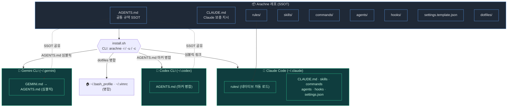
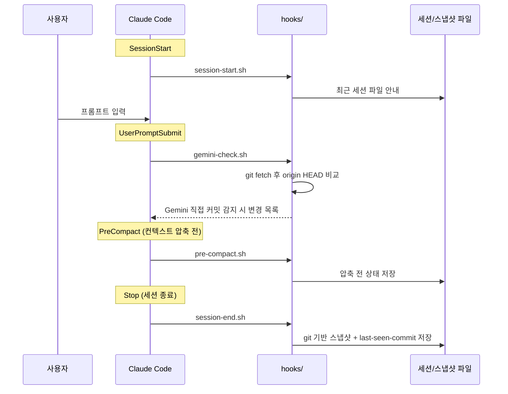
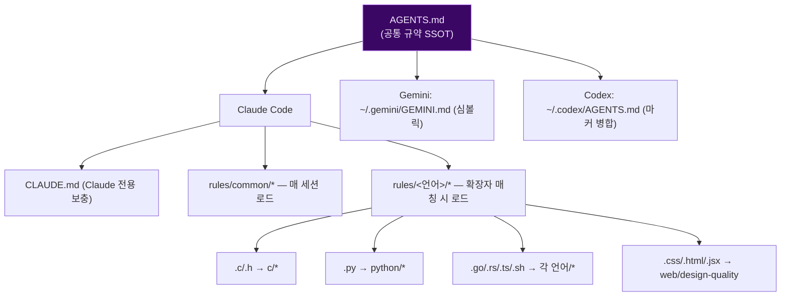

# 🕷️ Arachne 하네스 구조

> 이 문서의 Mermaid 다이어그램은 GitHub에서 자동 렌더링됩니다.
> 전체 디렉터리 설명은 [README](../README.md), 사용법은 [docs/USAGE.md](USAGE.md),
> 멀티-CLI 통합은 [docs/MULTI-CLI.md](MULTI-CLI.md) 참고.

---

## 1. 전체 그림 — 레포 ↔ 멀티-CLI 심볼릭 연결

하나의 레포(`Arachne/`)를 `install.sh`(CLI: `arachne`)가 심볼릭 링크로 세 CLI에 연결한다.
레포를 수정하면 글로벌 설정에 즉시 반영되고, `git push/pull`로 모든 머신이 동기화된다.



---

## 2. 레포 디렉터리 구조

> 디렉터리 구조는 다이어그램이 아닌 트리 텍스트로 표기한다(Mermaid는 관계·흐름 표현용).

```
Arachne/
├── AGENTS.md                    # 공통 규약 SSOT (Claude·Gemini·Codex 공유)
├── CLAUDE.md                    # Claude 전용 보충 지시
├── README.md
├── settings.template.json       # ~/.claude/settings.json 템플릿
├── install.sh                   # 통합 관리 도구 (CLI: arachne)
├── tmux.sh                      # 워크스페이스 매니저 (CLI: tws)
├── gemini-task.sh               # Gemini 위임 래퍼 — reader/advisor (CLI: gask, gemini-task)
├── codex-task.sh                # Codex 위임 래퍼 — tester/fixer (CLI: cask, codex-task)
├── statusline-command.sh
│
├── rules/                       # Claude 전역 행동 규칙
│   ├── common/                  # 언어 공통 (12)
│   ├── c · cpp · golang · rust  # 언어별 규칙
│   ├── python · javascript · bash
│   └── web/                     # design-quality
├── skills/                      # 워크플로·도메인 스킬 (26)
├── commands/                    # 슬래시 커맨드 (14)
├── agents/                      # 서브에이전트 (planner·code-reviewer·tdd·debugger·python-reviewer)
├── hooks/                       # 이벤트 훅 (session-start/end · pre-compact · gemini-check)
├── mcp-configs/                 # MCP 서버 설정 템플릿
├── dotfiles/                    # bash_profile · vimrc (병합 원본)
├── tests/                       # 검증 (bats + shell)
└── docs/ · .github/workflows/   # 문서 · CI
```

---

## 3. 런타임 — 이벤트 훅 흐름

`settings.json`이 Claude Code 라이프사이클 이벤트를 `hooks/`의 스크립트에 연결한다.



---

## 4. SSOT 규약 로딩 모델

`rules/common/*`는 매 세션, `rules/<언어>/*`는 해당 확장자 편집 시 자동 로드된다.
세 CLI 공통 규약은 `AGENTS.md` 하나에서 파생된다.



---

## 5. 개발 워크플로 파이프라인

`조사 → 설계 → TDD → 리뷰 → 커밋`. 토큰 무거운 작업은 Gemini(`gask`)로,
정밀 구현·디버깅은 Claude 에이전트로 라우팅한다.

```mermaid
flowchart LR
    START([작업 시작]) --> INV["0. 조사·재사용<br/>sgrep · 기존 라이브러리 탐색"]
    INV --> ROUTE{토큰 무거움?}

    ROUTE -->|"설계·요약·장문·1차 리뷰"| GEMINI["💎 Gemini (gask)"]
    ROUTE -->|"구현·디버깅·임계 리뷰"| CLAUDE["🤖 Claude"]

    GEMINI -.->|자문 결과| PLAN
    CLAUDE --> PLAN["1. 설계<br/>planner 에이전트"]
    PLAN --> TDD["2. TDD<br/>tdd 에이전트 (RED→GREEN→CLEAN)"]
    TDD --> REVIEW["3. 리뷰<br/>code-reviewer / debugger"]
    REVIEW --> VERIFY["4. /verify (정적+동작)"]
    VERIFY --> COMMIT["5. git commit + push"]
    COMMIT --> END([완료])

    classDef gem fill:#0f3d3e,stroke:#34d399,color:#d1fae5;
    classDef cla fill:#1e3a5f,stroke:#60a5fa,color:#dbeafe;
    class GEMINI gem;
    class CLAUDE,PLAN,TDD,REVIEW cla;
```


