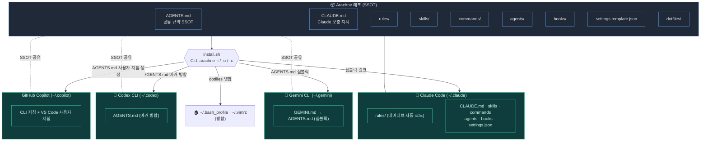
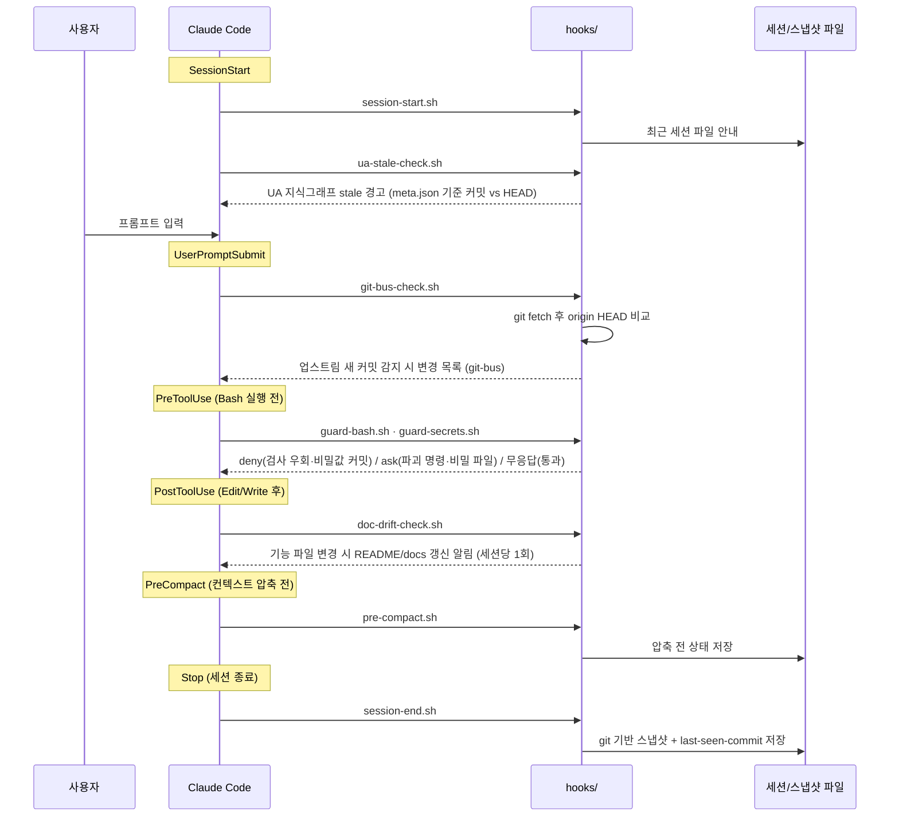
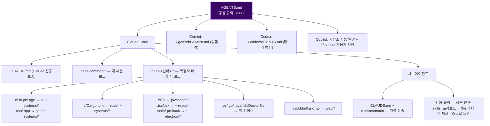
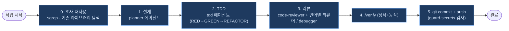
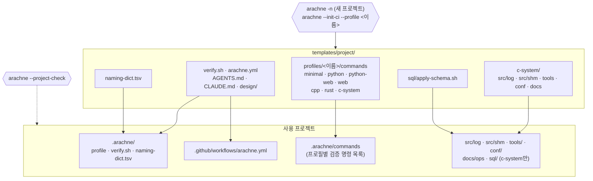

# 🕷️ Arachne 하네스 구조

이 문서는 Arachne 하네스가 어떻게 짜여 있고 실행 중에 어떻게 움직이는지를 다이어그램으로 보여 준다.
하네스를 처음 보는 사람이나, 구조를 바꾸기 전에 영향 범위를 확인하려는 사람이 읽는다.
각 절은 다이어그램을 먼저 두고, 그 아래 "동작 단계"에서 실제로 일어나는 일을 순서대로 설명한다.

| 절 | 보여 주는 것 |
|---|---|
| 1 | 저장소가 각 CLI 설정 디렉터리에 연결되는 방식 (설치·동기화) |
| 2 | Claude Code 단독 운용 모델 |
| 3 | 저장소 디렉터리 구성 |
| 4 | 이벤트 훅이 실행되는 시점 |
| 5 | 규칙(rules)이 로드되는 시점과 서브에이전트에 닿는 범위 |
| 6 | 한 작업이 거치는 개발 파이프라인 |
| 7 | 비밀값·개인정보를 막는 보안 계층 |
| 8 | 사용 프로젝트에 깔리는 프로젝트 키트(프로필) |
| 9 | 3티어 대용량 시스템 개발을 지원하는 자산 지도 |

다이어그램은 GitHub에서 자동으로 렌더링된다. 사용법은 [USAGE](USAGE.md), 다른 CLI와의 공통 규약 배포는
[MULTI-CLI](MULTI-CLI.md), 영역별 자산 목록은 [CAPABILITY-MAP](CAPABILITY-MAP.md)에 있다.

---

## 1. Big Picture — Repo ↔ Multi-CLI Configuration Wiring

하나의 레포(`Arachne/`)를 `install.sh`(CLI: `arachne`)가 CLI별 지원 방식으로 연결한다.
Claude/Gemini는 심볼릭 링크를 사용하지만 Codex는 마커 병합 사본을 사용한다. 따라서 Codex의
`AGENTS.md` 변경 반영에는 재설치가 필요하며, `git push/pull`은 각 머신의 원본 레포를 동기화한다.


```mermaid
flowchart TB
    subgraph REPO["📦 Arachne 레포 (SSOT)"]
        direction TB
        AGENTS["AGENTS.md<br/>공통 규약 SSOT"]
        CLAUDEMD["CLAUDE.md<br/>Claude 보충 지시"]
        RULES["rules/"]
        SKILLS["skills/"]
        CMDS["commands/"]
        SUBAG["agents/"]
        HOOKSD["hooks/"]
        SETT["settings.template.json"]
        DOTS["dotfiles/"]
    end

    INSTALL{{"install.sh<br/>CLI: arachne -i / -u / -c"}}

    subgraph CLAUDE["🤖 Claude Code (~/.claude)"]
        C_RULES["rules/ (네이티브 자동 로드)"]
        C_MISC["CLAUDE.md · skills · commands<br/>agents · hooks · settings.json"]
    end
    subgraph GEMINI["💎 Gemini CLI (~/.gemini)"]
        G_MD["GEMINI.md → AGENTS.md (심볼릭)"]
    end
    subgraph CODEX["🔷 Codex CLI (~/.codex)"]
        X_MD["AGENTS.md (마커 병합)"]
    end
    subgraph COPILOT["GitHub Copilot (~/.copilot)"]
        P_MD["CLI 지침 + VS Code 사용자 지침"]
    end
    HOME["🏠 ~/.bash_profile · ~/.vimrc<br/>(병합)"]

    REPO --> INSTALL
    INSTALL -->|"심볼릭 링크"| CLAUDE
    INSTALL -->|"AGENTS.md 심볼릭"| GEMINI
    INSTALL -->|"AGENTS.md 마커 병합"| CODEX
    INSTALL -->|"AGENTS.md 사용자 지침 생성"| COPILOT
    INSTALL -->|"dotfiles 병합"| HOME

    AGENTS -. "SSOT 공유" .-> G_MD
    AGENTS -. "SSOT 공유" .-> X_MD
    AGENTS -. "SSOT 공유" .-> P_MD
    RULES --> C_RULES

    classDef repo fill:#1f2937,stroke:#60a5fa,color:#e5e7eb;
    classDef cli fill:#0f3d3e,stroke:#34d399,color:#d1fae5;
    class REPO,AGENTS,CLAUDEMD,RULES,SKILLS,CMDS,SUBAG,HOOKSD,SETT,DOTS repo;
    class CLAUDE,GEMINI,CODEX,COPILOT,C_RULES,C_MISC,G_MD,X_MD,P_MD cli;
```

### 동작 단계 — `arachne -i` 설치가 실제로 하는 일

`arachne`는 `~/.local/bin/arachne → install.sh` 심볼릭이다. 실행하면 `install.sh`가 POSIX 호환
`ResolvePath`로 자기 실제 경로를 풀어 **레포 루트(`REPO_DIR`)** 를 찾는다 — 그래서 어느 디렉터리에서 불러도 올바른
레포를 가리킨다. 그다음 `install()` 디스패처가 타깃별로 아래를 순서대로 수행한다.

Windows에서는 `~\.local\bin\arachne.cmd → install.ps1` 래퍼가 같은 역할을 한다.
`install.ps1`은 관리자 권한이 필요한 파일 심볼릭 링크 대신 디렉터리 junction과 파일 hard link를
우선 사용하고, 파일 시스템 제약이 있으면 복사로 폴백한다. Bash 기반 훅과 위임 명령은
Git for Windows의 `bash.exe`를 통해 실행한다.

1. **Claude 설치** (`InstallClaude`)
   1. `~/.claude/` 생성(`mkdir -p`).
   2. `SYMLINK_TARGETS`(CLAUDE.md · commands · agents · rules · hooks · skills · statusline)를 하나씩:
      - 대상이 **실파일/디렉터리면** `.bak`으로 백업(`mv`), **기존 심볼릭이면** 제거(`rm`).
      - `ln -s 레포/대상 ~/.claude/대상` 으로 **심볼릭 링크** 생성 → 이후 레포 수정이 즉시 반영.
   3. `settings.json`은 링크가 아니라 **생성**: 실파일이면 `.bak` 백업 후,
      `settings.template.json`의 `__HOME__`을 실제 홈 경로로 `sed` 치환해 써넣는다.
2. **Gemini 설치** (`InstallGemini`, 감지된 경우만)
   - `ln -s 레포/AGENTS.md ~/.gemini/GEMINI.md`. **심볼릭이므로 AGENTS.md 수정이 재설치 없이 즉시 반영.**
3. **Codex 설치** (`InstallCodex`, 감지된 경우만)
   - Codex는 import를 지원하지 않아 심볼릭 대신 **마커 병합**(`MergeDotfile`): `~/.codex/AGENTS.md`의
     `<!-- === ARACHNE … === -->` 마커 **안쪽만** AGENTS.md 본문으로 갱신하고, 마커 밖 사용자 내용은 보존.
   - 심볼릭이 아니라서 **AGENTS.md를 고친 뒤엔 `arachne -i --target codex`로 재병합**해야 반영된다.
4. **GitHub Copilot 설치** (`InstallCopilot`, 감지된 경우만)
   - Copilot CLI용 `~/.copilot/copilot-instructions.md`는 사용자 영역을 보존하며 마커 병합한다.
   - VS Code용 `~/.copilot/instructions/arachne.instructions.md`는 `applyTo: "**"` frontmatter와 함께 생성한다.
   - Windows 네이티브는 `install.ps1 -Install -Target copilot`, macOS/Linux/WSL/Git Bash는
     `install.sh -i --target copilot`을 사용한다. 독립 `install-copilot.ps1`은 보조 설치 경로로 유지한다.
5. **공통 설치** (`install_shared`, 항상 1회)
   1. `install_dotfiles` — `~/.bash_profile`·`~/.vimrc`에 `# === ARACHNE BEGIN/END ===` 마커 섹션을
      병합(멱등: 있으면 교체, 없으면 추가, 사용자 영역 중복 줄은 제외).
   2. `RegisterBin` — `BIN_TARGETS`(arachne · tws · docs-sync)를
      `~/.local/bin/`에 심볼릭으로 등록(+`chmod +x`). PATH에 `~/.local/bin`이 없으면 경고 출력.

> **graceful skip**: `all` 타깃에서 Gemini/Codex/Copilot이 감지되지 않으면 해당 도구만 건너뛰고
> 나머지는 정상 설치한다.

### 동작 단계 — `arachne -u` 동기화 (다중 머신)

1. `git -C 레포 pull` 로 최신 소스를 받는다(동기화 허브).
2. 위 `arachne -i` 설치 흐름을 그대로 재실행 → 새 스크립트·심볼릭·규칙이 반영.
3. `settings.json`은 **매번 템플릿에서 재생성**되므로, 직접 수정한 값이 있으면 먼저 `arachne -e`로
   템플릿에 역추출해 둬야 유실되지 않는다(직전 값은 `settings.json.bak`에 남는다).

> **머신 간 동기화 모델**: 레포가 단일 진실 공급원(SSOT)이다. Claude/Gemini는 심볼릭 그림자,
> Codex는 재설치 시 갱신되는 마커 병합 사본이다.
> 한 머신에서 `git push` → 다른 머신에서 `arachne -u`(= pull + 재설치) 하면 전 머신이 같은 설정으로 수렴한다.

---

## 2. Runtime Operation — Claude Code 단독

> 과거의 3-레인 위임 구조(레인 표·협업 다이어그램·두 우선순위 사슬·`codex-task` 통합 경계·
> 위임 사이클·계측)는 [ADR-0004](decisions/0004-remove-3lane-runtime.md)로
> [`archive/multi-cli/`](../archive/multi-cli/)에 보존·제거됐다 — 당시 서술 원문은
> [archive/multi-cli/MULTI-CLI.md](../archive/multi-cli/MULTI-CLI.md). 공통 규약 배포는
> [MULTI-CLI](MULTI-CLI.md) 참고.

Claude Code가 조사·설계·구현·검증·커밋을 단독 수행한다.

- **병렬성** — Claude 내장 서브에이전트(`Agent` 도구, `agents/` 10종)로 확보한다.
  독립 작업은 동시 실행, 파일을 수정하는 병렬 작업은 worktree로 격리한다.
- **게이트** — 커밋 전 `/verify`(정적+동작) + 프로젝트 CI(`.arachne/verify.sh`·GitHub Actions).
- **맹점 보정** — 구현과 검증이 같은 모델이므로 `code-reviewer`와 언어별 리뷰어의 리뷰, `/verify`를
  한 단계 더 신중하게 적용한다(`rules/common/workflow.md`).
- **실수 방지** — 검사 우회·파괴 명령·비밀값 커밋은 PreToolUse 가드 훅이 막거나 확인을 받는다(7절).

## 3. Repository Directory Layout

디렉터리 구성은 관계가 아니라 포함 구조이므로 다이어그램 대신 트리로 적는다.
`~/.claude/`로 연결되는 디렉터리는 하네스 본체이고, 나머지는 설치 도구·문서·검증 자산이다.

```
Arachne/
├── AGENTS.md                    # 공통 규약 정본(SSOT) — 다른 CLI 어댑터로 배포
├── CLAUDE.md                    # Claude 전용 보충 지시 (~/.claude/CLAUDE.md)
├── README.md · VERSION · LICENSE
├── settings.template.json       # ~/.claude/settings.json 생성 원본 (훅 등록·permissions.deny)
├── install.sh · install.ps1     # 통합 관리 도구 (CLI: arachne)
├── lib/                         # install.sh 도메인 라이브러리 (project-ci · feedback · naming-check)
├── tmux.sh · docs-sync.sh · statusline-command.sh · setup-extras.*
│
├── rules/                       # 항상 적용되는 규칙 (~/.claude/rules)
│   ├── common/                  # 언어 공통 10개 — 매 세션 로드
│   ├── c · cpp · golang · rust · java      # 언어별 규칙 — 확장자 매칭 시 로드
│   ├── python · javascript · bash · docker
│   ├── systems/                 # C·Rust 시스템 설계 철학·결정 기준 (ADR-0005)
│   ├── react · electron         # TS 클라이언트
│   └── web/                     # 디자인 품질·UI 배치·웹 보안·웹 성능
├── skills/                      # 워크플로·도메인 스킬 65개 (+ archive · synced)
├── commands/                    # 슬래시 커맨드 21개
├── agents/                      # 서브에이전트 10개 — 설계(planner) · 테스트(tdd) · 디버깅(debugger)
│                                #   · 리뷰어 7종(code · python · fastapi · react · typescript · rust · database)
├── hooks/                       # 이벤트 훅 — 세션(session-start/end · pre-compact · ua-stale-check)
│                                #   · 알림(git-bus-check · doc-drift-check) · 가드(guard-bash · guard-secrets · lib-guard)
├── mcp-configs/ · dotfiles/     # MCP 설정 템플릿 · bash_profile·vimrc 병합 원본
│
├── templates/project/           # 사용 프로젝트에 까는 키트 (8절)
│   ├── profiles/                # minimal · python · python-web · web · cpp · rust · c-system
│   ├── c-system/                # C 서버 골격 — log · shm · pipeline · contract + 운영 도구(tools/)
│   ├── sql/ · naming-dict.tsv   # .sql 스키마 버전 적용기 · 네이밍 사전 원본
│   ├── throughput-poc/ · desktop-data-client/ · compose-3tier/   # 측정·클라이언트·3티어 예제
│   └── verify.sh · arachne.yml · AGENTS.md · CLAUDE.md · design/
├── tests/                       # 하네스 자체 검증 (bats · 셸 검사)
├── docs/                        # 문서 — 지도(ARCHITECTURE·README) · 결정(decisions) · 이력(issue)
│                                #   · 상태(task) · 아이디어(idea) · 도구(tools) · 양식(template)
├── archive/                     # 현역에서 뺀 자산 보존 (multi-cli — ADR-0004)
└── .github/workflows/ci.yml     # 5개 플랫폼 CI
```

---

## 4. Runtime — Event Hook Flow

`settings.json`이 Claude Code 라이프사이클 이벤트를 `hooks/`의 스크립트에 연결한다.


```mermaid
sequenceDiagram
    participant U as 사용자
    participant CC as Claude Code
    participant H as hooks/
    participant FS as 세션/스냅샷 파일

    Note over CC: SessionStart
    CC->>H: session-start.sh
    H->>FS: 최근 세션 파일 안내
    CC->>H: ua-stale-check.sh
    H-->>CC: UA 지식그래프 stale 경고 (meta.json 기준 커밋 vs HEAD)

    U->>CC: 프롬프트 입력
    Note over CC: UserPromptSubmit
    CC->>H: git-bus-check.sh
    H->>H: git fetch 후 origin HEAD 비교
    H-->>CC: 업스트림 새 커밋 감지 시 변경 목록 (git-bus)
    Note over CC: PreToolUse (Bash 실행 전)
    CC->>H: guard-bash.sh · guard-secrets.sh
    H-->>CC: deny(검사 우회·비밀값 커밋) / ask(파괴 명령·비밀 파일) / 무응답(통과)
    Note over CC: PostToolUse (Edit/Write 후)
    CC->>H: doc-drift-check.sh
    H-->>CC: 기능 파일 변경 시 README/docs 갱신 알림 (세션당 1회)

    Note over CC: PreCompact (컨텍스트 압축 전)
    CC->>H: pre-compact.sh
    H->>FS: 압축 전 상태 저장

    Note over CC: Stop (세션 종료)
    CC->>H: session-end.sh
    H->>FS: git 기반 스냅샷 + last-seen-commit 저장
```

### 동작 단계 — 훅별 상세

각 훅은 `settings.json`의 해당 이벤트 매처에 등록돼 있다. 알림 훅은 종료코드 `0`으로 끝나며 출력은
경고로만 쓰인다. 가드 훅(`PreToolUse`)은 종료코드 대신 JSON 응답의 `permissionDecision`
(`deny` 거부 · `ask` 사용자 확인)으로 판정을 전달하고, 아무것도 출력하지 않으면 통과다.

- **`session-start.sh` (SessionStart)** — 세션이 열릴 때 1회. `.claude/sessions/`에서 가장 최근 스냅샷
  파일을 찾아 "이어받기" 안내(경로)를 출력한다. 직전 세션 맥락을 빠르게 복구하기 위함.
- **`ua-stale-check.sh` (SessionStart)** — 세션이 열릴 때 1회. `.understand-anything/meta.json`의
  분석 기준 커밋(`gitCommitHash`)과 HEAD를 비교해 N커밋 이상 뒤처지면 `/understand` 재실행을
  안내한다(임계값 `UA_STALE_THRESHOLD`, 기본 1). UA 산출물이 없는 프로젝트에서는 침묵하며,
  분석을 자동 재실행하지는 않는다 — 재분석 비용은 사람이 판단한다.
- **`guard-bash.sh` (PreToolUse, Bash)** — Bash 명령이 실행되기 직전마다. 명령을 셸처럼 읽어(따옴표·이스케이프
  해석) `;`·`&`·`|` 단위로 나눈 뒤 단어를 보고 판정한다. `-nm`처럼 붙여 쓴 짧은 옵션도 풀어서 본다. 검사 우회(`--no-verify`, `core.hooksPath` 변경)는 **거부**하고, 되돌리기
  어려운 명령(DB 클라이언트의 `DROP`·`TRUNCATE`, force push, `reset --hard`, 위험 경로 `rm -rf`,
  `chmod 777`, `ipcrm`)과 비밀 파일(`.env`, 키, 자격증명, 덤프)을 여는 명령은 **사용자 확인**을 받는다.
  커밋 메시지 안의 `DROP` 같은 문자열은 DB 클라이언트 호출이 아니므로 통과한다.
- **`guard-secrets.sh` (PreToolUse, Bash)** — `git commit` 직전에만 동작한다. 커밋될 추가 줄에서
  비밀값(액세스 키, API 키, 개인키, 비밀번호 리터럴, DB 접속 문자열)과 검증식이 맞는 주민등록번호·
  카드번호를 찾으면 커밋을 **거부**하고, 데이터 파일이나 연락처·이메일이 많은 파일은 **확인**을 받는다.
  사유에는 파일과 줄 번호만 남기고 값은 출력하지 않는다. 테스트 픽스처 경로와
  `ARACHNE-SYNTHETIC-DATA` 표식이 있는 파일은 합성 데이터로 본다.
- 두 가드의 판정 함수(명령 토큰화, 커밋 인자 해석, JSON 응답 생성)는 `lib-guard.sh`에 모여 있다.
  가드는 jq가 없어도 동작하며, 이때는 정규식으로 명령 문자열을 꺼낸다.
- 두 가드는 실수를 막는 장치다. Claude가 비밀 파일을 읽지 못하게 하는 1차 경계는
  `settings.json`의 `permissions.deny`이며, Read 거부 규칙은 Bash의 `cat`·`head` 같은 읽기 명령에도 적용된다.
- **`git-bus-check.sh` (UserPromptSubmit)** — 프롬프트를 넣을 때마다. **git-bus의 핵심**:
  1. `git fetch -q origin` 으로 리모트 최신을 받는다(로컬 `pull` 없이 감지만).
     매 프롬프트 네트워크 왕복을 막기 위해 기본 300초 간격으로 스로틀된다
     (`.claude/last-fetch-epoch` 스탬프, `GIT_BUS_FETCH_INTERVAL` 초로 조정).
  2. 비교 기준 HEAD를 정한다 — 리모트 트래킹 브랜치(`origin/<현재브랜치>`)가 있으면 그 HEAD, 없으면 로컬 HEAD.
  3. 기준점 파일 `.claude/last-seen-commit`(gitignore, 추적 안 됨)과 비교.
     - 파일이 **없으면**(최초 실행) 현재 HEAD만 조용히 기록하고 종료.
     - 현재 HEAD == 기준점이면 **새 커밋 없음** → 조용히 종료.
  4. 다르면 `git log --oneline <기준점>..<HEAD>`로 **새 커밋 목록 + 변경 파일**을 박스 UI로 출력
     (작성 도구와 무관하게 업스트림에 추가된 커밋을 알림).
  5. 기준점을 현재 HEAD로 **갱신** → 같은 커밋을 두 번 알리지 않는다.
- **`pre-compact.sh` (PreCompact)** — 컨텍스트 압축 직전. 현재 작업 상태를 스냅샷 파일로 저장해
  압축으로 잃을 맥락을 보존한다.
- **`session-end.sh` (Stop)** — 세션 종료 시. git 기반 스냅샷을 남기고, 방금 fetch한 리모트 HEAD를
  `.claude/last-seen-commit`에 기록해 다음 세션의 git-bus 비교 기준점을 최신화한다.

> **비동기 변경 알림**: 업스트림 git 히스토리를 변경 알림으로 사용한다.
> 훅(`git-bus-check.sh`)은 커밋 작성자가 사람인지 특정 AI인지 판별하지 않으며,
> 미푸시 로컬 커밋은 업스트림 비교에 포함되지 않는다.

---

## 5. SSOT Convention Loading Model

`rules/common/*`는 매 세션, `rules/<언어>/*`는 해당 확장자 편집 시 자동 로드된다.
공통 규약은 `AGENTS.md` 하나에서 파생된다.


```mermaid
flowchart TB
    AGENTS["AGENTS.md<br/>(공통 규약 SSOT)"]

    AGENTS --> CLAUDE["Claude Code"]
    AGENTS --> GEMINI["Gemini: ~/.gemini/GEMINI.md (심볼릭)"]
    AGENTS --> CODEX["Codex: ~/.codex/AGENTS.md (마커 병합)"]
    AGENTS --> COPILOT["Copilot: 저장소 자동 발견 + ~/.copilot 사용자 지침"]

    CLAUDE --> CM["CLAUDE.md (Claude 전용 보충)"]
    CLAUDE --> RC["rules/common/* — 매 세션 로드"]
    CLAUDE --> RL["rules/<언어>/* — 확장자 매칭 시 로드"]

    RL --> EX1[".c/.h/.pc/.pgc → c/* + systems/*<br/>.cpp/.hpp → cpp/* + systems/*"]
    RL --> EX2[".rs/Cargo.toml → rust/* + systems/*"]
    RL --> EX3[".ts/.js → javascript/*<br/>.tsx/.jsx → + react/*<br/>main/·preload/ → + electron/*"]
    RL --> EX4[".py/.go/.java/.sh/Dockerfile → 각 언어/*"]
    RL --> EX5[".css/.html/.jsx/.tsx → web/*"]

    CLAUDE --> SUB["서브에이전트"]
    SUB --> SUB1["CLAUDE.md + rules/common — 자동 상속"]
    SUB --> SUB2["언어 규칙 — 상속 안 됨<br/>skills: 프리로드 · 리뷰어 내장 체크리스트로 보완"]

    classDef ssot fill:#3b0764,stroke:#c084fc,color:#f3e8ff;
    class AGENTS ssot;
```

### 동작 단계 — 규칙이 로드되는 순간

1. **세션 시작 시 (공통 규칙)** — Claude Code는 `~/.claude/rules/`(→ 레포 `rules/` 심볼릭)를 **네이티브로
   자동 로드**한다. `rules/common/*`는 `paths` frontmatter가 없으므로 **매 세션 항상** 적용된다. 동시에
   `CLAUDE.md`(Claude 전용 보충)도 읽힌다. `@import` 구문은 쓰지 않는다 — 심볼릭 + 네이티브 로더가 대체.
2. **파일을 열 때 (언어 규칙)** — 편집 대상 확장자가 `rules/<언어>/*`의 `paths` 패턴과 매칭되면 그 언어
   규칙 5종(coding-style·patterns·security·testing·hooks)이 **추가 로드**된다. 예: `*.rs`/`Cargo.toml`을
   건드리면 `rules/rust/*`, `*.py`면 `rules/python/*`, `*.css/.html/.jsx`면 `rules/web/*`가 붙는다.
   C·Rust 파일은 언어 규칙과 함께 `rules/systems/*`(설계 철학·결정 기준)도 로드한다.
   경로 매칭은 현재 프로젝트 안의 파일에만 적용되므로, 프로젝트 밖 파일을 편집할 때는 언어 규칙이 붙지 않는다.
3. **Gemini/Codex/Copilot (다이제스트 경로)** — 이 도구들은 같은 규약의 **요약본인
   `AGENTS.md`** 를 각자 지원하는 방식으로 본다. 언어 규칙은 본문 자동 로드가 아니라
   `AGENTS.md §9`의 **경로 포인터**로 안내된다.

4. **서브에이전트** — 표준 서브에이전트는 `CLAUDE.md`와 `rules/common/*`를 그대로 물려받는다.
   그러나 `paths`가 있는 언어 규칙은 어떤 서브에이전트에도 미리 로드되지 않는다(2026-10 실측).
   그래서 `tdd`·`code-reviewer`·`debugger`는 frontmatter의 `skills:`로 필요한 스킬을 미리 싣고,
   언어 리뷰어는 체크리스트를 정의 파일 안에 담는다. Explore·Plan 계열은 `CLAUDE.md`도 건너뛰므로
   위임 프롬프트에 핵심 규칙을 직접 적는다(`rules/common/agents.md`).

> **두 동기화 축을 혼동하지 말 것**: ① 레포→글로벌(심볼릭/병합, `arachne -i`)과 ② `AGENTS.md`(다이제스트)
> ↔ `rules/`(풀 버전)의 **내용 동기화**는 별개다. 규약을 바꾸면 양쪽을 함께 손봐야 하며, CI 인덱스 검사는
> 파일 누락만 잡고 **내용 일치는 사람 책임**이다.

---

## 6. Development Workflow Pipeline

한 작업은 `조사 → 설계 → TDD → 리뷰 → 검증 → 커밋` 순서로 진행한다. 모든 단계를 Claude가 수행하고,
단계마다 전담 서브에이전트(planner·tdd·리뷰어·debugger)를 쓴다.
TDD = Test-Driven Development(테스트 주도 개발), RED→GREEN→REFACTOR 순서.


```mermaid
flowchart LR
    START([작업 시작]) --> INV["0. 조사·재사용<br/>sgrep · 기존 라이브러리 탐색"]
    INV --> PLAN["1. 설계<br/>planner 에이전트"]
    PLAN --> TDD["2. TDD<br/>tdd 에이전트 (RED→GREEN→REFACTOR)"]
    TDD --> REVIEW["3. 리뷰<br/>code-reviewer + 언어별 리뷰어 / debugger"]
    REVIEW --> VERIFY["4. /verify (정적+동작)"]
    VERIFY --> COMMIT["5. git commit + push<br/>(guard-secrets 검사)"]
    COMMIT --> END([완료])

    classDef cla fill:#1e3a5f,stroke:#60a5fa,color:#dbeafe;
    class INV,PLAN,TDD,REVIEW,VERIFY,COMMIT cla;
```

### 동작 단계 — 한 작업이 거치는 길

0. **조사·재사용** — 새로 짜기 전에 `sgrep`으로 유사 패턴을, man/POSIX/패키지로 기존 구현을 찾는다.
   80% 이상 해결하는 검증된 구현이 있으면 채택.
1. **설계** — 파일 3개+ 수정·신규 모듈·시스템 레벨 변경이면 **`planner` 에이전트**(opus)로 설계 선행.
   단순 버그·설정값 변경은 생략 가능.
2. **TDD** — `tdd` 에이전트로 RED(실패 테스트) → GREEN(최소 구현) → REFACTOR. 커버리지 80%+ 확인.
3. **리뷰** — 코드 변경 직후 `code-reviewer`와 언어별 리뷰어(`python-reviewer`·`fastapi-reviewer`·
   `react-reviewer`·`typescript-reviewer`·`rust-reviewer`·`database-reviewer`)를 돌리고,
   빌드 실패·메모리 문제면 `debugger`. CRITICAL·HIGH는 수정 후 진행. 구현·검증 동일 모델이므로
   리뷰를 생략하지 않는다.
4. **검증** — `/verify`로 정적 검사(`gcc -fsyntax-only`·`go vet`·`tsc --noEmit`·`ruff`·`shellcheck` 등) +
   동작/테스트를 2단계로 돌린다.
5. **커밋·푸시** — 통과하면 `<type>: <설명>` 형식으로 커밋 후 푸시.

> **병렬 작업이면 worktree**: 동시 다중 세션·에이전트는 `git worktree add ../<repo>-<task> feat/<task>`로
> 폴더까지 분리한다(브랜치만으로는 체크아웃 충돌이 남는다). 서브에이전트는 `isolation: "worktree"`로 자동 격리.

---

## 7. Security Layers — 비밀값·개인정보 보호

비밀값(키·비밀번호·토큰·DB 접속 정보)과 개인정보는 네 겹으로 막는다. 바깥 겹일수록 강제력이 크고,
안쪽 겹은 놓친 것을 다시 잡는 확인 장치다. 어느 한 겹도 단독으로 완전하지 않으므로 겹을 줄이지 않는다.


```mermaid
flowchart LR
    subgraph L1["① 읽기 차단 (settings.json)"]
        DENY["permissions.deny<br/>.env · 키 · ~/.ssh · 자격증명<br/>wallet · tnsnames · .pgpass · 덤프"]
    end
    subgraph L2["② 실행 직전 가드 (PreToolUse)"]
        GB["guard-bash.sh<br/>검사 우회 거부 · 파괴 명령 확인<br/>비밀 파일 열기 확인"]
        GS["guard-secrets.sh<br/>커밋될 줄의 비밀값 거부<br/>주민번호·카드 검증식 · 연락처 다수 확인"]
    end
    subgraph L3["③ 저장소 검사 (CI)"]
        CST["check_sensitive_text.sh<br/>개인 경로·비밀값·개인정보"]
        CUS["check_unicode_safety.sh<br/>지시 파일의 숨은 유니코드"]
    end
    subgraph L4["④ 작성 규약 (rules · skills · agents)"]
        SDH["sensitive-data-handling 스킬<br/>마스킹 · 합성 데이터 · 코어 덤프 차단"]
        PD["에이전트 프롬프트 방어 기준선<br/>외부 콘텐츠 UNTRUSTED 구획"]
    end

    MODEL(["Claude"]) --> L1 --> L2 --> REPO[("git 저장소")]
    REPO --> L3
    L4 -. "코드·문서를 쓰는 기준" .-> MODEL
```

### 동작 단계 — 비밀값 하나가 막히는 지점

1. **읽기** — Claude가 `.env`나 개인키를 Read 도구로 열려고 하면 `permissions.deny`가 거부한다.
   이 규칙은 Bash의 `cat`·`head` 같은 읽기 명령에도 적용되며, 예외를 둘 수 없다.
2. **명령 실행** — 거부 목록에 없는 비밀 파일을 셸 명령으로 열거나, 되돌리기 어려운 명령을 실행하려 하면
   `guard-bash.sh`가 사용자 확인을 받는다. `--no-verify`처럼 검사를 건너뛰는 명령은 거부한다.
3. **커밋** — `git commit` 직전 `guard-secrets.sh`가 스테이지된 추가 줄을 검사한다. `cd 경로 &&`나
   `git -C 경로`로 다른 저장소를 가리켜도 그 저장소를 검사한다. 일부러 남기는 예시 값은 줄 끝의
   `ARACHNE-ALLOW-SECRET` 표식이나 파일 앞부분의 `ARACHNE-SYNTHETIC-DATA` 표식으로 허용한다.
4. **푸시 이후** — CI가 추적 파일 전체를 다시 검사한다. 세션 요약이나 issue 문서처럼 모델이 쓴 산출물로
   새는 경우를 여기서 잡는다. 저장소 이력 전체 점검 결과는
   [이력 비밀값 점검](issue/2026-10-05-history-secret-scan.md)에 있다.
5. **운영 데이터** — 원격 서버에서 가져오는 수집 묶음(`tools/collect.sh`)은 반출 전에 전화번호·이메일 등을
   가린다. 프로젝트 코드의 로그·공유메모리·클라이언트 저장 기준은 `sensitive-data-handling` 스킬을 따른다.

---

## 8. Project Kit — 사용 프로젝트에 까는 자산

하네스 본체(`~/.claude`)는 모든 프로젝트에 공통으로 적용된다. 프로젝트마다 다른 검증 명령·CI·
설계 문서 양식·코드 골격은 `arachne` 명령이 프로젝트 저장소 안에 복사해 넣는다. 어떤 묶음을 깔지는
프로필(profile)로 고른다.


```mermaid
flowchart TB
    CMD{{"arachne -n (새 프로젝트)<br/>arachne --init-ci --profile &lt;이름&gt;"}}
    subgraph TPL["templates/project/"]
        PROF["profiles/&lt;이름&gt;/commands<br/>minimal · python · python-web · web<br/>cpp · rust · c-system"]
        COMMON["verify.sh · arachne.yml<br/>AGENTS.md · CLAUDE.md · design/"]
        KIT["c-system/<br/>src/log · src/shm · tools · conf · docs"]
        SQL["sql/apply-schema.sh"]
        DICT["naming-dict.tsv"]
    end
    subgraph PROJ["사용 프로젝트"]
        P_AR[".arachne/<br/>profile · verify.sh · naming-dict.tsv"]
        P_CI[".github/workflows/arachne.yml"]
        P_CMD[".arachne/commands<br/>(프로필별 검증 명령 목록)"]
        P_SRC["src/log · src/shm · tools/ · conf/<br/>docs/ops · sql/ (c-system만)"]
    end
    CMD --> TPL
    PROF --> P_CMD
    COMMON --> P_AR
    COMMON --> P_CI
    KIT --> P_SRC
    SQL --> P_SRC
    DICT --> P_AR
    CHECK{{"arachne --project-check"}} -.-> PROJ
```

### 동작 단계 — 프로필이 깔리는 순서

1. `arachne --init-ci --profile <이름>`이 프로필 이름을 검증하고 `.arachne/profile`에 기록한다.
2. 공통 자산(`.arachne/verify.sh`, GitHub Actions 워크플로)을 복사한다. CI는 `.arachne/profile`을 읽어
   해당 언어 검사만 켠다. 웹 계열 프로필이면 설계 문서 양식(`design/`)도 함께 깐다.
3. 프로필의 검증 명령 목록을 `.arachne/commands`로 복사한다. `verify.sh`는 이 목록을 한 줄씩 실행한다.
   이미 있는 목록은 보존한다.
4. `c-system` 프로필은 추가로 C 서버 골격(로그·공유메모리 모듈, 운영 도구, 설정, 운영 문서, `.sql` 적용기)과
   네이밍 사전을 복사한다. 이미 있는 파일은 덮어쓰지 않고 건너뛴다.
5. `arachne --project-check`로 깔린 상태를 점검한다. 세부 절차는 [PROJECT-CI](PROJECT-CI.md)에 있다.

---

## 9. 3-Tier System Support Map — 대용량 시스템 지원 지도

Arachne가 겨냥하는 대상은 클라이언트(Windows·macOS) ↔ Linux C/Rust 서버 ↔ Oracle·PostgreSQL DB로 이어지는
3티어 대용량 데이터 처리 시스템이다. 아래 지도는 티어마다 어떤 규칙·스킬·에이전트·템플릿이 붙는지 보여 준다.
설계 결정의 근거는 [ADR-0006](decisions/0006-roadmap-2026q4.md)과 [ADR-0005](decisions/0005-programming-philosophy.md)에 있다.


```mermaid
flowchart LR
    subgraph CL["클라이언트 — TypeScript (웹 · Electron)"]
        CL_R["rules: javascript · react · electron · web"]
        CL_S["skills: desktop-data-client · frontend-patterns<br/>react-testing · vite-patterns · frontend-a11y"]
        CL_A["agents: typescript-reviewer · react-reviewer"]
        CL_T["templates: desktop-data-client"]
    end
    subgraph SV["서버 — Linux C · Rust"]
        SV_R["rules: c · rust · systems"]
        SV_S["skills: c-server-patterns · stream-pipeline-patterns<br/>c-data-structures · shm-db-patterns · operational-logging<br/>latency-critical-systems · c-to-rust-migration"]
        SV_A["agents: code-reviewer · rust-reviewer · debugger · tdd"]
        SV_T["templates: c-system · throughput-poc"]
    end
    subgraph DB["DB — Oracle · PostgreSQL"]
        DB_S["skills: embedded-sql · oracle-patterns<br/>postgres-patterns · sql-schema-versioning"]
        DB_A["agents: database-reviewer"]
        DB_T["templates: sql/apply-schema.sh"]
    end
    CL <-->|"바이너리 스트림 계약<br/>api-contracts · json-contracts"| SV
    SV <-->|"Pro*C · ecpg<br/>공유메모리 ⇄ DB 동기화"| DB

    subgraph X["티어 공통"]
        X1["처리량·부하: data-throughput-accelerator · load-testing"]
        X2["분석·추적: remote-linux-analysis · distributed-tracing · performance-profiling"]
        X3["보안·네이밍: sensitive-data-handling · naming-dictionary"]
        X4["통합 실행: templates/compose-3tier (CI 스모크)"]
    end
```

### 동작 단계 — 데이터 한 건이 지나는 길과 담당 자산

1. **수신** — 서버가 외부 데이터를 받아 고정 크기 레코드로 만든다. 큐·링버퍼·프레이밍은
   `stream-pipeline-patterns`, 저장 자료구조와 정렬은 `c-data-structures`를 따른다.
2. **보관** — 실시간 데이터는 공유메모리에 두고 DB와 동기화한다(`shm-db-patterns`). 세그먼트 조회·제어·복구는
   c-system 키트의 `tools/shmctl.sh`·`shm_view`·`shm_recover`로 한다.
3. **영속화** — DB 반영은 Pro*C·ecpg 호스트 배열로 묶어서 처리한다(`embedded-sql`). 스키마 변경은
   `.sql` 파일 버전 규약(`sql-schema-versioning`)으로 관리한다.
4. **송신** — 서버는 클라이언트별 송신 큐 상한을 두고 바이너리 스트림을 보낸다. 메시지 형식의 정본은
   C 헤더 구조체이며, C와 TypeScript 디코더가 같은 테스트 벡터로 서로를 검증한다(`api-contracts`).
5. **표시** — TypeScript 클라이언트는 워커에서 프레임을 재조립하고 화면 주기마다 최신값만 병합해 그린다
   (`desktop-data-client`). TypeScript가 이 부하를 감당한다는 측정은
   [처리량 PoC 결과](issue/2026-10-05-throughput-poc-result.md)에 있다.
6. **운영** — 모든 티어는 거래 ID를 담은 한 줄 로그를 남기고(`operational-logging`), `tools/logtrace.sh`로
   한 거래를 따라간다. 오프라인 서버 분석은 `tools/collect.sh` 묶음으로 한다(`remote-linux-analysis`).
