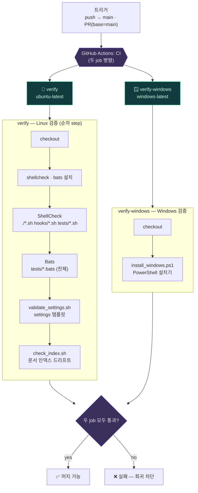
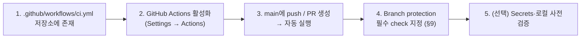

MOC:: [[Arachne]]
FROM:: [[empty]]

# Arachne CI 운영 가이드

> 소문자 경로를 요구하는 도구와 사용자를 위해 최신 CI 가이드는 [ci.md](ci.md)에도 정리되어 있다.
> 이 파일은 기존 링크 호환을 위해 유지한다.

Arachne의 CI(Continuous Integration, 지속적 통합)는 GitHub Actions에서 저장소의 셸 스크립트,
설치 동작, 설정 템플릿, 문서 인덱스를 자동 검증한다. 현재 CI는 **검증 전용**이며 패키지 배포,
릴리스 생성, 사용자 환경 설치 같은 CD(Continuous Deployment)는 수행하지 않는다.

실행 정의의 정본은 [`.github/workflows/ci.yml`](../.github/workflows/ci.yml)이다. 이 문서는 해당
워크플로의 목적, 로컬 재현법, 실패 해석, 유지보수 절차를 설명한다. 문서와 YAML이 다르면 실제
GitHub Actions 동작을 결정하는 YAML이 우선한다.

## 0. 개요 — 왜 CI이고 어떻게 짜였나

### 왜 CI를 쓰는가

수동 검사는 잊히고 사람마다 다르다. CI는 **매 변경마다 같은 검사를 기계적으로** 돌려 다음을 보장한다.

- **회귀 차단** — main에 들어간 변경이 기존 동작(셸 스크립트·설치·설정·문서 인덱스)을 깨지 않는지 자동 확인.
- **자기규칙 강제** — 하네스가 규정한 `shellcheck`·`bats`·인덱스 일치를 **자기 자신에게도** 강제한다.
  규칙·문서와 실제 코드가 어긋나는 **드리프트**를 구조적으로 막는다.
- **크로스 플랫폼** — Linux·Windows 두 러너에서 동시에 검증해 "내 OS에선 통과"하는 함정을 방지한다.
- **PR 게이트** — 병합 전에 통과를 요구하면, 깨진 변경이 main에 들어오는 것을 사전에 막는다.
- **재현 가능성** — 로컬에서 동일 명령(§5)으로 그대로 재현 가능 → "내 머신에선 됐는데" 문제를 줄인다.
- **저비용·안전** — 외부 CLI를 mock·임시 홈으로 격리해 API 키·과금·실제 계정 없이 빠르게 돈다(§10).

> 한계도 분명하다 — CI 통과가 "모델 응답 정확성·전 플랫폼 호환·보안 무결성"을 보장하진 않는다(§11).
> CI는 **정의된 자동 검사 범위 안에서만** 회귀를 차단한다.

### 구조 한눈에



핵심은 **glob 기반 자동 포함**이다. ShellCheck는 `./*.sh hooks/*.sh tests/*.sh`, Bats는 `tests/*.bats`를
글로브로 잡으므로, 그 위치에 스크립트·테스트를 추가하면 **CI YAML 수정 없이 자동으로 검사 대상에 들어간다**
(§3.3·§3.4). 새 위치·새 PowerShell 테스트만 YAML 갱신이 필요하다(§8).

### 세팅·설정 방법

CI를 처음 켜거나 다른 저장소/포크에 적용할 때의 절차다. **워크플로 파일만 있으면 GitHub가 자동 인식**하므로
별도 등록 도구는 없다 — 나머지는 GitHub 저장소 설정(UI)이다.



1. **워크플로 파일 — 이미 포함됨**
   - `.github/workflows/ci.yml`이 저장소에 있으면 GitHub가 자동으로 워크플로로 등록한다. 별도 설치 불필요.
   - main에 들어가 있으면 이후 `push`/`pull_request`(§1)에서 바로 동작한다.
2. **GitHub Actions 활성화 확인**
   - 저장소 **Settings → Actions → General**에서 Actions 실행을 허용한다(최소 필요 action 허용 권장).
   - **포크한 저장소**는 Actions 탭에서 한 번 *"I understand my workflows, enable them"* 을 눌러야 워크플로가 켜진다.
   - 조직 정책으로 막혀 있으면 조직 관리자가 Actions를 허용해야 한다.
3. **브랜치 보호로 게이트화 (권장)**
   - **Settings → Branches → Add branch ruleset(또는 protection rule) → `main`**.
   - *Require status checks to pass* 를 켜고 필수 check로 **`verify`** 와 **`verify-windows`** 를 지정한다.
   - 상세 권장값(최신 main 요구·강제 push 제한 등)은 [§9](#9-branch-protection-권장-설정).
   - ⚠️ job 이름을 바꾸면 여기 필수 check 이름도 다시 지정해야 한다.
4. **Secrets 설정 (현재 불필요)**
   - 현재 CI는 외부 AI 인증을 쓰지 않아 API 키가 없어도 된다(§10). 추후 E2E를 추가하면
     **Settings → Secrets and variables → Actions**에 최소 권한 토큰을 등록하고 fork PR엔 secret이 안 가는 점을 고려한다.
5. **로컬 사전 검증 세팅 (권장)**
   - PR 전 CI와 동일 검사를 로컬에서 돌리도록 도구를 깐다(§5): `shellcheck`·`bats`·`jq`(+macOS는 `coreutils`).
   - 자동화하려면 `pre-push` git 훅에 §5의 한 줄 명령을 넣어, push 전에 실패를 잡는다.
6. **다른 저장소·신규 프로젝트에 적용**
   - `.github/workflows/ci.yml`과 `tests/`를 복사한다. job 이름을 유지하면 브랜치 보호 설정을 그대로 재사용할 수 있다.
   - `arachne -n`으로 만든 신규 프로젝트는 문서 구조(`docs/{issue,idea,task,template}`)는 받지만 **CI YAML은 포함하지 않으므로** 필요하면 별도로 복사한다.
7. **워크플로 커스터마이즈**
   - 수동 실행이 필요하면 트리거에 `workflow_dispatch:` 추가, 정기 검증은 `schedule:` 추가.
   - macOS 검증이 필요하면 `macos-latest` job을 추가하고 §5.2의 명령을 step으로 넣는다(현재는 없음, §11).

## 1. 실행 조건

CI는 다음 이벤트에만 실행된다.

| 이벤트 | 대상 | 용도 |
| --- | --- | --- |
| `push` | `main` 브랜치 | main에 들어간 변경이 계속 정상인지 검증 |
| `pull_request` | base 브랜치가 `main`인 PR | 병합 전에 변경을 검증 |

다음 상황에서는 현재 워크플로가 자동 실행되지 않는다.

- main이 아닌 브랜치에 push만 하고 PR을 만들지 않은 경우
- 태그 생성
- 수동 실행(`workflow_dispatch`)
- 예약 실행(`schedule`)
- 다른 저장소에서 Arachne를 설치하거나 사용하는 경우

따라서 기능 브랜치에서는 PR을 생성하거나 아래 로컬 재현 명령을 직접 실행해야 한다.

## 2. Job 구성

현재 CI는 서로 독립적인 두 job으로 구성된다.

| Job | 러너 | 역할 |
| --- | --- | --- |
| `verify` | `ubuntu-latest` | Bash 정적 분석, 전체 Bats, 설정 및 문서 인덱스 검사 |
| `verify-windows` | `windows-latest` | Windows PowerShell 설치기와 생성 산출물 검사 |

두 job은 병렬로 실행된다. 하나가 통과해도 다른 하나가 실패하면 전체 CI는 성공으로 볼 수 없다.

## 3. Ubuntu Job: `verify`

### 3.1 Checkout

```yaml
- uses: actions/checkout@v4
```

검증할 커밋의 저장소 내용을 러너에 체크아웃한다. 이후 모든 명령은 저장소 루트에서 실행된다.

### 3.2 ShellCheck와 Bats 설치

```bash
sudo apt-get update -qq
sudo apt-get install -y shellcheck bats
```

- `shellcheck`: Bash/Shell 정적 분석기
- `bats`: Bash Automated Testing System

현재 `jq`는 명시적으로 설치하지 않는다. `ubuntu-latest`에 `jq`가 있으면
`tests/validate_settings.sh`가 JSON 파싱과 필수 키 검사를 수행하고, 없으면 해당 부분을 `SKIP`
처리한다. 즉, 지금 구조에서는 JSON 검사가 러너 이미지에 부분적으로 의존한다.

### 3.3 ShellCheck

```bash
shellcheck -S warning ./*.sh hooks/*.sh tests/*.sh
```

검사 대상:

- 저장소 루트의 모든 `*.sh`
- `hooks/`의 모든 `*.sh`
- `tests/`의 모든 `*.sh`

`-S warning` 때문에 warning 이상 진단이 있으면 실패한다. glob을 사용하므로 위 세 위치에 새 Shell
스크립트를 추가하면 별도 CI YAML 수정 없이 자동 포함된다.

자동 포함되지 않는 예:

- 다른 하위 디렉터리에 추가한 Shell 스크립트
- 확장자가 `.sh`가 아닌 실행 스크립트
- PowerShell 파일

새 스크립트 위치를 추가할 경우 ShellCheck 명령의 glob도 함께 갱신해야 한다.

### 3.4 전체 Bats

```bash
bats tests/*.bats
```

`tests/` 바로 아래의 모든 `.bats` 파일을 실행한다. 새 Bats 파일은 해당 디렉터리에 두면 자동
포함된다.

현재 주요 테스트 범위:

| 테스트 | 검증 대상 |
| --- | --- |
| `tests/install.bats` | Unix 설치, 링크, settings 생성, Codex/Copilot 병합, 연결 점검 |
| `tests/hooks.bats` | 훅 파일 존재·권한·문법과 일부 기본 동작 |
| `tests/atask.bats` | 역할별 순서, 쿼터 폴백, 쿨다운, 일반 오류 중단 |
| `tests/docs_sync.bats` | docs-sync 설정 생성·목록·구형 설정 호환 |
| `tests/new_project.bats` | 신규 프로젝트 구조, 템플릿, git 초기화, 입력 검증 |

대부분의 외부 CLI는 mock 또는 임시 홈 디렉터리로 격리된다. 따라서 실제 Claude, Codex, Gemini,
Copilot 서비스에 로그인하거나 API를 호출하는 E2E 테스트가 아니다.

### 3.5 settings 템플릿 검증

```bash
bash tests/validate_settings.sh
```

검사 내용:

1. `settings.template.json` 존재
2. `jq`가 있으면 JSON 문법 파싱
3. `jq`가 있으면 필수 키 존재
   - `.statusLine`
   - `.hooks`
   - `.hooks.SessionStart`
   - `.hooks.Stop`
   - `.hooks.PreCompact`
   - `.enabledPlugins`
4. 설치 시 치환할 `__HOME__` 플레이스홀더 존재
5. 실행한 러너의 실제 `$HOME` 경로가 템플릿에 하드코딩되지 않았는지 확인

주의:

- 이 검사는 모든 hook matcher나 command 경로의 의미적 정확성까지 검증하지 않는다.
- `jq`가 없으면 JSON 파싱 및 필수 키 검사가 생략될 수 있다.
- 템플릿으로 생성된 최종 `~/.claude/settings.json` 동작은 `install.bats`가 일부 검증한다.

### 3.6 문서 인덱스 검사

```bash
bash tests/check_index.sh
```

파일을 추가하고 사용자 문서나 인덱스를 갱신하지 않는 드리프트를 탐지한다.

현재 검사 관계:

| 실제 파일 | 등록을 요구하는 문서 |
| --- | --- |
| `skills/*.md` | `skills/README.md`, `docs/USAGE.md` |
| `commands/*.md` | `CLAUDE.md`, `docs/USAGE.md` |
| `agents/*.md` | `CLAUDE.md`, `docs/USAGE.md` |
| `rules/<하위 디렉터리>/` | `CLAUDE.md` |

추가로 `tests/`, `mcp-configs/`처럼 이미 존재하는 디렉터리가 `CLAUDE.md`에 계속 “예정”으로
표시되는지도 검사한다.

현재 한계:

- Markdown 구조를 파싱하지 않고 파일명 또는 stem 문자열 포함 여부를 검사한다.
  - 단, stem 은 **단어 경계**로 매칭한다(#35) — 더 긴 단어의 일부로 우연히 통과하는 false-negative 차단.
- 문서가 실제로 기능을 정확히 설명하는지는 검사하지 않는다.
- `docs/task/`, `docs/issue/`, 일반 사용자 문서의 상호 링크는 검사하지 않는다.
- 문서가 삭제된 파일을 참조하는 역방향 검사도 없다.

### 3.7 규약 동기화 검사

```bash
bash tests/check_convention_sync.sh
```

`AGENTS.md`(다이제스트)와 `rules/common/*`(풀버전)의 **내용 동기화**를 검사한다(#39). 파일명 인덱스가
아니라, 핵심 규약 토큰이 양쪽 정본에 모두 존재하는지 본다 — 한쪽만 고쳐 Gemini/Codex(AGENTS.md)와
Claude(rules)가 다른 규약을 보게 되는 드리프트를 차단한다.

| 토큰 그룹 | 정본(rules) | 검사 토큰(예) |
| --- | --- | --- |
| 네이밍 | `rules/common/coding-style.md` | `snake_case` `PascalCase` `SCREAMING_SNAKE_CASE` … |
| TDD 단계 | `rules/common/testing.md` | `RED` `GREEN` `REFACTOR` `AAA` |
| git type | `rules/common/git-workflow.md` | `feat` `fix` `refactor` `docs` `test` `chore` `perf` `style` |

- 각 토큰은 `AGENTS.md` **와** 매핑된 rules 파일에 **단어 경계**로 존재해야 한다. 한쪽에만 있으면 `[DRIFT]`로 실패한다.
- 한계: 전체 본문의 의미 등가성까지 검증하지 않는다. 새 핵심 규약을 추가하면 이 스크립트의 토큰 목록도 갱신한다.
- 테스트는 `CONV_SYNC_REPO` 환경변수로 픽스처 디렉터리를 주입해 검증한다.

## 4. Windows Job: `verify-windows`

### 4.1 Checkout

Windows 최신 GitHub-hosted runner에 저장소를 체크아웃한다.

### 4.2 PowerShell 설치기 테스트

```powershell
./tests/install_windows.ps1
```

테스트는 임시 디렉터리를 `ARACHNE_HOME`으로 사용하고 사용자 PATH 변경은
`ARACHNE_SKIP_PATH=1`로 막는다. 실제 사용자 홈을 변경하지 않는다.

현재 검증 내용:

- Claude 자산 설치
- 디렉터리 junction 또는 복사 폴백 산출물 존재
- 파일 hard link 또는 복사 폴백 산출물 존재
- `settings.template.json`의 `__HOME__` 치환
- Windows 경로를 `/` 형식으로 바꾼 settings JSON
- settings JSON 파싱
- Gemini `GEMINI.md` 생성
- Codex `AGENTS.md` 사용자 내용 보존
- Codex ARACHNE 마커 병합 멱등성
- `arachne.cmd`, `atask.cmd` 등 Windows 명령 래퍼 생성
- Bash 래퍼가 Windows 경로 대신 slash 경로를 사용하는지 확인

현재 검증하지 않는 내용:

- Windows 통합 설치기의 Copilot 타깃
- `install-copilot.ps1`의 실제 실행 결과
- Git for Windows `bash.exe`에서 훅 실행
- Windows에서 `gtask`, `ctask`, `atask`가 실제 외부 CLI를 호출하는 흐름
- Windows 사용자 PATH 영구 변경
- junction/hard link 실패 시 실제 복사 폴백 강제 재현
- Windows PowerShell 5.1과 PowerShell 7의 동시 호환성 매트릭스

## 5. 로컬에서 CI 재현

PR을 올리기 전에는 가능한 한 CI와 같은 명령을 로컬에서 실행한다.

### 5.1 Ubuntu/Debian

```bash
sudo apt-get update
sudo apt-get install -y shellcheck bats jq

shellcheck -S warning ./*.sh hooks/*.sh tests/*.sh
bats tests/*.bats
bash tests/validate_settings.sh
bash tests/check_index.sh
```

한 줄로 실행하려면:

```bash
shellcheck -S warning ./*.sh hooks/*.sh tests/*.sh \
    && bats tests/*.bats \
    && bash tests/validate_settings.sh \
    && bash tests/check_index.sh
```

### 5.2 macOS

```bash
brew install shellcheck bats-core jq coreutils

shellcheck -S warning ./*.sh hooks/*.sh tests/*.sh
bats tests/*.bats
bash tests/validate_settings.sh
bash tests/check_index.sh
```

주의:

- 현재 GitHub Actions에는 macOS job이 없다.
- 일부 스크립트는 GNU `date` 또는 GNU `readlink` 동작에 의존한다.
- 로컬에서 통과해도 기본 BSD 도구만 있는 다른 macOS 환경까지 보장하지 않는다.

### 5.3 Windows PowerShell

```powershell
pwsh -File .\tests\install_windows.ps1
```

Git Bash 관련 테스트를 별도로 실행하려면 Git for Windows의 `bash.exe`가 PATH에 있어야 한다.
현재 CI의 Windows job은 PowerShell 설치 테스트만 공식적으로 수행한다.

### 5.4 특정 테스트만 실행

```bash
bats tests/install.bats
bats tests/hooks.bats
bats tests/atask.bats
bats tests/docs_sync.bats
bats tests/new_project.bats
```

Bats에서 실패한 테스트 이름과 파일/줄이 출력되므로 해당 파일만 반복 실행하는 편이 빠르다.

## 6. PR 권장 절차

1. 변경 전에 관련 issue 또는 task의 범위와 완료 조건을 확인한다.
2. 테스트를 먼저 추가하거나 기존 실패를 재현한다.
3. 구현 또는 문서를 수정한다.
4. 변경 범위에 맞는 개별 테스트를 실행한다.
5. 전체 로컬 CI 명령을 실행한다.
6. `git diff --check`로 공백 오류를 확인한다.
7. PR 본문에 실제 실행한 명령과 결과를 기록한다.
8. GitHub Actions의 `verify`, `verify-windows`가 모두 통과한 뒤 병합한다.

문서만 변경했더라도 `tests/check_index.sh`와 `git diff --check`는 실행한다. 문서 변경이 명령,
설치 경로, 설정 키를 설명한다면 관련 Bats 또는 PowerShell 테스트도 함께 실행한다.

## 7. 실패 해석과 대응

### ShellCheck 실패

증상:

```text
SCxxxx: ...
```

대응:

1. 해당 코드가 실제 결함인지 확인한다.
2. 코드 구조로 해결하는 것을 우선한다.
3. 의도적 예외라면 가장 좁은 줄에 `# shellcheck disable=SCxxxx`와 이유를 남긴다.
4. 파일 전체 또는 CI 전체에서 규칙을 무효화하지 않는다.

### Bats 실패

증상:

```text
not ok N 테스트 이름
# (in test file ..., line ...)
```

대응:

1. 실패한 테스트 파일만 로컬에서 다시 실행한다.
2. 임시 HOME, PATH, mock CLI 같은 테스트 격리 조건을 확인한다.
3. 구현이 틀렸다면 구현을 수정한다.
4. 의도된 계약 변경이면 테스트와 사용자 문서를 함께 갱신한다.
5. 단순히 테스트를 삭제하거나 assertion을 약화해 통과시키지 않는다.

### settings 검증 실패

- JSON 파싱 실패: 쉼표, 따옴표, 배열·객체 닫힘 확인
- 필수 키 없음: hook 또는 statusLine 제거가 의도된 변경인지 확인
- `__HOME__` 없음: 설치기의 경로 치환 계약 확인
- 실제 HOME 하드코딩: 사용자별 절대 경로를 `__HOME__`으로 교체

### 인덱스 드리프트 실패

출력된 파일을 지정된 인덱스 문서에 실제 경로 또는 파일명으로 등록한다. 이름만 우연히 본문에
등장하도록 만드는 방식은 문서 발견성을 해결하지 못한다.

### Windows 설치 실패

1. 실패한 assertion 메시지에서 산출물 종류를 확인한다.
2. `install.ps1`의 링크, 경로 치환, 병합, wrapper 생성 중 어느 단계인지 분리한다.
3. 로컬 Windows 또는 `pwsh` 환경에서 `tests/install_windows.ps1`을 실행한다.
4. junction/hard link 권한과 파일 시스템 종류를 확인한다.
5. Git Bash 런타임 문제라면 현재 PowerShell 설치 테스트의 범위 밖인지 구분한다.

## 8. 새 기능을 CI에 연결하는 방법

### 새 Shell 스크립트

- 루트, `hooks/`, `tests/` 아래 `.sh`면 현재 ShellCheck glob에 자동 포함된다.
- 다른 디렉터리라면 CI glob을 갱신한다.
- 실행 파일이라면 권한과 `bash -n` 테스트도 추가한다.

### 새 Bats 파일

- `tests/<name>.bats`에 두면 `bats tests/*.bats`가 자동 실행한다.
- 테스트는 외부 홈, PATH, 네트워크, 실제 CLI 인증에 의존하지 않도록 격리한다.
- 임시 파일은 `teardown`에서 제거한다.

### 새 PowerShell 기능

- `tests/install_windows.ps1`에 assertion을 추가하거나 목적이 다르면 별도 테스트 파일을 만든다.
- 별도 파일을 만들면 `.github/workflows/ci.yml`에서 명시적으로 실행해야 한다.

### 새 문서·명령·에이전트·스킬

- `tests/check_index.sh`가 검사하는 범주라면 해당 인덱스를 갱신한다.
- 검사 대상이 아닌 새 사용자 기능은 README 또는 `docs/USAGE.md`에 명시적으로 연결한다.
- 새 문서 검증 규칙이 필요하면 `check_index.sh` 또는 별도 테스트를 추가하고 CI에 연결한다.

## 9. Branch Protection 권장 설정

워크플로 YAML만으로 GitHub branch protection이 자동 설정되지는 않는다. 저장소 관리자 설정에서
main 브랜치에 다음을 권장한다.

- pull request를 통해서만 병합
- status check 통과 요구
- 필수 check로 Ubuntu `verify`와 Windows `verify-windows` 지정
- 최신 main 기준으로 브랜치 업데이트 요구
- 강제 push 제한
- 승인 없이 관리자 우회 금지 여부는 저장소 운영 정책에 따라 결정

job 이름이나 workflow 이름을 바꾸면 branch protection의 필수 check 이름도 다시 확인해야 한다.

## 10. 보안과 비밀값

현재 CI는 실제 AI 서비스 인증을 사용하지 않으므로 Claude, OpenAI, Google, GitHub Copilot API
키를 요구하지 않는다.

원칙:

- 테스트를 위해 실제 사용자 토큰을 저장소나 workflow에 하드코딩하지 않는다.
- 외부 서비스 E2E가 필요하면 GitHub Actions secret과 최소 권한 계정을 사용한다.
- PR 로그에 토큰, 홈 경로, 비공개 저장소 내용이 출력되지 않게 한다.
- fork PR에서는 secret이 제공되지 않는다는 점을 고려한다.
- 의존성 설치와 외부 action은 버전 또는 commit SHA를 명시해 공급망 위험을 줄인다.

## 11. 현재 CI가 보장하지 않는 것

CI가 통과해도 다음을 의미하지 않는다.

- 실제 Claude/Codex/Gemini/Copilot 로그인과 API 호출 성공
- 모델 응답의 정확성
- 모든 Linux 배포판 호환성
- macOS 기본 BSD 도구 호환성
- Windows Git Bash 훅·위임 래퍼의 완전한 런타임 호환성
- 테스트 커버리지 80% 달성
- 보안 취약점이 없다는 보장
- docs와 코드의 의미 단위 완전 일치
- `arachne -u`가 모든 dirty branch 상황에서 안전하다는 보장
- 설치 후 사용자의 기존 설정이 모든 경우 보존된다는 보장

CI는 현재 정의된 자동 검사 범위 안에서만 회귀를 차단한다. 새 계약을 추가하면 그 계약을 검증하는
테스트도 함께 추가해야 한다.

## 12. 유지보수 체크리스트

CI 또는 테스트를 변경할 때:

- [ ] workflow 트리거가 의도한 브랜치와 이벤트를 대상으로 하는가
- [ ] 새 스크립트가 정적 검사 대상에 포함되는가
- [ ] 새 테스트가 실제 CI 명령에서 실행되는가
- [ ] Linux와 Windows 계약 차이가 문서화되어 있는가
- [ ] 테스트가 실제 사용자 홈이나 운영 GitHub Issue를 변경하지 않는가
- [ ] 네트워크 실패가 제품 결함처럼 오인되지 않는가
- [ ] 선택 검사가 의존성 부재로 조용히 SKIP되지 않는가
- [ ] README, `tests/README.md`, 이 문서가 현재 YAML과 일치하는가
- [ ] branch protection의 필수 check 이름이 여전히 유효한가
