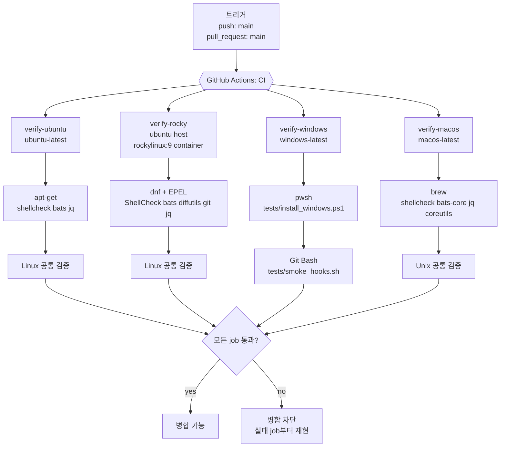
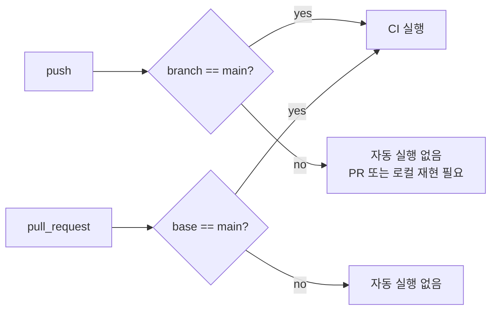
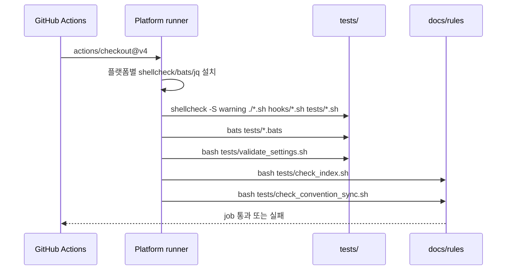
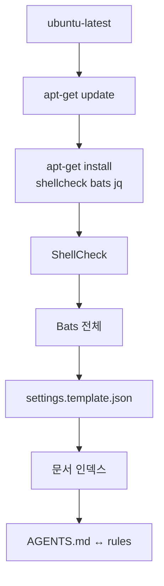
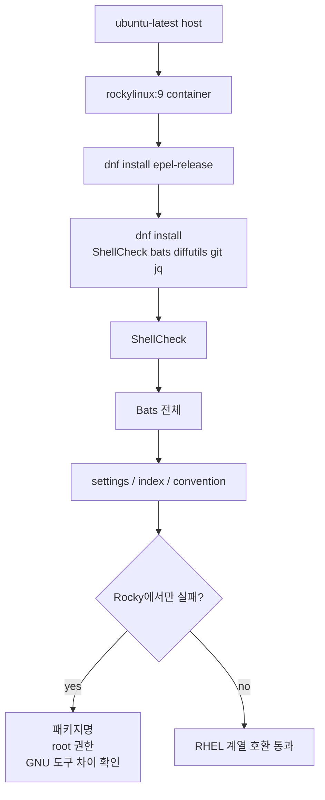
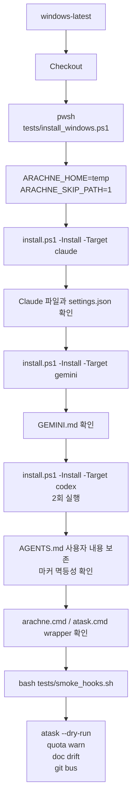
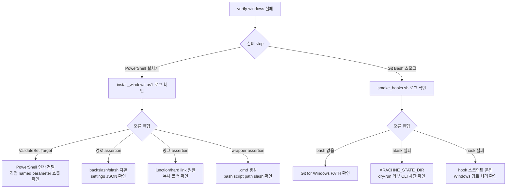
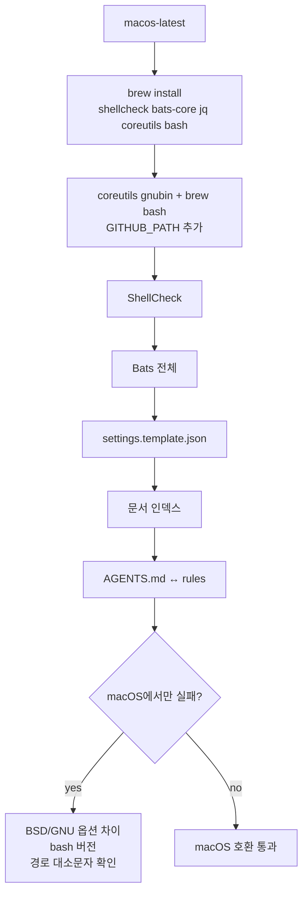
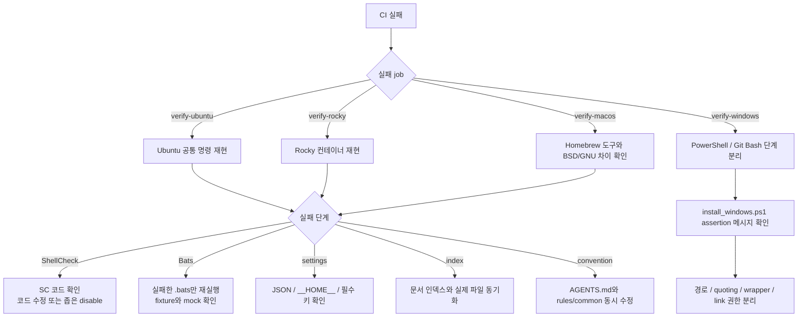

MOC:: [[Arachne]]
FROM:: [[empty]]

# Arachne CI 운영 가이드

Arachne의 CI(Continuous Integration, 지속적 통합)는 GitHub Actions에서 저장소의 셸 스크립트,
설치 동작, 설정 템플릿, 문서 인덱스, Windows 런타임 스모크를 자동 검증한다. 현재 CI는 검증 전용이며
패키지 배포나 릴리스 생성 같은 CD(Continuous Deployment)는 수행하지 않는다.

실행 정의의 정본은 [`.github/workflows/ci.yml`](../.github/workflows/ci.yml)이다. 문서와 YAML이
다르면 실제 GitHub Actions 동작을 결정하는 YAML이 우선한다.

## 1. 현재 CI 구조

현재 workflow 이름은 `CI`이며, push와 pull request를 `main` 기준으로 검증한다. job은 플랫폼별로
명시 분리되어 실패 원인을 OS 경계에서 바로 볼 수 있다.



| job | 플랫폼 | 실행 방식 | 책임 |
| --- | --- | --- | --- |
| `verify-ubuntu` | Ubuntu Linux | `ubuntu-latest` | 기본 Bash 정적 분석, 전체 Bats, 설정/문서/규약 검사 |
| `verify-rocky` | Red Hat/Rocky 계열 | `ubuntu-latest` + `container: rockylinux:9` | RHEL 계열 패키지, root 컨테이너, GNU userland 차이 검증 |
| `verify-windows` | Windows | `windows-latest` + `pwsh` + Git Bash | PowerShell 설치기, Windows 경로/링크/wrapper, Git Bash 훅 스모크 검증 |
| `verify-macos` | macOS | `macos-latest` + Homebrew | BSD/macOS 기본 도구 차이, `coreutils` 필요 경로, Unix 테스트 호환성 검증 |

## 2. 실행 조건



자동 실행하지 않는 항목:

- main이 아닌 브랜치에 push만 한 경우
- 태그 생성
- 예약 실행(`schedule`)
- 실제 사용자 머신에 Arachne를 설치하는 장시간 E2E
- 외부 Claude/Codex/Gemini/Copilot API 호출

## 3. 공통 Unix 검증

Ubuntu, Rocky, macOS job은 설치 도구만 다르고 핵심 검증 흐름은 같다.



공통 명령:

```bash
shellcheck -S warning ./*.sh hooks/*.sh tests/*.sh
bats tests/*.bats
bash tests/validate_settings.sh
bash tests/check_index.sh
bash tests/check_convention_sync.sh
```

검증 책임:

- ShellCheck: 루트, `hooks/`, `tests/` 아래 셸 스크립트 warning 이상 차단
- Bats: `tests/*.bats` 전체 자동 포함
- settings 검증: `settings.template.json`, `__HOME__`, 필수 키, 실제 `$HOME` 하드코딩 확인
- 인덱스 검사: `skills/`, `commands/`, `agents/`, `rules/` 문서 드리프트 차단
- 규약 동기화: `AGENTS.md`와 `rules/common/*` 핵심 토큰 드리프트 차단

## 4. Ubuntu Job: `verify-ubuntu`

Ubuntu는 Linux 기본 게이트다. 새 셸 스크립트나 Bats 테스트가 여기서 실패하면 가장 먼저 이 job을
로컬에서 재현한다.



로컬 재현:

```bash
sudo apt-get update
sudo apt-get install -y shellcheck bats jq
shellcheck -S warning ./*.sh hooks/*.sh tests/*.sh
bats tests/*.bats
bash tests/validate_settings.sh
bash tests/check_index.sh
bash tests/check_convention_sync.sh
```

## 5. Red Hat/Rocky Job: `verify-rocky`

GitHub-hosted runner에는 네이티브 `rocky-latest`가 없으므로 Ubuntu host 위에서 `rockylinux:9`
컨테이너를 사용한다.



Rocky에서 우선 확인할 항목:

- `ShellCheck` 패키지명 대소문자와 EPEL 활성화 여부
- 컨테이너 root 실행 때문에 chmod/권한 assertion이 Ubuntu와 다르게 동작하는지 여부
- `diff`, `which`, `git`, `jq` 같은 기본 도구 누락
- `readlink -f`, `tar`, `gzip` 등 GNU 도구 의존성

로컬 재현:

```bash
docker run --rm -it -v "$PWD:/repo" -w /repo rockylinux:9 bash
dnf install -y epel-release
dnf install -y ShellCheck bats diffutils git jq
shellcheck -S warning ./*.sh hooks/*.sh tests/*.sh
bats tests/*.bats
bash tests/validate_settings.sh
bash tests/check_index.sh
bash tests/check_convention_sync.sh
```

## 6. Windows Job: `verify-windows`

Windows job은 PowerShell 설치기와 Git Bash 스모크를 분리한다. 반복 실패했던 지점은
`tests/install_windows.ps1`가 `install.ps1` 호출 인자를 배열 splatting으로 넘기면서 `-Install`이
`Target` positional 값처럼 해석된 문제였다. 테스트는 `install.ps1 -Install -Target <name>`을 직접
호출해 이 바인딩을 고정한다.



Windows 실패 분리 흐름:



로컬 재현:

```powershell
pwsh -File .\tests\install_windows.ps1
```

Git Bash 스모크:

```bash
bash tests/smoke_hooks.sh
```

## 7. macOS Job: `verify-macos`

macOS는 BSD 기본 도구와 오래된 `/bin/bash` 차이를 조기에 잡는다. `tests/check_index.sh`와
`tests/check_convention_sync.sh`는 `readlink -f`를 사용하므로 CI에서는 Homebrew `coreutils`를 설치하고
GNU 도구 경로를 `GITHUB_PATH`에 추가한다. Bats의 한국어 테스트명 처리를 안정화하기 위해 Homebrew
`bash`와 UTF-8 locale도 명시한다.



로컬 재현:

```bash
brew install shellcheck bats-core jq coreutils bash
export PATH="$(brew --prefix coreutils)/libexec/gnubin:$PATH"
export PATH="$(brew --prefix bash)/bin:$PATH"
export LANG=en_US.UTF-8
export LC_ALL=en_US.UTF-8
shellcheck -S warning ./*.sh hooks/*.sh tests/*.sh
bats tests/*.bats
bash tests/validate_settings.sh
bash tests/check_index.sh
bash tests/check_convention_sync.sh
```

## 8. 실패 대응



기본 원칙:

- 실패 로그에서 job과 step을 먼저 고정한다.
- 전체 CI를 반복하기 전에 실패한 단일 명령을 로컬에서 재현한다.
- 테스트를 약화하기 전에 실제 계약이 바뀐 것인지 확인한다.
- Windows 실패는 PowerShell 인자 바인딩, 경로 구분자, `.cmd` wrapper, Git Bash PATH를 우선 확인한다.
- Rocky 실패는 EPEL, 패키지명, root 컨테이너, 기본 도구 누락을 우선 확인한다.
- macOS 실패는 BSD/GNU 옵션 차이와 `coreutils` PATH를 우선 확인한다.

## 9. PR 체크리스트

- [ ] 관련 테스트를 먼저 추가하거나 기존 실패를 재현했다.
- [ ] 변경 플랫폼의 로컬 재현 명령을 실행했거나 CI 결과를 확인했다.
- [ ] Windows 변경이면 `pwsh -File .\tests\install_windows.ps1` 또는 Windows CI 결과를 확인했다.
- [ ] Rocky/RHEL 변경이면 `rockylinux:9` 컨테이너 또는 `verify-rocky` 결과를 확인했다.
- [ ] macOS 경로/도구 변경이면 `verify-macos` 결과를 확인했다.
- [ ] `git diff --check`로 공백 오류를 확인했다.
- [ ] 문서, 인덱스, 규약 파일이 실제 변경과 일치한다.

## 10. 보안과 비밀값

현재 CI는 실제 AI 서비스 인증을 사용하지 않는다. Claude, OpenAI, Google, GitHub Copilot API 키 없이
검증이 가능해야 한다.

보안 원칙:

- 테스트용 토큰을 저장소나 workflow에 하드코딩하지 않는다.
- 외부 서비스 E2E가 필요하면 GitHub Actions secret과 최소 권한 계정을 사용한다.
- fork PR에는 secret이 제공되지 않는다는 점을 고려한다.
- 로그에 토큰, 비공개 경로, 사용자 홈의 민감한 내용이 출력되지 않게 한다.
- 외부 action과 설치 도구는 버전 고정 또는 신뢰 가능한 출처를 사용한다.

## 11. 현재 CI의 한계

CI 통과가 다음을 보장하지는 않는다.

- 실제 Claude/Codex/Gemini/Copilot 로그인 성공
- 모델 응답 품질
- 모든 Linux 배포판 호환
- 모든 Windows 버전, PowerShell 버전, 파일 시스템 조합 호환
- 장시간 실제 사용자 워크플로의 안정성
- 공급망 공격 부재

CI는 정의된 자동 검사 범위 안에서 회귀를 차단하는 장치다. 새 운영 리스크가 발견되면 해당 리스크를
재현하는 테스트를 추가하고 workflow에 연결해야 한다.
