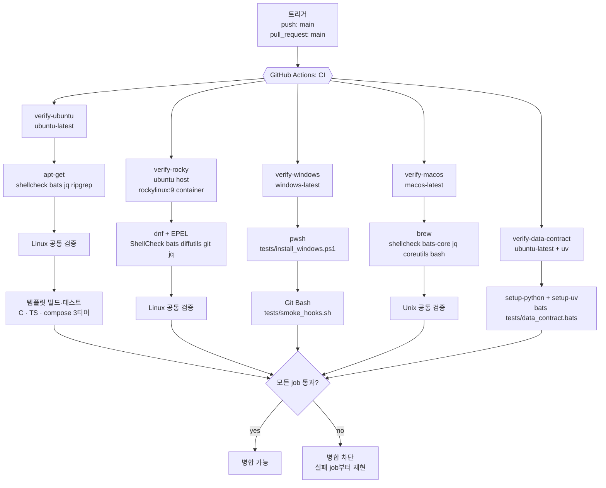
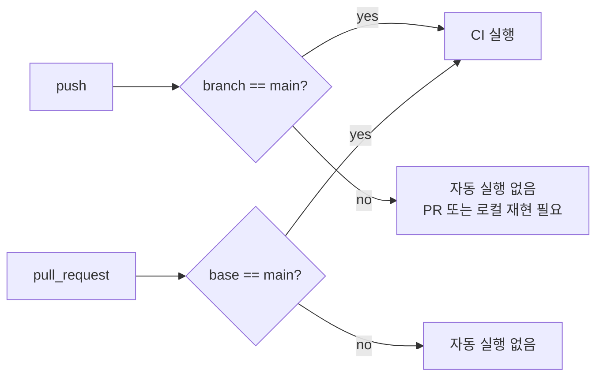
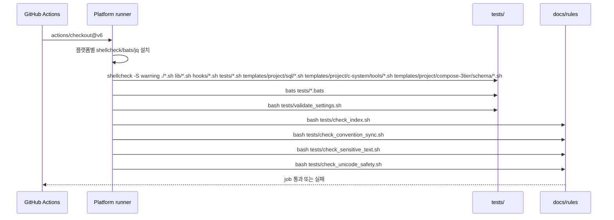
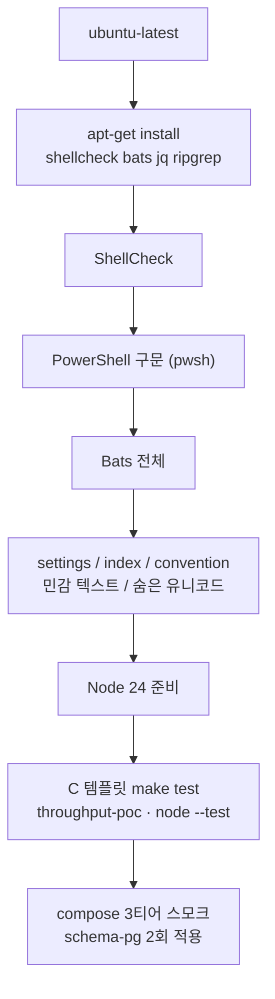
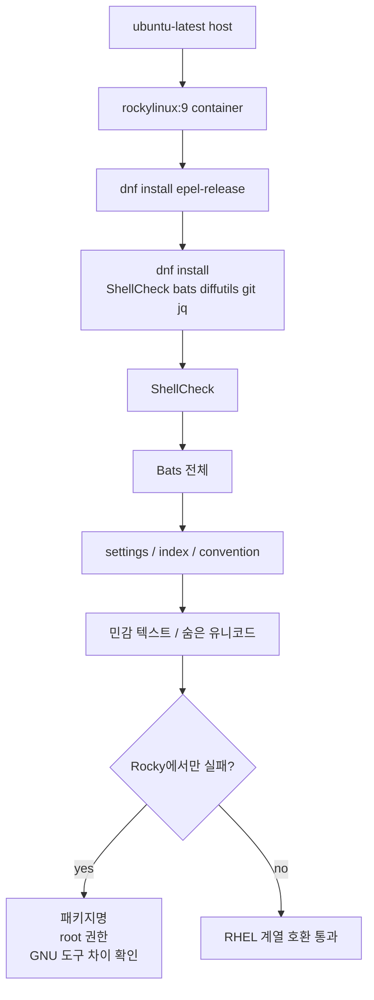
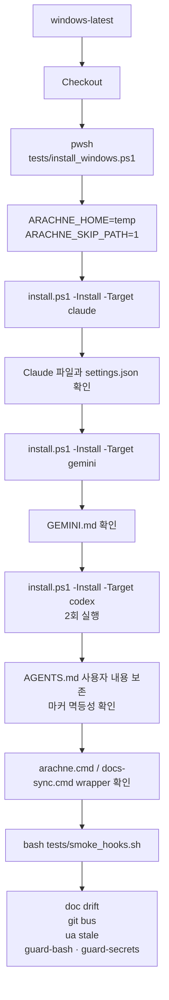
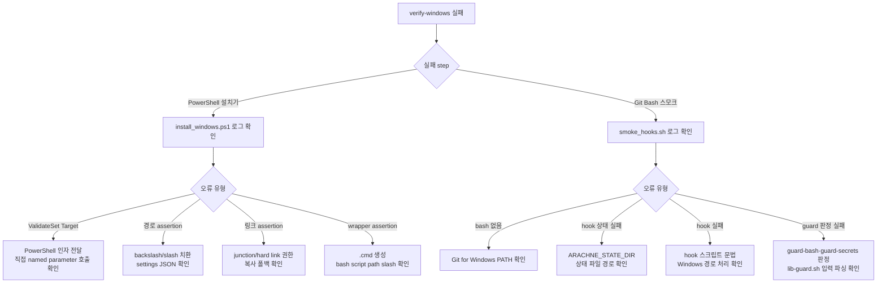
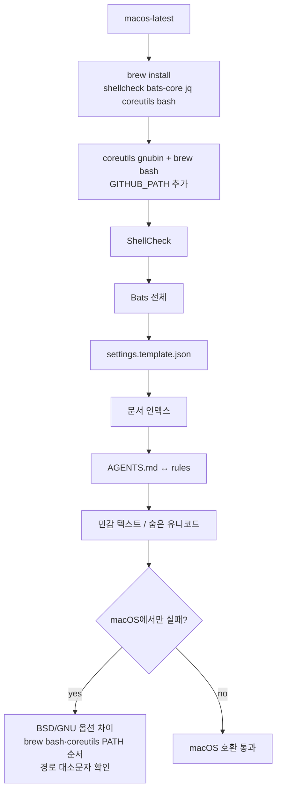
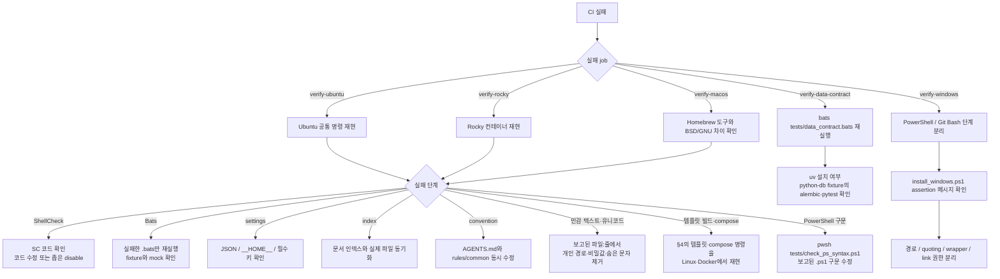
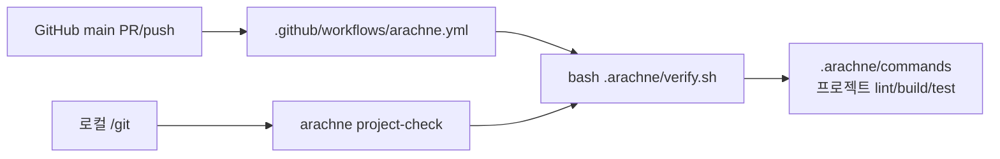

MOC:: [[Arachne]]
FROM:: [[empty]]

# Arachne CI 운영 가이드

Arachne의 CI(Continuous Integration, 지속적 통합)는 GitHub Actions에서 저장소의 셸 스크립트,
설치 동작, 설정 템플릿, 문서 인덱스, 민감 텍스트, 프로젝트 템플릿 빌드, Windows 런타임 스모크를 자동 검증한다.
CI가 실패했거나 새 테스트·스크립트를 추가할 때 이 문서를 읽는다. 현재 CI는 검증 전용이며
패키지 배포나 릴리스 생성 같은 CD(Continuous Deployment)는 수행하지 않는다.

이 workflow는 **Arachne 저장소 자체**만 검증한다. Arachne를 사용하는 다른 프로젝트는
`arachne init-ci`로 프로젝트별 `.github/workflows/arachne.yml`을 생성하고, 프로젝트가 소유한
`.arachne/commands`에 빌드·린트·테스트 명령을 정의한다.

실행 정의의 정본은 [`.github/workflows/ci.yml`](../.github/workflows/ci.yml)이다. 문서와 YAML이
다르면 실제 GitHub Actions 동작을 결정하는 YAML이 우선한다.

## 1. 현재 CI 구조

현재 workflow 이름은 `CI`이며, push와 pull request를 `main` 기준으로 검증한다. job은 플랫폼별로
명시 분리되어 실패 원인을 OS 경계에서 바로 볼 수 있다.


```mermaid
flowchart TB
    TRIG["트리거<br/>push: main<br/>pull_request: main"] --> CI{{"GitHub Actions: CI"}}

    CI --> U["verify-ubuntu<br/>ubuntu-latest"]
    CI --> R["verify-rocky<br/>ubuntu host<br/>rockylinux:9 container"]
    CI --> W["verify-windows<br/>windows-latest"]
    CI --> M["verify-macos<br/>macos-latest"]
    CI --> DC["verify-data-contract<br/>ubuntu-latest + uv"]

    U --> U1["apt-get<br/>shellcheck bats jq ripgrep"]
    U1 --> COMMON_U["Linux 공통 검증"]
    COMMON_U --> U2["템플릿 빌드·테스트<br/>C · TS · compose 3티어"]

    R --> R1["dnf + EPEL<br/>ShellCheck bats diffutils git jq"]
    R1 --> COMMON_R["Linux 공통 검증"]

    W --> W1["pwsh<br/>tests/install_windows.ps1"]
    W1 --> W2["Git Bash<br/>tests/smoke_hooks.sh"]

    M --> M1["brew<br/>shellcheck bats-core jq coreutils bash"]
    M1 --> COMMON_M["Unix 공통 검증"]

    DC --> DC1["setup-python + setup-uv<br/>bats tests/data_contract.bats"]

    U2 --> GATE{"모든 job 통과?"}
    COMMON_R --> GATE
    W2 --> GATE
    COMMON_M --> GATE
    DC1 --> GATE

    GATE -->|yes| OK["병합 가능"]
    GATE -->|no| BLOCK["병합 차단<br/>실패 job부터 재현"]
```

| job | 플랫폼 | 실행 방식 | 책임 |
| --- | --- | --- | --- |
| `verify-ubuntu` | Ubuntu Linux | `ubuntu-latest` | 기본 Bash 정적 분석, 전체 Bats, 설정/문서/규약/민감 텍스트 검사, PowerShell 구문 검사, 프로젝트 템플릿 빌드·테스트 |
| `verify-rocky` | Red Hat/Rocky 계열 | `ubuntu-latest` + `container: rockylinux:9` | RHEL 계열 패키지, root 컨테이너, GNU userland 차이 검증 |
| `verify-windows` | Windows | `windows-latest` + `pwsh` + Git Bash | PowerShell 설치기, Windows 경로/링크/wrapper, Git Bash 훅 스모크 검증 |
| `verify-macos` | macOS | `macos-latest` + Homebrew | BSD/macOS 기본 도구 차이, `coreutils` 필요 경로, Unix 테스트 호환성 검증 |
| `verify-data-contract` | Ubuntu Linux | `ubuntu-latest` + `setup-uv` | DB·JSON 데이터 계약 게이트 — `python-db` fixture의 alembic·pytest 실행 검증 (다른 job은 uv 부재로 정적 검사만) |

## 2. 실행 조건


```mermaid
flowchart LR
    A["push"] --> B{"branch == main?"}
    C["pull_request"] --> D{"base == main?"}
    B -->|yes| CI["CI 실행"]
    B -->|no| SKIP1["자동 실행 없음<br/>PR 또는 로컬 재현 필요"]
    D -->|yes| CI
    D -->|no| SKIP2["자동 실행 없음"]
```

자동 실행하지 않는 항목:

- main이 아닌 브랜치에 push만 한 경우
- 태그 생성
- 예약 실행(`schedule`)
- 실제 사용자 머신에 Arachne를 설치하는 장시간 E2E
- 외부 AI 서비스(Claude·Codex·Gemini·Copilot) API 호출

## 3. 공통 Unix 검증

Ubuntu, Rocky, macOS job은 설치 도구만 다르고 핵심 검증 흐름은 같다.


```mermaid
sequenceDiagram
    participant G as GitHub Actions
    participant P as Platform runner
    participant T as tests/
    participant D as docs/rules

    G->>P: actions/checkout@v6
    P->>P: 플랫폼별 shellcheck/bats/jq 설치
    P->>T: shellcheck -S warning ./*.sh lib/*.sh hooks/*.sh tests/*.sh templates/project/sql/*.sh templates/project/c-system/tools/*.sh templates/project/compose-3tier/schema/*.sh
    P->>T: bats tests/*.bats
    P->>T: bash tests/validate_settings.sh
    P->>D: bash tests/check_index.sh
    P->>D: bash tests/check_convention_sync.sh
    P->>D: bash tests/check_sensitive_text.sh
    P->>D: bash tests/check_unicode_safety.sh
    D-->>G: job 통과 또는 실패
```

공통 명령:

```bash
shellcheck -S warning ./*.sh lib/*.sh hooks/*.sh tests/*.sh templates/project/sql/*.sh templates/project/c-system/tools/*.sh templates/project/compose-3tier/schema/*.sh
bats tests/*.bats
bash tests/validate_settings.sh
bash tests/check_index.sh
bash tests/check_convention_sync.sh
bash tests/check_sensitive_text.sh
bash tests/check_unicode_safety.sh
```

검증 책임:

- ShellCheck: 루트, `lib/`, `hooks/`, `tests/`와 프로젝트 템플릿(`templates/project/sql/`,
  `templates/project/c-system/tools/`, `templates/project/compose-3tier/schema/`)의 셸 스크립트에서 warning 이상 차단
- Bats: `tests/*.bats` 전체 자동 포함
- settings 검증: `settings.template.json`, `__HOME__`, 필수 키, 실제 `$HOME` 하드코딩 확인
- 인덱스 검사: `skills/`, `commands/`, `agents/`, `rules/` 문서 드리프트 차단
- 규약 동기화: `AGENTS.md`와 `rules/common/*` 핵심 토큰 드리프트 차단
- 민감 텍스트: 추적 중인 문서·스크립트의 개인 경로(`/Users/<계정>/` 등)와 비밀값·개인정보 패턴 차단.
  패턴은 커밋 가드 `hooks/guard-secrets.sh`와 같고, 보고에는 파일과 줄 번호만 남긴다.
- 숨은 유니코드: 지시 파일(rules·agents·commands·skills·hooks·`CLAUDE.md`·`AGENTS.md`)의 폭 없는 문자와
  양방향 제어 문자 차단. 이런 문자는 사람 눈에 보이지 않는 숨은 지시의 통로가 된다.

## 4. Ubuntu Job: `verify-ubuntu`

Ubuntu는 Linux 기본 게이트다. 새 셸 스크립트나 Bats 테스트가 여기서 실패하면 가장 먼저 이 job을
로컬에서 재현한다. Ubuntu job은 공통 검증 외에 세 가지를 더 맡는다.

- **PowerShell 구문 검사**: Linux의 `pwsh`로 `tests/check_ps_syntax.ps1`을 실행해, Windows 러너까지 가기 전에
  `.ps1` 구문 오류를 잡는다.
- **프로젝트 템플릿 빌드·테스트**: Node 24를 준비한 뒤 c-system 템플릿 모듈(`src/shm`·`src/log`·`src/pipeline`·
  `src/contract`)의 `make test`, 계약 모듈의 TS 디코더 테스트와 레이아웃 검사(`ts-test layout`), `tools/` 테스트,
  `examples/ffi-rust` 테스트, `templates/project/throughput-poc` 빌드를 실행한다. 이어서
  `node --test templates/project/desktop-data-client/*.test.mjs`로 클라이언트 예제를 검사한다.
  robust 뮤텍스처럼 Linux 전용 경로가 있으므로 이 단계는 Ubuntu에서만 돈다.
- **3티어 compose 스모크**: `templates/project/compose-3tier`에서 C 빌드·테스트 컨테이너를 돌리고,
  PostgreSQL을 띄운 뒤 `schema-pg`로 스키마를 적용한다. 스키마 적용을 두 번 실행해, 이미 적용된 버전을
  건너뛰는지(재실행 안전성)도 확인한다.


```mermaid
flowchart TB
    A["ubuntu-latest"] --> B["apt-get install<br/>shellcheck bats jq ripgrep"]
    B --> D["ShellCheck"]
    D --> P["PowerShell 구문 (pwsh)"]
    P --> E["Bats 전체"]
    E --> F["settings / index / convention<br/>민감 텍스트 / 숨은 유니코드"]
    F --> N["Node 24 준비"]
    N --> C["C 템플릿 make test<br/>throughput-poc · node --test"]
    C --> K["compose 3티어 스모크<br/>schema-pg 2회 적용"]
```

로컬 재현(공통 검증):

```bash
sudo apt-get update
sudo apt-get install -y shellcheck bats jq ripgrep
shellcheck -S warning ./*.sh lib/*.sh hooks/*.sh tests/*.sh templates/project/sql/*.sh templates/project/c-system/tools/*.sh templates/project/compose-3tier/schema/*.sh
bats tests/*.bats
bash tests/validate_settings.sh
bash tests/check_index.sh
bash tests/check_convention_sync.sh
bash tests/check_sensitive_text.sh
bash tests/check_unicode_safety.sh
```

템플릿 빌드·테스트와 compose 스모크의 로컬 재현에는 Linux, gcc·make, Node 24, Rust 툴체인(`cargo`,
`examples/ffi-rust` 테스트용), Docker(compose 스모크용)가 필요하다. robust 뮤텍스 같은 Linux 전용 경로가
있으므로 macOS에서는 재현하지 않는다. 명령은 `.github/workflows/ci.yml`의 해당 step과 같다.

```bash
# 템플릿 빌드·테스트
for dir in shm log pipeline contract; do
    make -C "templates/project/c-system/src/${dir}" test
done
make -C templates/project/c-system/src/contract ts-test layout
make -C templates/project/c-system/tools test
make -C templates/project/c-system/examples/ffi-rust test
make -C templates/project/throughput-poc
node --test templates/project/desktop-data-client/*.test.mjs

# 3티어 compose 스모크
cd templates/project/compose-3tier
cp .env.example .env
docker compose config --quiet
docker compose up --build --abort-on-container-exit --exit-code-from c-build c-build
docker compose up -d --wait postgres
docker compose run --rm schema-pg
docker compose run --rm schema-pg   # 재실행 — 적용된 버전은 건너뛰어야 한다
docker compose down -v
```

## 5. Red Hat/Rocky Job: `verify-rocky`

GitHub-hosted runner에는 네이티브 `rocky-latest`가 없으므로 Ubuntu host 위에서 `rockylinux:9`
컨테이너를 사용한다.


```mermaid
flowchart TB
    A["ubuntu-latest host"] --> B["rockylinux:9 container"]
    B --> C["dnf install epel-release"]
    C --> D["dnf install<br/>ShellCheck bats diffutils git jq"]
    D --> E["ShellCheck"]
    E --> F["Bats 전체"]
    F --> G["settings / index / convention"]
    G --> S["민감 텍스트 / 숨은 유니코드"]
    S --> H{"Rocky에서만 실패?"}
    H -->|yes| I["패키지명<br/>root 권한<br/>GNU 도구 차이 확인"]
    H -->|no| J["RHEL 계열 호환 통과"]
```

Rocky에서 우선 확인할 항목:

- `ShellCheck` 패키지명 대소문자와 EPEL 활성화 여부
- 컨테이너 root 실행 때문에 chmod/권한 assertion이 Ubuntu와 다르게 동작하는지 여부
- `diff`, `which`, `git`, `jq` 같은 기본 도구 누락
- `readlink -f`, `tar`, `gzip` 등 GNU 도구 의존성

로컬 재현:

```bash
docker run --rm -it -v "$PWD:/repo" -w /repo rockylinux:9 bash
dnf install -y epel-release
dnf install -y ShellCheck bats diffutils git jq
shellcheck -S warning ./*.sh lib/*.sh hooks/*.sh tests/*.sh templates/project/sql/*.sh templates/project/c-system/tools/*.sh templates/project/compose-3tier/schema/*.sh
bats tests/*.bats
bash tests/validate_settings.sh
bash tests/check_index.sh
bash tests/check_convention_sync.sh
bash tests/check_sensitive_text.sh
bash tests/check_unicode_safety.sh
```

## 6. Windows Job: `verify-windows`

Windows job은 PowerShell 설치기와 Git Bash 스모크를 분리한다. 반복 실패했던 지점은
`tests/install_windows.ps1`가 `install.ps1` 호출 인자를 배열 splatting으로 넘기면서 `-Install`이
`Target` positional 값처럼 해석된 문제였다. 테스트는 `install.ps1 -Install -Target <name>`을 직접
호출해 이 바인딩을 고정한다.


```mermaid
flowchart TB
    A["windows-latest"] --> B["Checkout"]
    B --> C["pwsh<br/>tests/install_windows.ps1"]
    C --> D["ARACHNE_HOME=temp<br/>ARACHNE_SKIP_PATH=1"]
    D --> E["install.ps1 -Install -Target claude"]
    E --> F["Claude 파일과 settings.json 확인"]
    F --> G["install.ps1 -Install -Target gemini"]
    G --> H["GEMINI.md 확인"]
    H --> I["install.ps1 -Install -Target codex<br/>2회 실행"]
    I --> J["AGENTS.md 사용자 내용 보존<br/>마커 멱등성 확인"]
    J --> K["arachne.cmd / docs-sync.cmd wrapper 확인"]
    K --> L["bash tests/smoke_hooks.sh"]
    L --> M["doc drift<br/>git bus<br/>ua stale<br/>guard-bash · guard-secrets"]
```

`tests/smoke_hooks.sh`는 기록·알림 훅 세 개(doc-drift-check·git-bus-check·ua-stale-check)에 더해 가드 훅도 실행한다.
가드 훅은 세 경우를 확인한다. `guard-bash.sh`가 `--no-verify` 명령을 거부하는지(deny 1건),
`guard-bash.sh`가 일반 명령에 아무 응답도 하지 않는지, `guard-secrets.sh`가 커밋이 아닌 명령을 그대로 통과시키는지다.
`jq`가 없는 Git Bash 환경에서는 가드 훅이 정규식 폴백 경로(`hooks/lib-guard.sh`)로 입력을 해석하므로,
이 스모크가 그 경로의 판정도 함께 확인한다.

Windows 실패 분리 흐름:


```mermaid
flowchart TB
    F["verify-windows 실패"] --> A{"실패 step"}
    A -->|PowerShell 설치기| P["install_windows.ps1 로그 확인"]
    A -->|Git Bash 스모크| B["smoke_hooks.sh 로그 확인"]

    P --> P1{"오류 유형"}
    P1 -->|ValidateSet Target| P2["PowerShell 인자 전달<br/>직접 named parameter 호출 확인"]
    P1 -->|경로 assertion| P3["backslash/slash 치환<br/>settings JSON 확인"]
    P1 -->|링크 assertion| P4["junction/hard link 권한<br/>복사 폴백 확인"]
    P1 -->|wrapper assertion| P5[".cmd 생성<br/>bash script path slash 확인"]

    B --> B1{"오류 유형"}
    B1 -->|bash 없음| B2["Git for Windows PATH 확인"]
    B1 -->|hook 상태 실패| B3["ARACHNE_STATE_DIR<br/>상태 파일 경로 확인"]
    B1 -->|hook 실패| B4["hook 스크립트 문법<br/>Windows 경로 처리 확인"]
    B1 -->|guard 판정 실패| B5["guard-bash·guard-secrets 판정<br/>lib-guard.sh 입력 파싱 확인"]
```

로컬 재현:

```powershell
pwsh -File .\tests\install_windows.ps1
```

Git Bash 스모크:

```bash
bash tests/smoke_hooks.sh
```

## 7. macOS Job: `verify-macos`

macOS job은 BSD 기본 도구 차이를 조기에 잡는다. 다만 CI는 Homebrew bash 5를 `PATH` 앞에 두므로,
macOS 기본 `/bin/bash` 3.2와의 차이는 이 job에서 드러나지 않는다(§8). 테스트 코드는 GNU 전용
`sed -i` 대신 임시 파일 생성 후 교체처럼 GNU/BSD 양쪽에서 동작하는 방식을 사용해야 한다.
`tests/check_index.sh`와
`tests/check_convention_sync.sh`는 `readlink -f`를 사용하므로 CI에서는 Homebrew `coreutils`를 설치하고
GNU 도구 경로를 `GITHUB_PATH`에 추가한다. Bats의 한국어 테스트명 처리를 안정화하기 위해 Homebrew
`bash`와 UTF-8 locale도 명시한다.


```mermaid
flowchart TB
    A["macos-latest"] --> B["brew install<br/>shellcheck bats-core jq coreutils bash"]
    B --> C["coreutils gnubin + brew bash<br/>GITHUB_PATH 추가"]
    C --> D["ShellCheck"]
    D --> E["Bats 전체"]
    E --> F["settings.template.json"]
    F --> G["문서 인덱스"]
    G --> H["AGENTS.md ↔ rules"]
    H --> S["민감 텍스트 / 숨은 유니코드"]
    S --> I{"macOS에서만 실패?"}
    I -->|yes| J["BSD/GNU 옵션 차이<br/>brew bash·coreutils PATH 순서<br/>경로 대소문자 확인"]
    I -->|no| K["macOS 호환 통과"]
```

로컬 재현:

```bash
brew install shellcheck bats-core jq coreutils bash
export PATH="$(brew --prefix coreutils)/libexec/gnubin:$PATH"
export PATH="$(brew --prefix bash)/bin:$PATH"
export LANG=en_US.UTF-8
export LC_ALL=en_US.UTF-8
shellcheck -S warning ./*.sh lib/*.sh hooks/*.sh tests/*.sh templates/project/sql/*.sh templates/project/c-system/tools/*.sh templates/project/compose-3tier/schema/*.sh
bats tests/*.bats
bash tests/validate_settings.sh
bash tests/check_index.sh
bash tests/check_convention_sync.sh
bash tests/check_sensitive_text.sh
bash tests/check_unicode_safety.sh
```

## 8. Bats 작성 함정과 로컬 실행

작성 규칙의 정본은 [rules/bash/testing.md](../rules/bash/testing.md)다. 이 절은 CI와 로컬 결과가 다른 이유만 설명한다.

**결론**: 로컬 macOS에서 bats가 통과해도 CI가 실패할 수 있다. 판정의 정본은 CI다.
테스트 본문에서 마지막 줄이 아닌 단정은 `[ ]`, `grep -q`, 또는 명시적인 `|| return 1`로 쓴다.
부정 단정은 `!`를 앞에 붙이지 않는다. bats 1.5 이상에서는 `run ! 명령`으로 쓰고, 그 밖에는
`if 명령; then return 1; fi`로 쓴다.

### 8.1 `set -e`가 멈추지 않는 단정

bats는 테스트 본문을 `set -e` 아래에서 실행하므로, 실패한 명령이 있으면 그 줄에서 테스트가 실패해야 한다.
그러나 두 가지 형태는 중간 줄에서 실패해도 테스트를 멈추지 않는다.

| 형태 | 동작 | 영향 |
| --- | --- | --- |
| `[[ ... ]]` | macOS 기본 bash 3.2에서는 실패해도 `set -e`가 걸리지 않는다. bash 4.1 이상(CI)에서는 멈춘다. | 로컬은 통과, CI는 실패 |
| `! 명령` | 부정 명령은 모든 bash 버전에서 `set -e` 대상이 아니다. | 로컬과 CI 모두 실패를 놓친다 |

두 형태 모두 테스트의 **마지막 줄**에 있으면 그 종료 상태가 테스트 결과가 되므로 문제가 없다.
문제는 중간 줄에 있을 때다. 2026-10-05 로드맵 웨이브 2(W2, [ADR-0006](decisions/0006-roadmap-2026q4.md)) 작업에서
이 차이로 로컬은 통과하고 CI(bash 5)는 실패한 일이 실제로 있었다.

중간 줄의 단정은 다음처럼 쓴다.

```bash
# 나쁜 예 — bash 3.2 에서 실패해도 다음 줄로 넘어간다
[[ "$output" == *"생성"* ]]
! grep -q "secret" "$out"

# 좋은 예
[ "$status" -eq 0 ]
grep -q "생성" <<<"$output"
[[ "$output" == *"생성"* ]] || return 1
run ! grep -q "secret" "$out"          # bats 1.5+ (bats_require_minimum_version 1.5.0 필요)
if grep -q "secret" "$out"; then return 1; fi
```

### 8.2 로컬 실행

CI의 macOS job은 Homebrew bash(5.x)와 `en_US.UTF-8` 로케일로 bats를 실행한다(§7). 로컬 macOS에서
CI와 같은 결과를 보려면 §7의 로컬 재현 절차대로 Homebrew bash를 `PATH` 앞에 둔다.

기본 bash 3.2를 그대로 쓰면서 셸에 UTF-8 로케일(예: `LANG=ko_KR.UTF-8`)이 설정돼 있으면, bats가 한글 테스트 이름을
찾지 못해 테스트가 하나도 실행되지 않는다. 이때 출력은 다음과 같은 모양이다. 테스트 이름의 한글 부분은 깨진 바이트로 보인다.

```text
1..3
bats: unknown test name `$'test_docs_cli-3a_...'
# bats warning: Executed 0 instead of expected 3 tests
```

이때는 로케일 변수를 비우고 실행한다.

```bash
env LC_ALL= LANG= LC_CTYPE= bats tests/*.bats
```

이 방법은 실행 문제만 우회한다. §8.1의 `[[ ]]` 차이는 그대로 남으므로, 최종 판정은 CI 결과로 한다.

## 9. 실패 대응


```mermaid
flowchart TB
    F["CI 실패"] --> J{"실패 job"}
    J -->|verify-ubuntu| U["Ubuntu 공통 명령 재현"]
    J -->|verify-rocky| R["Rocky 컨테이너 재현"]
    J -->|verify-windows| W["PowerShell / Git Bash 단계 분리"]
    J -->|verify-macos| M["Homebrew 도구와 BSD/GNU 차이 확인"]

    U --> S1{"실패 단계"}
    R --> S1
    M --> S1
    S1 -->|ShellCheck| A["SC 코드 확인<br/>코드 수정 또는 좁은 disable"]
    S1 -->|Bats| B["실패한 .bats만 재실행<br/>fixture와 mock 확인"]
    S1 -->|settings| C["JSON / __HOME__ / 필수 키 확인"]
    S1 -->|index| D["문서 인덱스와 실제 파일 동기화"]
    S1 -->|convention| E["AGENTS.md와 rules/common 동시 수정"]
    S1 -->|민감 텍스트·유니코드| X["보고된 파일:줄에서<br/>개인 경로·비밀값·숨은 문자 제거"]
    S1 -->|템플릿 빌드·compose| Y["§4의 템플릿·compose 명령을<br/>Linux·Docker에서 재현"]
    S1 -->|PowerShell 구문| PS["pwsh tests/check_ps_syntax.ps1<br/>보고된 .ps1 구문 수정"]

    J -->|verify-data-contract| DC["bats tests/data_contract.bats 재실행"]
    DC --> DC1["uv 설치 여부<br/>python-db fixture의 alembic·pytest 확인"]

    W --> W1["install_windows.ps1 assertion 메시지 확인"]
    W1 --> W2["경로 / quoting / wrapper / link 권한 분리"]
```

기본 원칙:

- 실패 로그에서 job과 step을 먼저 고정한다.
- 전체 CI를 반복하기 전에 실패한 단일 명령을 로컬에서 재현한다.
- 테스트를 약화하기 전에 실제 계약이 바뀐 것인지 확인한다.
- Windows 실패는 PowerShell 인자 바인딩, 경로 구분자, `.cmd` wrapper, Git Bash PATH를 우선 확인한다.
- Rocky 실패는 EPEL, 패키지명, root 컨테이너, 기본 도구 누락을 우선 확인한다.
- macOS 실패는 `sed -i` 같은 BSD/GNU 옵션 차이와 `coreutils` PATH를 우선 확인한다.
- 로컬 macOS는 통과하는데 Linux CI의 Bats만 실패하면 §8.1의 중간 줄 단정을 먼저 의심한다.

## 10. PR 체크리스트

- [ ] 관련 테스트를 먼저 추가하거나 기존 실패를 재현했다.
- [ ] 변경 플랫폼의 로컬 재현 명령을 실행했거나 CI 결과를 확인했다.
- [ ] Windows 변경이면 `pwsh -File .\tests\install_windows.ps1` 또는 Windows CI 결과를 확인했다.
- [ ] Rocky/RHEL 변경이면 `rockylinux:9` 컨테이너 또는 `verify-rocky` 결과를 확인했다.
- [ ] macOS 경로/도구 변경이면 `verify-macos` 결과를 확인했다.
- [ ] `git diff --check`로 공백 오류를 확인했다.
- [ ] 문서, 인덱스, 규약 파일이 실제 변경과 일치한다.

## 11. 보안과 비밀값

현재 CI는 실제 AI 서비스 인증을 사용하지 않는다. Claude, OpenAI, Google, GitHub Copilot API 키 없이
검증이 가능해야 한다.

보안 원칙:

- 테스트용 토큰을 저장소나 workflow에 하드코딩하지 않는다.
- 외부 서비스 E2E가 필요하면 GitHub Actions secret과 최소 권한 계정을 사용한다.
- fork PR에는 secret이 제공되지 않는다는 점을 고려한다.
- 로그에 토큰, 비공개 경로, 사용자 홈의 민감한 내용이 출력되지 않게 한다.
- 외부 action과 설치 도구는 버전 고정 또는 신뢰 가능한 출처를 사용한다.

## 12. 현재 CI의 한계

CI 통과가 다음을 보장하지는 않는다.

- 실제 Claude/Codex/Gemini/Copilot 로그인 성공
- 모델 응답 품질
- 모든 Linux 배포판 호환
- 모든 Windows 버전, PowerShell 버전, 파일 시스템 조합 호환
- 장시간 실제 사용자 워크플로의 안정성
- 공급망 공격 부재
- Arachne를 설치한 모든 외부 프로젝트의 빌드·테스트 통과

CI는 정의된 자동 검사 범위 안에서 회귀를 차단하는 장치다. 새 운영 리스크가 발견되면 해당 리스크를
재현하는 테스트를 추가하고 workflow에 연결해야 한다.

## 13. 사용 프로젝트 CI


```mermaid
flowchart LR
    G["로컬 /git"] --> P["arachne project-check"]
    PR["GitHub main PR/push"] --> W[".github/workflows/arachne.yml"]
    W --> V["bash .arachne/verify.sh"]
    P --> V
    V --> C[".arachne/commands<br/>프로젝트 lint/build/test"]
```

`verify.sh`, profile, workflow는 Arachne가 관리하고, `commands`는 프로젝트가 관리한다.

```bash
arachne init-ci /path/to/project --profile python-web
arachne project-check /path/to/project
```

profile별 런타임, 파일 소유권, branch protection, 실패 해석의 정본은
[PROJECT-CI.md](PROJECT-CI.md)다.
