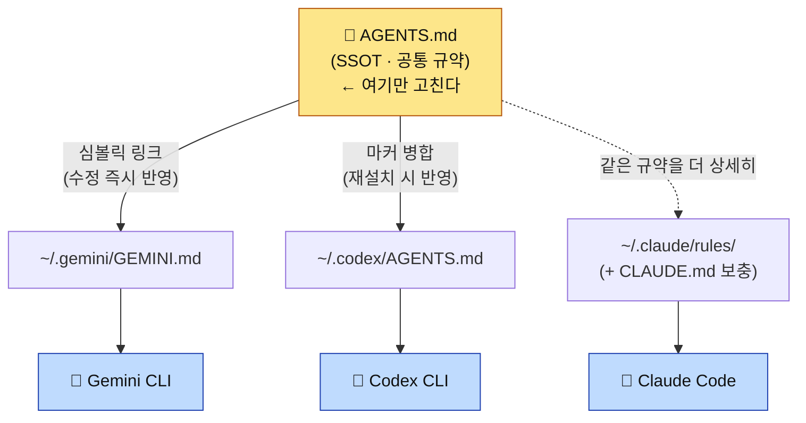

# 멀티-CLI 가이드 — Claude Code · Gemini CLI · Codex CLI

Arachne는 **하나의 공통 규약(`AGENTS.md`)을 세 개의 AI 코딩 CLI가 동시에 따르도록** 연결한다.
한 파일만 고치면 세 도구가 같은 규칙으로 움직인다. 이 문서는 각 CLI에서 어떻게 쓰고, 셋이
서로 어떻게 영향을 주고받는지 설명한다.

> 한 줄 요약: **`AGENTS.md` = 단일 진실 공급원(SSOT).** 세 CLI는 이 한 파일을 각자의 방식으로 본다.

---

## 1. 큰 그림

> **SSOT** = Single Source of Truth(단일 진실 공급원). 같은 정보를 여러 곳에 복제하지 않고
> **한 곳(`AGENTS.md`)만 정본**으로 두는 원칙. 거기만 고치면 나머지는 그것을 가리키므로,
> 사본끼리 어긋나는 **드리프트(drift, 문서·설정이 실제와 점점 불일치해지는 현상)** 가 생기지 않는다.



> Claude는 `rules/`에서 풀 디테일을 자동 로드하므로 점선(`-.->`)으로 표시했다 — `AGENTS.md`를
> 직접 읽는 게 아니라 같은 규약의 상세판을 본다. 자세한 비대칭은 2장.

- **공통 규약**(작업 원칙·코딩 스타일·패턴·보안·테스트·git·이슈·언어 포인터)은 `AGENTS.md`에만 둔다.
- **도구 전용 기능**(Claude의 서브에이전트·훅·슬래시 커맨드·모델 라우팅·`gask`)은 `CLAUDE.md`에만 둔다.
  → 공유 규약과 도구 전용이 파일 단위로 분리돼 **드리프트가 구조적으로 차단**된다.

> 📖 이 문서의 약어(SSOT·TDD·DI·a11y 등)는 [GLOSSARY.md](GLOSSARY.md)에 풀이돼 있다.

---

## 2. 각 CLI는 SSOT를 어떻게 보는가 (비대칭이 핵심)

| CLI | 연결 파일 | 연결 방식 | 반영 시점 | 무엇을 보나 |
| --- | --- | --- | --- | --- |
| **Claude Code** | `~/.claude/rules/` (+ `CLAUDE.md`) | 디렉터리 심볼릭 → **네이티브 자동 로드** | 다음 세션 | `rules/`의 **풀 디테일** (AGENTS.md보다 상세) |
| **Gemini CLI** | `~/.gemini/GEMINI.md` | **AGENTS.md 심볼릭** | **즉시** (재설치 0회) | AGENTS.md 다이제스트 |
| **Codex CLI** | `~/.codex/AGENTS.md` | **AGENTS.md 마커 병합** | `arachne -i --target codex` 재실행 후 | AGENTS.md 다이제스트 |

**왜 비대칭인가** — import 지원 여부가 도구마다 다르기 때문이다.
- Claude는 `~/.claude/rules/`를 네이티브로 자동 로드한다. 그래서 Claude는 AGENTS.md를 굳이 import하지
  않는다 — `rules/`가 더 상세한 풀 버전을 이미 준다.
- Gemini는 글로벌 컨텍스트 파일(`~/.gemini/GEMINI.md`) 하나를 읽는다. 심볼릭이라 **AGENTS.md 수정이 즉시** 반영된다.
- Codex는 import가 없어 심볼릭 대신 **본문을 병합**한다. 사용자가 직접 추가한 내용(마커 밖)을 보존하되,
  마커 안 본문은 재설치할 때 AGENTS.md로 갱신된다.

> 이 비대칭은 실측으로 검증됨: Gemini·Codex 모두 비대화 모드에서 AGENTS.md에 심은 고유 토큰을
> 출력함(런타임 로딩 확인). 4장 참고.

---

## 3. CLI별 동작 — 무엇이 작동하나

### 3.0 능력 매트릭스

Arachne 구성요소가 각 CLI에서 실제로 작동하는지. **공통 규약만 셋이 공유**하고, 나머지는
대부분 Claude 전용이다(import·이벤트 훅·서브에이전트 개념이 Claude Code에만 있으므로).

| Arachne 구성요소 | Claude Code | Gemini CLI | Codex CLI |
| --- | :---: | :---: | :---: |
| 공통 규약 (`AGENTS.md` / `rules/common`) | ✅ `rules/` 풀버전 자동 로드 | ✅ `GEMINI.md` | ✅ `~/.codex/AGENTS.md` |
| 언어 규칙 (`rules/<언어>/*`) | ✅ `paths`로 확장자 매칭 시 자동 로드 | ⚠️ AGENTS §9 **경로 포인터만** (본문 자동 로드 X) | ⚠️ 동일 |
| 서브에이전트 (`agents/`) | ✅ | ❌ | ❌ |
| 슬래시 커맨드 (`commands/`) | ✅ `/이름` | ❌ | ❌ |
| 이벤트 훅 (`hooks/`) | ✅ Session·PreCompact·Prompt | ❌ | ❌ |
| 스킬 (`skills/`) | ✅ 자동 참조 | ❌ | ❌ |
| 상태표시줄 (`statusline`) | ✅ | ❌ | ❌ |
| 작업 위임 래퍼 | ✅ **호출 주체** | `gask`/`gemini-task` 위임 **대상** (reader/advisor) | `cask`/`codex-task` 위임 **대상** (tester/fixer) |
| MCP 서버 | ✅ `settings.json` | 별도 `~/.gemini` 설정(미관리) | 별도 `~/.codex/config.toml`(미관리) |

> 요점: **공통 규약을 읽는 것**은 셋 다 공유한다. 그 위에 Claude는 Gemini를 `gask`(요약·자문),
> Codex를 `cask`(테스트·수정)로 **위임 호출**한다 — 3-레인 협업. 에이전트·훅·커맨드 같은
> 오케스트레이션 자체는 Claude Code 고유 기능이라 이식되지 않는다. (Gemini·Codex가 가진 **자체**
> 에이전트·MCP 기능은 별개이며 Arachne가 아직 관리하지 않는다 — [설계문서](issue/2026-06-05-multi-cli-ssot.md) Phase 3.)

### 3.1 Claude Code — 풀 스택으로 동작

별도 설정 불필요 — `arachne -i` 후 자동이다.

**런타임 동작**: 세션 시작 시 `~/.claude/rules/`를 네이티브로 읽고(공통=항상), `CLAUDE.md`의 Claude
전용 보충을 적용한다. 파일 편집 시 확장자에 맞는 언어 규칙이 추가 로드되고, 이벤트마다 훅이 실행되며,
상태표시줄이 렌더된다. 에이전트·슬래시 커맨드를 호출할 수 있다.

**어떻게 쓰나** (Claude Code 채팅에서):

```
/add  /fix  /tdd  /verify  /refactor …      # 슬래시 커맨드 — 워크플로 실행
"code-reviewer로 이 변경 리뷰해줘"            # 서브에이전트 위임
"이 설계 gask로 검토해줘"                     # Claude가 Bash로 gask 호출 → Gemini 위임
```

- **공통 규칙**(`rules/common/*`): 매 세션 자동 로드 — 입력 불필요.
- **언어 규칙**(`rules/<언어>/*`): 해당 확장자 파일을 열면 자동 활성화 (예: `*.rs` 편집 → `rules/rust/*`).
- 슬래시 커맨드·에이전트·스킬·훅 전체 카탈로그와 상세 예시는 [USAGE.md](USAGE.md).

### 3.2 Gemini CLI — 공통 규약 + gask 위임 대상

**런타임 동작**: Gemini는 매 호출마다 글로벌 컨텍스트 `~/.gemini/GEMINI.md`(→ AGENTS.md 심볼릭)를
로드한다. 즉 **공통 규약만** 적용되고, 에이전트·훅·커맨드는 없다. 비대화 호출 시 신뢰 폴더 검사가 있어
헤드리스 환경에선 `--skip-trust`가 필요하다(`gask`가 자동 처리). 실측: `gemini --skip-trust -p`가
AGENTS.md에 심은 고유 토큰을 출력 → 런타임 로딩 확인됨.

**어떻게 쓰나**:

```bash
# (1) 직접 — 공통 규약이 자동 로드된 채로 동작
gemini                                        # 대화형 세션
gemini -p "이 모듈 설계 검토해줘"             # 비대화 1회 질의

# (2) Claude 안에서 위임 (권장) — gask 래퍼, 답변만 stdout
gask "이 설계 검토해줘: $(cat module.c)"      # 자문
gask "이 로그 에러 원인만 요약: $(cat app.log)"
gask "README 초안 작성" > README.md           # 장문 생성 → 파일로 (재독 금지)
```

- `gask`는 Claude가 Gemini에 작업을 위임하는 비용 최적화 경로다([USAGE.md §6](USAGE.md)).
- `gask`는 헤드리스라 `--skip-trust`를 자동 처리 — 임의 디렉터리에서 불려도 동작한다.

### 3.3 Codex CLI — 공통 규약(병합본) + `cask` 위임 대상 (tester/fixer)

**런타임 동작**: Codex는 새 세션마다 글로벌 지침 `~/.codex/AGENTS.md`를 로드한다. 이 파일엔 SSOT 본문이
마커(`<!-- === ARACHNE … === -->`)로 병합돼 있고, 마커 밖 사용자 내용은 보존된다. **공통 규약만** 적용되고
에이전트·훅·커맨드는 없다(Codex 자체 기능은 별개). 실측: 프로젝트 AGENTS.md가 없는 중립 디렉터리에서
`codex exec`가 전역 지침의 고유 토큰을 출력 → 런타임 로딩 확인됨.

**협업 레인**: Codex는 3-레인에서 **tester/fixer**다. Claude가 `cask`(=`codex-task`)로 테스트 작성·실행과
버그 수정을 위임한다. `cask`는 호출마다 테스터/픽서 역할 프리앰블을 주입하고(기능 추가 금지), 결과만
stdout으로 돌려줘 Claude가 통합·커밋한다. 기본은 read-only 제안 모드, `-w`는 workspace-write 실행 모드.

**어떻게 쓰나**:

```bash
codex                                         # 대화형 — 새 세션에 공통 규약 자동 로드
codex exec "이 함수 리뷰해줘"                  # 비대화 1회 (raw)
codex exec -C <작업디렉터리> --skip-git-repo-check "..."   # 디렉터리·git 밖 실행

# Claude 안에서 위임 (권장) — cask 래퍼, 결과만 stdout
cask "tests/ 의 parser 테스트 보강안 제시: $(cat src/parser.c)"  # 제안만 (read-only)
cask -w "실패하는 test_auth 를 green 까지 수정"                   # 직접 실행·수정
```

- **주의**: AGENTS.md를 수정했으면 Codex는 자동 반영이 아니다. `arachne -i --target codex`
  (또는 전체 `arachne -u`)로 재병합해야 한다. 까먹어도 `arachne --check`가 stale을 잡는다.

---

## 4. 셋은 서로 어떻게 영향을 주는가

### 4.1 전파 — "한 파일 수정 = 세 CLI"

`AGENTS.md`를 고치면:

| CLI | 전파 | 추가 작업 |
| --- | --- | --- |
| Gemini | **즉시** (심볼릭) | 없음 |
| Claude | 다음 세션 | 없음 (단, 풀 규칙은 `rules/`에서 — AGENTS.md와 함께 갱신 권장) |
| Codex | 재병합 후 | `arachne -i --target codex` 또는 `arachne -u` |

> `AGENTS.md`(다이제스트) ↔ `rules/`(풀 버전)는 별도 동기화 축이다. 규약을 바꾸면 양쪽을 함께 손봐야 한다.
> CI의 인덱스 검사가 파일 누락은 잡지만, **내용 동기화는 사람 책임**이다.

### 4.2 협업 — Claude ↔ Gemini 비용 라우팅

토큰 무겁고 정밀도가 덜 중요한 작업(설계·요약·조사·1차 리뷰·장문 생성)은 Claude가 `gask`로 Gemini에
위임한다. 구현·디버깅·보안 리뷰·설정 관리는 Claude가 한다. 정책의 단일 출처는
[`rules/common/workflow.md`](../rules/common/workflow.md), 사람용 설명은 [USAGE.md §6](USAGE.md).

또 다른 채널은 **git-bus**다 — 다른 터미널에서 Gemini가 직접 커밋한 경우, `hooks/gemini-check.sh`가
다음 프롬프트 때 새 커밋을 알린다(비동기 메시지 버스).

### 4.3 독립성 — 서로를 깨지 않는다

- Codex 병합은 **마커 밖 사용자 내용을 보존**한다(직접 추가한 메모가 재설치로 사라지지 않음).
- Gemini 심볼릭이 끊겨도(레포 이동 등) Claude·Codex는 영향 없다.
- 한 CLI 미설치 시 `arachne -i`는 그 CLI만 graceful skip한다(나머지 정상 설치).

---

## 5. 상태 점검 — `arachne --check`

세 CLI 연결을 한 번에 점검한다. 심볼릭 댕글링과 Codex stale을 잡는다.

```bash
arachne --check
```

```
[Arachne] 연결 상태 점검
  [OK]   Claude : ~/.claude/CLAUDE.md -> 레포
  [OK]   Gemini : ~/.gemini/GEMINI.md -> AGENTS.md
  [OK]   Codex  : ~/.codex/AGENTS.md (AGENTS.md 최신)
[Arachne] 모든 연결 정상
```

- `[OK]` 정상 / `[SKIP]` 미감지(미설치) / `[FAIL]` 끊김·stale → 안내대로 재설치.
- 하나라도 FAIL이면 종료코드 1 (스크립트·CI에서 활용 가능).

---

## 6. 흔한 작업 흐름

```bash
# 규약을 바꾸고 싶다 → AGENTS.md 수정 후
vim ~/Arachne/AGENTS.md
arachne -i --target codex      # Gemini는 자동, Codex만 재병합
arachne --check                # 세 CLI 정상 확인

# 전부 최신으로 (다른 머신에서 pull 받은 뒤 등)
arachne -u                     # git pull + 감지된 CLI 전체 재설치

# 새 CLI를 방금 로그인했다 (예: Codex)
arachne -i --target codex      # 또는 arachne -i (all)
```

---

## 7. 관련 문서

- [README.md](../README.md) — 설치·CLI 커맨드 개요
- [USAGE.md](USAGE.md) — 커맨드·에이전트·스킬·훅·규칙·협업 상세
- [AGENTS.md](../AGENTS.md) — 공통 규약 SSOT 본문
- [멀티-CLI SSOT 설계](issue/2026-06-05-multi-cli-ssot.md) — 설계 결정·Phase 기록
