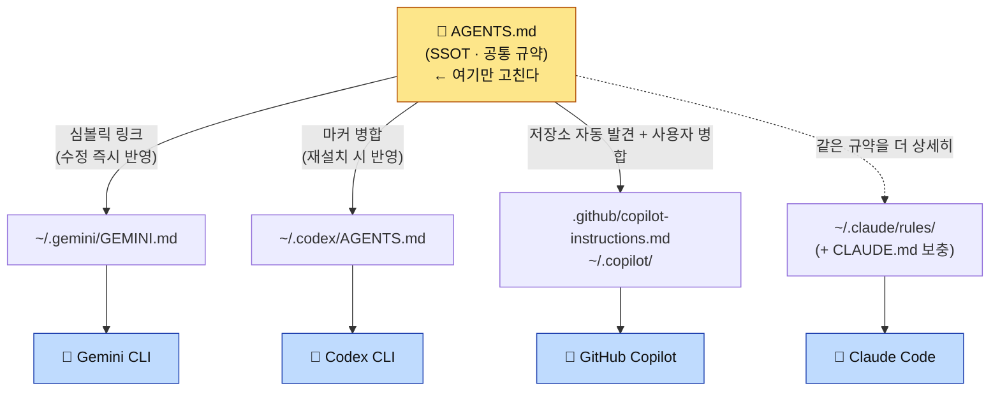
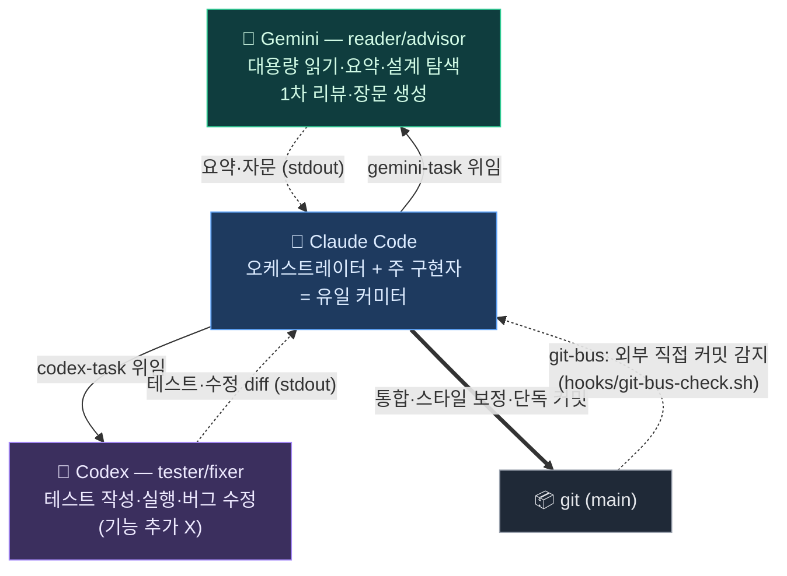

# Multi-CLI Guide — Claude Code · Gemini CLI · Codex CLI · GitHub Copilot

Arachne는 **하나의 공통 규약(`AGENTS.md`)을 여러 AI 코딩 도구가 동시에 따르도록** 연결한다.
한 파일만 고치면 세 도구가 같은 규칙으로 움직인다. 이 문서는 각 CLI에서 어떻게 쓰고, 셋이
서로 어떻게 영향을 주고받는지 설명한다.

> 한 줄 요약: **`AGENTS.md` = 단일 진실 공급원(SSOT).** 각 도구는 이 파일을 지원 방식에 맞게 본다.

---

## 1. Big Picture

> **SSOT** = Single Source of Truth(단일 진실 공급원). 같은 정보를 여러 곳에 복제하지 않고
> **한 곳(`AGENTS.md`)만 정본**으로 두는 원칙. 거기만 고치면 나머지는 그것을 가리키거나 재생성하므로,
> 사본끼리 어긋나는 **드리프트(drift, 문서·설정이 실제와 점점 불일치해지는 현상)** 가 생기지 않는다.



> Claude는 `rules/`에서 풀 디테일을 자동 로드하므로 점선(`-.->`)으로 표시했다 — `AGENTS.md`를
> 직접 읽는 게 아니라 같은 규약의 상세판을 본다. 자세한 비대칭은 2장.

- **공통 규약**(작업 원칙·코딩 스타일·패턴·보안·테스트·git·이슈·언어 포인터)은 `AGENTS.md`에만 둔다.
- **도구 전용 기능**(Claude의 서브에이전트·훅·슬래시 커맨드·모델 라우팅·`gemini-task`)은 `CLAUDE.md`에만 둔다.
  → 공유 규약과 도구 전용이 파일 단위로 분리돼 **드리프트가 구조적으로 차단**된다.

> 📖 이 문서의 약어(SSOT·TDD·DI·a11y 등)는 [GLOSSARY.md](GLOSSARY.md)에 풀이돼 있다.

---

## 2. How Each CLI Sees the SSOT (Asymmetry is Key)

| CLI | 연결 파일 | 연결 방식 | 반영 시점 | 무엇을 보나 |
| --- | --- | --- | --- | --- |
| **Claude Code** | `~/.claude/rules/` (+ `CLAUDE.md`) | 디렉터리 심볼릭 → **네이티브 자동 로드** | 다음 세션 | `rules/`의 **풀 디테일** (AGENTS.md보다 상세) |
| **Gemini CLI** | `~/.gemini/GEMINI.md` | **AGENTS.md 심볼릭** | **즉시** (재설치 0회) | AGENTS.md 다이제스트 |
| **Codex CLI** | `~/.codex/AGENTS.md` | **AGENTS.md 마커 병합** | `arachne -i --target codex` 재실행 후 | AGENTS.md 다이제스트 |
| **GitHub Copilot** | 저장소 `AGENTS.md` + `~/.copilot/` | 자동 발견 + **마커 병합** | 저장소는 즉시, 전역은 `--target copilot` 후 | AGENTS.md 다이제스트 |

**왜 비대칭인가** — import 지원 여부가 도구마다 다르기 때문이다.
- Claude는 `~/.claude/rules/`를 네이티브로 자동 로드한다. 그래서 Claude는 AGENTS.md를 굳이 import하지
  않는다 — `rules/`가 더 상세한 풀 버전을 이미 준다.
- Gemini는 글로벌 컨텍스트 파일(`~/.gemini/GEMINI.md`) 하나를 읽는다. 심볼릭이라 **AGENTS.md 수정이 즉시** 반영된다.
- Codex는 import가 없어 심볼릭 대신 **본문을 병합**한다. 사용자가 직접 추가한 내용(마커 밖)을 보존하되,
  마커 안 본문은 재설치할 때 AGENTS.md로 갱신된다.
- Copilot은 저장소의 `AGENTS.md`와 `.github/copilot-instructions.md`를 지원한다. 사용자 전역 적용은
  Copilot CLI용 `~/.copilot/copilot-instructions.md`와 VS Code용
  `~/.copilot/instructions/arachne.instructions.md`에 설치한다.

> 이 비대칭은 실측으로 검증됨: Gemini·Codex 모두 비대화 모드에서 AGENTS.md에 심은 고유 토큰을
> 출력함(런타임 로딩 확인). 4장 참고.

---

## 3. Per-CLI Behavior — What Actually Works

### 3.0 Capability Matrix

Arachne 구성요소가 각 CLI에서 실제로 작동하는지. **공통 규약만 셋이 공유**하고, 나머지는
대부분 Claude 전용이다(import·이벤트 훅·서브에이전트 개념이 Claude Code에만 있으므로).

| Arachne 구성요소 | Claude Code | Gemini CLI | Codex CLI | GitHub Copilot |
| --- | :---: | :---: | :---: | :---: |
| 공통 규약 (`AGENTS.md` / `rules/common`) | ✅ `rules/` 풀버전 자동 로드 | ✅ `GEMINI.md` | ✅ `~/.codex/AGENTS.md` | ✅ 저장소 + 사용자 지침 |
| 언어 규칙 (`rules/<언어>/*`) | ✅ `paths`로 확장자 매칭 시 자동 로드 | ⚠️ AGENTS §9 **경로 포인터만** (본문 자동 로드 X) | ⚠️ 동일 | ⚠️ 경로 포인터 |
| 서브에이전트 (`agents/`) | ✅ | ❌ | ❌ | Copilot 자체 agent 기능 |
| 슬래시 커맨드 (`commands/`) | ✅ `/이름` | ❌ | ❌ | ❌ Arachne 명령 미이식 |
| 이벤트 훅 (`hooks/`) | ✅ Session·PreCompact·Prompt | ❌ | ❌ | ❌ Arachne 훅 미이식 |
| 스킬 (`skills/`) | ✅ 자동 참조 | ❌ | ❌ | Copilot 자체 skills 위치 별도 |
| 상태표시줄 (`statusline`) | ✅ | ❌ | ❌ | ❌ |
| 작업 위임 래퍼 | ✅ **호출 주체** | `gemini-task`/`gtask` 위임 **대상** (reader/advisor) | `codex-task`/`ctask` 위임 **대상** (tester/fixer) | 독립 실행 표면 |
| MCP 서버 | ✅ `settings.json` | 별도 `~/.gemini` 설정(미관리) | 별도 `~/.codex/config.toml`(미관리) | Copilot 자체 MCP(미관리) |

> 요점: **공통 규약을 읽는 것**은 셋 다 공유한다. 그 위에 Claude는 Gemini를 `gemini-task`(요약·자문),
> Codex를 `codex-task`(테스트·수정)로 **위임 호출**한다 — 3-레인 협업. 에이전트·훅·커맨드 같은
> 오케스트레이션 자체는 Claude Code 고유 기능이라 이식되지 않는다. (Gemini·Codex가 가진 **자체**
> 에이전트·MCP 기능은 별개이며 Arachne가 아직 관리하지 않는다 — [설계문서](issue/2026-06-05-multi-cli-ssot.md) Phase 3.)

### 3.1 Claude Code — Full Stack

별도 설정 불필요 — `arachne -i` 후 자동이다.

**런타임 동작**: 세션 시작 시 `~/.claude/rules/`를 네이티브로 읽고(공통=항상), `CLAUDE.md`의 Claude
전용 보충을 적용한다. 파일 편집 시 확장자에 맞는 언어 규칙이 추가 로드되고, 이벤트마다 훅이 실행되며,
상태표시줄이 렌더된다. 에이전트·슬래시 커맨드를 호출할 수 있다.

**어떻게 쓰나** (Claude Code 채팅에서):

```
/add  /fix  /tdd  /verify  /refactor …      # 슬래시 커맨드 — 워크플로 실행
"code-reviewer로 이 변경 리뷰해줘"            # 서브에이전트 위임
"이 설계 gemini-task로 검토해줘"                     # Claude가 Bash로 gemini-task 호출 → Gemini 위임
```

- **공통 규칙**(`rules/common/*`): 매 세션 자동 로드 — 입력 불필요.
- **언어 규칙**(`rules/<언어>/*`): 해당 확장자 파일을 열면 자동 활성화 (예: `*.rs` 편집 → `rules/rust/*`).
- 슬래시 커맨드·에이전트·스킬·훅 전체 카탈로그와 상세 예시는 [USAGE.md](USAGE.md).

### 3.2 Gemini CLI — Shared Convention + gemini-task Delegation Target (reader/advisor)

**런타임 동작**: Gemini는 매 호출마다 글로벌 컨텍스트 `~/.gemini/GEMINI.md`(→ AGENTS.md 심볼릭)를
로드한다. 즉 **공통 규약만** 적용되고, 에이전트·훅·커맨드는 없다. 비대화 호출 시 신뢰 폴더 검사가 있어
헤드리스 환경에선 `--skip-trust`가 필요하다(`gemini-task`가 자동 처리). 실측: `gemini --skip-trust -p`가
AGENTS.md에 심은 고유 토큰을 출력 → 런타임 로딩 확인됨.

**어떻게 쓰나**:

```bash
# (1) 직접 — 공통 규약이 자동 로드된 채로 동작
gemini                                        # 대화형 세션
gemini -p "이 모듈 설계 검토해줘"             # 비대화 1회 질의

# (2) Claude 안에서 위임 (권장) — gemini-task 래퍼, 답변만 stdout
gemini-task "이 설계 검토해줘: $(cat module.c)"      # 자문
gemini-task "이 로그 에러 원인만 요약: $(cat app.log)"
gemini-task "README 초안 작성" > README.md           # 장문 생성 → 파일로 (재독 금지)
```

- `gemini-task`는 Claude가 Gemini에 작업을 위임하는 비용 최적화 경로다([USAGE.md §6](USAGE.md)).
- `gemini-task`는 헤드리스라 `--skip-trust`를 자동 처리 — 임의 디렉터리에서 불려도 동작한다.

### 3.3 Codex CLI — Shared Convention (Merged) + `codex-task` Delegation Target (tester/fixer)

**런타임 동작**: Codex는 새 세션마다 글로벌 지침 `~/.codex/AGENTS.md`를 로드한다. 이 파일엔 SSOT 본문이
마커(`<!-- === ARACHNE … === -->`)로 병합돼 있고, 마커 밖 사용자 내용은 보존된다. **공통 규약만** 적용되고
에이전트·훅·커맨드는 없다(Codex 자체 기능은 별개). 실측: 프로젝트 AGENTS.md가 없는 중립 디렉터리에서
`codex exec`가 전역 지침의 고유 토큰을 출력 → 런타임 로딩 확인됨.

**협업 레인**: Codex는 3-레인에서 **tester/fixer**다. Claude가 `codex-task`(=`ctask`)로 테스트 작성·실행과
버그 수정을 위임한다. `codex-task`는 호출마다 테스터/픽서 역할 프리앰블을 주입하고(기능 추가 금지), 결과만
stdout으로 돌려줘 Claude가 통합·커밋한다. 기본은 read-only 제안 모드, `-w`는 workspace-write 실행 모드.

**어떻게 쓰나**:

```bash
codex                                         # 대화형 — 새 세션에 공통 규약 자동 로드
codex exec "이 함수 리뷰해줘"                  # 비대화 1회 (raw)
codex exec -C <작업디렉터리> --skip-git-repo-check "..."   # 디렉터리·git 밖 실행

# Claude 안에서 위임 (권장) — codex-task 래퍼, 결과만 stdout
codex-task "tests/ 의 parser 테스트 보강안 제시: $(cat src/parser.c)"  # 제안만 (read-only)
codex-task -w "실패하는 test_auth 를 green 까지 수정"                   # 직접 실행·수정
```

- **주의**: AGENTS.md를 수정했으면 Codex는 자동 반영이 아니다. `arachne -i --target codex`
  (또는 전체 `arachne -u`)로 재병합해야 한다. 까먹어도 `arachne --check`가 stale을 잡는다.

### 3.4 GitHub Copilot — Repository + User Instructions

저장소에서는 루트 `AGENTS.md`를 직접 읽고, `.github/copilot-instructions.md`가 Copilot 전용
진입점 역할을 한다. 사용자 전역 설치는 다음 두 표면을 함께 지원한다.

```text
~/.copilot/copilot-instructions.md              # GitHub Copilot CLI
~/.copilot/instructions/arachne.instructions.md # VS Code 사용자 프로필
```

macOS/Linux/WSL/Git Bash:

```bash
./install.sh -i --target copilot
```

Windows PowerShell:

```powershell
Set-ExecutionPolicy -Scope Process Bypass
.\install-copilot.ps1
```

둘 다 일반 파일을 생성하므로 Windows Developer Mode나 관리자 심볼릭 링크 권한이 필요 없다.
VS Code Settings Sync에서 `Prompts and Instructions`를 켜면 사용자 지침을 Windows/macOS 간에도
동기화할 수 있다.

---

## 4. How the Three Interact

### 4.1 Propagation — "Edit One File = Three CLIs"

`AGENTS.md`를 고치면:

| CLI | 전파 | 추가 작업 |
| --- | --- | --- |
| Gemini | **즉시** (심볼릭) | 없음 |
| Claude | 다음 세션 | 없음 (단, 풀 규칙은 `rules/`에서 — AGENTS.md와 함께 갱신 권장) |
| Codex | 재병합 후 | `arachne -i --target codex` 또는 `arachne -u` |
| Copilot | 저장소 즉시 / 사용자 전역 재설치 후 | `arachne -i --target copilot` 또는 PowerShell 설치기 |

> `AGENTS.md`(다이제스트) ↔ `rules/`(풀 버전)는 별도 동기화 축이다. 규약을 바꾸면 양쪽을 함께 손봐야 한다.
> CI의 인덱스 검사가 파일 누락은 잡지만, **내용 동기화는 사람 책임**이다.

### 4.2 Collaboration — 3-Lane Cost Routing (Claude · Codex · Gemini)

§1~3이 **규약 공유**(한 파일을 셋이 본다)라면, 이 절은 **런타임 위임**이다. Claude가 중심에서
역할을 분리해 떠넘긴다. 토큰 무겁고 정밀도가 덜 중요한 작업(설계·요약·조사·1차 리뷰·장문 생성)은
`gemini-task`로 **Gemini(reader/advisor)** 에, 테스트 작성·실행과 버그 수정은 `codex-task`로
**Codex(tester/fixer)** 에 위임한다. 정밀 구현·통합·디버깅·보안 리뷰·설정 관리, 그리고 **최종 커밋**은
**Claude(오케스트레이터+주 구현자)** 가 직접 한다.



> 이 다이어그램은 [ARCHITECTURE.md §2](ARCHITECTURE.md)와 동일한 협업 구조다(같은 그림을 두 문서가 공유).
> 정책의 단일 출처(SSOT)는 [`rules/common/workflow.md`](../rules/common/workflow.md), 사람용 설명은 [USAGE.md §6](USAGE.md).

방향이 반대인 두 우선순위 사슬:
- **오프로드(offload, 비용)**: Gemini → Codex → (Claude 안 씀) — 토큰 무거운 일을 싸게 떠넘김
- **페일오버(failover, 구현 품질)**: Claude → Codex → Gemini — 구현 대타는 Codex 먼저

또 다른 채널은 **git-bus**다 — 다른 터미널에서 직접 커밋한 경우, `hooks/git-bus-check.sh`가
다음 프롬프트 때 새 커밋을 알린다(비동기 메시지 버스).

### 4.3 Independence — They Don't Break Each Other

- Codex 병합은 **마커 밖 사용자 내용을 보존**한다(직접 추가한 메모가 재설치로 사라지지 않음).
- Gemini 심볼릭이 끊겨도(레포 이동 등) Claude·Codex는 영향 없다.
- 한 CLI 미설치 시 `arachne -i`는 그 CLI만 graceful skip한다(나머지 정상 설치).

---

## 5. Usage Modes — 단독 · 위임 · 페일오버

세 CLI는 **함께(오케스트레이션)** 도 쓰고 **따로(단독)** 도 쓴다. 공통 규약(`AGENTS.md`)은 어느 쪽이든
적용되므로, 단독으로 띄워도 같은 코딩 스타일·패턴·보안 규칙을 따른다.

### 5.1 Claude Code의 세 가지 모드

1. **단독 사용 (풀 스택)** — `claude`만 띄워서 쓴다. `rules/`(공통+언어) 자동 로드, 서브에이전트·슬래시
   커맨드·훅·스킬·상태표시줄이 전부 동작한다. 위임 없이 Claude 혼자 설계·구현·리뷰·커밋까지 한다.
   (§3.1 참고.)
2. **위임 사용 (3-레인 오케스트레이션)** — Claude가 중심에서 토큰 무거운 읽기·요약·자문은
   `gemini-task`(Gemini, reader/advisor)로, 테스트·버그 수정은 `codex-task`(Codex, tester/fixer)로
   떠넘기고, 정밀 구현·통합·**커밋**은 직접 한다. (§4.2 참고.)
3. **소진 대응 (페일오버)** — Claude 쿼터가 다 되면 **중심 역할이 Codex → Gemini 순으로 이양**된다.
   "유일 커미터" 권한도 그 중심을 따라 이동한다.

   | 단계 | 가용 | 중심 (구현+커밋) | tester/fixer | reader/advisor | 인계·주의 |
   | --- | --- | --- | --- | --- | --- |
   | **L0 정상** | C·X·G | **Claude** | Codex (`codex-task`) | Gemini (`gemini-task`) | 기본 3-레인 |
   | **L1 Claude 소진** | X·G | **Codex** | (Codex 흡수) | Gemini | `/handoff`로 Codex 인계, Gemini 1차 리뷰 보강 |
   | **L2 +Codex 소진** | G | **Gemini** | 사람+Gemini | (Gemini) | 스타일 충실도↓ → 사람 리뷰 강화, 작은 단위 |
   | **L3 전부 소진** | — | 사람(수동) | — | — | 쿼터 회복 대기 |

   분기(중심=Claude 유지, 위임 대상 하나만 소진): **Codex만 소진** → Claude가 테스트도 직접(맹점 탈상관↓),
   **Gemini만 소진** → 읽기·요약을 Claude/Codex가 직접(토큰 절약↓, 품질 무관).
   순서 근거는 코딩 스타일 충실도(Codex > Gemini). 정책 SSOT는 [`rules/common/workflow.md`](../rules/common/workflow.md).

#### 자동 폴백 — `atask` (arachne-task)

위 캐스케이드를 **수동 판단 없이 자동 실행**하는 디스패처다. 역할별 우선순위로 CLI를 시도하고,
출력에서 쿼터·rate limit 패턴을 감지하면 그 CLI를 **쿨다운 등록 후 다음으로 자동 전환**한다.

```bash
atask "결제 모듈 재시도 로직 구현"            # impl: claude → codex → gemini
atask -R read "이 로그 에러 원인 요약: $(cat app.log)"   # read: gemini → codex → claude
atask -R test -w "실패하는 test_auth 를 green 까지"      # test: codex → claude → gemini
atask --dry-run -R impl "..."                  # 실제 호출 없이 순서·쿨다운 상태만
```

| 동작 | 설명 |
| --- | --- |
| 쿼터 감지 | 출력의 `rate limit`·`quota`·`429`·`overloaded`·`resource exhausted` 등 패턴 |
| 쿨다운 | 소진 CLI를 `~/.claude/arachne-quota-state`에 기록(기본 Claude 5h·그 외 1h) → 그 동안 건너뜀 |
| 일반 에러 | 쿼터가 **아닌** 실패(문법 오류 등)는 폴백하지 않고 그대로 중단(세 CLI 토큰 낭비 방지) |
| 사전 경고 | `atask-quota-warn.sh` 훅이 프롬프트마다 상태 파일을 읽어 현재 "중심"·회복 시각을 배너로 표시 |

> **한계(정직)**: `atask`는 **헤드리스 호출 전용**이다. `claude -p`·`codex-task`·`gemini-task`를 감싸 자동
> 전환하지만, **대화형 Claude Code 세션이 대화 도중 한도에 걸리면 그 자리에서 매끄럽게 구제하지 못한다** —
> 새 작업을 `atask`로 시작하거나 `/handoff`로 인계한다. 감지는 에러 문자열 휴리스틱이라 CLI 버전업 시
> 패턴 유지보수가 필요하다(예측형 아님, 사후 감지).

### 5.2 Gemini · Codex의 단독 사용

Claude의 위임 대상이 아니라 **그 자체로** 쓸 수도 있다. 이때도 공통 규약은 적용된다.

- **Gemini 단독** — `gemini`(대화형) 또는 `gemini -p "..."`(1회). 매 호출 `~/.gemini/GEMINI.md`(→ AGENTS.md
  심볼릭)를 로드하므로 공통 규약이 그대로 적용된다. 에이전트·훅·커맨드는 없다(§3.2).
- **Codex 단독** — `codex`(대화형) 또는 `codex exec "..."`(1회). 새 세션마다 `~/.codex/AGENTS.md`(마커 병합본)를
  로드한다. `ctask`/`codex-task` 래퍼 없이 직접 호출하면 tester/fixer 역할 프리앰블은 주입되지 않는다(§3.3).

> 단독 사용과 위임 사용의 차이는 **누가 호출하느냐**일 뿐, 읽는 규약은 같다. `gemini-task`/`codex-task`
> 래퍼는 노이즈 제거 + 역할 프리앰블 주입을 더해 **Claude가 부르기 좋게** 감싼 것이다.

### 5.3 Cross-Harness Packaging — 같은 자산, 여러 하네스

Arachne가 `AGENTS.md` 하나를 Claude·Gemini·Codex에 배포하는 것은 더 큰 **이식성 모델(portability
model)** 의 한 사례다: **공통 소스를 각 하네스의 형식으로 어댑터 변환**해 배포한다. 같은 접근을
[everything-claude-code(ECC)](https://github.com/) 가 Claude/Codex/Gemini/**Cursor**/**OpenCode**까지 확장한다.

| 표면(Surface) | 공통 소스 | 하네스별 어댑터 |
| --- | --- | --- |
| 규약·지침 | `AGENTS.md` · `rules/` | Claude `rules/` 자동 로드 · Codex `AGENTS.md` 병합 · Gemini `GEMINI.md` 심볼릭 · Cursor rules · OpenCode instructions |
| 스킬 | `skills/*` | Claude 플러그인 · Codex 플러그인 · `.agents/skills` · Cursor 복사 · OpenCode 플러그인 |
| 훅 | `hooks/*` | Claude 네이티브 훅 · OpenCode 이벤트 · Cursor 어댑터 · **Codex는 지침 기반** |
| 커맨드 | `commands/*` | Claude 슬래시 커맨드 · CLI 엔트리포인트 · 호환 shim |
| MCP | `mcp-configs/` | 하네스별 네이티브 MCP import |

> 핵심: **워크플로 모델을 도구마다 새로 만들지 않는다.** 공통 소스를 가장자리(edge)에서 각 하네스 형식으로
> 변환할 뿐이다. 그래서 어떤 하네스를 단독으로 쓰든 같은 규약·스킬·패턴이 따라온다.
> Arachne는 현재 Claude(풀)·Gemini(심볼릭)·Codex(병합)를 지원하고, Cursor·OpenCode는 ECC가 다루는 확장 표면이다.

---

## 6. Status Check — `arachne --check`

지원 도구 연결을 한 번에 점검한다. 심볼릭 댕글링과 병합본 stale을 잡는다.

```bash
arachne --check
```

```
[Arachne] 연결 상태 점검
  [OK]   Claude : ~/.claude/CLAUDE.md -> 레포
  [OK]   Gemini : ~/.gemini/GEMINI.md -> AGENTS.md
  [OK]   Codex  : ~/.codex/AGENTS.md (AGENTS.md 최신)
[Arachne] 모든 연결 정상
```

- `[OK]` 정상 / `[SKIP]` 미감지(미설치) / `[FAIL]` 끊김·stale → 안내대로 재설치.
- 하나라도 FAIL이면 종료코드 1 (스크립트·CI에서 활용 가능).

---

## 7. Common Workflows

```bash
# 규약을 바꾸고 싶다 → AGENTS.md 수정 후
vim ~/Arachne/AGENTS.md
arachne -i --target codex      # Gemini는 자동, Codex만 재병합
arachne --check                # 지원 도구 연결 확인

# 전부 최신으로 (다른 머신에서 pull 받은 뒤 등)
arachne -u                     # git pull + 감지된 CLI 전체 재설치

# 새 CLI를 방금 로그인했다 (예: Codex)
arachne -i --target codex      # 또는 arachne -i (all)
```

---

## 8. Related Docs

- [README.md](../README.md) — 설치·CLI 커맨드 개요
- [USAGE.md](USAGE.md) — 커맨드·에이전트·스킬·훅·규칙·협업 상세
- [AGENTS.md](../AGENTS.md) — 공통 규약 SSOT 본문
- [멀티-CLI SSOT 설계](issue/2026-06-05-multi-cli-ssot.md) — 설계 결정·Phase 기록
