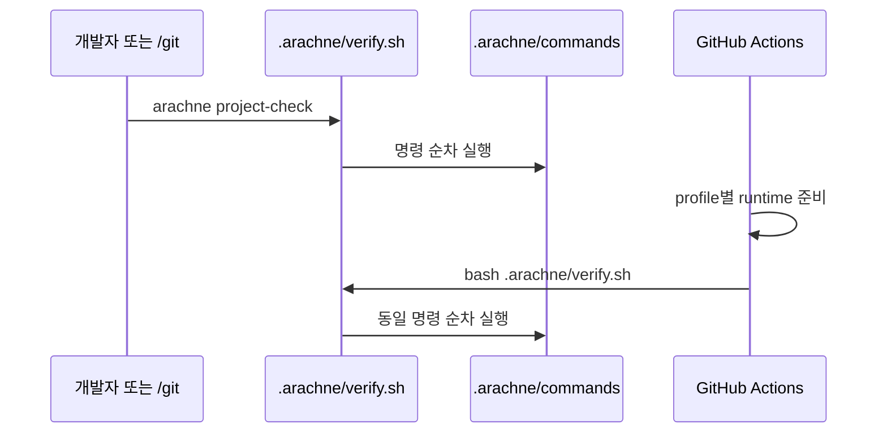

MOC:: [[Arachne]]
FROM:: [[0001-python-web-profile]]

# Arachne 사용 프로젝트 CI

## 계약

Arachne 저장소 CI와 Arachne 사용 프로젝트 CI는 별개다. 각 프로젝트는 다음 파일을 커밋해야 한다.

```text
.arachne/
├── profile          # Arachne 관리: minimal|python|web|python-web|cpp|rust
├── verify.sh        # Arachne 관리: 로컬·CI 공통 runner
├── commands         # 프로젝트 소유: 실제 검증 명령
└── reports/         # 프로젝트 소유: /verify 리포트 (첫 /verify 시 생성, 커밋 대상)
.github/workflows/
└── arachne.yml      # Arachne 관리: main push/PR workflow
```



## 초기화

```bash
# 기존 프로젝트
arachne init-ci --profile python-web

# 신규 프로젝트
arachne new app /work --profile web

# 로컬 검증
arachne project-check
```

지원 profile과 기본 도구는 [PYTHON-WEB-PROFILE.md](PYTHON-WEB-PROFILE.md)를 따른다.

## 갱신과 소유권

`init-ci` 재실행 시 `verify.sh`, `profile`, workflow는 현재 Arachne 템플릿으로 갱신된다.
`commands`는 프로젝트 소유이므로 덮어쓰지 않는다. profile 변경 후에도 같은 정책을 적용한다.

| 파일 | 소유자 | 재실행 동작 |
| --- | --- | --- |
| `.arachne/profile` | Arachne | 요청 profile로 갱신 |
| `.arachne/verify.sh` | Arachne | 최신 템플릿으로 교체 |
| `.arachne/commands` | 프로젝트 | 기존 파일 보존 |
| `.arachne/reports/` | 프로젝트 | 기존 파일 보존 (`init-ci`는 건드리지 않음) |
| `.github/workflows/arachne.yml` | Arachne | 최신 템플릿으로 교체 |

## 검증 리포트 (`.arachne/reports/`)

`/verify`(Claude Code 커맨드)가 검증 결과를 `.arachne/reports/<YYYY-MM-DD-HHMM>-verify.md`로
영속화한다. 형식 정본은 `commands/verify.md` STEP 3.

- **작성 주체**: Claude 세션의 `/verify`만. CI(`verify.sh`)는 리포트를 생성하지 않는다 —
  CI 실행 기록은 GitHub Actions 로그가 이미 보존하므로 중복 기록하지 않는다.
- **커밋 정책**: 리포트는 커밋 대상이다. `/git`이 코드 변경과 같은 커밋에 포함시켜
  검증 증거가 커밋 히스토리에 남고, 멀티 머신에서 `git pull`로 공유된다.
- **통과·실패 무관 기록**: 실패 리포트가 회귀 비교에 가장 가치 있다. 실패 후 수정하면
  새 리포트를 추가한다(기존 리포트 수정 금지 — 불변).
- **정리 정책**: 리포트가 과도하게 쌓이면(예: 100개 초과 또는 90일 경과) 오래된 것부터
  사람이 별도 커밋으로 정리한다. 자동 삭제는 하지 않는다.

## GitHub Actions 동작

workflow는 profile을 읽고 필요한 런타임만 준비한다.

- `python`, `python-web`: Python 3.12와 uv
- `web`, `python-web`: Node.js 22와 Corepack
- `rust`: stable 툴체인 + rustfmt·clippy (dtolnay/rust-toolchain)
- `cpp`: 추가 셋업 없음 — gcc·cmake·ctest는 ubuntu-latest 러너에 사전 설치
- `minimal`: 추가 런타임 없음

> **minimal의 의도**: `minimal`은 `git diff --check`(공백 오류)만 실행하는 **의도적 최소
> 게이트**다. clean checkout인 CI에서는 사실상 통과 자리표시자이며, 실질 검증은 프로젝트가
> `.arachne/commands`에 자기 명령을 추가하는 순간 시작된다. 언어 도구를 강제하지 않기 위한
> 설계 결정이다 (감사 F-06).

## 시스템 프로필 (cpp·rust)

- `cpp`: CMake 구성 → **ASan/UBSan 플래그 빌드** → ctest. Makefile 프로젝트는 commands의
  주석대로 `make CFLAGS=...`/`make test`로 교체한다. TSan(레이스)·cppcheck·valgrind는
  주석 게이트로 제공 — 프로젝트가 필요 시 주석 해제(TSan은 ASan과 동시 사용 불가라 별도 빌드).
- `rust`: `cargo fmt --check` → `clippy -D warnings` → `build --locked` → `test --locked`.
  cargo-audit·nextest·miri는 주석 게이트.
- 두 프로필 모두 `.arachne/commands`는 프로젝트 소유(재실행 시 보존)라, 템플릿은 시작점이고
  프로젝트 빌드 체계에 맞게 편집한다.

그 후 모든 profile이 `bash .arachne/verify.sh`를 호출한다. commands의 첫 실패 상태가 job 실패로
전파된다.

## Branch Protection

GitHub 저장소 Settings에서 `main` 보호 규칙을 만들고 `Arachne Project CI / project-check`를 필수
status check로 지정한다. 직접 push 제한, 최신 base 반영 요구, 승인 수는 프로젝트 정책에 맞춘다.

## 프로젝트별 조정

다음은 commands에서 프로젝트가 직접 책임진다.

- monorepo workspace 경로
- PostgreSQL·Redis service 필요 여부
- coverage 임계값
- test artifact와 report 업로드
- secrets와 환경변수
- 변경 경로 기반 선택 실행

workflow에 service나 artifact가 필요하면 프로젝트가 관리 파일을 수정할 수 있지만, 이후 `init-ci`
재실행이 workflow를 교체한다. 장기 사용자 확장이 필요하면 별도 workflow에서 `project-check`를
호출하는 방식을 권장한다.

## 실패 해석

| 실패 | 확인 |
| --- | --- |
| profile 오류 | `.arachne/profile` 값과 `init-ci --profile` |
| 명령 없음 | `.arachne/commands`에 비주석 명령 존재 여부 |
| `uv`/`pnpm` lock 실패 | lockfile 커밋과 frozen 상태 |
| script 없음 | `package.json` scripts 또는 Python dev dependency |
| Playwright browser 없음 | CI는 commands의 `CI` 조건부 install 줄, 로컬은 `pnpm exec playwright install` 1회 실행 |
| 로컬만 통과 | 런타임 버전, 비밀값, 서비스 의존성 |
| CI만 통과 | 로컬에서 `arachne project-check` 실행 여부 |
