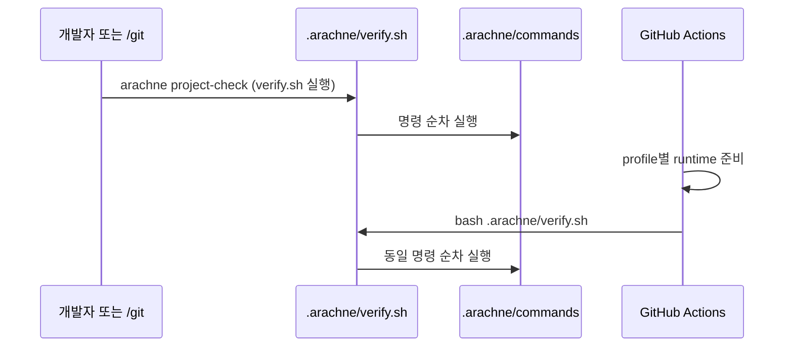

MOC:: [[Arachne]]
FROM:: [[0001-python-web-profile]]

# Arachne 사용 프로젝트 CI

이 문서는 Arachne를 쓰는 프로젝트에 설치되는 검증 약속을 설명한다. 검증 약속은 어떤 명령으로 프로젝트를
검증할지 정한 파일 묶음(`.arachne/`와 `.github/workflows/arachne.yml`)이며, 이 문서에서는 줄여서 "계약"이라고 부른다.
API나 바이너리 스트림의 데이터 계약과는 다른 말이다.
프로젝트에 CI를 처음 붙이거나, profile을 고르거나, 프로젝트 CI 실패를 해석할 때 읽는다.

## 계약

Arachne 저장소 CI와 Arachne 사용 프로젝트 CI는 별개다. 각 프로젝트는 다음 파일을 커밋해야 한다.

```text
.arachne/
├── profile          # Arachne 관리: minimal|python|web|python-web|cpp|rust|c-system
├── verify.sh        # Arachne 관리: 로컬·CI 공통 runner
├── commands         # 프로젝트 소유: 실제 검증 명령
├── naming-dict.tsv  # 프로젝트 소유(c-system만): 네이밍 사전, 있으면 보존
└── reports/         # 프로젝트 소유: /verify 리포트 (첫 /verify 시 생성, 커밋 대상)
.github/workflows/
└── arachne.yml      # Arachne 관리: main push/PR workflow
docs/design/
└── DESIGN.md        # 프로젝트 소유(web·python-web만): 설계 문서, 있으면 보존
```

c-system profile은 이 밖에 스타터 키트(`src/log`·`src/shm`·`tools/`·`sql/`·`conf/`·`docs/ops/`)를 복사한다.
키트 파일은 프로젝트 소유이며, 같은 경로에 파일이 이미 있으면 복사하지 않는다(아래 "c-system profile" 절).


```mermaid
sequenceDiagram
    participant Dev as 개발자 또는 /git
    participant Runner as .arachne/verify.sh
    participant Cmd as .arachne/commands
    participant GH as GitHub Actions

    Dev->>Runner: arachne project-check (verify.sh 실행)
    Runner->>Cmd: 명령 순차 실행
    GH->>GH: profile별 runtime 준비
    GH->>Runner: bash .arachne/verify.sh
    Runner->>Cmd: 동일 명령 순차 실행
```

## 초기화

```bash
# 기존 프로젝트
arachne init-ci --profile python-web

# 신규 프로젝트
arachne new app /work --profile web

# 로컬 검증
arachne project-check
```

이 문서는 하위 명령 형태(`init-ci`·`project-check`)로 적는다. 옵션 형태(`--init-ci`·`--project-check`)도
같은 동작을 한다. 프로젝트 경로를 생략하면 현재 디렉터리를 대상으로 삼는다.

지원 profile은 `minimal`·`python`·`web`·`python-web`·`cpp`·`rust`·`c-system` 7개다.
Python·Web profile의 기본 도구는 [PYTHON-WEB-PROFILE.md](PYTHON-WEB-PROFILE.md)가 설명한다.
`cpp`·`rust`는 바로 다음 "시스템 프로필" 절이, `c-system`은 그다음 절이 설명한다.
각 profile의 기본 명령 정본은 `templates/project/profiles/<profile>/commands`다.

### 시스템 프로필 (cpp·rust)

- `cpp`: CMake 구성 → **ASan/UBSan 플래그 빌드** → ctest. Makefile 프로젝트는 commands의
  주석대로 `make CFLAGS=...`/`make test`로 교체한다. TSan(레이스)·cppcheck·valgrind는
  주석 처리된 명령으로 들어 있어, 필요한 프로젝트가 주석을 푼다. TSan은 ASan과 함께 쓸 수 없으므로 별도로 빌드한다.
- `rust`: `cargo fmt --check` → `clippy -D warnings` → `build --locked` → `test --locked`.
  cargo-audit·nextest·miri도 주석 처리된 명령으로 들어 있다.
- 두 프로필 모두 `.arachne/commands`는 프로젝트 소유라 재실행해도 보존된다. 템플릿은 시작점이므로
  프로젝트 빌드 체계에 맞게 편집한다.

### c-system profile

불투명 핸들과 함수 포인터 테이블로 객체처럼 설계한 Linux C 서버와 Pro*C·ecpg 임베디드 SQL 프로젝트용이다.
`init-ci`는 검증 명령과 함께 아래 스타터 키트를 프로젝트에 복사한다. 이미 있는 파일은 덮어쓰지 않으므로
기존 프로젝트에 적용해도 안전하다.

| 복사 위치 | 내용 | 관련 스킬 |
| --- | --- | --- |
| `src/log/` | 운영 로거(레벨 매크로·비동기 링버퍼·폭주 억제·마스킹) | `operational-logging` |
| `src/shm/` | 공유메모리 세그먼트(헤더 검증·robust 뮤텍스)·정렬 테이블 | `shm-db-patterns`, `c-data-structures` |
| `tools/` | `shmctl.sh`·`shm_view`·`shm_recover`·`logtrace.sh`·`collect.sh` | `shm-db-patterns`, `remote-linux-analysis` |
| `sql/` | `apply-schema.sh`와 방언별 `SCHEMA_HISTORY` DDL | `sql-schema-versioning` |
| `conf/` | logrotate 템플릿(SIGHUP 재오픈) | `operational-logging` |
| `docs/ops/` | 공유메모리 레이아웃 표·복구 런북 템플릿 | `shm-db-patterns` |
| `.arachne/naming-dict.tsv` | 네이밍 사전 기본 항목 | `naming-dictionary` |

검증 명령은 키트 모듈의 ASan/UBSan 테스트, 도구 빌드, 스키마 버전 계획 점검(DB 없이), 네이밍 검사(보고만)다.
네이밍 검사는 `~/.claude/lib/naming-check.sh --changed`를 부르며, 명령 앞의 `if [ -f ... ]` 검사로 그 파일이
있을 때만 실행된다. 이 파일은 `arachne -i`가 `lib/`를 `~/.claude/lib`로 링크해야 생기므로, Arachne를 설치한
머신에서만 돌고 프로젝트 CI 러너에서는 건너뛴다. `lib/` 링크가 생기기 전에 Arachne를 설치한 머신은
`arachne -i`를 다시 실행해야 링크가 만들어진다.
본체 Makefile이 생기면 `.arachne/commands`의 "프로젝트 빌드" 줄 주석을 푼다.

`templates/project/c-system/` 아래의 `src/pipeline/`(수신 파이프라인)·`src/contract/`(바이너리 스트림 계약과
TS 디코더)·`examples/ffi-rust/`(Rust FFI 예제)는 복사되지 않는 참고 구현이다. 필요한 프로젝트가 직접 가져다 쓴다.
같은 성격의 참고 템플릿으로 `templates/project/throughput-poc`(처리량 PoC), `templates/project/desktop-data-client`
(대용량 수신 클라이언트), `templates/project/compose-3tier`(C 서버·PostgreSQL 3티어 compose)가 있다.
이 참고 템플릿들의 빌드·테스트는 Arachne 저장소 CI가 검증한다([CI.md](CI.md)).

## 갱신과 소유권

`init-ci` 재실행 시 `verify.sh`, `profile`, workflow는 현재 Arachne 템플릿으로 갱신된다.
`commands`는 프로젝트 소유이므로 덮어쓰지 않는다. profile 변경 후에도 같은 정책을 적용한다.

| 파일 | 소유자 | 재실행 동작 |
| --- | --- | --- |
| `.arachne/profile` | Arachne | 요청 profile로 갱신 |
| `.arachne/verify.sh` | Arachne | 최신 템플릿으로 교체 |
| `.arachne/commands` | 프로젝트 | 기존 파일 보존 |
| `.arachne/reports/` | 프로젝트 | 기존 파일 보존 (`init-ci`는 건드리지 않음) |
| `.arachne/naming-dict.tsv` (c-system) | 프로젝트 | 없을 때만 생성, 있으면 보존 |
| c-system 키트 (`src/log`·`src/shm`·`tools/`·`sql/`·`conf/`·`docs/ops/`) | 프로젝트 | 없는 파일만 복사, 있는 파일은 보존 |
| `docs/design/DESIGN.md` (web·python-web) | 프로젝트 | 없을 때만 생성, 있으면 보존 |
| `.github/workflows/arachne.yml` | Arachne | 최신 템플릿으로 교체 |

## 검증 리포트 (`.arachne/reports/`)

`/verify`(Claude Code 커맨드)가 검증 결과를 `.arachne/reports/<YYYY-MM-DD-HHMM>-verify.md`로
영속화한다. 형식 정본은 `commands/verify.md` STEP 3.

- **작성 주체**: Claude 세션의 `/verify`만. CI(`verify.sh`)는 리포트를 생성하지 않는다 —
  CI 실행 기록은 GitHub Actions 로그가 이미 보존하므로 중복 기록하지 않는다.
- **커밋 정책**: 리포트는 커밋 대상이다. `/git`이 코드 변경과 같은 커밋에 포함시켜
  검증 증거가 커밋 히스토리에 남고, 멀티 머신에서 `git pull`로 공유된다.
- **통과·실패 무관 기록**: 실패 리포트가 회귀 비교에 가장 가치 있다. 실패 후 수정하면
  새 리포트를 추가한다(기존 리포트 수정 금지 — 불변).
- **정리 정책**: 리포트가 과도하게 쌓이면(예: 100개 초과 또는 90일 경과) 오래된 것부터
  사람이 별도 커밋으로 정리한다. 자동 삭제는 하지 않는다.

## GitHub Actions 동작

workflow는 `.arachne/profile`을 읽지만, 이 값은 런타임(Python·Node·Rust)을 준비하는 데만 쓴다.
실제로 무엇을 검사할지는 `.arachne/commands`가 정한다. profile별로 준비하는 런타임은 다음과 같다.

- `python`, `python-web`: Python 3.12와 uv
- `web`, `python-web`: Node.js 22와 Corepack
- `rust`: stable 툴체인 + rustfmt·clippy (dtolnay/rust-toolchain)
- `cpp`: 추가 셋업 없음 — gcc·cmake·ctest는 ubuntu-latest 러너에 사전 설치
- `c-system`: 추가 셋업 없음 — gcc·make는 ubuntu-latest 러너에 사전 설치
- `minimal`: 추가 런타임 없음

런타임을 준비한 뒤 모든 profile이 `bash .arachne/verify.sh`를 호출한다. commands의 첫 실패 상태가 job 실패로
전파된다.

> **minimal의 의도**: `minimal`은 `git diff --check`(공백 오류)만 실행하는 **의도적 최소
> 게이트**다. clean checkout인 CI에서는 사실상 항상 통과하는 자리표시자이며, 실질 검증은 프로젝트가
> `.arachne/commands`에 자기 명령을 추가하는 순간 시작된다. 언어 도구를 강제하지 않기 위한
> 설계 결정이다([아키텍처 감사 F-06](issue/2026-06-11-architecture-audit.md)).

## Branch Protection

GitHub 저장소 Settings에서 `main` 보호 규칙을 만들고 `Arachne Project CI / project-check`를 필수
status check로 지정한다. 직접 push 제한, 최신 base 반영 요구, 승인 수는 프로젝트 정책에 맞춘다.

## 프로젝트별 조정

다음은 commands에서 프로젝트가 직접 책임진다.

- monorepo workspace 경로
- PostgreSQL·Redis service 필요 여부
- coverage 임계값
- test artifact와 report 업로드
- secrets와 환경변수
- 변경 경로 기반 선택 실행

workflow에 service나 artifact가 필요하면 프로젝트가 관리 파일을 수정할 수 있지만, 이후 `init-ci`
재실행이 workflow를 교체한다. 장기 사용자 확장이 필요하면 별도 workflow에서 `project-check`를
호출하는 방식을 권장한다.

## 실패 해석

| 실패 | 확인 |
| --- | --- |
| profile 오류 | `.arachne/profile` 값과 `init-ci --profile` |
| 명령 없음 | `.arachne/commands`에 비주석 명령 존재 여부 |
| `uv`/`pnpm` lock 실패 | lockfile 커밋과 frozen 상태 |
| script 없음 | `package.json` scripts 또는 Python dev dependency |
| Playwright browser 없음 | CI는 commands의 `CI` 조건부 install 줄, 로컬은 `pnpm exec playwright install` 1회 실행 |
| 로컬만 통과 | 런타임 버전, 비밀값, 서비스 의존성 |
| CI만 통과 | 로컬에서 `arachne project-check` 실행 여부 |
