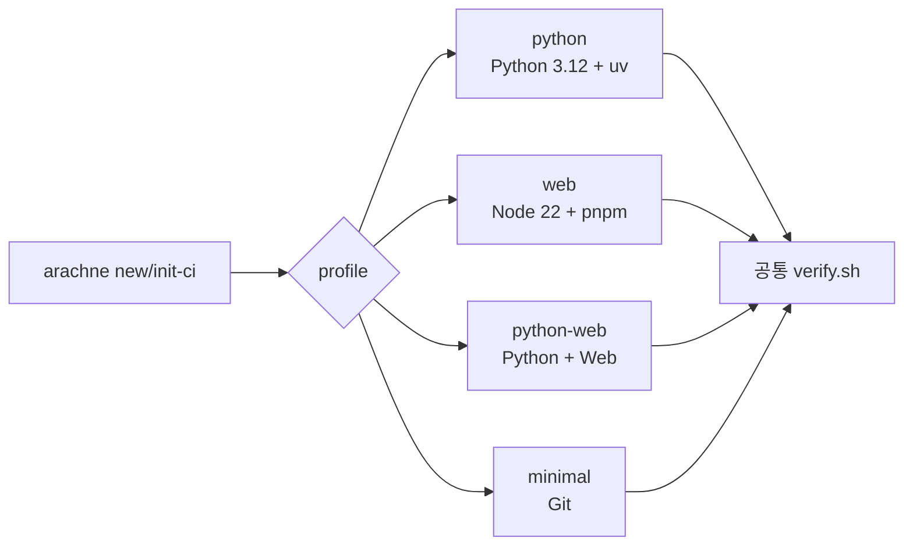

MOC:: [[Arachne]]
FROM:: [[0001-python-web-profile]]

# Python·Web Profile

## 목적

profile은 Arachne가 사용 프로젝트에 어떤 검증 계약을 생성할지 결정한다. 현재 단계에서는 전역
rules 설치량이 아니라 `.arachne/commands`와 GitHub Actions 런타임을 선택한다.



## 기본 기술 결정

| 영역 | 기본값 | 이유 |
| --- | --- | --- |
| Python runtime | Python 3.12 | 현재 생태계 호환성과 안정성 |
| Python package | uv | lockfile, 빠른 동기화, 도구 실행 통합 |
| Python 품질 | Ruff, mypy, pytest, pip-audit | format·lint·type·test·의존성 감사 분리 |
| Python API | FastAPI 권장 | 기존 rules·reviewer·skill 활용 |
| Python DB | PostgreSQL, SQLAlchemy 2.x, Alembic 권장 | 운영 경계와 migration 명시 |
| Web runtime | Node.js 22 | 장기 지원 기준 |
| Web package | pnpm via Corepack | lockfile과 workspace 효율 |
| Web 기본 | TypeScript + Vite React | 작은 기본 표면과 빠른 검증 |
| Web test | Vitest, RTL, MSW, Playwright | unit·component·network·E2E 계층 |
| 선택 확장 | Django, Next.js | 실제 프로젝트 필요 시 별도 pack |

이 표는 프로젝트 파일을 자동 생성하거나 프레임워크를 강제하지 않는다. 프로젝트가 다른 도구를
사용하면 `.arachne/commands`를 직접 수정한다.

## Profile별 기본 명령

`minimal`은 `git diff --check`만 실행한다. `python`은 `uv sync --frozen` 후 Ruff, mypy, pytest,
pip-audit를 실행한다. `web`은 `pnpm install --frozen-lockfile` 후 lint, typecheck, test, build,
Playwright를 실행한다. `python-web`은 두 집합을 순서대로 실행한다.

명령이 성공하려면 프로젝트가 해당 script와 개발 의존성을 선언해야 한다. 누락된 도구를 조용히
건너뛰지 않는다.

## 사용 예

```bash
arachne new service . --profile python
arachne new frontend . --profile web
arachne init-ci /work/fullstack --profile python-web
```

기존 commands가 있으면 profile을 변경해도 보존된다. 새 기본 명령으로 교체하려면 commands를
직접 갱신하거나 삭제 후 `init-ci`를 다시 실행한다.

## 후속 확장 기준

- Django 또는 Next.js를 사용하는 실제 프로젝트가 생긴다.
- 기존 profile 명령으로 표현할 수 없는 프레임워크 고유 검증이 있다.
- 최소 두 프로젝트에서 반복되는 규칙이다.
- rules에 둘 짧은 계약과 skill에 둘 긴 절차를 분리할 수 있다.
- 추가 후 first-pass CI와 false-positive 비율을 측정할 수 있다.
