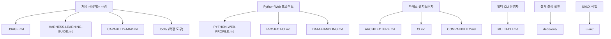

MOC:: [[Arachne]]
FROM:: [[README]]

# Arachne 문서 인덱스

모든 문서를 **결(주제)별로 묶어** 정리한다. 각 문서는 한 가지 정본 범위를 가진다.
문서가 실제 동작과 충돌하면 소스·테스트가 우선이며, 충돌은 issue/task로 기록한 뒤
정본 하나를 고치고 나머지는 링크로 연결한다.

## 독자별 진입점

---

## 1. 시작하기 · 사용법 (Guide)

| 문서 | 정본 범위 |
| --- | --- |
| [README](../README.md) | 5분 온보딩, 핵심 명령, 전체 소개 |
| [USAGE](USAGE.md) | 일상 사용법 — commands·agents·skills, 설치·동기화 |
| [GLOSSARY](GLOSSARY.md) | 약어와 기술 용어 사전 |
| [HARNESS-LEARNING-GUIDE](HARNESS-LEARNING-GUIDE.md) | 하네스 학습 순서 — 공통 규율→TDD→제품→아키텍처→도메인 트랙 |
| [CAPABILITY-MAP](CAPABILITY-MAP.md) | Arachne 역량 지도 — 제품·아키텍처·Java·Docker·시스템/네트워크 자산 연결 |

## 2. 확장 도구 (Tools) — `tools/`

Arachne 핵심에 더해 선택형 외부 도구를 함께 설치·사용하기 위한 통합 계층.

| 문서 | 정본 범위 |
| --- | --- |
| [tools/README](tools/README.md) | 확장 도구 개요 — 두 통합 계층, 빠른 시작, 클론 준비 |
| [tools/extras-setup](tools/extras-setup.md) | `setup-extras.sh`·`.ps1`, installer 연동, 재설치 내구성, 제거·문제해결 |
| [tools/understand-anything](tools/understand-anything.md) | 코드베이스 분석 플러그인 — `/understand*` 커맨드 |
| [tools/taste-skill](tools/taste-skill.md) | 프론트엔드 안티-슬롭 디자인 스킬 모음 |
| [tools/codegraph](tools/codegraph.md) | 코드 인텔리전스 CLI — 심볼·호출·영향 분석, `/codegraph` |

## 3. 구조 · 설계 (Architecture)

| 문서 | 정본 범위 |
| --- | --- |
| [ARCHITECTURE](ARCHITECTURE.md) | SSOT, 링크·병합 구조, 3-레인 구조 |
| [MULTI-CLI](MULTI-CLI.md) | Claude·Codex·Gemini·Copilot 역할 분담·연계 |
| [AI-ENGINEERING-NOTES](AI-ENGINEERING-NOTES.md) | 에이전틱 엔지니어링 설계 노트 |
| [decisions/](decisions/) | 장기 설계 결정(ADR)과 트레이드오프 |

## 4. CI · 프로젝트 기준 (CI & Profiles)

| 문서 | 정본 범위 |
| --- | --- |
| [CI](CI.md) | Arachne 저장소 자체 GitHub Actions |
| [PROJECT-CI](PROJECT-CI.md) | 사용 프로젝트 CI — profile·commands·workflow·branch protection |
| [PYTHON-WEB-PROFILE](PYTHON-WEB-PROFILE.md) | Python·Web 기본 도구와 확장 원칙 |
| [DATA-HANDLING](DATA-HANDLING.md) | PII 분류표, 노출 표면, 암호화 경계, DB quality gate |

## 4.5 UI/UX 기준

| 문서 | 정본 범위 |
| --- | --- |
| [ui-ux/README](ui-ux/README.md) | UI/UX 예시 위치, 작업 순서, 간격·정렬 참고 기준 |
| [ui-ux/examples/](ui-ux/examples/) | 화면·컴포넌트 before/after 예시 |

## 5. 설치 · 플랫폼 · 동기화 (Setup & Platform)

| 문서 | 정본 범위 |
| --- | --- |
| [COMPATIBILITY](COMPATIBILITY.md) | 기능별 Linux/macOS/Windows 지원 범위 |
| [WINDOWS-SETUP](WINDOWS-SETUP.md) | Windows 설치 — PowerShell·Git Bash·WSL |
| [SYNCTHING-SETUP](SYNCTHING-SETUP.md) | 다중 머신 설정 동기화 |
| [OBSIDIAN-DOCS-SYNC](OBSIDIAN-DOCS-SYNC.md) | 문서 Obsidian 동기화 |

## 6. 기록 디렉터리 (Workflow Tracking)

문제·아이디어·작업의 시점 기록. 사후 편집보다 **추가**로 이력을 남긴다.

| 디렉터리 | 용도 |
| --- | --- |
| `docs/issue/` | 문제 재현, 원인 분석, 영향 |
| `docs/idea/` | 아직 실행 확정 전인 개선 후보 |
| `docs/task/` | 실행하기로 결정한 작업과 실제 상태 |
| `docs/template/` | `status: "to do"` frontmatter를 포함한 프로젝트 기록 템플릿 |
| `docs/decisions/` | 장기 설계 결정과 트레이드오프 |
