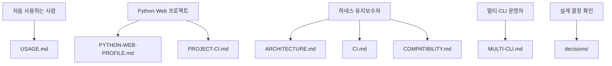

MOC:: [[Arachne]]
FROM:: [[README]]

# Arachne 문서 인덱스

## 독자별 진입점

| 목적 | 문서 | 정본 범위 |
| --- | --- | --- |
| 빠른 설치와 전체 소개 | [README](../README.md) | 5분 온보딩, 핵심 명령 |
| 일상 사용법 | [USAGE](USAGE.md) | commands, agents, skills, 설치·동기화 |
| 구조 이해 | [ARCHITECTURE](ARCHITECTURE.md) | SSOT, 링크·병합, 3-레인 구조 |
| 자체 CI | [CI](CI.md) | Arachne 저장소 GitHub Actions |
| 사용 프로젝트 CI | [PROJECT-CI](PROJECT-CI.md) | profile, commands, workflow, branch protection |
| Python·Web 기준 | [PYTHON-WEB-PROFILE](PYTHON-WEB-PROFILE.md) | 기본 도구와 확장 원칙 |
| 플랫폼 지원 | [COMPATIBILITY](COMPATIBILITY.md) | 기능별 Linux/macOS/Windows 범위 |
| CLI 간 역할 | [MULTI-CLI](MULTI-CLI.md) | Claude, Codex, Gemini, Copilot 연계 |
| Windows 설치 | [WINDOWS-SETUP](WINDOWS-SETUP.md) | PowerShell, Git Bash, WSL |
| 용어 | [GLOSSARY](GLOSSARY.md) | 약어와 기술 용어 |

## 기록 디렉터리

| 디렉터리 | 용도 |
| --- | --- |
| `docs/issue/` | 문제 재현, 원인 분석, 영향 |
| `docs/idea/` | 아직 실행 확정 전인 개선 후보 |
| `docs/task/` | 실행하기로 결정한 작업과 실제 상태 |
| `docs/template/` | 프로젝트 기록 템플릿 |
| `docs/decisions/` | 장기 설계 결정과 트레이드오프 |

문서가 실제 동작과 충돌하면 소스와 테스트가 우선한다. 충돌을 발견하면 issue 또는 task로 기록하고
정본 문서 하나를 수정한 뒤 다른 문서는 링크로 연결한다.
