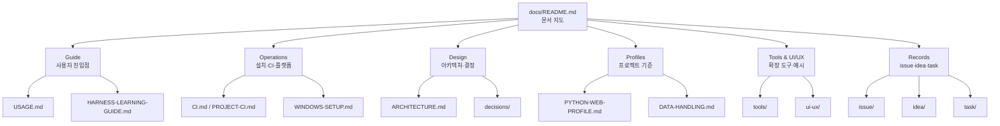

MOC:: [[Arachne]]
FROM:: [[README]]

# Arachne 문서 인덱스

이 디렉터리는 **정본 문서**와 **작업 기록**을 분리해서 관리한다. 정본 문서는 현재 사용법과
운영 계약을 설명하고, 기록 문서는 특정 시점의 문제·아이디어·작업 결정을 남긴다.

문서가 실제 동작과 충돌하면 소스·테스트가 우선이다. 충돌은 `issue/` 또는 `task/`에 기록한 뒤
정본 하나를 고치고, 나머지 문서는 링크로 연결한다.

## 빠른 선택

| 상황 | 먼저 볼 문서 |
| --- | --- |
| 처음 설치하고 5분 안에 감을 잡고 싶다 | [루트 README](../README.md), [USAGE](USAGE.md) |
| Arachne를 매일 어떻게 쓰는지 알고 싶다 | [USAGE](USAGE.md), [GLOSSARY](GLOSSARY.md) |
| Python·Web 프로젝트에 붙이고 싶다 | [PYTHON-WEB-PROFILE](PYTHON-WEB-PROFILE.md), [PROJECT-CI](PROJECT-CI.md), [DATA-HANDLING](DATA-HANDLING.md), [DESIGN-DOCS](DESIGN-DOCS.md) |
| Claude·Codex·Gemini·Copilot 역할을 구분하고 싶다 | [MULTI-CLI](MULTI-CLI.md), [ARCHITECTURE](ARCHITECTURE.md) |
| 설치 플랫폼과 동기화 범위를 확인하고 싶다 | [COMPATIBILITY](COMPATIBILITY.md), [WINDOWS-SETUP](WINDOWS-SETUP.md), [SYNCTHING-SETUP](SYNCTHING-SETUP.md) |
| 확장 도구를 설치하거나 비교하고 싶다 | [tools/README](tools/README.md) |
| UI/UX 기준과 예시가 필요하다 | [ui-ux/README](ui-ux/README.md) |
| 문제·아이디어·작업·피드백 기록을 남기고 싶다 | [issue/README](issue/README.md), [idea/README](idea/README.md), [task/README](task/README.md), [template/feedback](template/feedback.md) |

## 문서 유형

## 1. Guide — 시작하기와 일상 사용

현재 사용자가 읽는 문서다. 설치 후 어떤 명령을 쓰고 어떤 개념을 알아야 하는지 설명한다.

| 문서 | 정본 범위 |
| --- | --- |
| [루트 README](../README.md) | 5분 온보딩, 핵심 명령, 전체 소개 |
| [USAGE](USAGE.md) | 일상 사용법 — commands·agents·skills, 설치·동기화 |
| [GLOSSARY](GLOSSARY.md) | 약어와 기술 용어 사전 |
| [HARNESS-LEARNING-GUIDE](HARNESS-LEARNING-GUIDE.md) | 학습 순서 — 공통 규율→TDD→제품→아키텍처→도메인 트랙 |
| [CAPABILITY-MAP](CAPABILITY-MAP.md) | 역량 지도 — 제품·아키텍처·Java·Docker·시스템/네트워크 자산 연결 |

## 2. Operations — 설치, CI, 플랫폼

운영 환경을 맞추거나 검증 경계를 확인할 때 보는 문서다.

| 문서 | 정본 범위 |
| --- | --- |
| [CI](CI.md) | Arachne 저장소 자체 GitHub Actions |
| [PROJECT-CI](PROJECT-CI.md) | 사용 프로젝트 CI — profile·commands·workflow·branch protection |
| [COMPATIBILITY](COMPATIBILITY.md) | 기능별 Linux/macOS/Windows 지원 범위 |
| [WINDOWS-SETUP](WINDOWS-SETUP.md) | Windows 설치 — PowerShell·Git Bash·WSL |
| [SYNCTHING-SETUP](SYNCTHING-SETUP.md) | 다중 머신 설정 동기화 |
| [OBSIDIAN-DOCS-SYNC](OBSIDIAN-DOCS-SYNC.md) | 문서 Obsidian 동기화 |

## 3. Profiles — 프로젝트 기준

Arachne를 특정 프로젝트 유형에 적용할 때의 기준 문서다.

| 문서 | 정본 범위 |
| --- | --- |
| [PYTHON-WEB-PROFILE](PYTHON-WEB-PROFILE.md) | Python·Web 기본 도구와 확장 원칙 |
| [DATA-HANDLING](DATA-HANDLING.md) | PII 분류표, 노출 표면, 암호화 경계, DB quality gate |
| [DESIGN-DOCS](DESIGN-DOCS.md) | 사용 프로젝트 디자인 문서 위치와 `/design` 탐색 계약 |

## 4. Design — 구조와 장기 결정

왜 이런 구조인지, 앞으로 바꾸기 어려운 결정이 무엇인지 설명한다.

| 문서 | 정본 범위 |
| --- | --- |
| [ARCHITECTURE](ARCHITECTURE.md) | SSOT, 링크·병합 구조, 3-레인 구조 |
| [MULTI-CLI](MULTI-CLI.md) | Claude·Codex·Gemini·Copilot 역할 분담·연계 |
| [AI-ENGINEERING-NOTES](AI-ENGINEERING-NOTES.md) | 에이전틱 엔지니어링 설계 노트 |
| [decisions/README](decisions/README.md) | ADR 작성 기준과 현재 결정 목록 |

## 5. Tools & UI/UX — 확장 도구와 예시

핵심 하네스 바깥의 선택형 도구와 화면 품질 기준을 모은다.

| 문서 | 정본 범위 |
| --- | --- |
| [tools/README](tools/README.md) | 확장 도구 개요 — 두 통합 계층, 빠른 시작, 클론 준비 |
| [tools/extras-setup](tools/extras-setup.md) | `setup-extras.sh`·`.ps1`, installer 연동, 재설치 내구성, 제거·문제해결 |
| [tools/understand-anything](tools/understand-anything.md) | 코드베이스 분석 플러그인 — `/understand*` 커맨드 |
| [tools/taste-skill](tools/taste-skill.md) | 프론트엔드 안티-슬롭 디자인 스킬 모음 |
| [tools/codegraph](tools/codegraph.md) | 코드 인텔리전스 CLI — 심볼·호출·영향 분석, `/codegraph` |
| [ui-ux/README](ui-ux/README.md) | UI/UX 예시 위치, 작업 순서, 간격·정렬 참고 기준 |
| [ui-ux/examples/](ui-ux/examples/) | 화면·컴포넌트 before/after 예시 |

## 6. Records — 이슈, 아이디어, 작업 기록

시점 기록이다. 정본 문서처럼 계속 덮어쓰기보다 결정과 진행 이력을 남긴다.

| 디렉터리 | 쓸 때 | 안내 |
| --- | --- | --- |
| [issue/](issue/) | 문제 재현, 원인 분석, 영향 범위를 기록할 때 | [issue/README](issue/README.md) |
| [idea/](idea/) | 실행 확정 전인 개선 후보나 감사 결과를 둘 때 | [idea/README](idea/README.md) |
| [task/](task/) | 실행하기로 결정한 작업과 실제 상태를 추적할 때 | [task/README](task/README.md) |
| [template/](template/) | issue·idea·task·audit·feedback 문서 초안을 만들 때 | [template/](template/) |
| [decisions/](decisions/) | 장기 설계 결정과 트레이드오프를 보존할 때 | [decisions/README](decisions/README.md) |
