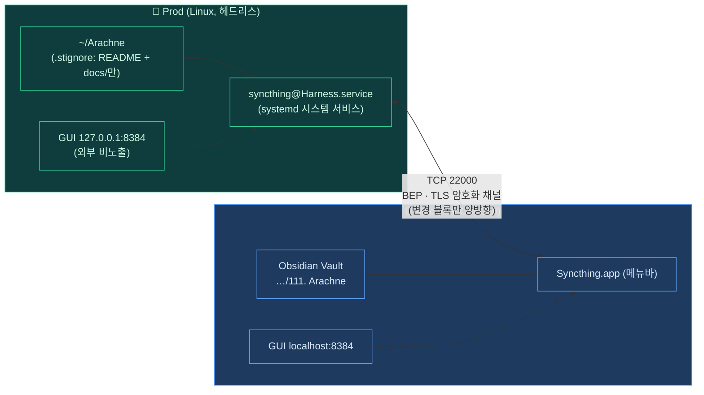

# Syncthing 양방향 자동 동기화 (Linux ↔ macOS)

원격 Linux 서버의 `/home/Harness/Arachne`와 MacBook의 Obsidian 프로젝트 폴더를
**Syncthing**으로 양방향 자동 동기화한다. 변경된 파일은 양쪽이 온라인일 때 즉시
전파되며, 충돌 발생 시 양쪽 모두 보존된다.

---

## Syncthing 개요 (Overview)

**Syncthing**은 **중앙 서버 없는 P2P(peer-to-peer, 단말 간 직접) 파일 동기화** 도구다.
드롭박스처럼 클라우드를 거치지 않고, 등록된 단말끼리 **직접 암호화 채널(TLS)** 로 변경분만
주고받는다. 핵심 개념:

| 개념 | 설명 |
| --- | --- |
| **Device ID** | 단말의 신원 = TLS 인증서(`cert.pem`)의 지문. 위조 불가하며 이 ID로 서로를 인증한다. |
| **Folder** | 동기화 단위. 양쪽 단말이 같은 **Folder ID**로 공유해야 동기화된다. |
| **BEP** | Block Exchange Protocol — 파일을 블록으로 쪼개 **바뀐 블록만** 전송하는 자체 프로토콜. |
| **Folder Type** | `Send & Receive`(양방향)·`Send Only`·`Receive Only`·`Receive Encrypted`(암호 보관). |
| **Discovery / Relay** | 상대 IP를 찾는 방법(글로벌·로컬 디스커버리)과, 직접 연결 불가 시 우회하는 중계 서버. |



> 이 가이드는 위 토폴로지를 만든다: **Prod는 CLI·systemd 시스템 서비스, Mac은 메뉴바 앱**.
> 데이터는 22000 포트로 직접 흐르고, 각 GUI(8384)는 자기 단말에서만 연다.

---

## 동기화 방식 비교

| 방식                 | 트리거               | 방향                       | 충돌 처리                          | 용도                                     |
| -------------------- | -------------------- | -------------------------- | ---------------------------------- | ---------------------------------------- |
| `docs-sync.sh`       | 수동 (`pull`/`push`) | 단방향 (호출 시 결정)      | rsync timestamp 기반 덮어쓰기      | 가끔 끌어오기·올리기, 미리보기(`--dry-run`) |
| **Syncthing**        | 자동 (파일 변경 감지) | 양방향                     | `.sync-conflict-*` 파일로 양쪽 보존 | 상시 백그라운드 동기화                   |

> 두 방식은 공존 가능하다. Syncthing이 상시 동기화를 담당하고, `docs-sync.sh`는
> Syncthing 미설치 환경(또는 디버그용)에서 단발 동기화로 활용한다.
> 수동·arachne 관리 방식(`docs-sync`)은 [OBSIDIAN-DOCS-SYNC.md](OBSIDIAN-DOCS-SYNC.md) 참고.

---

## 빠른 시작 — 한번에 세팅 (자동 동기화)

아래 블록을 순서대로 실행하면 Syncthing 자동 동기화가 대부분 세팅된다.
(Device 페어링·폴더 공유는 보안상 양쪽 확인이 필요해 GUI/CLI 한 단계가 남는다. 상세는 아래 본문.)

### A. 원격(Linux) — 원샷 스크립트 (복붙)

```bash
# 설치 + 방화벽(22000) + 시스템 서비스 + 문서만 동기화하는 .stignore 까지 한 번에
USER_NAME="$(whoami)"
REPO_DIR="$HOME/Arachne"                       # 동기화할 프로젝트 경로로 교체

# 1) 설치 (배포판 자동 분기)
if command -v dnf >/dev/null; then sudo dnf install -y syncthing
else sudo apt-get update -qq && sudo apt-get install -y syncthing; fi

# 2) 방화벽: 데이터 포트만 개방 (GUI는 닫아 둔다)
sudo firewall-cmd --permanent --add-port=22000/tcp 2>/dev/null && sudo firewall-cmd --reload || true

# 3) 시스템 서비스로 기동 (SSH 세션엔 --user 가 D-Bus 없어 실패하므로 시스템 서비스 사용)
sudo systemctl enable --now "syncthing@${USER_NAME}.service"

# 4) 문서만 동기화: README.md + docs/ 외 전부 무시
cat > "${REPO_DIR}/.stignore" << 'EOF'
(?d)*
!/README.md
!/docs
!/docs/**
EOF

# 5) 이 서버의 Device ID 출력 (Mac에 등록할 값)
syncthing --device-id
```

### B. 로컬(Mac) — 압축 단계

```bash
brew install --cask syncthing && open -a Syncthing      # 메뉴바 아이콘 → http://localhost:8384
```
브라우저 GUI(`http://localhost:8384`)에서:
1. **Add Remote Device** → 원격 Device ID 입력, Addresses에 `tcp://<원격IP>:22000`
2. **Add Folder** → 경로를 Obsidian 프로젝트 폴더로, **Folder Type = Send & Receive**, 원격 device 공유 체크
3. 원격에서 폴더 수락(아래 4단계 참고) → 상태가 **최신**이 되면 완료

> 위가 "한번에 세팅"의 핵심이다. 각 단계의 배경·트러블슈팅은 이어지는 본문에서 단계별로 설명한다.

## 사전 준비

| 항목                       | 원격 (Linux)                          | 로컬 (macOS)                    |
| -------------------------- | ------------------------------------- | ------------------------------- |
| 사용자                     | `Harness` (실제 사용자)               | `jomarusoup`                    |
| 패키지 관리자              | `dnf` / `apt`                         | Homebrew                        |
| sudo 권한                  | 필요 (방화벽·systemd)                 | 불필요                          |
| 양방향 TCP 22000           | 서버에서 열기 (방화벽)                | 클라이언트 발신만 가능하면 됨   |
| `~/.ssh/authorized_keys`   | `chmod 600` 필수 (사전 등록)          | -                               |

> 원격 서버는 GUI가 없는 헤드리스 환경이라 **CLI 전용**으로 설정하고,
> Mac은 메뉴바 앱 + 브라우저 GUI를 사용한다.

---

## 1단계 — 원격 (Linux) 설치

### 1.1 패키지 설치

```bash
# RHEL/CentOS/Rocky
sudo dnf install -y syncthing

# Debian/Ubuntu
sudo apt-get install -y syncthing
```

### 1.2 방화벽 개방

Syncthing은 두 포트를 사용한다.

| 포트            | 프로토콜 | 용도                                |
| --------------- | -------- | ----------------------------------- |
| `22000`         | TCP      | 데이터 전송 (필수)                  |
| `21027`         | UDP      | 로컬 디스커버리 (멀티캐스트, 선택) |
| `8384`          | TCP      | 웹 GUI (원격은 비활성화 권장)       |

원격(공인 IP) 서버 환경에서는 22000만 열고 GUI는 닫는다.

```bash
sudo firewall-cmd --permanent --add-port=22000/tcp
sudo firewall-cmd --reload
```

### 1.3 systemd 시스템 service 활성화

> **주의**: `systemctl --user`는 SSH 세션에서 D-Bus가 없어 실패한다
> ("미디어가 없음" 오류). 시스템 서비스 형태인 `syncthing@<user>`를 사용한다.

```bash
sudo systemctl enable --now syncthing@Harness.service
sudo systemctl status syncthing@Harness.service
```

`Active: active (running)`이면 정상.

### 1.4 GUI 리스닝 주소 확인

원격에서는 GUI를 외부에 노출하지 않는다. 기본값(`127.0.0.1:8384`) 유지를 확인:

```bash
grep '<address>' ~/.local/state/syncthing/config.xml
```

`127.0.0.1:8384`이면 OK. `0.0.0.0:8384`로 잡혀 있다면 즉시 바꾼다.

### 1.5 원격 Device ID 확인

```bash
syncthing --device-id
# 예: UBH364Y-E6QZ5NV-JRCBAP2-SASYS7S-CAOMXFU-M3AR6D7-NVSAW4Q-YNRRKAR
```

이 값을 Mac에 등록할 때 쓴다.

---

## 2단계 — 로컬 (Mac) 설치

### 2.1 Homebrew로 설치

```bash
brew install --cask syncthing
```

또는 [공식 사이트](https://syncthing.net)에서 macOS 앱을 받아 설치.

### 2.2 첫 실행 및 GUI 접근

Spotlight에서 `Syncthing` 실행 → 메뉴바 아이콘이 뜬다.
브라우저에서 `http://localhost:8384` 접속.

> HTTPS로 바꾸려면 Actions → Settings → GUI → Listen Address를
> `https://127.0.0.1:8384`로 변경. 자체 서명 인증서라 브라우저 경고가 뜨지만
> localhost는 보안 차이가 없으므로 HTTP 기본값이 편하다.

### 2.3 Mac Device ID 확인

GUI 우상단 **Actions → Show ID**, 또는:

```bash
cat ~/Library/Application\ Support/Syncthing/cert.pem | \
  grep -oE 'Device ID: [A-Z0-9-]+'
```

---

## 3단계 — Device 페어링

양쪽이 서로의 Device ID를 알아야 연결된다.

### 3.1 원격 → Mac 등록 (CLI)

```bash
# 반드시 Harness 사용자로 실행 (root에서는 cert.pem 못 찾음)
su - Harness
syncthing cli config devices add \
  --device-id <Mac의 Device ID> \
  --name Mac
```

### 3.2 Mac → 원격 등록 (GUI)

1. `http://localhost:8384` 열기
2. 우하단 **Add Remote Device** 클릭
3. **Device ID** 필드에 원격 Device ID 입력
4. **Device Name**: `Prod` (식별용)
5. **Advanced** 탭 → **Addresses**:
   ```
   tcp://<원격 IP>:22000
   ```
   기본값(`dynamic`)은 NAT 뒤 디스커버리에 의존하므로 명시하는 게 안전하다.
6. Save

### 3.3 연결 확인

Mac GUI 우측 패널에 `Prod` device가 **연결됨(미사용)** 으로 뜨면 성공.
("미사용"은 아직 공유 폴더가 없다는 뜻일 뿐 정상)

---

## 4단계 — 폴더 공유

### 4.1 Mac GUI에서 폴더 추가

1. 좌측 **Add Folder** 클릭
2. **Folder Label**: `Arachne`
3. **Folder Path**:
   ```
   /Users/jomarusoup/Desktop/HOME/Life-Hack/100. Project/110. Side-Project/111. Arachne
   ```
4. **Sharing** 탭 → `Prod` 체크
5. **Advanced** 탭 → **Folder Type**: **Send & Receive** (송수신)
   > "Receive Encrypted"로 두면 원격과 타입 불일치로 동기화 실패한다.
6. Save → Folder ID가 자동 생성됨 (예: `ygpiw-w5hcx`)

### 4.2 원격에서 폴더 수락 (CLI)

Mac이 Save한 직후 원격에 pending 폴더가 생긴다. Auto-accept가 켜져 있으면
자동 수락되지만 일반적으로는 수동 수락이 필요하다.

먼저 폴더 목록 확인:

```bash
syncthing cli config folders list
# default        ← 설치 시 자동 생성된 기본 폴더
# ygpiw-w5hcx    ← Mac이 공유한 Arachne 폴더
```

폴더 설정 조회 (REST API 직접 호출):

```bash
API_KEY=$(grep -oP '(?<=<apikey>)[^<]+' ~/.local/state/syncthing/config.xml)
curl -s -H "X-API-Key: $API_KEY" \
  http://127.0.0.1:8384/rest/config/folders/<folder-id>
```

`"path"`, `"type": "sendreceive"`, `"devices"` 확인.

### 4.3 원격 폴더에 Mac device 연결

`devices` 배열에 Prod 자신만 있고 Mac이 없으면 직접 추가:

```bash
syncthing cli config folders <folder-id> devices add \
  --device-id <Mac Device ID>
```

성공 후 Mac GUI 폴더 상태가 **최신** 또는 **동기화 중**으로 바뀐다.

---

## 5단계 — `.stignore`로 동기화 범위 제한

기본 상태로 두면 `/home/Harness/Arachne` 전체(소스 코드·빌드 산출물 포함)가
Mac으로 내려온다. Obsidian 노트로는 문서만 필요하므로 화이트리스트 패턴으로
좁힌다.

### 5.1 Prod에 `.stignore` 생성

```bash
cat > /home/Harness/Arachne/.stignore << 'EOF'
// README.md와 docs/만 허용, 나머지 전부 무시
(?d)*
!/README.md
!/docs
!/docs/**
EOF
```

### 5.2 패턴 의미

| 패턴            | 의미                                              |
| --------------- | ------------------------------------------------- |
| `(?d)*`         | 모든 항목을 무시. `(?d)`는 대상에서도 삭제 허용    |
| `!/README.md`   | 루트 `README.md`는 예외 (동기화 허용)             |
| `!/docs`        | 루트 `docs/` 디렉터리는 예외                      |
| `!/docs/**`     | `docs/` 하위 모든 파일·디렉터리는 예외            |

> `!` 가 우선순위가 높다. 무시 패턴 뒤에 와도 예외가 적용된다.
> `(?d)` 접두사는 "이 패턴에 매칭되는 파일이 대상에 있으면 삭제 가능"을 뜻한다.

### 5.3 Mac 쪽 `.stignore` (선택)

Syncthing은 `.stignore` 자체를 동기화하므로 Prod에서 만들면 Mac으로도 전파된다.
양쪽 동일 정책이 자동 적용된다.

별도 정책을 원하면 Mac GUI에서 폴더 Edit → **Ignore Patterns** 탭에서 따로 작성한다.

### 5.4 `.stignore` 패턴 문법 레퍼런스

| 문법 | 의미 | 예시 |
| --- | --- | --- |
| `*` | 한 경로 구간(슬래시 제외) 매칭 | `*.log` → 모든 로그 파일 |
| `**` | 여러 구간(슬래시 포함) 매칭 | `build/**` → build 하위 전부 |
| `/` 시작 | 폴더 루트 기준 절대 경로 | `/README.md` → 루트의 그것만 |
| `!` 시작 | **예외**(무시하지 않음). 무시 패턴보다 우선 | `!/docs/**` |
| `(?d)` | 접두사 — 매칭 파일이 대상에 있으면 **삭제 허용** | `(?d)*` |
| `(?i)` | 접두사 — 대소문자 무시 매칭 | `(?i)*.PDF` |
| `#include` | 다른 ignore 파일 포함 | `#include .gitignore-like` |

> 화이트리스트 패턴(전부 무시 후 `!`로 되살리기)이 의도가 명확해 권장된다.
> 줄 순서가 중요하다 — 위에서부터 첫 매칭이 적용되므로 `!` 예외를 `(?d)*` **앞**에 둬도 되고
> Syncthing은 `!`에 절대 우선권을 준다.

---

## 설정 레퍼런스 (Settings Reference)

설치·페어링 이후 조정할 수 있는 핵심 설정. 값은 GUI(Actions → Settings / 폴더·device Edit)
또는 `config.xml`(Linux: `~/.local/state/syncthing/config.xml`, Mac:
`~/Library/Application Support/Syncthing/config.xml`)에서 바꾼다. 설정 변경 후엔 재시작이 필요할 수 있다.

### GUI 인증·보안

헤드리스 Prod는 GUI를 `127.0.0.1`에만 바인딩하지만, 추가로 인증을 걸어두는 게 안전하다.

| 항목 | 설정 위치 | 권장값 |
| --- | --- | --- |
| Listen Address | Settings → GUI | `127.0.0.1:8384` (외부 노출 금지) |
| GUI 인증 | Settings → GUI → User/Password | 설정 권장 (특히 포트 포워딩 시) |
| HTTPS | Settings → GUI → "Use HTTPS for GUI" | localhost면 선택, 원격 노출이면 필수 |
| **API Key** | Settings → GUI → API Key | REST API 호출용. 노출 시 재발급 |

```bash
# CLI로 GUI 인증 설정 (Prod, Harness 사용자)
syncthing cli config gui user set "admin"
syncthing cli config gui password set "강한-비밀번호"

# API Key 확인 (REST 호출에 사용)
grep -oP '(?<=<apikey>)[^<]+' ~/.local/state/syncthing/config.xml
```

> API Key는 비밀값이다. 커밋·로그에 남기지 말고 환경변수나 별도 보관소로 다룬다.

### 연결·디스커버리·릴레이

상대 단말을 찾고 연결하는 방식. NAT 뒤 환경에서 특히 중요하다.

| 설정 | 의미 | 권장 |
| --- | --- | --- |
| **Global Discovery** | Syncthing 공용 디스커버리 서버로 IP 광고·조회 | 공인망이면 켜둠 |
| **Local Discovery** | 같은 LAN에서 UDP 21027 멀티캐스트로 탐색 | LAN 동일망이면 켜둠 |
| **Relaying** | 직접 연결 실패 시 공용 릴레이 경유(암호화 유지, 느림) | 폴백용으로 켜둠 |
| **NAT Traversal** | UPnP로 포트 매핑 시도 | 서버는 끄고 22000 직접 개방 권장 |
| device **Addresses** | `dynamic`(자동) 또는 `tcp://IP:22000` 명시 | **고정 IP 서버는 명시가 안전** |

```bash
# 직접 연결 강제 — device 주소를 고정 IP로 박아 릴레이·디스커버리 의존 제거
syncthing cli config devices <device-id> addresses set "tcp://<원격IP>:22000"

# 현재 연결 방식 확인 (relay 경유인지 direct인지)
API_KEY=$(grep -oP '(?<=<apikey>)[^<]+' ~/.local/state/syncthing/config.xml)
curl -s -H "X-API-Key: $API_KEY" http://127.0.0.1:8384/rest/system/connections \
  | grep -o '"type":"[^"]*"'        # "tcp-client"/"tcp-server"=직접, "relay-*"=릴레이
```

### File Versioning (삭제·덮어쓰기 복구)

Syncthing은 **삭제·변경도 동기화**하므로, 실수로 지운 파일을 되살리려면 폴더별
버전 관리를 켠다. 폴더 Edit → **File Versioning** 탭.

| 방식 | 동작 | 용도 |
| --- | --- | --- |
| **No Versioning** | 버전 보관 안 함 (기본) | 버전 불필요 |
| **Trash Can** | 삭제·교체된 파일을 `.stversions/`에 N일 보관 | 가장 간단한 휴지통 |
| **Simple** | 파일당 최근 N개 버전 보관 | 가벼운 이력 |
| **Staggered** | 시간대별로 촘촘→성김 보관(최대 보관기간 지정) | 문서 작업 권장 |
| **External** | 외부 명령에 위임 | 커스텀 백업 연계 |

> Obsidian 노트처럼 자주 고치는 문서는 **Staggered**(예: maxAge 30일)가 안전하다.
> 버전 파일은 각 단말의 `.stversions/`에 쌓이며 이 폴더는 동기화 대상이 아니다.

### 폴더 고급 옵션

폴더 Edit → **Advanced** 탭에서 조정.

| 옵션 | 의미 | 비고 |
| --- | --- | --- |
| **Folder Type** | `sendreceive`/`sendonly`/`receiveonly`/`receiveencrypted` | 양쪽 호환 타입이어야 함 |
| **Rescan Interval** | 주기적 전체 스캔 간격(초) | 기본 3600. Watch 켜면 길게 둬도 됨 |
| **Watch for Changes** | inotify/FSEvents로 변경 즉시 감지 | 켜두면 거의 실시간 |
| **Ignore Permissions** | 파일 권한 비트 동기화 제외 | Linux↔Mac 권한 차이 무시할 때 |
| **Folder Type 불일치** | 한쪽 plain + 한쪽 encrypted | 동기화 실패 → 트러블슈팅 참고 |

---

## 일상 운영 명령 (CLI · REST)

Prod(헤드리스)에서 자주 쓰는 점검·제어 명령. CLI subcommand가 없는 버전은 `curl` REST로 대체한다.

```bash
# 공통: API Key 미리 잡아두기 (Harness 사용자)
API_KEY=$(grep -oP '(?<=<apikey>)[^<]+' ~/.local/state/syncthing/config.xml)
ST="http://127.0.0.1:8384"
```

| 작업 | 명령 |
| --- | --- |
| 서비스 상태 | `sudo systemctl status syncthing@Harness.service` |
| 실시간 로그 | `sudo journalctl -u syncthing@Harness.service -f` |
| 재시작 | `sudo systemctl restart syncthing@Harness.service` |
| 폴더 즉시 재스캔 | `curl -s -X POST -H "X-API-Key: $API_KEY" "$ST/rest/db/scan?folder=<folder-id>"` |
| 동기화 진행률 | `curl -s -H "X-API-Key: $API_KEY" "$ST/rest/db/status?folder=<folder-id>"` |
| 폴더 일시정지 | `curl -s -X PATCH -H "X-API-Key: $API_KEY" -d '{"paused":true}' "$ST/rest/config/folders/<folder-id>"` |
| 폴더 재개 | `curl -s -X PATCH -H "X-API-Key: $API_KEY" -d '{"paused":false}' "$ST/rest/config/folders/<folder-id>"` |
| 연결된 peer | `curl -s -H "X-API-Key: $API_KEY" "$ST/rest/system/connections"` |
| 전체 재시작(API) | `curl -s -X POST -H "X-API-Key: $API_KEY" "$ST/rest/system/restart"` |

> `<folder-id>`는 `syncthing cli config folders list` 또는 `/rest/config/folders`로 확인한다.
> 진행률(`/rest/db/status`)의 `needBytes`가 0이면 해당 폴더는 최신 상태다.

---

## 검증

### 동기화 확인

1. Mac GUI에서 Arachne 폴더가 **최신** 상태인지 확인
2. Prod에서 `/home/Harness/Arachne/docs/` 안에 테스트 파일 생성:
   ```bash
   echo "test" > /home/Harness/Arachne/docs/sync-test.md
   ```
3. 수 초 내로 Mac 로컬 폴더에 동일 파일 등장 확인:
   ```bash
   ls -la "/Users/jomarusoup/Desktop/HOME/Life-Hack/100. Project/110. Side-Project/111. Arachne/docs/sync-test.md"
   ```
4. 반대 방향도 동일하게 검증 (Mac에서 만들고 Prod에서 확인)
5. 정리:
   ```bash
   rm /home/Harness/Arachne/docs/sync-test.md
   ```

### 충돌 시뮬레이션

양쪽이 동시에 같은 파일을 다른 내용으로 수정하면 늦게 수신한 쪽이
`<원본명>.sync-conflict-<날짜>-<시각>-<deviceID>.md` 파일로 보존한다.
어느 쪽도 데이터를 잃지 않으므로 수동 머지 후 충돌 파일을 삭제한다.

---

## 트러블슈팅

### `systemctl --user enable syncthing` 실패 — "미디어가 없음"

SSH 세션은 user systemd 인스턴스 D-Bus가 없다.
**해결**: 시스템 서비스 형태인 `syncthing@<user>.service`를 sudo로 활성화.

```bash
sudo systemctl enable --now syncthing@Harness.service
```

### SSH publickey 거부 — `authorized_keys` 권한 664

`sshd`의 `StrictModes`는 `authorized_keys` 권한이 그룹 쓰기 가능하면 거부한다.
**해결**:

```bash
chmod 700 ~/.ssh
chmod 600 ~/.ssh/authorized_keys
```

### `syncthing cli` 실행 시 `cert.pem` not found

root 또는 다른 사용자로 실행 중. Syncthing config는
`~/.local/state/syncthing/`에 사용자별로 저장된다.

**해결**: 실제 syncthing 인스턴스를 띄운 사용자(Harness)로 전환.

```bash
su - Harness
syncthing cli <command>
```

또는 `sudo`로 위임:

```bash
sudo -u Harness syncthing cli <command>
```

### Mac GUI에 "Failed to verify encryption consistency" 에러

```
error="remote expects to exchange plain data, but local data is encrypted
       (folder-type receive-encrypted)"
```

Mac 폴더가 **Receive Encrypted** 모드로 추가됨. Prod는 plain `sendreceive`라
타입 불일치.

**해결**: Mac GUI에서 폴더 Edit → **Advanced** → **Folder Type**을
**Send & Receive**로 변경 후 Save.

### `syncthing cli rest get` / `syncthing cli config ... get` 실패

해당 버전 CLI가 그 subcommand를 지원하지 않음.
**해결**: `curl`로 REST API 직접 호출.

```bash
API_KEY=$(grep -oP '(?<=<apikey>)[^<]+' ~/.local/state/syncthing/config.xml)
curl -s -H "X-API-Key: $API_KEY" http://127.0.0.1:8384/rest/<endpoint>
```

주요 endpoint:

| Endpoint                            | 용도                       |
| ----------------------------------- | -------------------------- |
| `/rest/config`                      | 전체 설정                  |
| `/rest/config/folders`              | 모든 폴더 목록             |
| `/rest/config/folders/<id>`         | 특정 폴더 상세             |
| `/rest/config/devices`              | 모든 device 목록           |
| `/rest/system/status`               | 시스템 상태 (Device ID 등) |
| `/rest/system/connections`          | 연결된 peer 목록           |

### `BSD readlink: -e` 옵션 없음 (macOS)

현재 Arachne 설치기는 BSD `readlink`에서도 동작하는 경로 해석을 사용한다. 다만 Arachne 저장소의
전체 기여자 테스트와 일부 보조 기능은 GNU coreutils가 필요하다.

```bash
brew install coreutils
```

Syncthing 자체 동작과 Arachne 기여자 테스트의 플랫폼 요구사항은 별개다. 세부 범위는
[COMPATIBILITY.md](COMPATIBILITY.md)를 따른다.

---

## 자동 시작

### Prod

```bash
sudo systemctl is-enabled syncthing@Harness.service
# enabled ← 부팅 시 자동 시작
```

### Mac

메뉴바 Syncthing 아이콘 → **Settings → Start at Login** 체크.

---

## 운영 원칙

- 큰 파일 일괄 추가 시 LAN/공인망 대역 소모 주의 → `.stignore`로 좁히기
- 양쪽 시계가 크게 어긋나면 충돌 판정이 어색해진다 → NTP 동기화 확인
- `default` 폴더(설치 시 자동 생성)는 사용하지 않으면 GUI에서 삭제
- Syncthing은 **삭제도 동기화**한다. 한쪽에서 지운 파일은 다른 쪽도 사라진다.
  버전 관리가 필요하면 GUI에서 **File Versioning** 활성화 (Staggered, Trash Can 등)

## 관련 문서

- [`OBSIDIAN-DOCS-SYNC.md`](./OBSIDIAN-DOCS-SYNC.md) — `docs-sync.sh` 수동 동기화 CLI
- [공식 문서](https://docs.syncthing.net/) — Syncthing 전체 레퍼런스
- [REST API 레퍼런스](https://docs.syncthing.net/dev/rest.html) — `curl`로 직접 호출 시 참고
