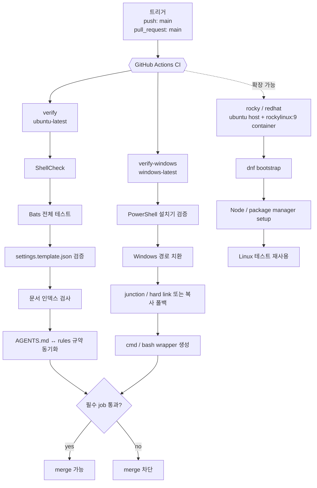
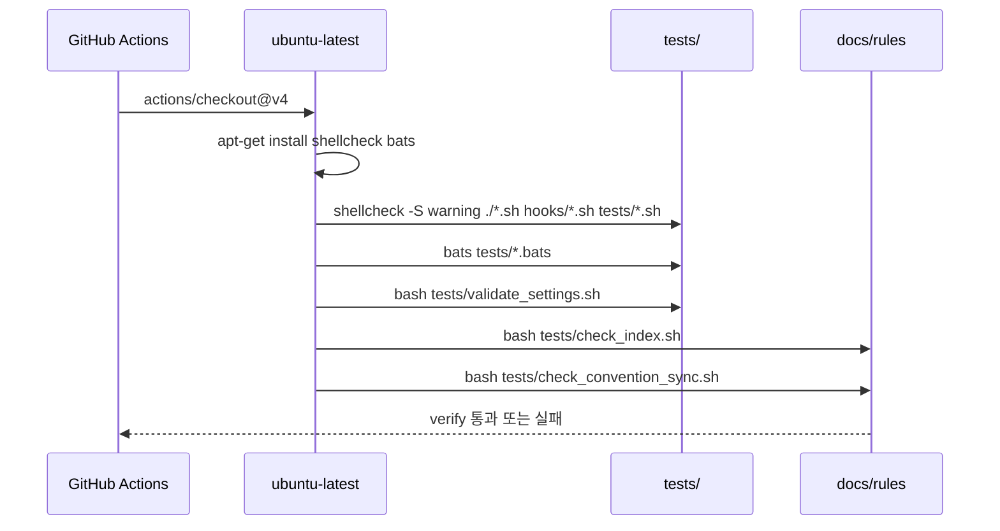
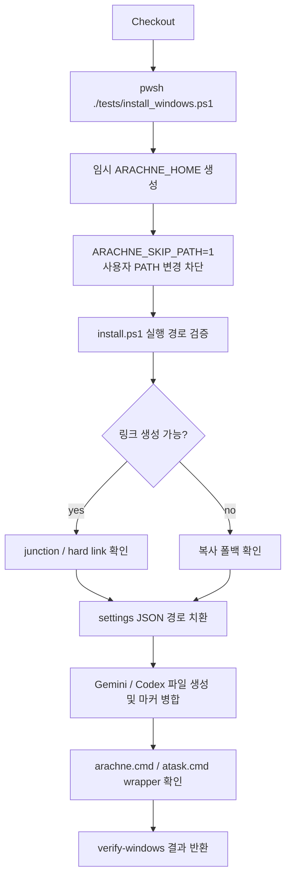
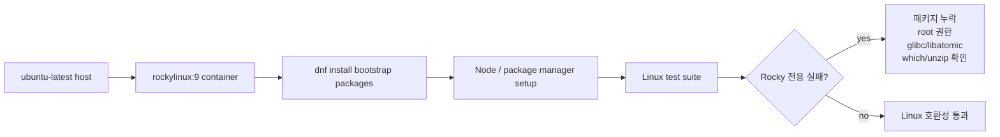
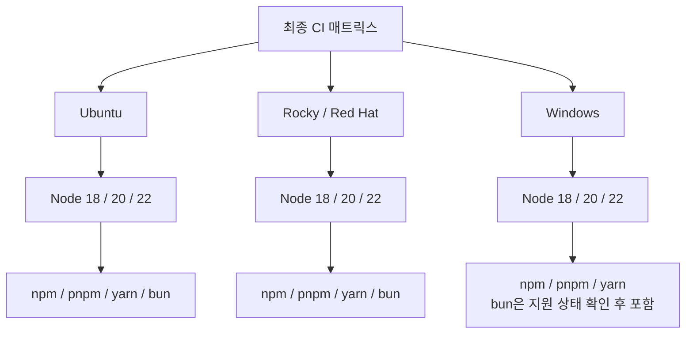
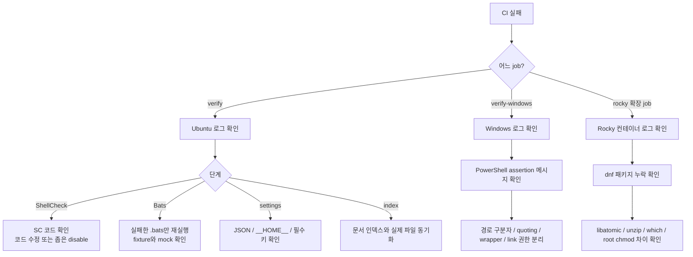

MOC:: [[Arachne]]
FROM:: [[empty]]

# Arachne CI 운영 가이드

Arachne의 CI(Continuous Integration, 지속적 통합)는 GitHub Actions에서 저장소의 셸 스크립트,
설치 동작, 설정 템플릿, 문서 인덱스, Windows 설치 흐름을 자동 검증한다. 현재 CI는 **검증 전용**이며
패키지 배포나 릴리스 생성 같은 CD(Continuous Deployment)는 수행하지 않는다.

실행 정의의 정본은 [`.github/workflows/ci.yml`](../.github/workflows/ci.yml)이다. 문서와 YAML이
다르면 실제 GitHub Actions 동작을 결정하는 YAML이 우선한다.

## 1. 전체 구조

현재 Arachne CI는 최종 게이트를 Linux(Ubuntu)와 Windows로 나누어 실행한다. Red Hat/Rocky 계열은
현재 Arachne 저장소의 필수 job은 아니지만, Linux 배포판 차이를 확인해야 하는 프로젝트에서는
`rockylinux:9` 컨테이너를 추가하는 방식으로 확장한다.



| 환경 | 현재 필수 여부 | 실행 방식 | 검증 책임 |
| --- | --- | --- | --- |
| Ubuntu Linux | 필수 | `ubuntu-latest` | Bash 정적 분석, Bats, 설정 템플릿, 문서 인덱스, 규약 동기화 |
| Windows | 필수 | `windows-latest` + `pwsh` | PowerShell 설치기, Windows 경로 처리, 링크/복사 폴백, wrapper 생성 |
| Red Hat/Rocky | 확장 패턴 | `ubuntu-latest` host + `container: rockylinux:9` | RHEL 계열 패키지 차이, root 컨테이너 차이, Linux 테스트 재사용성 |

## 2. 실행 조건

CI는 다음 이벤트에서 실행된다.

| 이벤트 | 대상 | 목적 |
| --- | --- | --- |
| `push` | `main` | main에 들어간 변경이 계속 통과하는지 검증 |
| `pull_request` | base 브랜치가 `main` | 병합 전에 변경을 검증 |

현재 자동 실행하지 않는 항목:

- main이 아닌 브랜치에 push만 한 경우
- 태그 생성
- 수동 실행(`workflow_dispatch`)
- 예약 실행(`schedule`)
- 실제 사용자 머신에 Arachne를 설치하는 E2E 배포 검증

기능 브랜치에서는 PR을 만들거나 로컬 재현 명령을 직접 실행해야 한다.

## 3. Ubuntu Linux CI

Ubuntu job 이름은 `verify`이며 GitHub-hosted `ubuntu-latest` 러너에서 실행된다. 이 job은 Arachne의
주요 Bash 기반 동작을 검증하는 기본 게이트다.



### 3.1 ShellCheck

```bash
shellcheck -S warning ./*.sh hooks/*.sh tests/*.sh
```

검사 대상:

- 저장소 루트의 `*.sh`
- `hooks/*.sh`
- `tests/*.sh`

warning 이상 진단이 있으면 실패한다. 새 Shell 스크립트를 다른 디렉터리에 추가하면 현재 glob에
자동 포함되지 않으므로 workflow 명령을 함께 갱신해야 한다.

### 3.2 Bats

```bash
bats tests/*.bats
```

`tests/` 바로 아래의 모든 `.bats` 파일을 실행한다. 주요 범위는 다음과 같다.

| 테스트 | 검증 대상 |
| --- | --- |
| `tests/install.bats` | Unix 설치, 링크, settings 생성, Codex/Copilot 병합 |
| `tests/hooks.bats` | 훅 파일 존재, 권한, 문법, 기본 동작 |
| `tests/atask.bats` | 역할별 실행 순서, 쿼터 폴백, 쿨다운, 오류 중단 |
| `tests/docs_sync.bats` | 문서 동기화 설정 생성, 목록, 구형 설정 호환 |
| `tests/new_project.bats` | 신규 프로젝트 구조, 템플릿, git 초기화, 입력 검증 |
| `tests/drift.bats` | 문서/규약 드리프트 탐지 보조 검증 |
| `tests/wrapper_security.bats` | wrapper 입력 경계와 보안 회귀 검증 |

Bats 테스트는 실제 Claude, Codex, Gemini, Copilot API를 호출하지 않는다. mock, 임시 HOME, 임시 PATH를
사용해 사용자 계정과 비용 발생 가능성을 분리한다.

### 3.3 settings 템플릿 검증

```bash
bash tests/validate_settings.sh
```

검증 내용:

- `settings.template.json` 존재
- `jq`가 있으면 JSON 문법 파싱
- 필수 키 존재 여부 확인
- 설치 시 치환할 `__HOME__` 플레이스홀더 존재
- 실제 러너의 `$HOME`이 템플릿에 하드코딩되지 않았는지 확인

`jq`가 러너에 없으면 JSON 파싱 일부가 생략될 수 있다. JSON 검증을 필수화하려면 workflow의 설치
단계에 `jq`를 명시적으로 추가해야 한다.

### 3.4 문서 인덱스 검사

```bash
bash tests/check_index.sh
```

이 검사는 새 파일이 생겼는데 사용자 문서나 인덱스가 갱신되지 않는 드리프트를 잡는다.

| 실제 파일 | 등록을 요구하는 문서 |
| --- | --- |
| `skills/*.md` | `skills/README.md`, `docs/USAGE.md` |
| `commands/*.md` | `CLAUDE.md`, `docs/USAGE.md` |
| `agents/*.md` | `CLAUDE.md`, `docs/USAGE.md` |
| `rules/<하위 디렉터리>/` | `CLAUDE.md` |

### 3.5 규약 동기화 검사

```bash
bash tests/check_convention_sync.sh
```

`AGENTS.md`와 `rules/common/*`에 같은 핵심 규약이 존재하는지 검사한다. Arachne는 여러 CLI가 같은
규약을 읽는 구조이므로, 한쪽만 수정되면 실제 도구별 행동이 갈라질 수 있다.

## 4. Windows CI

Windows job 이름은 `verify-windows`이며 GitHub-hosted `windows-latest` 러너에서 PowerShell로 실행된다.
이 job의 목적은 “Linux에서는 통과하지만 Windows 설치에서 깨지는” 문제를 조기에 잡는 것이다.



현재 검증 내용:

- Claude 자산 설치
- 디렉터리 junction 또는 복사 폴백 산출물 존재
- 파일 hard link 또는 복사 폴백 산출물 존재
- `settings.template.json`의 `__HOME__` 치환
- Windows 경로를 slash 경로로 바꾼 settings JSON
- settings JSON 파싱
- Gemini `GEMINI.md` 생성
- Codex `AGENTS.md` 사용자 내용 보존
- Codex ARACHNE 마커 병합 멱등성
- `arachne.cmd`, `atask.cmd` 등 Windows 명령 래퍼 생성
- Bash wrapper가 Windows backslash 경로 대신 slash 경로를 쓰는지 확인

현재 검증하지 않는 내용:

- 실제 Claude/Codex/Gemini/Copilot 로그인과 API 호출
- `install-copilot.ps1` 전체 실행 결과
- Git for Windows `bash.exe`에서 훅이 실제로 도는 흐름
- Windows 사용자 PATH 영구 변경
- junction/hard link 실패를 강제로 만든 복사 폴백 재현
- Windows PowerShell 5.1과 PowerShell 7의 전체 호환성 매트릭스

Windows CI가 반복 실패할 때는 먼저 실패한 assertion이 설치, 경로 치환, 링크/복사, wrapper 생성 중
어느 단계인지 분리한다. Linux job이 통과해도 Windows 경로 구분자, PowerShell quoting, `.cmd` shim,
권한 모델 때문에 Windows만 실패할 수 있다.

## 5. Red Hat/Rocky 계열 확장 패턴

GitHub-hosted runner에는 `rocky-latest` 같은 네이티브 Rocky Linux 러너가 없다. Red Hat/Rocky 계열을
CI에 넣을 때는 보통 Ubuntu host 위에서 Rocky 컨테이너를 실행한다.

```yaml
rocky-test:
  runs-on: ubuntu-latest
  container: rockylinux:9
  steps:
    - uses: actions/checkout@v4
    - name: Bootstrap Rocky
      run: dnf install -y ca-certificates git gzip libatomic nodejs npm tar unzip which xz
    - name: Run tests
      run: npm test
```



Rocky 컨테이너에서 자주 필요한 bootstrap 패키지:

| 패키지 | 필요한 이유 |
| --- | --- |
| `ca-certificates` | HTTPS 다운로드와 action 도구 통신 |
| `git` | checkout 이후 git 기반 테스트와 버전 확인 |
| `gzip`, `tar`, `xz`, `unzip` | Node 도구, Bun, package manager archive 해제 |
| `libatomic` | pnpm standalone binary 등 일부 Node 도구 실행 |
| `nodejs`, `npm` | 기본 Node 런타임과 npm |
| `which` | CLI 존재 확인 테스트와 스크립트 호환 |

컨테이너는 기본적으로 root로 실행되는 경우가 많다. root는 읽기 전용 비트나 chmod 기반 권한 테스트를
일반 사용자와 다르게 통과시킬 수 있으므로, 권한 테스트는 다음 중 하나를 선택해야 한다.

- 테스트를 non-root 사용자로 실행한다.
- `process.getuid?.() === 0` 같은 조건으로 root 컨테이너에서만 해당 assertion을 건너뛴다.
- chmod 대신 실제 실패를 보장하는 별도 fixture를 사용한다.

## 6. Node/package manager 매트릭스 확장

Arachne 자체 CI는 현재 Node 매트릭스를 사용하지 않지만, Node 기반 프로젝트에서 Linux/Windows/Rocky를
함께 검증할 때는 OS, Node 버전, package manager를 분리해 보는 것이 안전하다.



권장 패턴:

- package manager별 설치 step을 분리한다.
- Windows에서 Bash `case` 문으로 `.cmd` shim을 호출하지 않는다.
- Corepack, pnpm, yarn, bun setup은 OS별 shell 차이를 고려한다.
- Windows에서 지원이 불안정한 조합은 명시적으로 제외하고 이유를 주석으로 남긴다.

예시 설치 명령:

| package manager | 설치 명령 예시 |
| --- | --- |
| npm | `npm ci --ignore-scripts` |
| pnpm | `pnpm install --ignore-scripts --config.strict-dep-builds=false --no-frozen-lockfile` |
| yarn | `yarn install --mode=skip-build` |
| bun | `bun install --ignore-scripts` |

## 7. 로컬 재현

PR 전에는 가능한 한 GitHub Actions와 같은 명령을 로컬에서 실행한다.

### 7.1 Ubuntu/Debian

```bash
sudo apt-get update
sudo apt-get install -y shellcheck bats jq

shellcheck -S warning ./*.sh hooks/*.sh tests/*.sh
bats tests/*.bats
bash tests/validate_settings.sh
bash tests/check_index.sh
bash tests/check_convention_sync.sh
```

### 7.2 Windows PowerShell

```powershell
pwsh -File .\tests\install_windows.ps1
```

Git Bash 관련 흐름을 추가로 확인하려면 Git for Windows의 `bash.exe`가 PATH에 있어야 한다. 현재 공식
Windows CI는 PowerShell 설치 검증을 중심으로 돈다.

### 7.3 Rocky 컨테이너

```bash
docker run --rm -it -v "$PWD:/repo" -w /repo rockylinux:9 bash
dnf install -y ca-certificates git gzip libatomic nodejs npm tar unzip which xz
npm test
```

컨테이너 내부 root 실행과 GitHub Actions의 컨테이너 실행 조건은 완전히 같지 않을 수 있다. CI 실패를
정확히 재현하려면 workflow의 `container:` 설정과 bootstrap 명령을 함께 확인한다.

## 8. 실패 대응



기본 원칙:

- 실패 로그를 먼저 확인하고, 실패한 단계만 로컬에서 반복한다.
- 테스트를 약화하기 전에 실제 계약이 바뀐 것인지 확인한다.
- 계약 변경이면 구현, 테스트, 문서를 함께 갱신한다.
- Windows 실패는 경로 구분자와 shell 차이를 우선 의심한다.
- Rocky 실패는 기본 패키지 누락, root 실행, 라이브러리 차이를 우선 확인한다.

## 9. PR 체크리스트

- [ ] 관련 테스트를 먼저 추가하거나 기존 실패를 재현했다.
- [ ] Ubuntu 로컬 검증 또는 대응되는 개별 테스트를 실행했다.
- [ ] Windows 변경이면 `tests/install_windows.ps1`을 실행했거나 CI 결과를 확인했다.
- [ ] Red Hat/Rocky 관련 변경이면 `rockylinux:9` 컨테이너 또는 해당 CI job 결과를 확인했다.
- [ ] `git diff --check`로 공백 오류를 확인했다.
- [ ] 문서, 인덱스, 규약 파일이 실제 변경과 일치한다.
- [ ] PR 본문에 실행한 명령과 결과를 기록했다.

## 10. 보안과 비밀값

현재 CI는 실제 AI 서비스 인증을 사용하지 않는다. Claude, OpenAI, Google, GitHub Copilot API 키 없이
검증이 가능해야 한다.

보안 원칙:

- 테스트용 토큰을 저장소나 workflow에 하드코딩하지 않는다.
- 외부 서비스 E2E가 필요하면 GitHub Actions secret과 최소 권한 계정을 사용한다.
- fork PR에는 secret이 제공되지 않는다는 점을 고려한다.
- 로그에 토큰, 비공개 경로, 사용자 홈의 민감한 내용이 출력되지 않게 한다.
- 외부 action과 설치 도구는 버전 고정 또는 신뢰 가능한 출처를 사용한다.

## 11. 현재 CI의 한계

CI 통과가 다음을 보장하지는 않는다.

- 실제 Claude/Codex/Gemini/Copilot 로그인 성공
- 모델 응답 품질
- 모든 Linux 배포판 호환
- 모든 Windows 버전, PowerShell 버전, 파일 시스템 조합 호환
- macOS 호환
- 장시간 실제 사용자 워크플로의 안정성
- 공급망 공격 부재

CI는 정의된 자동 검사 범위 안에서 회귀를 차단하는 장치다. 새 운영 리스크가 발견되면 해당 리스크를
재현하는 테스트를 추가하고 workflow에 연결해야 한다.
