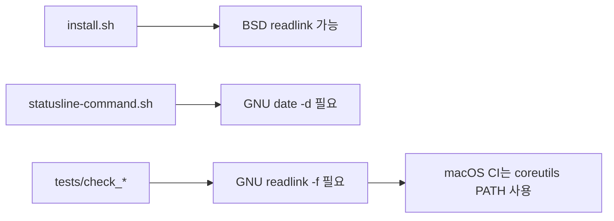
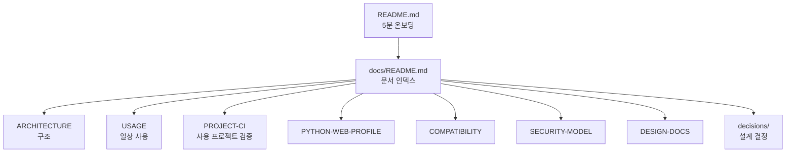

MOC:: [[Arachne]]
FROM:: [[2026-06-07-documentation-coverage-audit]]

# [idea] Arachne README·docs 최신성 감사

- **감사 기준일**: 2026-06-09
- **기준 revision**: `67c23f1` + PR #42
- **범위**: README, `docs/*.md`, task 상태, CLI 도움말, CI, rules/skills 인덱스
- **판정**: 문서 커버리지는 높지만 “모두 최신”은 아니다.

## 요약

현재 문서는 설치, 멀티 CLI, CI, Windows, Obsidian까지 폭넓게 설명한다. 그러나 기능 추가 속도에
비해 revision/date, 플랫폼 전제, 완료 task 상태, 미래형 문구가 따라오지 못했다.

| 심각도 | 발견 | 영향 |
| --- | --- | --- |
| HIGH | macOS 설치 요구사항이 실제 runtime과 섞여 부정확 | 불필요한 coreutils 설치 또는 잘못된 지원 판단 |
| HIGH | README 정체성이 C/C++·Go·Rust 중심 | Python/Web 우선 전략과 온보딩 메시지 충돌 |
| HIGH | 프로젝트 CI 기본 명령이 실질 테스트를 보장하지 않음 | 초록 CI를 품질 보증으로 오해 |
| MEDIUM | 완료된 작업이 “예정/미해결/in-progress”로 남음 | 유지보수 우선순위 왜곡 |
| MEDIUM | README/ARCHITECTURE modification 날짜 stale | 문서 freshness 판단 불가 |
| MEDIUM | docs 전체 인덱스와 링크 검증 부재 | 새 문서 발견성·깨진 링크 위험 |
| LOW | 프로젝트 CI 설명이 README/USAGE/CI에 중복 | 향후 세 문서가 서로 드리프트 가능 |

## 구체적 드리프트

### 1. macOS 설명이 범위를 구분하지 않는다

현재 `install.sh`는 `ResolvePath`를 사용해 GNU `readlink -f` 없이 진입 경로를 해석한다. 반면 일부
테스트 스크립트는 여전히 `readlink -f`를 쓰고, 상태표시줄은 GNU `date -d`를 쓴다.

따라서 다음 문구는 너무 넓다.

- README: macOS 설치에 GNU coreutils가 필요하다고 단정
- USAGE: “현재 스크립트는 readlink -f/-e 사용”이라고 전체 runtime을 묶음
- SYNCTHING 문서: 설치·점검 스크립트가 GNU readlink를 쓴다고 설명

정확한 문서는 설치기, statusline, test/CI helper를 분리해야 한다.

### 2. 문서화 task 상태가 실제와 다르다

`docs/task/2026-06-07-documentation-coverage-hardening.md`는 `in-progress`이며 다음을 미해결로 둔다.

- CI의 jq 필수 설치 결정
- 규약 내용 동기화 검사

현재 CI는 jq를 플랫폼별로 명시 설치하고 `check_convention_sync.sh`도 실행한다. task 상태와 체크리스트를
재판정해야 한다. 단, CLI 도움말과 문서 자동 대조는 여전히 미해결이다.

### 3. 완료된 기능이 미래형으로 남아 있다

- `AI-ENGINEERING-NOTES.md`: 규약 내용 동기화를 “#39로 보강 예정”이라고 기록
- 일부 task: “GitHub issue close 예정” 표현이 장기간 남음
- `development-workflow.md`: TDD/debugger 에이전트를 “예정”으로 표현하지만 파일은 존재

### 4. README 정체성이 현재 우선순위와 맞지 않는다

README 첫 문장은 C/C++·Go·Rust와 저지연 트레이딩을 핵심으로 소개한다. Python/Web을 먼저 사용할
계획이라면 다음 중 하나를 결정해야 한다.

1. Arachne를 범용 멀티 CLI 하네스로 재정의한다.
2. systems와 python-web을 동등한 profile로 소개한다.
3. README는 범용 코어를 설명하고 별도 profile 문서에서 전문화를 설명한다.

### 5. 프로젝트 CI 문서는 있으나 운영 계약이 약하다

PR #42는 README, USAGE, CI에 `init-ci`와 `project-check`를 추가한다. 다음 내용은 아직 부족하다.

- `.arachne/commands` Python/Web 권장 예시
- 최소 필수 명령이 무엇인지
- dependency 설치와 cache 주체
- GitHub branch protection 설정
- workflow 업데이트 시 사용자 수정 보존 정책
- secrets/service container 사용
- 실패 로그 해석

### 6. 문서 메타데이터가 일관되지 않다

README와 ARCHITECTURE는 2026-06-09에 내용이 바뀌었지만 frontmatter modification은 2026-06-07이다.
일부 최상위 docs는 frontmatter 자체가 없고 일부는 있다. 메타데이터가 운영에 필요하다면 CI로 강제하고,
필요하지 않다면 날짜 필드를 제거하는 편이 낫다.

### 7. 문서 인덱스가 없다

README는 주요 문서만 링크한다. issue/task/template를 제외한 docs의 목적과 독자를 한눈에 보는
`docs/README.md`가 없다. `docs/idea/`도 이번 감사 전에는 디렉터리가 없었다.

### 8. 자동 검사가 제한적이다

`check_index.sh`는 skills, commands, agents, rules 파일의 인덱스 존재를 검사한다. 다음은 검사하지 않는다.

- README와 실제 CLI help 일치
- docs 상대 링크 유효성
- 문서에 기록된 파일 수
- frontmatter modification freshness
- task 상태와 체크박스 모순
- 구현에서 제거된 옵션·환경변수
- Mermaid 문법

## 문서별 판정

| 문서 | 상태 | 판단 |
| --- | --- | --- |
| `README.md` | 갱신 필요 | 정체성, macOS 전제, 새 templates 구조, Python/Web 진입점 |
| `docs/ARCHITECTURE.md` | 부분 갱신 | 프로젝트 CI는 반영 중이나 profile/실행 계약 부재 |
| `docs/CI.md` | 대체로 최신 | 자체 CI와 프로젝트 CI를 별도 문서로 분리할 여지 |
| `docs/USAGE.md` | 갱신 필요 | 플랫폼 설명, Python/Web profile, project CI 운영 상세 |
| `docs/MULTI-CLI.md` | 대체로 정확 | “공통 규약 공유”와 “하네스 동등성” 차이를 더 명확히 해야 함 |
| `docs/WINDOWS-SETUP.md` | 별도 재검증 필요 | 외부 CLI 설치 명령은 시간에 따라 변함 |
| `docs/SYNCTHING-SETUP.md` | 갱신 필요 | GNU readlink 관련 Arachne runtime 설명 |
| `docs/AI-ENGINEERING-NOTES.md` | 갱신 필요 | 완료된 #39를 예정으로 기록 |
| `docs/GLOSSARY.md` | 양호 | 신규 project profile/quality gate 용어 추가 가능 |

## 새로 작성할 가치가 있는 문서

| 문서 제안 | 목적 |
| --- | --- |
| `docs/README.md` | 전체 문서 정보 구조와 독자별 진입점 |
| `docs/PYTHON-WEB-PROFILE.md` | Python/FastAPI/Django + TS/React/Next 표준 |
| `docs/PROJECT-CI.md` | 사용 프로젝트 CI 설정·명령·cache·services·branch protection |
| `docs/DESIGN-DOCS.md` | rules/skills/project docs 디자인 문서 배치 정책 |
| `docs/HARNESS-EVALUATION.md` | 하네스 효과 지표와 정기 audit 방법 |
| `docs/SECURITY-MODEL.md` | hooks, wrappers, prompt injection, managed files 위협 모델 |
| `docs/COMPATIBILITY.md` | Linux/macOS/Windows/WSL 기능별 지원표 |
| `docs/decisions/` | 중요한 설계 결정을 ADR로 보존 |

## 권장 문서 구조

## 자동화 제안

1. CLI `usage()` 출력과 README 명령 표를 비교하는 테스트
2. Markdown 상대 링크 검사
3. 문서에 기록된 agent/command/skill 수를 실제 파일에서 계산
4. `in-progress` task 중 7일 이상 변경 없는 문서 경고
5. “예정”, “미지원”, “현재” 문구를 정기 감사하는 grep report
6. Mermaid CLI가 उपलब्ध한 경우 문법 검사
7. 사용자 기능 변경 시 관련 문서 경로를 task에 필수 기록

## 처리 순서

1. 잘못된 플랫폼 설명과 완료 task 상태를 먼저 정정한다.
2. `docs/README.md`, `PYTHON-WEB-PROFILE.md`, `PROJECT-CI.md`를 작성한다.
3. README 정체성과 profile 전략을 결정한다.
4. 자동 링크·CLI 계약 검사를 CI에 추가한다.
5. 중복된 CI 설명을 정본 문서 하나로 모은다.
