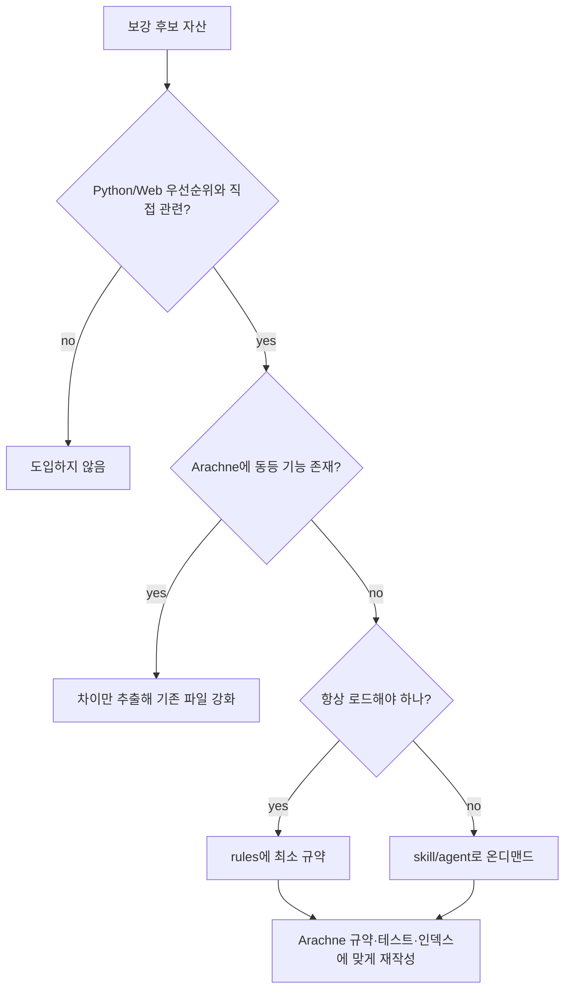

MOC:: [[Arachne]]
FROM:: [[2026-06-09-python-web-harness-assessment]]

# [idea] 보강 후보 Python·Web 선별 도입 검토

- **검토 기준**: `보강 후보`
- **원칙**: 전체 복사 금지. Arachne의 역할과 중복되지 않는 고가치 자산만 선별·재작성한다.

## 규모 비교

| 표면 | Arachne | 보강 후보군 | 판단 |
| --- | ---: | ---: | --- |
| agents | 7 | 63 | 보강 후보 전체 도입 시 선택 비용 급증 |
| commands | 16 | 79 | 중복·별칭·오케스트레이션 충돌 위험 |
| rules 파일 | 49 | 115 | 언어 깊이는 보강 후보가 우세 |
| skills | 28 | 404 | 전체 설치는 Arachne 철학과 맞지 않음 |
| hooks | 6 | 4개 최상위 + 런타임 모듈 | 파일 수보다 설치·프로필 구조가 중요 |

보강 후보의 강점은 “많은 파일”보다 선택적 설치, 추적성, context budget, quality gate, 프레임워크별
세분화다. Arachne가 배워야 할 부분은 카탈로그 크기가 아니라 **선택·검증·소유권 구조**다.

## 선별 기준



## 높은 우선순위로 참고할 자산

### Python

| 보강 후보 자산 | Arachne 상태 | 제안 배치 | 이유 |
| --- | --- | --- | --- |
| `skills/django-patterns` | 없음 | `skills/django-patterns.md` | Django/DRF를 쓸 경우 구조 기준 필요 |
| `skills/django-security` | 없음 | `skills/django-security.md` | CSRF, settings, upload, session 보안 |
| `skills/django-tdd` | 없음 | `skills/django-testing.md` | DB fixture, migration, API 테스트 |
| `skills/django-verification` | 없음 | 기존 `verification-loop` 확장 | 별도 스킬보다 중복 제거 우선 |
| `agents/django-reviewer.md` | 없음 | Django 채택 시 에이전트 추가 | ORM·migration·DRF 고유 리뷰 |
| `agents/django-build-resolver.md` | 없음 | 일반 Python build resolver로 축약 | dependency/migration/startup 실패 대응 |
| `agents/database-reviewer.md` | 없음 | DB 사용 프로젝트용 선택 agent | Python 서버의 실제 장애 지점 보완 |

FastAPI 관련 보강 후보 자산은 Arachne에도 대부분 존재한다. 새 파일을 복사하기보다 아래 누락만 기존
`fastapi-patterns`, `fastapi-reviewer`, `rules/python/fastapi.md`에 반영하는 편이 낫다.

- SQLAlchemy 2.x transaction/session 경계
- Alembic migration 안전성
- lifespan 자원 초기화와 종료
- background task 실패 관찰
- OpenTelemetry와 구조적 로깅
- Pydantic v2 validator 예시

### Web

| 보강 후보 자산 | Arachne 상태 | 제안 배치 | 이유 |
| --- | --- | --- | --- |
| `rules/typescript/*` | JS와 통합 | `rules/typescript/` 분리 검토 | JS와 TS 계약을 동일 취급하지 않기 |
| `rules/react/*` | agent에만 일부 존재 | `rules/react/` | RSC, hooks, security, RTL 기준 자동 로드 |
| `skills/react-testing` | 얕은 JS testing만 존재 | 기존 testing 강화 또는 신규 skill | RTL, MSW, userEvent, async assertion |
| `skills/react-performance` | frontend-patterns 일부 | 기존 skill 강화 | render, bundle, hydration, virtualization |
| `skills/frontend-a11y` | 단편적 a11y | 신규 skill | WCAG 2.2, keyboard, focus, form 계약 |
| `agents/a11y-architect.md` | 없음 | 선택 agent | 설계 시 접근성을 뒤늦게 붙이지 않기 |
| `skills/frontend-design-direction` | design-quality와 유사 | 기존 rule/skill 강화 | 제네릭 AI UI 방지와 제품 방향 설정 |
| `skills/design-system` | 없음 | 신규 skill | token 추출·감사·DESIGN.md 생성 |
| `skills/browser-qa` | `/verify`, `/e2e` 일부 | 기존 명령 강화 | console/network/breakpoint/a11y 통합 |
| `skills/vite-patterns` | 없음 | Vite 사용 시 선택 | 빌드·환경변수·chunk 전략 |
| `skills/nextjs-turbopack` | 없음 | Next 사용 시 선택 | Next 빌드 고유 문제 |

## 하네스 수준에서 참고할 자산

| 보강 후보 자산 | 도입 가치 | Arachne 적용 방향 |
| --- | --- | --- |
| selective install manifests/profiles | 매우 높음 | `core`, `python-web`, `systems`, `network` profile |
| `context-budget` | 매우 높음 | rules/agents/skills/MCP 기본 토큰 예산 감사 |
| `/quality-gate` | 높음 | `/verify`, `/python-review`, `/react-review` 결과 통합 |
| checkpoint/session adapter | 높음 | 기존 session hook의 상태 계약 명확화 |
| skill placement/추적성 policy | 높음 | 학습 스킬의 소유권과 업데이트 기준 추적 |
| `harness-audit` | 높음 | 규칙 충돌, 중복, dead asset 정기 감사 |
| `doc-updater` | 중간 | 자동 수정보다 문서 드리프트 보고서 우선 |
| silent failure hunter | 중간 | Python async/background task와 Web error boundary 리뷰에 유용 |
| AI regression/eval harness | 중간 | 3-레인 품질을 측정할 때 도입 |

## 그대로 가져오면 안 되는 것

### 1. 전체 404개 스킬

대부분은 현재 목표와 무관하다. 검색 비용, 업데이트 비용, 중복 설명이 증가한다.

### 2. 모든 에이전트

에이전트 description은 발견 표면에 계속 노출될 수 있다. Python/Web에 필요한 reviewer, build resolver,
a11y, database 정도로 제한하는 편이 낫다.

### 3. 보강 후보 오케스트레이션 전체

Arachne의 Claude 중심 3-레인과 보강 후보의 multi-* 명령을 동시에 설치하면 책임 경계가 중복된다.

### 4. continuous learning 자동 승격

학습된 규칙이 검토 없이 전역 규약으로 올라가면 잘못된 패턴이 고착된다. 추적성, confidence,
승인 게이트가 먼저 필요하다.

### 5. plugin/installer를 중첩 설치

Arachne 목적에 맞는 원칙만 선별해 내부 기준으로 재작성한다.

## 권장 Python/Web profile

```text
python-web
├── core
│   ├── common rules
│   ├── git / security / task 기록
│   └── project-check
├── python
│   ├── python rules
│   ├── FastAPI 또는 Django 선택
│   ├── python-reviewer
│   └── pytest / type / dependency scan
├── web
│   ├── TypeScript rules
│   ├── React/Next 또는 Vite 선택
│   ├── react-reviewer + a11y
│   └── unit / component / e2e / visual QA
└── optional
    ├── database-reviewer
    ├── design-system
    └── browser-qa
```

## 도입 순서 제안

1. selective profile과 추적성 정책부터 만든다.
2. TypeScript/React 규칙과 React testing/a11y를 선별한다.
3. Python 패키징·DB 규칙을 보강한다.
4. Django를 실제 사용할 때만 Django pack을 추가한다.
5. quality gate와 context budget을 추가한다.
6. 실제 프로젝트 2~3개에서 효과를 측정한 뒤 추가 자산을 결정한다.

## 공개 문서 작성 원칙

공개 배포 문서에는 저작권과 라이선스가 불명확한 외부 문구를 그대로 넣지 않는다.
필요한 원칙은 Arachne 문맥에 맞게 재작성하고, 구현 가능한 검증 기준과 함께 둔다.
