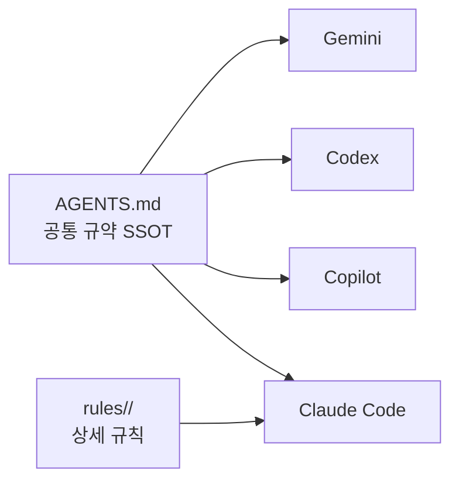
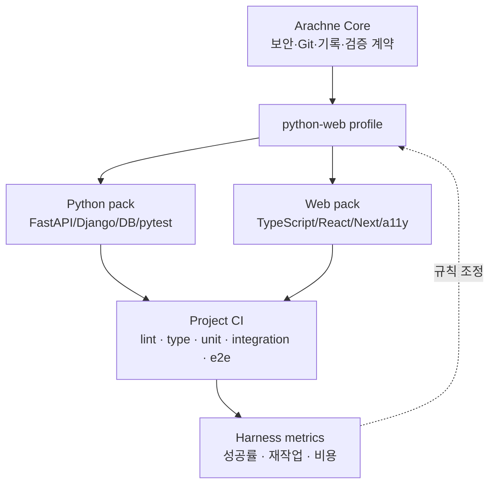

MOC:: [[Arachne]]
FROM:: [[empty]]

# [idea] Python·Web 중심 Arachne 하네스 냉정 평가

- **평가 기준일**: 2026-06-09
- **평가 대상**: `main` + 프로젝트 CI 스캐폴딩 PR #42
- **전제**: 당분간 Python 백엔드와 Web 프론트엔드 개발을 우선한다.
- **판정**: 기반은 건전하지만, 현재 상태를 “효율적인 Python/Web 프로덕션 하네스”라고 부르기에는 이르다.

## 결론

Arachne의 가장 큰 장점은 작은 표면, 명시적인 역할 분담, 공통 규약 SSOT, 실제 테스트다. 반면 현재
구조는 시스템 프로그래밍 중심 규칙을 Python/Web에도 강하게 적용하고, 역할 분담을 문서로 약속할 뿐
실행을 일관되게 강제하지 못한다.

현재 점수는 **6.5/10**으로 본다.

| 영역 | 점수 | 냉정한 평가 |
| --- | ---: | --- |
| 규약 일관성 | 8/10 | `AGENTS.md` SSOT와 동기화 검사가 강점 |
| 컨텍스트 효율 | 7/10 | 보강 후보보다 작지만 공통 규칙이 여전히 과도하게 상시 로드됨 |
| Python 실전성 | 6/10 | FastAPI는 있으나 패키징·DB·마이그레이션·Django·타입 전략이 얕음 |
| Web 실전성 | 5/10 | React 리뷰는 있으나 React 전용 rules, RTL, 시각 회귀, 디자인 시스템이 부족 |
| 검증 자동화 | 7/10 | 자체 CI는 좋지만 사용 프로젝트 CI는 명령 runner 수준의 초기 단계 |
| 멀티 CLI 실효성 | 6/10 | 호출 도구는 있으나 3-레인 실행 여부와 품질을 측정하지 않음 |
| 문서 신뢰성 | 5/10 | 문서량은 충분하지만 구현과 어긋난 과거 설명이 존재 |

## 실제로 효율적인 부분

### 1. 작은 기본 표면

Arachne는 현재 에이전트 7개, 커맨드 16개, 스킬 28개다. 모든 기능을 설치하는 대형 하네스보다
탐색 비용과 충돌 가능성이 낮다.

### 2. 규칙의 역할 구분

공통 계약과 Claude 전용 상세 규칙을 구분한 방향은 합리적이다. 모든 CLI 기능을 억지로 동일하게
복제하지 않는 것도 맞는 판단이다.

### 3. 실패를 실제 테스트로 고정

Bats, ShellCheck, Windows PowerShell, Rocky, macOS CI가 있으며 최근 macOS BSD/GNU 차이도 실제
runner에서 검출했다. 문서만 있는 하네스보다 신뢰도가 높다.

### 4. 프로젝트 검증의 로컬·CI 단일 진입점

PR #42의 `.arachne/verify.sh` 구조는 `/git`과 GitHub Actions가 같은 명령을 실행하게 한다. 방향은
정확하다. 언어를 임의 추측하지 않고 프로젝트가 명령을 소유하게 한 것도 안전하다.

## 핵심 허점

### 1. 3-레인 협업은 “자동 파이프라인”이 아니다

문서상 흐름은 Claude 구현, Gemini 자문, Codex 테스트지만 실제 강제는 없다.

- `/add`, `/fix`가 `gtask`나 `ctask` 실행을 보장하지 않는다.
- `atask`는 쿼터 폴백 도구이지 계획→구현→테스트 오케스트레이터가 아니다.
- Codex 테스트 결과가 Claude 구현과 독립적인지 측정하지 않는다.
- Gemini 자문이 사용됐는지, 채택됐는지, 잘못된 제안을 냈는지 기록하지 않는다.
- Claude가 직접 구현·테스트·커밋해도 하네스는 성공으로 본다.

따라서 현재 설명은 “권장 역할 모델”이지 “재현 가능한 멀티 모델 개발 파이프라인”이 아니다.

### 2. Python/Web에 시스템 규칙이 과적용된다

모든 소스 파일과 함수에 박스형 헤더를 강제하는 규칙은 Python과 React에서 유지보수 비용이 크다.

- Python docstring, 타입, 모듈 경계보다 시각적 주석 박스가 우선될 수 있다.
- React 컴포넌트마다 C 스타일 함수 헤더를 쓰면 JSX 가독성이 악화된다.
- 함수 50줄, 파일 800줄 같은 숫자는 점검 신호로는 유용하지만 언어별 맥락 없이 전역 적용된다.
- 모든 변경에 TDD와 80% 커버리지를 강제하면 설정·문서·실험 UI 작업에서 형식적 테스트가 늘어난다.
- “불변성 우선”은 좋지만 Python DB 세션이나 React ref처럼 의도된 가변 상태의 기준이 없다.

### 3. Python 깊이가 부족하다

현재 Python 규칙은 기본 이디엄과 FastAPI에 집중되어 있다. 다음 운영 경계가 약하다.

- `uv`/Poetry/pip-tools 중 패키지·lockfile 정책
- Python 버전과 `pyproject.toml` 기준
- Ruff formatter와 Black 중복 정책
- mypy와 pyright 선택 기준
- SQLAlchemy 2.x async/session/transaction 패턴
- Alembic 마이그레이션 안전성
- Django/DRF/Celery 지원
- 구조적 로깅, OpenTelemetry, background task 실패 처리
- pytest marker 등록, flaky test, contract/integration test 분리
- dependency audit (`pip-audit`)와 lockfile CI

### 4. Web 깊이가 부족하다

JS와 TypeScript를 한 규칙 묶음으로 처리하고 React 고유 규칙은 리뷰 에이전트에 편중되어 있다.

- React Server Components와 client boundary 규칙
- Next.js route handler/server action 보안
- React Testing Library의 role-first 테스트
- MSW 기반 네트워크 테스트
- Vitest/Jest 선택 기준
- Playwright 시각 회귀와 breakpoint 기준
- Core Web Vitals와 번들 예산
- 디자인 토큰과 컴포넌트 상태 계약
- WCAG 2.2 AA 검증
- Storybook 또는 컴포넌트 카탈로그 전략
- Vite/Next 빌드 캐시와 CI dependency cache

### 5. 사용 프로젝트 CI는 아직 최소 runner다

`.arachne/commands`는 명확하지만 다음 기능이 없다.

- Python/Web 시작 템플릿
- 의존성 설치와 캐시
- Node/Python 버전 고정
- 테스트 결과와 coverage artifact 업로드
- lint/type/unit/integration/e2e job 분리
- 필요한 서비스(PostgreSQL, Redis) 선언
- 변경 경로 기반 선택 실행
- dependency/security scan
- branch protection 필수 check 이름 안내

기본 명령이 `git diff --check` 하나뿐이므로 사용자가 명령을 추가하지 않으면 “초록색이지만 프로젝트
품질은 검증하지 않는 CI”가 된다.

### 6. 품질을 측정하지 않는다

하네스가 효율적인지 판단할 지표가 없다.

- 작업 완료까지 걸린 시간
- 재작업 횟수
- 첫 CI 통과율
- 테스트가 발견한 결함 수
- 모델별 비용과 성공률
- 위임 후 Claude 재작성 비율
- 문서 드리프트 발생률
- 컨텍스트 기본 오버헤드

이 상태에서는 역할과 규칙이 많아져도 실제 생산성이 좋아졌는지 알 수 없다.

### 7. 전역 설정의 선택성이 부족하다

모든 사용자가 같은 hooks, common rules, skills를 받는다. Python/Web 개발자에게 불필요한 시스템·네트워크
자산도 설치된다. 파일이 존재하는 것 자체가 항상 컨텍스트를 소비하지는 않지만, 발견성과 유지보수
비용은 증가한다.

### 8. 크로스 CLI 동등성이 과장될 수 있다

Claude만 `rules/`, agents, slash commands, hooks를 완전하게 사용한다. Gemini/Codex/Copilot은
공통 규약만 공유한다. “같은 하네스”보다 “같은 코어 정책을 읽는 다른 실행 환경”이 정확하다.

## Python/Web 우선 목표 구조

## 제안 우선순위

| 우선순위 | 제안 | 기대 효과 |
| --- | --- | --- |
| P0 | Python/Web 전용 설치 profile과 프로젝트 CI 명령 템플릿 | 불필요한 자산 감소, 즉시 사용 가능 |
| P0 | React/Next 전용 rules와 RTL/Playwright 검증 기준 | Web 품질 공백 축소 |
| P0 | Python 패키징·DB·마이그레이션·dependency audit 기준 | 운영 장애 예방 |
| P1 | 헤더 주석·TDD·커버리지 규칙을 언어/변경 유형별로 완화 | 형식 비용 감소 |
| P1 | `/quality-gate` 하나로 lint/type/test/e2e 상태 요약 | 명령 중복 감소 |
| P1 | 하네스 효율 지표와 월별 audit | 규칙 추가의 효과 검증 |
| P2 | 실제 계획→구현→독립 검증 오케스트레이션 | 3-레인을 문서가 아닌 실행 계약으로 전환 |

## 채택 전 확인 질문

1. Python 주력 프레임워크는 FastAPI인가 Django인가, 둘 다인가?
2. Web 기본 스택은 Next.js인가 Vite React인가?
3. 패키지 관리자는 Python `uv`, Node `pnpm`을 표준으로 둘 것인가?
4. 80% 커버리지를 전체 프로젝트에 적용할지 핵심 도메인에만 적용할지?
5. Gemini/Codex 위임을 매 작업 필수로 할지 위험도 기반 선택으로 둘지?
