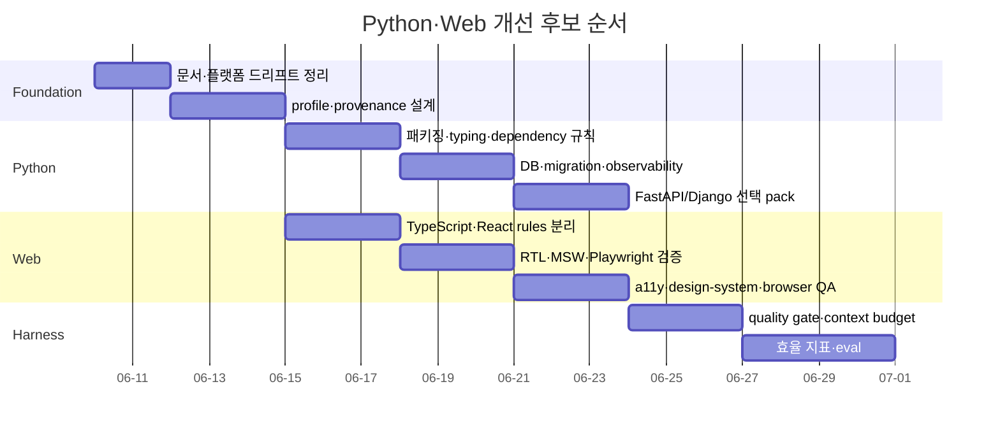
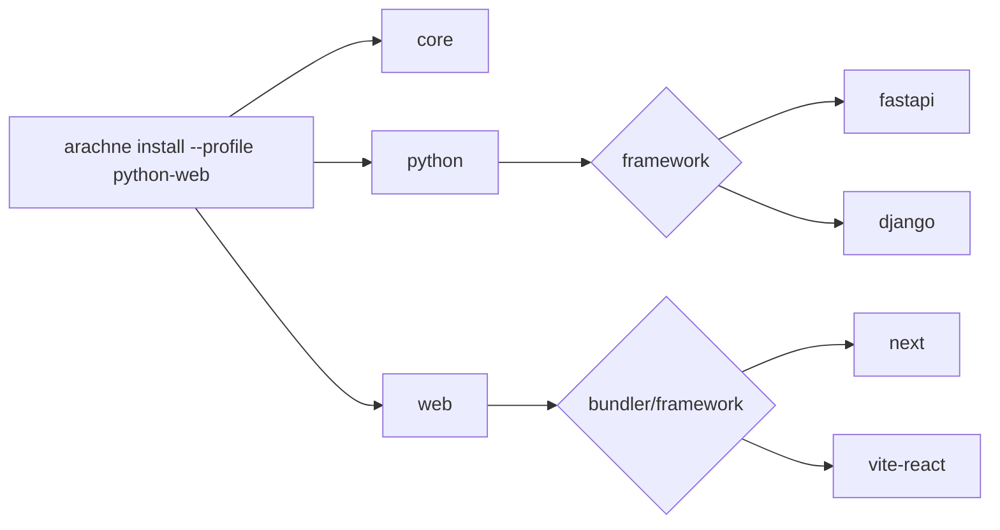

MOC:: [[Arachne]]
FROM:: [[2026-06-09-python-web-harness-assessment]]

# [idea] Python·Web 우선 개선 로드맵

이 문서는 앞선 세 idea를 실행 가능한 후보 묶음으로 정리한다. 아직 실행이 결정되지 않았으므로 task가
아니며 구현 체크박스를 완료 처리하지 않는다.

## 목표

작고 예측 가능한 Arachne 코어를 유지하면서 Python/Web 프로젝트가 별도 조립 없이 바로 개발·검증할
수 있는 profile을 제공한다.

## 원칙

- 전체 ECC 복사보다 선별 도입
- 항상 로드되는 rule은 짧게
- 긴 예시는 skill로 이동
- 프로젝트별 결정은 프로젝트 docs에 저장
- 로컬과 CI는 같은 검증 명령 사용
- 추가 규칙은 효과 지표로 유지 여부 판단

## 단계



## Phase 0: 정합성

### 후보 작업

- [ ] macOS/Windows/Linux 기능별 compatibility 표 재작성
- [ ] 완료 task와 미래형 문구 정리
- [ ] `docs/README.md` 생성
- [ ] Python/Web profile의 표준 스택 결정
- [ ] 외부 skill provenance 규약 결정

### 종료 기준

- README, CLI help, CI, platform 문서가 서로 모순되지 않는다.
- Python/Web 사용자가 첫 검증 명령을 소스 탐색 없이 알 수 있다.

## Phase 1: Python pack

### 후보 구성

```text
rules/python/
├── packaging.md
├── typing.md
├── database.md
├── observability.md
└── 기존 파일

skills/
├── python-project-bootstrap.md
├── database-migrations.md
└── django-* 또는 FastAPI 강화
```

### 프로젝트 CI 예시

```text
uv sync --frozen
uv run ruff format --check .
uv run ruff check .
uv run mypy .
uv run pytest --cov --cov-report=term-missing
uv run pip-audit
```

실제 표준이 Poetry/pip이면 명령을 바꿔야 한다. 도구 결정 전 파일을 추가하지 않는다.

## Phase 2: Web pack

### 후보 구성

```text
rules/typescript/
rules/react/
rules/web/accessibility.md
rules/web/performance.md
skills/react-testing.md
skills/frontend-a11y.md
skills/design-system.md
skills/browser-qa.md
```

### 프로젝트 CI 예시

```text
pnpm install --frozen-lockfile
pnpm lint
pnpm typecheck
pnpm test -- --coverage
pnpm build
pnpm exec playwright test
```

Node package manager와 Next/Vite 기본값을 먼저 결정해야 한다.

## Phase 3: Profile과 설치 선택성



profile은 설치 파일 목록만이 아니라 다음을 기록해야 한다.

- 설치된 module과 revision
- Arachne가 관리하는 파일
- 사용자가 수정 가능한 파일
- update 시 overwrite/merge/preserve 정책
- target별 Claude/Codex/Gemini/Copilot 어댑터

## Phase 4: 품질 게이트

여러 리뷰 커맨드를 무조건 연속 실행하지 않고 변경 위험에 따라 선택한다.

| 변경 | 필수 게이트 |
| --- | --- |
| Python 순수 로직 | Ruff, type, unit |
| FastAPI route | Python + FastAPI review + integration |
| DB migration | migration review + rollback 검증 |
| React component | type, RTL, a11y |
| 사용자 핵심 flow | Playwright |
| 스타일 변경 | responsive screenshot + visual diff |
| auth/payment | security review + E2E |

## Phase 5: 하네스 평가

월별로 다음을 기록한다.

| 지표 | 의미 |
| --- | --- |
| first-pass CI rate | 하네스가 사전에 결함을 잡는 정도 |
| median rework count | 규칙이 재작업을 줄였는지 |
| delegated result rewrite rate | Gemini/Codex 출력 품질 |
| test-found defects | 독립 검증 가치 |
| context overhead | rules/agents/skills 비용 |
| stale docs count | 문서 자동화 효과 |
| false-positive gate count | 과도한 규칙 여부 |

지표가 개선되지 않는 agent, hook, rule은 제거 후보로 본다.

## 하지 않을 것

- Python/Web와 무관한 ECC 스킬 대량 도입
- 모든 작업에 Gemini와 Codex를 강제 호출
- 프로젝트마다 동일한 framework를 강제
- Markdown에 디자인 token 실제 값을 이중 관리
- 테스트 수나 커버리지 숫자만으로 품질을 판단
- profile 없이 전역 rules를 계속 확장
