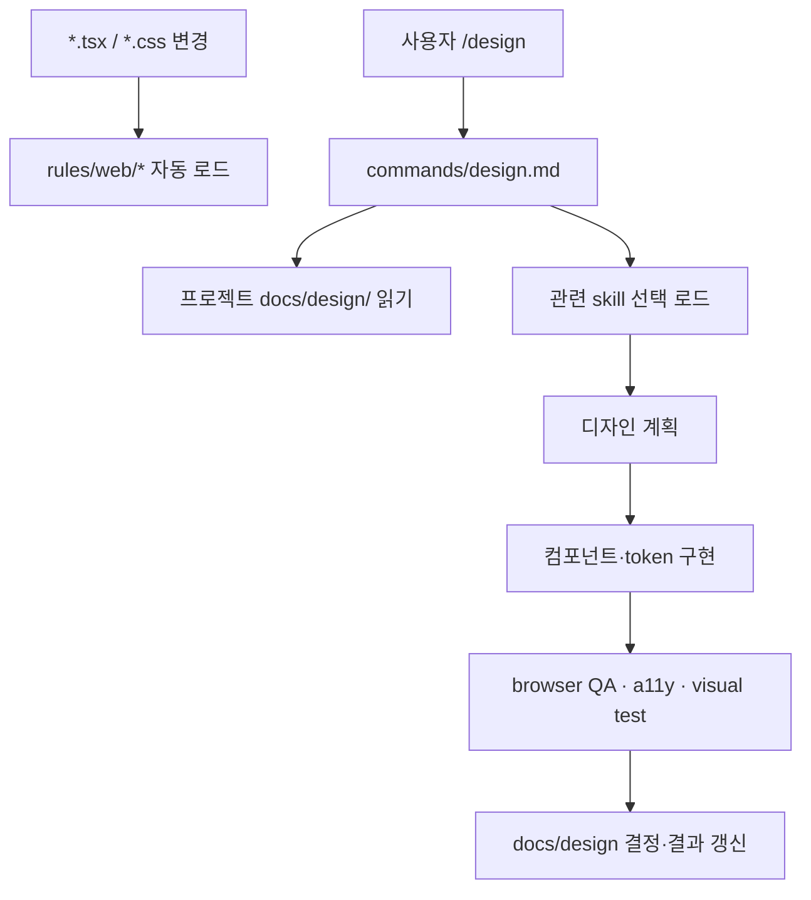

MOC:: [[Arachne]]
FROM:: [[2026-06-09-python-web-harness-assessment]]

# [idea] Web 디자인·UI·UX 문서 배치 정책

## 결론

Web 디자인 문서를 한 디렉터리에 몰아넣으면 규칙, 작업 절차, 프로젝트 산출물이 섞인다. 문서의
**수명과 적용 범위**에 따라 나눠야 한다.

| 문서 성격 | 권장 위치 | 예 |
| --- | --- | --- |
| 모든 Web 변경에 자동 적용할 규범 | `rules/web/` | 접근성 최소선, 반응형, 디자인 품질 |
| 여러 프로젝트에서 재사용할 절차 | `skills/` | 디자인 시스템 생성, UI 감사, 브라우저 QA |
| Claude 전용 실행 명령 | `commands/` | `/design`, `/ui-audit`, `/browser-qa` |
| 전문 판단 역할 | `agents/` | `react-reviewer`, 제안 `a11y-reviewer` |
| 특정 프로젝트의 제품 디자인 | 해당 프로젝트 `docs/design/` | 토큰, UX flow, 화면 명세, ADR |
| 실제 코드가 소비하는 토큰 | 프로젝트 소스 | `tokens.css`, `theme.ts`, `tailwind.config.*` |

## Arachne 전역 문서

### `rules/web/`

항상 지켜야 하고 파일 경로로 자동 활성화되어야 하는 짧은 규칙을 둔다.

권장 구조:

```text
rules/web/
├── design-quality.md     # 현재 존재: 미감·안티 템플릿
├── accessibility.md      # WCAG 최소선, semantic HTML, focus
├── responsive.md         # viewport, overflow, touch target
├── performance.md        # Core Web Vitals, 이미지, 번들
├── security.md           # XSS, URL, CSP, client secret
└── testing.md            # component/e2e/visual regression 최소선
```

규칙 파일에는 긴 튜토리얼이나 프로젝트별 색상 값을 넣지 않는다. 자동 로드되므로 짧고 강제 가능한
계약만 남겨야 한다.

### `rules/common/ui-layout.md`

현재 파일은 웹 전용 px 값과 테이블 CSS를 포함하지만 `common`에 있다. 공통에는 다음만 남기는 편이
논리적이다.

- 정보 위계
- 키보드 탐색 가능성
- 터치 타깃 최소 크기
- overflow 방지
- empty/loading/error 상태

웹 CSS 수치와 selector 예시는 `rules/web/layout.md` 또는 skill로 이동하는 안을 검토한다.

### `skills/`

온디맨드로 읽어야 하는 긴 절차와 예시를 둔다.

```text
skills/
├── frontend-design-direction.md
├── design-system.md
├── frontend-a11y.md
├── browser-qa.md
├── react-testing.md
└── frontend-patterns.md
```

현재 `frontend-patterns.md`, `make-interfaces-feel-better.md`는 이 범주에 맞다.

### `commands/`와 `agents/`

`commands/design.md`는 “무엇을 실행할지”만 정의하고 상세 디자인 지식은 rules/skills를 참조해야 한다.
현재처럼 `DESIGN.md`를 찾는 것은 맞지만, 산출물 위치를 명확히 해야 한다.

## 사용 프로젝트의 문서

각 Web 프로젝트에는 다음 구조를 권장한다.

```text
docs/design/
├── README.md                 # 디자인 문서 인덱스와 현재 상태
├── product-direction.md      # 대상 사용자·제품 톤·시각 방향
├── design-system.md          # 색·타입·spacing·radius·shadow 정책
├── ux-flows.md               # 사용자 여정과 상태 전이
├── accessibility.md          # WCAG 목표와 예외·검증 결과
├── responsive.md             # breakpoint와 화면별 행동
├── content-style.md          # 용어·마이크로카피·에러 메시지
├── qa-checklist.md           # 브라우저·viewport·상태 검증
├── decisions/
│   └── YYYY-MM-DD-*.md       # 중요한 디자인 결정 기록
└── screens/
    └── *.md                  # 복잡한 화면별 명세가 필요할 때만
```

작은 프로젝트는 `docs/design/README.md` 하나로 시작하고 실제 복잡도가 생길 때 분리한다.

## 문서와 코드의 경계

| 항목 | Markdown | 코드 |
| --- | --- | --- |
| 색상 선택 이유 | `design-system.md` | CSS 변수 실제 값 |
| spacing scale 의도 | `design-system.md` | token 파일 |
| 컴포넌트 API | Storybook/타입 근처 | TypeScript props |
| 사용자 흐름 | `ux-flows.md` | router/state machine |
| 접근성 예외 | `accessibility.md` | axe/Playwright 테스트 |
| 반응형 원칙 | `responsive.md` | CSS/container query |

Markdown에 실제 token 값을 복제하면 드리프트한다. 코드에서 생성하거나 문서에는 의미와 결정 이유를
기록하고 값의 SSOT는 token 파일로 둔다.

## 로딩과 실행 흐름



## 피해야 할 배치

- 프로젝트 색상·브랜드 규칙을 Arachne 전역 `rules/web/`에 넣지 않는다.
- 긴 React 튜토리얼을 항상 로드되는 rule에 넣지 않는다.
- 디자인 결정 이유를 CSS 주석에만 남기지 않는다.
- 디자인 token의 실제 값을 Markdown과 코드에 동시에 수동 관리하지 않는다.
- 모든 화면마다 문서를 만들어 유지보수 부채를 만들지 않는다.
- UI/UX 문서를 `docs/idea/`에 영구 보관하지 않는다. idea는 채택 전 제안만 둔다.

## Arachne 스캐폴딩 제안

`arachne new` 또는 별도 `arachne init-web`이 다음 최소 구조를 선택적으로 만들 수 있다.

```text
docs/design/README.md
docs/design/decisions/.gitkeep
```

기본 프로젝트마다 강제 생성하기보다 `python-web` 또는 `web` profile에서만 생성하는 편이 효율적이다.
