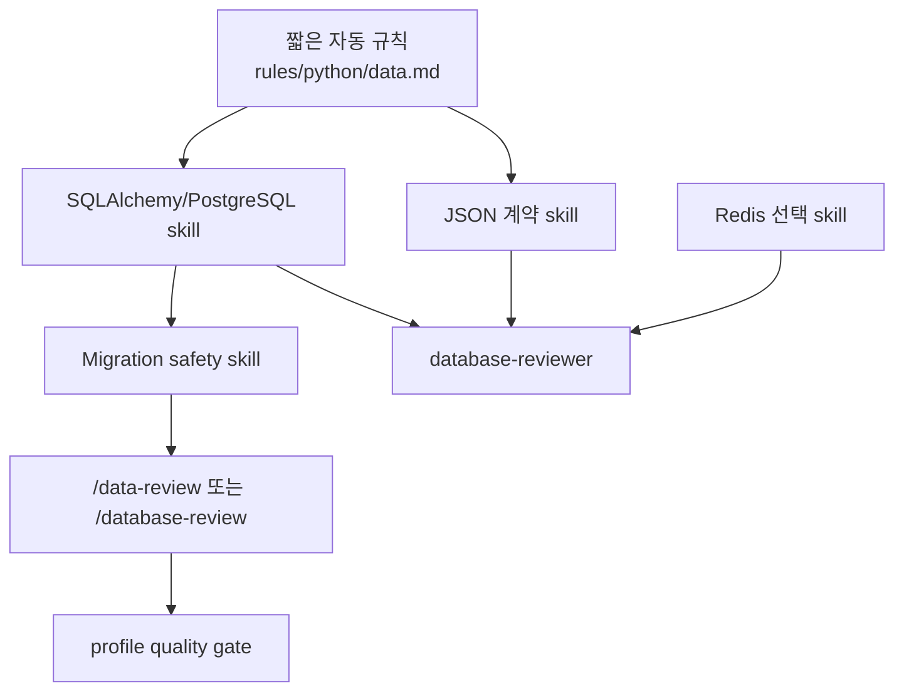

MOC:: [[Arachne]]
FROM:: [[2026-06-09-python-web-harness-assessment]]

# [audit] 보강 후보 대비 DB·JSON 데이터 처리 격차

- **작성일**: 2026-06-09
- **심각도**: HIGH
- **영역**: Python/FastAPI, PostgreSQL, migration, Redis, JSON/API 계약, 데이터 보안
- **상태**: 비교 완료, 구현 필요
- **검토 기준**: Arachne 보강 후보

## 조사 범위

Arachne의 다음 자산을 대조했다.

- `rules/python/fastapi.md`, `rules/python/security.md`, `rules/python/testing.md`
- `skills/fastapi-patterns.md`, `skills/backend-patterns.md`, `skills/api-design.md`
- `agents/fastapi-reviewer.md`, `agents/python-reviewer.md`
- Python/Web profile의 `.arachne/commands`

보강 후보로 다음 책임 영역을 검토했다.

- database reviewer
- migration safety
- PostgreSQL 운영 기준
- Redis cache pattern
- API contract
- database migration command

## 결론

Arachne는 간단한 CRUD에 필요한 입력 검증, SQL 파라미터화, 요청 단위 async session, 트랜잭션,
N+1 방지, Redis cache-aside 예시를 이미 갖고 있다. 그러나 이 내용이 FastAPI와 backend skill에
흩어져 있어 DB 변경을 독립적으로 검토하거나 migration·직렬화 계약을 검증하는 실행 경로가 없다.

PostgreSQL, migration, Redis, database reviewer를 책임별로 분리하면 발견성과 실행성이 높아진다.
반면 JSON을 독립 데이터 계약으로 다루는 깊이는 별도 보강이 필요하다. Arachne는 문서를 대량 추가하는 대신
DB 운영 기준을 선별하고 JSON 계약은 별도 정본으로 보강해야 한다.

## 현재 강점

| 영역 | 현재 Arachne 근거 | 판정 |
| --- | --- | --- |
| 입력 검증 | Pydantic/Zod, raw `Request.json()` 경고 | 기본 충족 |
| SQL injection | 파라미터 쿼리와 ORM 사용 원칙 | 기본 충족 |
| session 수명 | FastAPI `Depends(get_db)`, close/rollback 검토 | 기본 충족 |
| 트랜잭션 | `async with session.begin()` 예시 | 기본 충족 |
| 쿼리 효율 | 필요한 컬럼, N+1, batch 조회 | 기본 충족 |
| 캐시 | Redis cache-aside, TTL, write invalidation | 기초만 충족 |
| API 형식 | 상태 코드, envelope, pagination, 에러 형식 | 기본 충족 |

## 격차 요약

| 우선순위 | 격차 | 보강 후보 상태 | 영향 |
| --- | --- | --- | --- |
| P0 | migration 안전성·expand-contract·대용량 backfill | 전용 skill 보유 | 배포 중 lock, 데이터 손실 |
| P0 | SQLAlchemy 2.x session·transaction·동시성 계약 | reviewer 일부 보유 | 부분 commit, 장수명 lock |
| P0 | JSON 직렬화·스키마 진화 정본 부재 | 보강 후보도 부분적 | 클라이언트 호환 깨짐 |
| P0 | PostgreSQL schema·index·constraint 검토 경로 부재 | reviewer+skill 보유 | 무결성·성능 결함 |
| P0 | PII·민감 필드·보존·삭제 정책 부재 | reviewer 보안 일부 | 개인정보 노출·과잉 보존 |
| P1 | migration/DB 전용 reviewer와 command 부재 | 둘 다 보유 | 일반 리뷰에서 결함 누락 |
| P1 | DB 통합 테스트·migration smoke gate 부재 | verification 지식 보유 | CI 통과 후 운영 실패 |
| P1 | JSON Schema/OpenAPI 호환성 검사 부재 | OpenAPI 체크만 존재 | breaking change 미탐지 |
| P1 | connection pool·timeout·deadlock 기준 부족 | PostgreSQL skill 보유 | 부하 시 고갈·교착 |
| P1 | JSONB 사용 기준과 GIN/정규화 선택 기준 부재 | 기본 인덱스 예시 보유 | 쿼리 악화·스키마 난립 |
| P2 | Redis 원자성·lock·streams·eviction 기준 부족 | 전용 skill 보유 | 중복 처리·stale cache |
| P2 | backup·restore·PITR 검증 기준 부재 | 보강 후보도 제한적 | 복구 불가능 상태 미발견 |
| P2 | 데이터 품질·관측 지표 부재 | 보강 후보도 제한적 | silent corruption 탐지 지연 |

## 상세 발견

### 1. Migration은 현재 가장 큰 운영 공백이다

Arachne에는 migration 전용 rule, skill, reviewer, command가 없다. planner가 rollback을 언급하고
FastAPI skill이 session rollback을 설명하지만 다음 계약은 없다.

- 배포된 migration 불변성
- schema migration과 data backfill 분리
- nullable 추가 → backfill → constraint 강화 순서
- 대형 테이블 `CREATE INDEX CONCURRENTLY`
- column rename의 expand-contract
- lock timeout과 예상 lock 범위
- forward fix와 down migration 선택 기준
- production-size fixture 또는 복제 데이터 검증

단순 프로젝트라도 데이터가 쌓인 뒤에는 작은 `ALTER TABLE`이 가장 큰 장애 원인이 될 수 있다.

### 2. DB 책임이 FastAPI 문맥에 종속돼 있다

현재 DB 규칙은 라우터·서비스·repository 예시에 포함되어 있다. 따라서 SQL 파일, Alembic revision,
독립 worker, 배치 작업만 변경하면 자동으로 적용되는 path rule이나 전문 reviewer가 없다.

필요한 독립 계약:

- session은 요청/작업 단위로 생성하고 공유하지 않는다.
- commit 책임은 service/use-case 경계 한 곳에 둔다.
- 외부 API 호출 중 DB transaction을 열어 두지 않는다.
- retry 가능한 serialization/deadlock 오류를 일반 오류와 구분한다.
- idempotency key 또는 unique constraint로 중복 쓰기를 막는다.
- FK, unique, check, not-null을 애플리케이션 검증만으로 대체하지 않는다.

### 3. JSON은 문법이 아니라 계약으로 관리해야 한다

현재 문서는 JSON 예시와 Pydantic/Zod 입력 검증을 제공하지만 다음 결정이 없다.

- API 필드 naming과 alias의 단일 기준
- timezone-aware datetime의 wire format
- `Decimal`/금액을 number 또는 string 중 무엇으로 보낼지
- UUID, enum, bytes, large integer, NaN/Infinity 처리
- missing과 explicit `null`의 의미 차이
- PATCH에서 unset/null/delete 구분
- 알 수 없는 필드의 reject/ignore 정책
- request·response 최대 크기와 중첩 깊이
- canonical JSON 또는 서명 대상 직렬화
- schema version과 backward/forward compatibility
- 민감 필드의 직렬화·로그·캐시 제외

이 공백은 Python 모델이 정확해도 TypeScript 클라이언트에서 다른 의미로 해석되는 결함을 만든다.

### 4. PostgreSQL 운영 기준이 부족하다

보강 후보는 schema type, FK index, composite index order, partial/covering index, cursor pagination,
RLS, connection timeout, `pg_stat_statements`, lock ordering을 전문 reviewer에서 검사한다.

Arachne는 N+1과 필요한 컬럼 선택은 설명하지만 다음은 약하다.

- `timestamptz`, `numeric`, `jsonb` 등 타입 선택
- constraint와 `ON DELETE` 정책
- `EXPLAIN (ANALYZE, BUFFERS)` 사용 기준
- index 추가가 write cost와 storage에 주는 영향
- multi-tenant RLS와 least privilege
- statement/lock/idle transaction timeout
- pool 크기와 worker 수의 합산
- deadlock 방지를 위한 lock ordering

보강 후보의 “모든 FK index”, “random UUID 금지” 같은 절대 규칙은 프로젝트 맥락에 따라 과도할 수 있으므로
그대로 가져오지 않고 검토 트리거로 재작성해야 한다.

### 5. Redis는 예제 수준이다

현재 cache-aside 예시는 유용하지만 다음 운영 계약이 없다.

- key namespace와 version
- TTL jitter와 cache stampede 방지
- negative caching
- multi-step atomicity와 Lua/MULTI 사용 기준
- lock token 검증과 lease 만료
- Pub/Sub과 Streams의 전달 보장 차이
- eviction policy, max memory, persistence
- stale cache 허용 범위와 장애 시 fallback
- 큰 JSON blob 저장 제한

### 6. 보안·개인정보 수명주기가 빠져 있다

PII 로그 금지와 응답 secret 제외는 존재하지만 데이터의 전체 수명주기를 다루지 않는다.

각 단계에 분류, 최소 수집, 암호화, 마스킹, 접근 권한, retention, deletion, backup 잔존 정책이
필요하다.

## 권장 목표 구조

## 비목표

- 보강 후보 문서의 일괄 복사
- PostgreSQL, SQLAlchemy, Redis를 모든 프로젝트에 강제
- ORM이 있으면 SQL 검토가 불필요하다고 가정
- JSON envelope 형식을 모든 내부 API에 강제
- migration down만 있으면 rollback 가능하다고 간주
- 실제 DB 없이 정적 체크만으로 migration 안전성을 보장

## 완료 판단

이 issue는 연결 task의 P0/P1 항목이 구현되고, 최소 하나의 Python API fixture에서 다음을 자동 검증하면
해결 가능하다.

- JSON 직렬화와 OpenAPI 계약
- transaction rollback과 idempotent write
- Alembic upgrade 및 빈 DB/기존 DB migration
- PostgreSQL schema/index 검토
- 민감 필드의 응답·로그·캐시 제외
