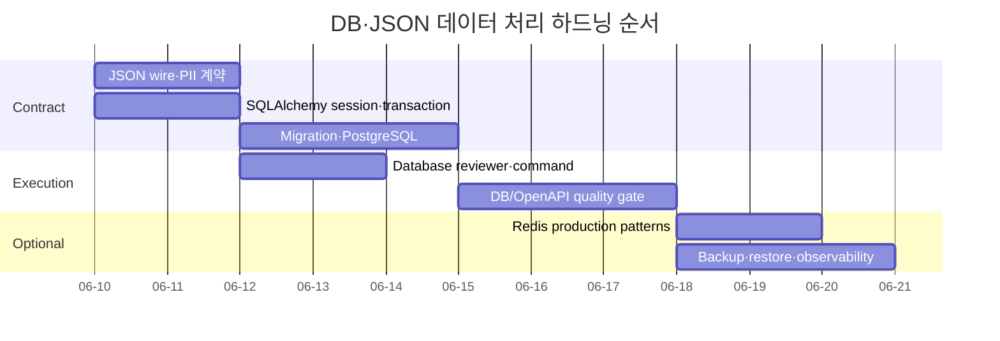

MOC:: [[Arachne]]
FROM:: [[2026-06-09-extension-data-handling-gap]]

# [task] DB·JSON 데이터 처리 하드닝

- **상태**: in-progress (P0·P1 완료 — Phase 3 선택 운영 pack은 실제 사용 프로젝트 발생 시)
- **우선순위**: high
- **담당**: unassigned
- **관련 문서**: [[2026-06-09-extension-data-handling-gap]], [[0001-python-web-profile]]

## 목표

Python/Web profile에 DB·JSON 데이터 처리의 명시적 계약과 독립 검토 경로를 추가한다. 단순 CRUD를
넘어 migration, transaction, PostgreSQL, JSON 호환성, 개인정보, Redis를 위험도에 따라 검증하고,
로컬과 GitHub CI에서 같은 품질 게이트를 실행할 수 있게 한다.

## 영향도와 실행 순서

| 단계 | 영향도 | 작업 묶음 | 선행 조건 |
| --- | --- | --- | --- |
| P0 | critical | JSON wire contract와 민감 데이터 기준 | 없음 |
| P0 | critical | SQLAlchemy transaction/session과 migration 안전성 | 없음 |
| P0 | high | PostgreSQL schema·constraint·index 기준 | DB 기준 |
| P1 | high | database reviewer와 review command | P0 rules/skills |
| P1 | high | DB fixture와 migration/OpenAPI CI gate | P0 계약 |
| P2 | medium | Redis 운영 패턴 | 캐시 사용 프로젝트 |
| P2 | medium | backup/restore와 데이터 관측 | 실제 운영 프로젝트 |



## 범위

- 포함:
  - Python JSON 직렬화와 API schema 호환 계약
  - SQLAlchemy 2.x async session/transaction 규칙
  - Alembic migration과 대용량 backfill 안전성
  - PostgreSQL schema, constraint, index, RLS, timeout 기준
  - DB 전문 reviewer와 review command
  - Python profile의 선택적 DB·contract 검증 방법
  - PII 분류·로그·응답·캐시·retention 기준
  - Redis 사용 시 원자성·TTL·장애 처리 기준
- 제외:
  - 특정 클라우드 DB나 Supabase 강제
  - 사용자 프로젝트의 실제 schema 작성
  - 모든 프로젝트에 PostgreSQL/Redis service 자동 추가
  - 운영 backup 인프라 자체 구축
  - 보강 후보 자산의 무검토 복사

## Phase 0: 데이터 계약

### 0-1. JSON wire contract

- [x] `rules/python/data-handling.md`에 항상 필요한 짧은 경계 규칙을 작성한다.
- [x] `skills/json-contracts.md`에 Pydantic v2와 TypeScript 간 직렬화 계약을 작성한다.
- [x] datetime은 timezone-aware RFC 3339, 금액은 `Decimal` 손실 방지 형식을 결정한다.
- [x] UUID, enum, bytes, large integer, missing/null, PATCH semantics를 명시한다.
- [x] unknown field, 최대 payload, 중첩 깊이, duplicate key 처리 정책을 명시한다.
- [x] schema version과 backward-compatible 변경 기준을 정의한다.
- [x] OpenAPI schema snapshot 또는 breaking-change 검출 도구를 선정한다.
      (외부 도구 대신 자체 contract snapshot — `app/contract.py` + pytest 비교)

### 0-2. 개인정보와 민감 데이터

- [x] public/internal/PII/secret 데이터 분류표를 만든다. (`docs/DATA-HANDLING.md`)
- [x] 응답·로그·metric·cache별 허용 필드를 정의한다.
- [x] field-level encryption과 password hashing의 적용 경계를 구분한다.
- [x] retention, deletion, backup 잔존, audit trail 기준을 작성한다.
- [x] 테스트 fixture가 실제 개인정보를 포함하지 않도록 검사 기준을 둔다.
      (bats가 `@example.com` 외 이메일 패턴을 차단)

## Phase 1: DB 정확성과 Migration

### 1-1. SQLAlchemy 2.x

- [x] 요청·worker 단위 async session 수명주기를 규칙으로 고정한다.
- [x] commit/rollback 책임을 service/use-case 경계 한 곳에 둔다.
- [x] transaction 안에서 외부 네트워크 I/O를 금지한다.
- [ ] nested transaction, savepoint, retry 가능한 DB 오류 기준을 정한다.
- [x] idempotency key와 unique constraint의 역할을 문서화한다.
- [x] lazy loading과 N+1, eager loading 선택 기준을 작성한다.

### 1-2. Alembic migration

- [x] `skills/database-migrations.md`를 Arachne 구조로 작성한다.
- [x] schema와 data migration을 분리한다.
- [x] expand-contract, concurrent index, batch backfill을 포함한다.
- [x] 배포된 revision 수정 금지와 forward-fix 원칙을 명시한다.
- [x] lock timeout, 예상 실행 시간, irreversible 표시, 복구 계획을 요구한다.
- [x] empty DB upgrade와 기존 DB upgrade를 모두 테스트한다.
      (`tests/data_contract.bats` — 빈 DB·`0001` revision DB 모두 head 도달)

### 1-3. PostgreSQL

- [x] `skills/postgres-patterns.md`를 선별 작성한다.
- [x] type, PK, FK, unique, check, not-null, `ON DELETE` 기준을 정의한다.
- [ ] composite/partial/covering/GIN/BRIN index 선택 기준을 작성한다. (GIN/BRIN 미기재)
- [x] JSONB와 정규화된 column/table 선택 기준을 명시한다.
- [x] `EXPLAIN (ANALYZE, BUFFERS)` 사용 조건과 증거 기록 형식을 정한다.
- [x] pool, statement/lock/idle transaction timeout과 worker 합산 기준을 작성한다.
- [x] multi-tenant RLS와 least privilege를 선택 보안 규칙으로 둔다.
- [ ] 보강 후보의 절대 규칙은 데이터 규모와 쿼리 증거를 요구하는 trigger로 완화한다.

## Phase 2: 실행 경로

### 2-1. 전문 Reviewer와 Command

- [x] `agents/database-reviewer.md`를 read-first 전문 reviewer로 추가한다.
- [x] migration, SQL, ORM model, repository 변경 시 활성화 조건을 정의한다.
- [x] `/database-review` command로 schema→query→migration→security→test 순서를 고정한다.
- [x] CRITICAL/HIGH/MEDIUM severity와 파일·line 근거 형식을 기존 reviewer와 맞춘다.
- [ ] 정리한 원칙의 적용 근거를 기록한다.

### 2-2. Quality Gate

- [x] Python DB project fixture를 테스트 자산으로 만든다. (`tests/fixtures/python-db/`)
- [x] `alembic upgrade head`를 빈 DB와 기존 revision DB에서 실행한다.
- [x] migration downgrade 대신 forward recovery가 필요한 경우를 표시한다.
      (revision의 `downgrade()`가 forward-fix 원칙과 함께 `NotImplementedError`)
- [x] transaction rollback, unique/idempotency, concurrency 회귀 테스트를 추가한다.
      (concurrency는 사전 조회 가로채기로 레이스 경로 재현 — 실제 병렬 실행 아님)
- [x] OpenAPI/JSON schema snapshot과 breaking-change 검사를 추가한다.
      (JSON schema contract snapshot 방식 — OpenAPI 전체 snapshot은 FastAPI 사용 프로젝트 몫)
- [x] `pip-audit` 외에 SQL/migration/data contract 검증을 profile에 선택적으로 연결한다.
      (python·python-web profile commands에 opt-in 주석 게이트)
- [x] PostgreSQL service가 필요한 검증은 opt-in 확장 workflow로 분리한다.
      (별도 template 대신 `docs/DATA-HANDLING.md`의 service 블록 — 기본 게이트는 SQLite 유지)

## Phase 3: 선택 운영 Pack

### 3-1. Redis

- [ ] `skills/redis-patterns.md`를 실제 사용 프로젝트가 생길 때 추가한다.
- [ ] namespace/version, TTL jitter, stampede, negative cache를 정의한다.
- [ ] MULTI/Lua, distributed lock token, Streams delivery 계약을 작성한다.
- [ ] eviction, persistence, pool, timeout, 장애 fallback을 정의한다.
- [ ] 큰 JSON blob 저장 제한과 object storage 전환 기준을 둔다.

### 3-2. Backup·Restore·관측

- [ ] backup 성공이 아니라 restore 성공을 검증하는 절차를 작성한다.
- [ ] RPO/RTO, PITR, migration 전 snapshot 기준을 프로젝트 결정으로 둔다.
- [ ] slow query, pool exhaustion, deadlock, replication lag 지표를 정의한다.
- [ ] 데이터 품질 지표와 silent corruption 탐지 방법을 정한다.

## 예상 산출물

```text
rules/python/data-handling.md
skills/json-contracts.md
skills/database-migrations.md
skills/postgres-patterns.md
agents/database-reviewer.md
commands/database-review.md
tests/data_contract*.bats
tests/fixtures/python-db/
docs/DATA-HANDLING.md
```

Redis는 실제 사용이 결정되기 전까지 예상 산출물에서 제외하고 Phase 3 선택 항목으로 유지한다.

## 검증

```bash
bash -n install.sh templates/project/verify.sh
shellcheck -S warning ./*.sh hooks/*.sh tests/*.sh templates/project/verify.sh
bats tests/*.bats
bash tests/validate_settings.sh
bash tests/check_index.sh
bash tests/check_convention_sync.sh
arachne project-check tests/fixtures/python-db
```

DB fixture 검증에는 별도로 다음 결과가 필요하다.

```text
empty database -> migration head 성공
previous revision -> migration head 성공
실패한 service operation -> rollback 확인
동일 idempotency key -> 중복 row 없음
OpenAPI schema breaking change -> gate 실패
PII field response/log/cache 포함 -> gate 실패
```

## 완료 조건

- JSON 날짜·금액·null·PATCH·schema evolution 계약이 Python과 TypeScript 예제로 검증된다.
- SQLAlchemy session·transaction·idempotency 기준이 rule과 test에 반영된다.
- Alembic migration이 빈 DB와 기존 DB에서 자동 검증된다.
- PostgreSQL schema·index·security 변경을 database reviewer가 독립 검토한다.
- 민감 필드는 응답·로그·캐시에 기본 노출되지 않는다.
- DB 없는 Python 프로젝트는 추가 service 없이 기존 profile을 계속 사용할 수 있다.
- 신규 자산이 skills/agents/commands/USAGE 인덱스와 GitHub CI에 연결된다.

## 진행 기록

### 2026-06-11 (P1)

- `/database-review` command 추가 — 순서 고정·severity 형식을 `database-reviewer`와 통일,
  CLAUDE.md·USAGE 인덱스 연결.
- `docs/DATA-HANDLING.md` 정본 작성 — 4등급 분류표, 노출 표면별 허용, hashing/encryption 경계,
  retention·audit, fixture 기준, PostgreSQL opt-in service 블록. `rules/python/data-handling.md`의
  "예정 산출물" 표기를 정본 링크로 교체.
- Quality gate 구축 — `tests/fixtures/python-db/`(SQLAlchemy 2.x + Alembic 2 revision + Pydantic v2
  + pytest 게이트 4종)와 `tests/data_contract.bats`(정적 6 + 실행 4). 실행 검증은 uv 가용 시에만
  수행하고 없으면 skip — 메인 CI에 `verify-data-contract` job(setup-uv) 추가로 실행 경로 보장.
  python·python-web profile에 opt-in DB 게이트 주석 추가. `docs/CI.md`·`tests/README.md` 갱신.
- 검증: 정적 bats 6건 로컬 통과. alembic·pytest 실행 검증은 로컬에 uv·pip가 없어 미실행 —
  첫 push의 `verify-data-contract` job 결과 확인 필요.

### 2026-06-11

- P0 산출물 5종(`rules/python/data-handling.md`, `skills/{json-contracts,database-migrations,postgres-patterns}.md`,
  `agents/database-reviewer.md`)을 커밋하고 skills/agents/rules 인덱스와 USAGE·CLAUDE.md에 연결했다
  (아키텍처 감사 A-02). `docs/DATA-HANDLING.md`·`/database-review` command·CI gate는 미착수.

### 2026-06-09

- DB·JSON 자산을 비교해 누락된 책임 영역을 확인했다.
- 전문 reviewer와 migration/PostgreSQL/Redis 책임 분리가 필요하다고 판단했다.
- JSON 계약은 Arachne가 별도 skill로 보강하기로 계획했다.
- 전체 복사 대신 P0 데이터 계약·migration부터 구현하고 Redis는 실제 사용 시 선택 도입하기로 했다.
