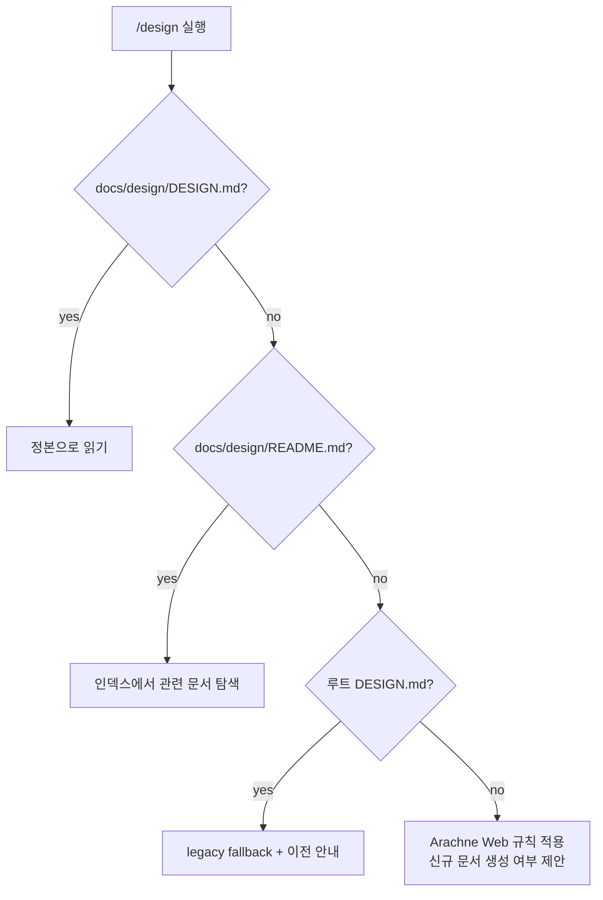

MOC:: [[Arachne]]
FROM:: [[2026-06-09-web-design-document-placement]]

# [task] 사용 프로젝트 디자인 문서 계약 정식화

- **상태**: to do
- **우선순위**: high
- **담당**: unassigned
- **관련 문서**: [[2026-06-09-web-design-document-placement]],
  [[2026-06-09-python-web-profile-foundation]], [Python·Web profile](../PYTHON-WEB-PROFILE.md)

## 목표

Arachne를 사용하는 Web 프로젝트의 제품 디자인 문서 정본을 `docs/design/DESIGN.md`로 확정한다.
`/design`, 사용자 가이드, Web profile 스캐폴딩이 동일한 위치와 소유권을 따르게 하고, 기존 루트
`DESIGN.md` 프로젝트는 깨지지 않도록 하위 호환 탐색을 제공한다.

## 결정할 계약

```text
docs/design/
├── DESIGN.md                 # 제품 디자인 방향과 핵심 UX 원칙의 정본
├── README.md                 # 선택: 분리 문서가 늘어난 경우 인덱스
├── design-system.md          # 선택: 토큰·컴포넌트 상태의 설계 의도
├── ux-flows.md               # 선택: 사용자 여정과 상태 전이
├── accessibility.md          # 선택: WCAG 목표·예외·검증 결과
├── responsive.md             # 선택: breakpoint·화면별 행동
├── content-style.md          # 선택: 용어·마이크로카피
├── qa-checklist.md           # 선택: 브라우저·viewport·상태 검증
├── decisions/
│   └── YYYY-MM-DD-*.md       # 중요한 디자인 결정
└── screens/
    └── *.md                  # 복잡한 화면만 개별 명세
```

### 파일 역할

| 파일 | 책임 | 생성 시점 |
| --- | --- | --- |
| `docs/design/DESIGN.md` | 제품 방향, 사용자, 톤, UX 원칙, 코드 정본 링크 | Web profile 기본 생성 |
| `docs/design/README.md` | 디자인 문서 인덱스와 현재 상태 | 문서가 2개 이상으로 분리될 때 |
| `docs/design/decisions/` | 결정 이유와 대안 | 중요한 디자인 결정 발생 시 |
| token/theme 소스 | 색상·spacing·type 실제 값의 SSOT | 프로젝트 구현 시 |

Markdown에는 디자인 token 실제 값을 코드와 중복 관리하지 않는다. `DESIGN.md`는 값의 의미와 선택
이유, 실제 token 파일 경로만 기록한다.

## 탐색 우선순위

`/design`은 다음 순서로 읽는다.



루트 `DESIGN.md`는 자동 이동하거나 삭제하지 않는다. 사용자가 명시적으로 승인했을 때만
`docs/design/DESIGN.md`로 이전한다.

## 범위

- 포함:
  - 디자인 문서 배치 정본 `docs/DESIGN-DOCS.md`
  - `/design` 탐색 우선순위와 하위 호환 수정
  - Web profile 신규 프로젝트의 최소 디자인 문서 구조
  - 기존 프로젝트용 명시적 디자인 문서 초기화 경로
  - 템플릿 소유권·재실행 보존 정책
  - README, USAGE, Python/Web profile, 문서 인덱스 연결
  - 생성·보존·legacy fallback 회귀 테스트
- 제외:
  - 색상·폰트·컴포넌트 token 자동 생성
  - Figma, Storybook, 브라우저 MCP 통합
  - 접근성·시각 회귀 rules 자체 구현
  - 기존 프로젝트의 루트 `DESIGN.md` 자동 이동
  - `minimal`, `python` profile에 디자인 문서 강제 생성

## 작업 목록

### 1. 정본 문서

- [ ] `docs/DESIGN-DOCS.md`에 Arachne 전역 규칙과 프로젝트 문서의 경계를 작성한다.
- [ ] `docs/design/DESIGN.md`를 프로젝트 제품 디자인 정본으로 명시한다.
- [ ] 실제 token 값은 CSS/TypeScript/theme 파일이 SSOT임을 명시한다.
- [ ] 작은 프로젝트와 복잡한 프로젝트의 문서 분리 기준을 제공한다.
- [ ] README, `docs/README.md`, USAGE, Python/Web profile에서 정본을 연결한다.

### 2. `/design` command

- [ ] `commands/design.md`의 첫 탐색 경로를 `docs/design/DESIGN.md`로 변경한다.
- [ ] `docs/design/README.md`가 있으면 관련 분리 문서를 따라 읽게 한다.
- [ ] 루트 `DESIGN.md`를 legacy fallback으로 유지한다.
- [ ] 문서가 없으면 자동 생성하지 않고 생성 계획과 범위를 먼저 제안한다.
- [ ] 수정 후 관련 design decision과 QA 결과 갱신 여부를 확인한다.

### 3. 스캐폴딩

- [ ] `templates/project/design/DESIGN.md` 최소 템플릿을 작성한다.
- [ ] Web·Python-Web 신규 프로젝트에 `docs/design/DESIGN.md`를 생성한다.
- [ ] `docs/design/decisions/.gitkeep`을 함께 생성한다.
- [ ] `minimal`, `python` profile에는 생성하지 않는다.
- [ ] 기존 프로젝트에는 `arachne init-design [DIR]` 같은 명시적 초기화 명령을 제공할지 결정한다.
- [ ] 명시적 초기화 명령을 채택하면 도움말·README·USAGE에 추가한다.

### 4. 소유권과 안전성

- [ ] 생성된 `docs/design/DESIGN.md`는 프로젝트 소유 파일로 정의한다.
- [ ] `new` 또는 초기화 명령 재실행 시 기존 디자인 문서를 덮어쓰지 않는다.
- [ ] `docs/design`, `DESIGN.md`, `decisions` 경로의 심볼릭 링크 쓰기를 거부한다.
- [ ] 템플릿 갱신은 기존 프로젝트에 자동 반영하지 않고 차이 안내만 제공한다.

### 5. 테스트

- [ ] `new --profile web`이 최소 디자인 구조를 생성하는 테스트를 추가한다.
- [ ] `new --profile python-web` 생성 테스트를 추가한다.
- [ ] `minimal`, `python`에는 디자인 구조가 없음을 검증한다.
- [ ] 기존 `DESIGN.md`와 `docs/design/DESIGN.md`를 보존하는 재실행 테스트를 추가한다.
- [ ] `/design` 문서가 정본·인덱스·legacy 순서를 명시하는 계약 테스트를 추가한다.
- [ ] 사용자 문서와 CLI 도움말의 초기화 명령 발견성을 검사한다.

## 템플릿 최소 내용

`docs/design/DESIGN.md`는 빈 문서보다 다음 질문을 포함한 작은 템플릿으로 시작한다.

```text
1. 제품과 대상 사용자
2. 핵심 사용자 목표
3. 시각적 방향과 피해야 할 표현
4. 정보 구조와 주요 UX 흐름
5. empty/loading/error/success 상태
6. 접근성·반응형 목표
7. 디자인 token 코드 정본 경로
8. 검증 기준과 열린 결정
```

실제 색상값, spacing 숫자, 컴포넌트 props를 템플릿에 하드코딩하지 않는다.

## 검증

```bash
bash -n install.sh
shellcheck -S warning install.sh tests/*.sh
bats tests/new_project.bats tests/docs_cli_contract.bats tests/*.bats
bash tests/check_index.sh
git diff --check
```

수동 계약 검증:

```text
web 신규 프로젝트 -> docs/design/DESIGN.md 생성
python-web 신규 프로젝트 -> docs/design/DESIGN.md 생성
minimal/python 신규 프로젝트 -> 디자인 문서 미생성
기존 DESIGN.md -> 덮어쓰기 없음
/design -> docs/design/DESIGN.md 우선
루트 DESIGN.md만 존재 -> legacy fallback
```

## 완료 조건

- 정식 사용자 가이드가 프로젝트 디자인 문서 위치를 `docs/design/DESIGN.md`로 일관되게 설명한다.
- `/design`이 정본, 인덱스, legacy fallback 순서로 문서를 탐색한다.
- Web·Python-Web 신규 프로젝트만 최소 디자인 구조를 받는다.
- 기존 프로젝트 디자인 문서는 어떤 재실행에서도 자동 덮어쓰거나 이동하지 않는다.
- token 실제 값은 코드가 SSOT라는 원칙이 템플릿과 가이드에 반영된다.
- 신규 테스트와 Ubuntu·Rocky·macOS·Windows CI가 모두 통과한다.

## 진행 기록

### 2026-06-09

- idea 문서의 `docs/design/` 제안과 현재 `/design`의 루트 `DESIGN.md` 탐색 충돌을 확인했다.
- 제품 디자인 정본은 `docs/design/DESIGN.md`, 분리 문서 인덱스는 선택적 `README.md`로 구분했다.
- Web·Python-Web profile에만 최소 구조를 생성하고 기존 파일은 프로젝트 소유로 보존하기로 계획했다.
- 구현은 수행하지 않고 정식 반영을 위한 범위·안전성·검증 계약만 작성했다.

### 2026-07-01

- task 인벤토리 정리: 규약상 상태 값은 `planned`가 아니라 `to do`로 표준화했다.
- 구현은 아직 착수하지 않았고, 정본 문서·`/design` command·스캐폴딩·테스트 항목이 전부 열린 상태다.
