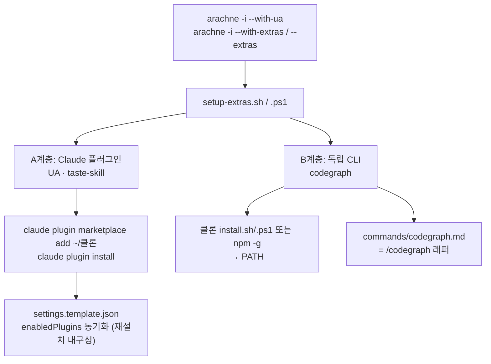

MOC:: [[Arachne]]
FROM:: [[arachne-docs]]

# Arachne 확장 도구 (Extras)

Arachne 핵심(agents·commands·rules·hooks·skills)에 더해, **외부 저장소로 배포되는
선택형 도구**를 Arachne와 충돌 없이 함께 설치·사용하기 위한 통합 계층이다.
모두 Linux·macOS·Windows에서 동일하게 동작한다.

## 무엇이 포함되나

| 도구 | 정체 | 통합 방식 | 문서 |
| --- | --- | --- | --- |
| **Understand-Anything** | Claude Code 플러그인 | 로컬 마켓플레이스 + `enabledPlugins` | [understand-anything.md](understand-anything.md) |
| **taste-skill** | Claude Code 플러그인 | 로컬 마켓플레이스 + `enabledPlugins` | [taste-skill.md](taste-skill.md) |
| **codegraph** | 독립 CLI | PATH 설치 + `/codegraph` 래퍼 | [codegraph.md](codegraph.md) |
| **통합 메커니즘** | 설치 스크립트 | `setup-extras.sh`·`.ps1` + installer 연동 | [extras-setup.md](extras-setup.md) |

## 두 개의 통합 계층



- **A계층 (플러그인)** — `~/.claude/plugins/`에 살고 `settings.json`의 `enabledPlugins`로
  켜진다. Arachne는 `~/.claude/`의 **개별 항목만** 심볼릭(agents·commands·rules·…)하고
  `plugins/`는 건드리지 않으므로 완전히 공존한다.
- **B계층 (CLI)** — `~/.local/bin`(또는 npm 전역)에 바이너리를 올린다. Claude와 독립이며
  어떤 셸·세션에서나 `codegraph`로 호출한다.

## 빠른 시작

```bash
# 대화형 — 항목별 Y/n 선택
arachne --extras

# 전부 비대화형
arachne --extras --all          # 또는: bash ~/Arachne/setup-extras.sh --all

# 설치(재설치)·업데이트와 함께 (멱등)
arachne -i --with-ua            # Understand-Anything 만
arachne -u --with-ua
arachne -i --with-extras
arachne -u --with-extras
```

> 클론 위치 기본값은 `$HOME/Understand-Anything`, `$HOME/taste-skill`, `$HOME/codegraph`.
> 다른 위치면 `UA_CLONE` / `TASTE_CLONE` / `CODEGRAPH_CLONE` 환경변수로 지정한다.
> 플러그인은 **Claude Code 재시작 후** 활성화된다.

## 저장소 클론 — 자동

확장 도구는 Arachne에 **번들되지 않는다.** UA·taste-skill 은 Claude Code 로컬 마켓플레이스라
로컬 클론이 필요한데, 클론이 없으면 설치 시 **아래 URL 에서 자동으로 `git clone`** 한다
(`--no-clone` 으로 비활성, git 미설치면 스킵). codegraph 는 npm 전역 설치라 클론이 필요 없다.

```bash
# 수동으로 미리 받아두려면 (선택 — 위치·출처는 *_CLONE / *_URL 로 override 가능):
git clone https://github.com/Egonex-AI/Understand-Anything.git ~/Understand-Anything
git clone https://github.com/Leonxlnx/taste-skill.git          ~/taste-skill
git clone https://github.com/colbymchenry/codegraph.git        ~/codegraph
```

`arachne -u`(또는 `setup-extras --update`)는 선택한 도구의 클론을 `git pull`,
플러그인·CLI 를 최신으로 갱신한다 — 선택은 대화형으로 유지된다.

자세한 동작·플래그·문제해결은 [extras-setup.md](extras-setup.md) 참고.
